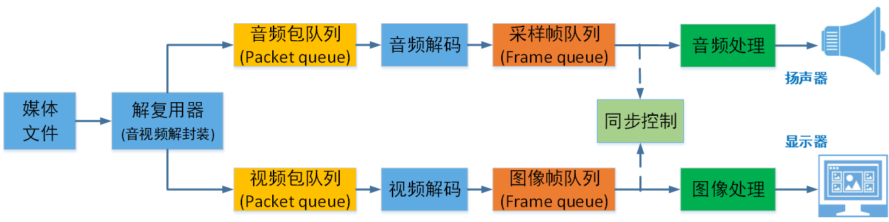
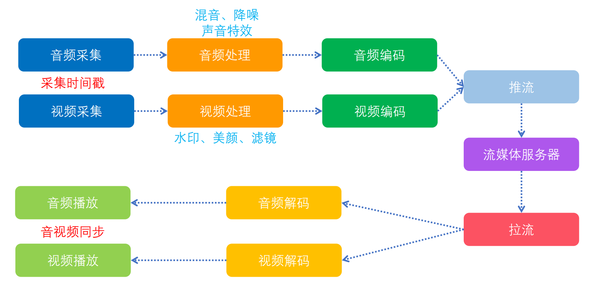
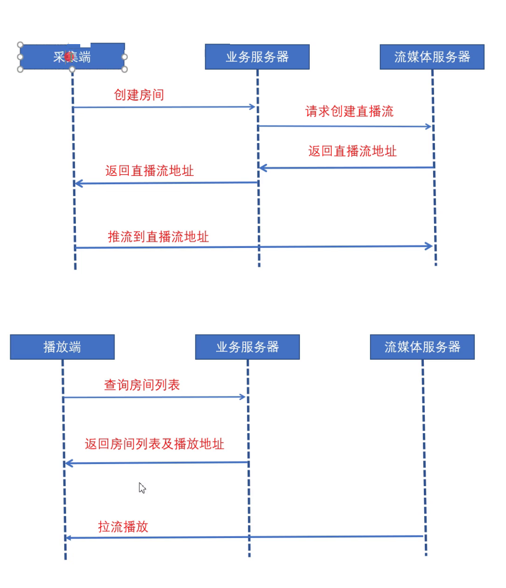
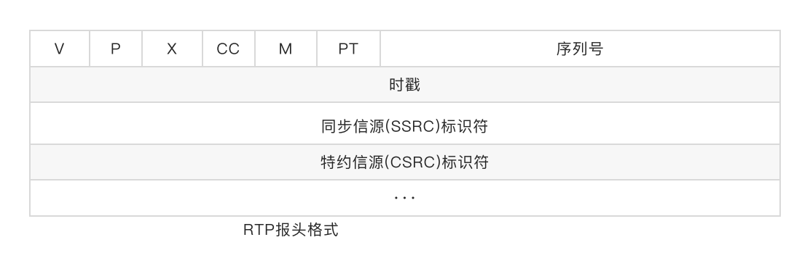
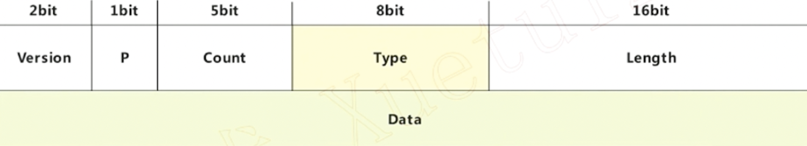
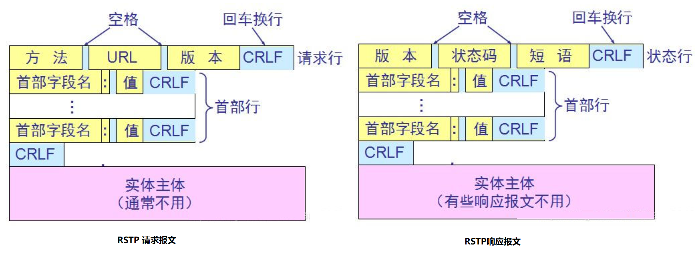
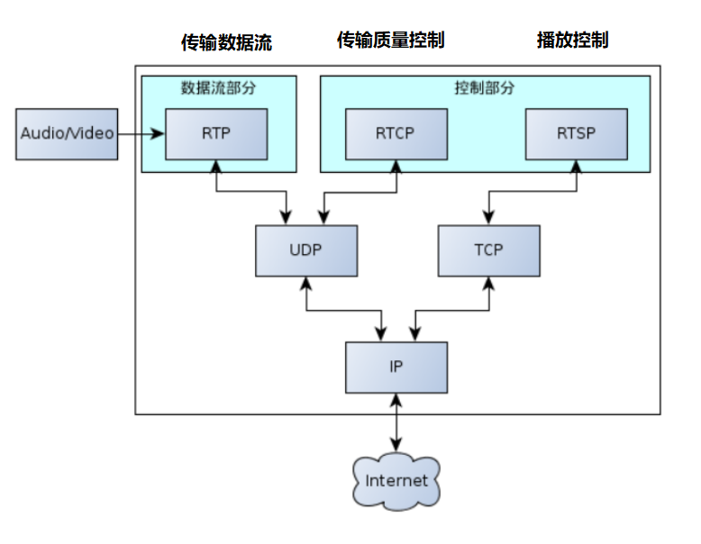

# stream

# 1 音视频基础

## 1.1 视频主要概念

视频录制和播放原理：





**像素**：是一个图片的基本单位，pix是英语单词picture的简写，加上英语单词“元素element”， 就得到了“pixel”，简称px，所以“像素”有“图像元素”之意

**分辨率**：图像（或视频）的分辨率是指图像的大小或尺寸。我们通常用像素表示图像的尺寸。常见的分辨率： 360P(640x360)、720P(1280x720)、1080P(1920x1080)、4K(3840x2160)、8K(7680x4320

**视频码率**：kb/s，是指视频文件在单位时间内使用的数据流量，也叫码流率。

**视频帧率**：fps，通常说一个视频的25帧，指的就是这个视频帧率，即1秒中会显示25帧。帧率越高，给人的视觉就越流畅。

**视频分辨率**：分辨率就是我们常说的640x480分辨率、1920x1080分辨率，分辨率影响视频图像的大小。

**Stride** ：指在内存中每行像素所占的空间。为了实现内存对齐每行像素在内存中所占 的空间并不一定是图像的宽度。


**RGB**：红R、绿G、蓝B三基色。也是三个通道

**YUV**：“Y”表示明亮度（Luminance或Luma），也就是灰阶值，“U”和“V”表 示的则是色度（Chrominance或Chroma）

**位深**：每个通道的位深越大，能够表示的颜色值就越大，比如现在高端电视说的10bit色 彩，即是每个通道用10bit表示，每个通道有1024种颜色。

**libyuv**：Google开源的实现各种YUV与RGB间相互转换、旋转、缩放的库。


**I帧（Intra coded frames）**：I帧不需要参考其他画面而生成,解码时仅靠自己就重构完整图像;

**P帧（Predicted frames）**：根据本帧与相邻的前一帧（I帧或P帧）的不同点来压缩本帧数据，P帧属于前向预测的帧间编码。它需要参考前面最靠近它的I帧或P帧来解码。

**B帧（Bi-directional predicted frames）**B 帧图像采用双向时间预测，可以大大提高压缩倍数。


常见视频压缩算法：

- MPEG2 MPEG阵营
- H264 MPEG阵营
- H265 MPEG阵营
- AVS   中国阵营
- VP8   Google阵营
- VP9 Google阵营

## 1.2 音频

**模拟信号数字化**：

- 采样频率：Nyguist采样定律，要从采样中完全恢复原始信号波形，采样频率必须至少是信号中最高频率的两倍。前面提到人耳能听到的频率范围是[20H~20kHz]，所以采样频率一般为44.1Khz
- 采样量化：采样值的精度取决于它用多少位来表示，这就是量化。
- 编码：

**PCM脉冲编码调制**：PCM是把声音从模拟信号转化为数字信号的技术。


**采样频率：**每秒钟采样的点的个数。常用的采样频率有：

- 22000（22kHz）： 无线广播。

- 44100（44.1kHz）：CD音质。

- 48000（48kHz）： 数字电视，DVD。

- 96000（96kHz）： 蓝光，高清DVD。

- 192000(192kHz): 蓝光，高清DVD。

**采样精度（采样深度）**：每个“样本点”的大小，常用的大小为8bit， 16bit，24bit。

**通道数：**单声道，双声道，四声道，5.1声道。


**比特率：**每秒传输的bit数，单位为：bps（Bit Per Second），没有压缩的音频数据的比特率 = 采样频率 * 采样精度 * 通道数。

**码率：** 质量压缩后的音频数据的比特率，常见的码率：

- 96kbps： FM

- 128-160kbps：一般质量音频。

- 192kbps： CD质量。

- 256-320Kbps：高质量音频


**帧：**每次编码的采样单元数，比如MP3通常是1152个采样点作为一个编码单元，AAC通常是1024个采样点作为一个编码单元。

**帧长**：可以指每帧播放持续的时间：每帧持续时间(秒) = 每帧采样点数 / 采样频率（HZ），也可以指压缩后每帧的数据长度。


**数字音频压缩编码**：采取去除声音信号中冗余成分的方法来实现。所谓冗余成分指的是音频中不能被人耳感知到的信号，它们对确定声音的音色，音调等信息没有任何的帮助。

**冗余信号**：包含人耳听觉范围外的音频信号以及被掩蔽掉的音频信号等。例如，人耳所能察觉的声音信号的频率范围为20Hz～20KHz，除此之外的其它频率人耳无法察觉，都可视为冗余信号。

根据人耳听觉的生理和心理声学现象，当一个强音信号与一个弱音信号同时存在时，弱音信号将被强音信号所掩蔽而听不见，这样弱音信号就可以视为冗余信号而不用传送。这就是人耳听觉的掩蔽效应，

**频谱掩蔽效应**：一个频率的声音能量小于某个阈值之后，人耳就会听不到。当有另外能量较大的声音出现的时候，该声音频率附近的阈值会提高很多，即所谓的掩蔽效应。

**时域掩蔽效应**：当强音信号和弱音信号同时出现时，还存在**时域掩蔽效应**。即两者发生时间很接近的时候，也会发生掩蔽效应。时域掩蔽过程曲线如图所示，分为前掩蔽、同时掩蔽和后掩蔽三部分。

**音频编解码**：

- OPUS
- MP3
- AAC
- AC3和EAC3 杜比公司的方案 

# 2 环境搭建

vs2015，qt5.1，cdb，

qt创建的项目目录里面不能有中文路径，否则无法编译。

qt如果要使用msvc的调试器，必须安装windows sdk 中的 debugger tools（下载winsdksetup.exe）

# 3 ffmpeg命令

## 3.1 ffmpeg

**ffmpeg**：Hyper fast Audio and Video encoder **超快音视频编码器**（**类似爱剪辑**）

- ```bash
  # 基本信息
  ffmpeg -h
  # 高级信息
  ffmpeg -h long
  #所有信息，若嫌打印过多： ffmepg -h full > ffmpeg_h_full.log，然后再打开 ffmpeg_h_full.log文件查看
  ffmpeg -h full
  
  ffmpeg [options] [[infile options] -i infile]... 
  {[outfile options] outfile}...
  ```


### 3.1.1 ffmpeg命令分类查询


查看具体分类所支持的**参数**：`ffmepg -h type=name`

```bash
# type可以不加s，就像muxer
ffmpeg -h muxer=flv
ffmpeg -h filter=atempo (atempo调整音频播放速率)
ffmpeg -h encoder=libx264
ffmpeg -encoders | findstr x264
```


### 3.1.2 主要参数

```bash
主要参数：
◼ -i 指定输入流，输入文件
◼ -f 设定输出格式(format)
◼ -ss 开始时间
◼ -t 时间长度
◼ -y：不经过确认，输出时直接覆盖同名文件


◼ 视频参数：
◼ -vframes 设置要输出的视频帧数
◼ -b 设定视频码率
◼ -b:v 视频码率
◼ -c codec：指定解码器
◼ -c:a 指定音频的编码器
◼ -c:v 指定视频的编码器
◼ -r 设定帧速率
◼ -s 设定画面的宽与高
◼ -vn 去除视频流
◼ -aspect aspect 设置横纵比 4:3 16:9 或 1.3333 1.7777
◼ -vcodec 设定视频编解码器，如果用copy表示原始编解码数据必须被拷贝。
◼ -vf 视频过滤器

ffmpeg -i test.mp4 -vframes 300 -b:v 300k -r 30 -s 640x480 -aspect 16:9 -vcodec libx265 out.h265

◼ 音频参数：
◼ -aframes 设置要输出的音频帧数
◼ -b:a 音频码率
◼ -ar 设定采样率
◼ -ac 设定声音的Channel数
◼ -acodec 设定声音编解码器，如果用copy表示原始编解码数据必须被拷贝。
◼ -an 去除音频流
◼ -af 音频过滤器

ffmpeg -i test.mp4 -b:a 192k -ar 48000 -ac 2 -acodec libmp3lame -aframes 200 out2.mp3
```


### 3.1.3 提取音视频数据

```bash
◼ 保留封装格式
ffmpeg -i test.mp4 -acodec copy -vn audio.mp4
ffmpeg -i test.mp4 -vcodec copy -an video.mp4
◼ 提取视频
保留编码格式：ffmpeg -i test.mp4 -vcodec copy -an -t 10 test_copy.h264
强制格式：ffmpeg -i test.mp4 -vcodec libx264 -an test.h264
◼ 提取音频
保留编码格式：ffmpeg -i test.mp4 -acodec copy -vn test.aac
强制格式：ffmpeg -i test.mp4 -acodec libmp3lame -vn test.mp3
```


```bash
# 从视频中提取音频，https://blog.csdn.net/weixin_42721372/article/details/126086830
ffmpeg -i ./TMElive.mp4 -ss 01:00:31 -t 00:02:52.0 -vn -b:a 192k -ar 44100 -ac 2 -acodec libmp3lame -y ./Mute_1.mp3
```

### 3.1.4 提取视频像素格式和音频PCM数据

```bash
◼ 提取YUV
◼ 提取3秒数据，分辨率和源视频一致
ffmpeg -i test_1280x720.mp4 -t 3 -pix_fmt yuv420p yuv420p_orig.yuv
◼ 提取3秒数据，分辨率转为320x240
ffmpeg -i test_1280x720.mp4 -t 3 -pix_fmt yuv420p -s 320x240 yuv420p_320x240.yuv


◼ 提取RGB
◼ 提取3秒数据，分辨率转为320x240
ffmpeg -i test.mp4 -t 3 -pix_fmt rgb24 -s 320x240 rgb24_320x240.rgb


◼ RGB和YUV之间的转换
ffmpeg -s 320x240 -pix_fmt yuv420p -i yuv420p_320x240.yuv -pix_fmt rgb24 rgb24_320x240_2.rgb

```

```bash
◼ 提取PCM数据
ffmpeg -i buweishui.mp3 -ar 48000 -ac 2 -f s16le 48000_2_s16le.pcm
ffmpeg -i buweishui.mp3 -ar 48000 -ac 2 -sample_fmt s16 out_s16.wav
ffmpeg -i buweishui.mp3 -ar 48000 -ac 2 -codec:a pcm_s16le out2_s16le.wav
ffmpeg -i buweishui.mp3 -ar 48000 -ac 2 -f f32le 48000_2_f32le.pcm
# 从视频中提取PCM数据
ffmpeg -i test.mp4 -t 10 -vn -ar 48000 -ac 2 -f f32le 48000_2_f32le_2.pcm
```

### 3.1.5 转封装

```bash
◼ 保持编码格式：
ffmpeg -i test.mp4 -vcodec copy -acodec copy test_copy.ts
ffmpeg -i test.mp4 -codec copy test_copy2.ts
◼ 改变编码格式：
ffmpeg -i test.mp4 -vcodec libx265 -acodec libmp3lame out_h265_mp3.mkv
◼ 修改帧率：
ffmpeg -i test.mp4 -r 15 -codec copy output.mp4 (错误命令)
ffmpeg -i test.mp4 -r 15 output2.mp4
◼ 修改视频码率：
ffmpeg -i test.mp4 -b 400k output_b.mkv （此时音频也被重新编码）
◼ 修改视频码率：
ffmpeg -i test.mp4 -b:v 400k output_bv.mkv

◼ 修改音频码率：
ffmpeg -i test.mp4 -b:a 192k output_ba.mp4
#如果不想重新编码video，需要加上-vcodec copy

◼ 修改音视频码率：
ffmpeg -i test.mp4 -b:v 400k -b:a 192k output_bva.mp4
◼ 修改视频分辨率：
ffmpeg -i test.mp4 -s 480x270 output_480x270.mp4
◼ 修改音频采样率: 
ffmpeg -i test.mp4 -ar 44100 output_44100hz.mp4
```

### 3.1.6 裁剪和拼接

```bash
# 实验的视频构造
◼ 找三个不同的视频每个视频截取10秒内容
ffmpeg -i 沙海02.mp4 -ss 00:05:00 -t 10 -codec copy 1.mp4
ffmpeg -i 复仇者联盟3.mp4 -ss 00:05:00 -t 10 -codec copy 2.mp4
ffmpeg -i 红海行动.mp4 -ss 00:05:00 -t 10 -codec copy 3.mp4
如果音视频格式不统一则强制统一为 -vcodec libx264 -acodec aac
◼ 将上述1.mp4/2.mp4/3.mp4转成ts格式
ffmpeg -i 1.mp4 -codec copy -vbsf h264_mp4toannexb 1.ts
ffmpeg -i 2.mp4 -codec copy -vbsf h264_mp4toannexb 2.ts
ffmpeg -i 3.mp4 -codec copy -vbsf h264_mp4toannexb 3.ts
◼ 转成flv格式
ffmpeg -i 1.mp4 -codec copy 1.flv
ffmpeg -i 2.mp4 -codec copy 2.flv
ffmpeg -i 3.mp4 -codec copy 3.flv


# 拼接
◼ 以MP4格式进行拼接
方法1：ffmpeg -i "concat:1.mp4|2.mp4|3.mp4" -codec copy out_mp4.mp4  #（不可用）
方法2：ffmpeg -f concat -i mp4list.txt -codec copy out_mp42.mp4
# mp4list.txt里的内容有三行, 如下
# file '1.mp4'
# file '2.mp4'
# file '3.mp4'

◼ 以TS格式进行拼接
方法1：ffmpeg -i "concat:1.ts|2.ts|3.ts" -codec copy out_ts.mp4
方法2：ffmpeg -f concat -i tslist.txt -codec copy out_ts2.mp4
# tslist.txt 也是如此，只是文件后缀变为了ts

◼ 以FLV格式进行拼接
方法1：ffmpeg -i "concat:1.flv|2.flv|3.flv" -codec copy out_flv.mp4  #（不可用）
方法2：ffmpeg -f concat -i flvlist.txt -codec copy out_flv2.mp4

◼ 方法1只适用部分封装格式，比如TS
◼ 建议：
（1）使用方法2进行拼接
（2）把所用视频先转成TS格式，再进行拼接


# 不同编码格式的文件进行拼接
◼ 建议：
◼ 把每个视频封装格式也统一为ts，拼接输出的时候再输出你需要的封装格式，比如MP4
◼ 视频分辨率可以不同，但是编码格式需要统一
◼ 音频编码格式需要统一，音频参数(采样率/声道等)也需要统一
```

### 3.1.7 图片与视频互转

```bash
◼ 截取一张图片
ffmpeg -i test.mp4 -y -f image2 -ss 00:00:02 -vframes 1 -s 640x360 test.jpg
ffmpeg -i test.mp4 -y -f image2 -ss 00:00:02 -vframes 1 -s 640x360 test.bmp
-i 输入
-y 覆盖，如果本地文件夹中有同名图片，直接覆盖，用来回答are you overwrite (y/n)?
-f 格式
image2 一种格式
-ss 起始值
-vframes 帧 如果大于1 那么 输出加%03d test%03d.jpg 
-s 格式大小size

◼ 转换视频为图片（每帧一张图):
ffmpeg -i test.mp4 -t 5 -s 640x360 -r 15 frame%03d.jpg 
# -r 15 每秒输出15张图片

◼ 图片转换为视频:
ffmpeg -f image2 -i frame%03d.jpg -r 25 video.mp4

◼ 从视频中生成GIF图片
ffmpeg -i test.mp4 -t 5 -r 1 image1.gif
ffmpeg -i test.mp4 -t 5 -r 25 -s 640x360 image2.gif
◼ 将 GIF 转化为 视频
ffmpeg -f gif -i image2.gif image2.mp4

◼ 从视频中生成GIF图片
ffmpeg -i test.mp4 -t 5 -r 1 image1.gif
ffmpeg -i test.mp4 -t 5 -r 25 -s 640x360 image2.gif
◼ 将 GIF 转化为 视频
ffmpeg -f gif -i image2.gif image2.mp4
```

### 3.1.8 推拉流

```bash
# nginx搭建rmtp流媒体服务器
https://www.jianshu.com/p/16741e363a77

# 拉流

# 拉流播放
ffplay rtmp://server/live/streamName 

# 拉流导出文件
ffmpeg -i rtmp://server/live/streamName -c copy dump.flv
# 对于不是rtmp的协议 -c copy要谨慎使用，因为目的格式文件（eg:flv），并不支持源流的编码方式
ffmpeg -i http://ivi.bupt.edu.cn/hls/cctv1hd.m3u8 -c copy cctv1.ts
ffmpeg -i http://ivi.bupt.edu.cn/hls/cctv1hd.m3u8 cctv1.flv
ffmpeg -i http://ivi.bupt.edu.cn/hls/cctv1hd.m3u8 -acodec aac -vcodec libx264 cctv1-2.flv

# 推流
# 将一个文件推流到rmtp上
ffmpeg -re -i out.mp4 -c copy flv rtmp://server/live/streamName
```

### 3.1.9 过滤器（滤镜）

#### Filter 内置变量 

这些变量可以在函数，参数值等地方使用。

- t 以秒表示的时间戳，如果输入的时间是未知的则是 NAN
- n 输入帧的顺序编号，从 0 开始 4 
- pos 输入帧的位置，如果未知的则是 NAN
- w 输入视频帧的宽度 
- h 输入视频帧的高度

#### 裁剪


```bash
crop=ow:oh:x:y
# 查看图片左1/3，中1/3，右1/3，视频的裁剪同样如此，只需换为ffmpeg
ffplay -i input.jpg -vf crop =iw/3:ih:0:0
ffplay -i input.jpg -vf crop =iw/3:ih:iw/3:0
ffplay -i input.jpg -vf crop =iw/3:ih:iw/3*2:0
```

#### 水印

在视频中增加文字水印需要准备的条件比较多，需要有文字字库处理的相关文件，在编译 FFmpeg 时需要 支持 FreeType、FontConfig、iconv，系统中需要有相关的字库，

##### 文字水印

**在 FFmpeg 中增加纯字母水印可以使用 drawtext 滤镜进行支持**

下面就来看一下 drawtext 的滤镜参数

| 参数     | 类型   | 说明                         |
| -------- | ------ | ---------------------------- |
| text     | 字符串 | 文字                         |
| textfile | 字符串 | 文字文件                     |
| box      | 布尔   | 文字区域背景框(缺省 false)   |
| boxcolor | 色彩   | 展示字体区域块的颜色         |
| font     | 字符串 | 字体名称（默认为 Sans 字体） |
| fontsize | 整数   | 显示字体的大小               |
| x        | 整数   | 缺省为 0                     |
| y        | 整数   | 缺省为 0                     |
| alpha    | 浮点数 | 透明度(默认为 1)，范围0~1    |

```bash
# drawtext滤镜示例
ffplay -i input.mp4 -vf "drawtext=fontsize=100:fontfile=FreeSerif.ttf:text='hello world':fontcolor=green:x=400:y=200:alpha=0.5:box=1:boxcolor=yellow"

# 使用时间作为水印，使用 ffmpeg 转码存储到文件时需要加上-re，否则时间不对。
ffplay -i input.mp4 -vf 
"drawtext=fontsize=60:fontfile=FreeSerif.ttf:text='%{localtime\:%Y\-%m\-%d %H-%M-%S}':fontcolor=green:box=1:boxcolor=yellow"

# 跑马灯效果
ffplay -i input.mp4 -vf 
"drawtext=fontsize=100:fontfile=FreeSerif.ttf:text='helloworld':x=mod(100*t\,w):y=abs(sin(t))*h*0.7"
```

##### 图片水印 

为视频添加图片水印可以使用 movie 滤镜

 **movie的内容可以是图片，视频，设备等。**

| 参数             | 类型     | 说明                                 |
| ---------------- | -------- | ------------------------------------ |
| filename         | 字符串   | 输入的文件名，可以是文件，协议，设备 |
| format_name, f   | 字符串   | 输入的封装格式                       |
| stream_index, si | 整数     | 输入的流索引编号                     |
| seek_point, sp   | 浮点数   | Seek 输入流的时间位置                |
| streams, s       | 字符串   | 输入的多个流的流信息                 |
| loop             | 整数     | 循环次数                             |
| discontinuity    | 时间差值 | 支持跳动的时间戳差值                 |

**可以有多个movie，多个movie用分号相隔，通过[xx]命名指代，最后通过overlay将多个指定合成**

```bash
# 添加图片水印
ffmpeg -i input.mp4 -vf "movie=logo.png[watermark];[in][watermark]overlay=x=10:y=10[out]" 
output.mp4
# 在这里其实使用了两个滤镜，[xxx]代替（或指定）某些命令内容
# movie=logo.png;
# overlay=x=10:y=10，#叠加在视频上方

（1）图片 logo.png 将会打入到 input.mp4 视频中，显示在 x 坐标 50、y 坐标 20 的位置
ffplay -i input.mp4 -vf "movie=logo.png[logo];[in][logo]overlay=50:10[out]"
由于 logo.png 图片的背景色是白色，所以显示起来比较生硬，如果水印图片是透明背景的，效果会更好，
下面找一张透明背景色的图片试一下：
ffplay -i input.mp4 -vf "movie=logo2.png[watermark];[in][watermark]overlay=50:10[out]"

（2）显示位置
# 左上角
ffplay -i input.mp4 -vf "movie=logo.png[watermark];[in][watermark]overlay=10:10[out]"
# 右上角
ffplay -i input.mp4 -vf "movie=logo.png[watermark];[in][watermark]overlay=main_w-overlay_w-10:10[out]"
#左下角
ffplay -i input.mp4 -vf "movie=logo.png[watermark];[in][watermark]overlay=10:main_h-overlay_h-10[out]"
# 右下角
ffplay -i input.mp4 -vf "movie=logo.png[watermark];[in][watermark]overlay=main_w-overlay_w-10:main_h-overlay_h-10[out]"
（3）跑马灯效果
ffplay -i input.mp4 -vf 
"movie=logo.png[watermark];[in][watermark]overlay=x=mod(50*t\,main_w):y=abs(sin(t))*h*0.7[out]"
```

#### 画中画

在视频画面中，嵌入另外一个视频画面。

在 FFmpeg 中，可以通过 **overlay 将 多个视频流、多个多媒体采集设备、多个视频文件合成到一个界面中，生成画中画的效果**。

尤其是 用在图层处理与合并场景中.

​      设置 output 的像素格式，默认为 yuv420 ➢ yuv420 (值为 0) ➢ yuv422 (值为 1) ➢ yuv444 (值为 2) ➢ rgb (值为 3)

| 参数       | 类型 | 说明                                                         |
| ---------- | ---- | ------------------------------------------------------------ |
| x          | 数字 | x坐标                                                        |
| y          | 数字 | y坐标                                                        |
| eof_action | 整数 | 遇到 eof 表示时的处理方式，默认为重复 <br />➢ repeat(值为 0)：重复前一帧<br /> ➢ endcall(值为 1)：一旦有一个画面停止了，就停止所有的流 <br />➢ pass(值为 2)：保留主图层，子画面消失 |
| shortest   | 布尔 | 终止最短的视频时全部终止（默认 false）                       |
| format     | 整数 | 设置 output 的像素格式，默认为 yuv420<br /> ➢ yuv420 (值为 0) <br />➢ yuv422 (值为 1) <br />➢ yuv444 (值为 2) <br />➢ rgb (值为 3) |


```bash
ffplay -i input.mp4 -vf "movie=sub_320x240.mp4[sub];[in][sub]overlay=x=20:y=20[out]"
# overlay 前面两个[in][sub],表示需要叠加的两个指代的内容，[in]指代的是输入的视频input.mp4,[sub]指代的是sub_320x240.mp4

# 缩放子画面的大小
ffplay -i input.mp4 -vf "movie=sub_320x240.mp4,scale=640x480[sub];[in][sub]overlay=x=20:y=20[out]"

```

#### 多宫格


```bash
ffmpeg -i 1.mp4 -i 2.mp4 -i 3.mp4 -i 4.mp4 -filter_complex				# 指定输入
"nullsrc=size=640x480[base];											# 设置一个空画布
[0:v]setpts=PTS-STARTPTS,scale=320x240[upperleft];						# 设置第一个视频为upperleft
[1:v]setpts=PTS-STARTPTS,scale=320x240[upperright];						# 第二个upperright
[2:v]setpts=PTS-STARTPTS, scale=320x240[lowerleft];						# 第三个lowerleft
[3:v]setpts=PTS-STARTPTS,scale=320x240[lowerright];						# 第四个lowerright
[base][upperleft]overlay=shortest=1[tmp1];								# 将空画布和第一个视频合成为临时tmp1
[tmp1][upperright]overlay=shortest=1:x=320[tmp2];						# 将tmp1和upperright合成为临时tmp2
[tmp2][lowerleft]overlay=shortest=1:y=240[tmp3];						# 将tmp2和lowerleft合成为临时tmp3
[tmp3][lowerright]overlay=shortest=1:x=320:y=240" out.mp4
```


## 3.2 ffplay

[ffplay](https://blog.csdn.net/m0_60259116/article/details/125787812)

**ffplay**：Simple media player简单媒体播放器，里面做了很多东西，如果自己要做播放器的话，需要ffplay的源码通读一遍。

- ```bash
  ffplay -h
  ffplay [options] input_file
  ```

### 3.2.1 键盘控制


### 3.2.2 主要参数

```bash
# 主要参数

◼ -x width 强制显示宽带。
◼ -y height 强制显示高度。
◼ -video_size size 帧尺寸 设置显示帧存储(WxH格式)，仅适用于类似原始YUV等没有包含帧大小(WxH)的视频。
比如: ffplay -pixel_format yuv420p -video_size 320x240 -framerate 5 yuv420p_320x240.yuv
◼ -pixel_format format 格式设置像素格式。
◼ -fs 以全屏模式启动。
◼ -an 禁用音频（不播放声音）
◼ -vn 禁用视频（不播放视频）
◼ -sn 禁用字幕（不显示字幕）
◼ -ss pos 根据设置的秒进行定位拖动，注意时间单位：比如'55' 55 seconds, '12:03:45' ,12 hours, 03 minutes and 45 seconds, '23.189' 23.189 second
◼ -t duration 设置播放视频/音频长度，时间单位如 -ss选项

◼ -bytes 按字节进行定位拖动（0=off 1=on -1=auto）。
◼ -seek_interval interval 自定义左/右键定位拖动间隔（以秒为单位），默认值为10秒（代码没有看到实现）
◼ -nodisp 关闭图形化显示窗口，视频将不显示
◼ -noborder 无边框窗口
◼ -volume vol 设置起始音量。音量范围[0 ~100]
◼ -f fmt 强制使用设置的格式进行解析。比如-f s16le
◼ -window_title title 设置窗口标题（默认为输入文件名）
◼ -loop number 设置播放循环次数
◼ -showmode mode 设置显示模式，可用的模式值：0 显示视频，1 显示音频波形，2 显示音频频谱。缺省为0，如果视频不存在则自动选择2
◼ -vf filtergraph 设置视频滤镜
◼ -af filtergraph 设置音频滤镜


# 高级参数
◼ -stats 打印多个回放统计信息，包括显示流持续时间，编解码器参数，流中的当前位置，以及音频/视频同步差值。默认情况下处于启用状
态，要显式禁用它则需要指定-nostats。。
◼ -fast 非标准化规范的多媒体兼容优化。
◼ -genpts 生成pts。
◼ -sync type 同步类型 将主时钟设置为audio（type=audio），video（type=video）或external（type=ext），默认是audio为主时钟。
◼ -ast audio_stream_specifier 指定音频流索引，比如-ast 3，播放流索引为3的音频流
◼ -vst video_stream_specifier指定视频流索引，比如-vst 4，播放流索引为4的视频流
◼ -sst subtitle_stream_specifier 指定字幕流索引，比如-sst 5，播放流索引为5的字幕流
◼ -autoexit 视频播放完毕后退出

◼ -exitonkeydown 键盘按下任何键退出播放
◼ -exitonmousedown 鼠标按下任何键退出播放
◼ -codec:media_specifier codec_name 强制使用设置的多媒体解码器，media_specifier可用值为a（音频）， v（视频）和s字幕。比如codec:v h264_qsv 强制视频采用h264_qsv解码
◼ -acodec codec_name 强制使用设置的音频解码器进行音频解码
◼ -vcodec codec_name 强制使用设置的视频解码器进行视频解码
◼ -scodec codec_name 强制使用设置的字幕解码器进行字幕解码
◼ -autorotate 根据文件元数据自动旋转视频。值为0或1 ，默认为1。
◼ -framedrop 如果视频不同步则丢弃视频帧。当主时钟非视频时钟时默认开启。若需禁用则使用 -noframedrop
◼ -infbuf 不限制输入缓冲区大小。尽可能快地从输入中读取尽可能多的数据。播放实时流时默认启用，如果未及时读取数据，则可能会丢弃数据。此选项将不限制缓冲区的大小。若需禁用则使用-noinfbuf

更多参数：http://www.ffmpeg.org/ffplay.html

```


### 3.3.3 播放内容

```bash
◼ 播放本地文件
◼ ffplay -window_title "test time" -ss 2 -t 10 -autoexit test.mp4
◼ ffplay buweishui.mp3
◼ 播放网络流
◼ ffplay -window_title "rtmp stream" rtmp://202.69.69.180:443/webcast/bshdlive-pc
◼ 播放YUV数据
◼ ffplay -pixel_format yuv420p -video_size 320x240 -framerate 5 yuv420p_320x240.yuv
◼ 播放RGB数据
◼ ffplay -pixel_format rgb24 -video_size 320x240 -i rgb24_320x240.rgb
◼ ffplay -pixel_format rgb24 -video_size 320x240 -framerate 5 -i rgb24_320x240.rgb
◼ 播放PCM数据
◼ ffplay -ar 48000 -ac 2 -f f32le 48000_2_f32le.pcm
-ar set audio sampling rate (in Hz) (from 0 to INT_MAX) (default 0)
-ac set number of audio channels (from 0 to INT_MAX) (default 0)
```

简单过滤器

```bash
◼ 视频旋转
ffplay -i test.mp4 -vf transpose=1
◼ 视频反转
ffplay test.mp4 -vf hflip
ffplay test.mp4 -vf vflip
◼ 视频旋转和反转
ffplay test.mp4 -vf hflip,transpose=1
◼ 音频变速播放
ffplay -i test.mp4 -af atempo=2
◼ 视频变速播放
ffplay -i test.mp4 -vf setpts=PTS/2
◼ 音视频同时变速
ffplay -i test.mp4 -vf setpts=PTS/2 -af atempo=2
◼ 更多参考
http://www.ffmpeg.org/ffmpeg-filters.html
```

## 3.3 ffprobe

**ffprobe**：Simple multimedia streams analyzer 简单多媒体流分析器

- ```bash
  ffprobe -h
  ffprobe [OPTIONS] [INPUT_FILE]
  
  # 获取以下信息
  # 命令行：https://blog.csdn.net/Smallwhitestrive/article/details/128145693
  # python：https://blog.csdn.net/lulongfei172006/article/details/106463526
  # 帧率
  ffprobe -v error -select_streams v -show_entries stream=r_frame_rate -of json vehicle.mp4
  # 总帧数
  ffprobe -v error -select_streams v -show_entries stream=nb_frames -of json vehicle.mp4
  # 时长
  ffprobe -show_entries format=duration -v quiet -of csv="p=0" vehicle.mp4
  # 分辨率
  ffprobe -v error -select_streams v:0 -show_entries stream=width,height -of json vehicle.mp4
  ```


ffmpeg/ffplay/ffprobe部分参数通用，部 分参数不通用，在使用时需要注意

# 4 SDL

SDL是 “Simple DirectMedia Layer”的缩写，SDL是一个开源的跨平台的多媒体库，封装了复杂的音视频底层操作，简化了音视频处理的难度。

## 4.1 yuv文件渲染

```c
#include <stdio.h>
#include <string.h>

#include <SDL.h>

//自定义消息类型
#define REFRESH_EVENT   (SDL_USEREVENT + 1)     // 请求画面刷新事件
#define QUIT_EVENT      (SDL_USEREVENT + 2)     // 退出事件

//定义分辨率
// YUV像素分辨率
#define YUV_WIDTH   320
#define YUV_HEIGHT  240
//定义YUV格式
#define YUV_FORMAT  SDL_PIXELFORMAT_IYUV

int s_thread_exit = 0;  // 退出标志 = 1则退出

int refresh_video_timer(void *data)
{
    while (!s_thread_exit)
    {
        SDL_Event event;
        event.type = REFRESH_EVENT;
        SDL_PushEvent(&event);
        SDL_Delay(40);
    }

    s_thread_exit = 0;

    //push quit event
    SDL_Event event;
    event.type = QUIT_EVENT;
    SDL_PushEvent(&event);

    return 0;
}
#undef main
int main(int argc, char* argv[])
{
    //初始化 SDL
    if(SDL_Init(SDL_INIT_VIDEO))
    {
        fprintf( stderr, "Could not initialize SDL - %s\n", SDL_GetError());
        return -1;
    }

    // SDL
    SDL_Event event;                            // 事件
    SDL_Rect rect;                              // 矩形
    SDL_Window *window = NULL;                  // 窗口
    SDL_Renderer *renderer = NULL;              // 渲染
    SDL_Texture *texture = NULL;                // 纹理
    SDL_Thread *timer_thread = NULL;            // 请求刷新线程
    uint32_t pixformat = YUV_FORMAT;            // YUV420P，即是SDL_PIXELFORMAT_IYUV

    // 分辨率
    // 1. YUV的分辨率
    int video_width = YUV_WIDTH;
    int video_height = YUV_HEIGHT;
    // 2.显示窗口的分辨率
    int win_width = YUV_WIDTH;
    int win_height = YUV_WIDTH;

    // YUV文件句柄
    FILE *video_fd = NULL;
    const char *yuv_path = "yuv420p_320x240.yuv";

    size_t video_buff_len = 0;

    uint8_t *video_buf = NULL; //读取数据后先把放到buffer里面

    // 我们测试的文件是YUV420P格式
    uint32_t y_frame_len = video_width * video_height;
    uint32_t u_frame_len = video_width * video_height / 4;
    uint32_t v_frame_len = video_width * video_height / 4;
    uint32_t yuv_frame_len = y_frame_len + u_frame_len + v_frame_len;

    //创建窗口
    window = SDL_CreateWindow("Simplest YUV Player",
                           SDL_WINDOWPOS_UNDEFINED,
                           SDL_WINDOWPOS_UNDEFINED,
                           video_width, video_height,
                           SDL_WINDOW_OPENGL|SDL_WINDOW_RESIZABLE);
    if(!window)
    {
        fprintf(stderr, "SDL: could not create window, err:%s\n",SDL_GetError());
        goto _FAIL;
    }
    // 基于窗口创建渲染器
    renderer = SDL_CreateRenderer(window, -1, 0);
    // 基于渲染器创建纹理
    texture = SDL_CreateTexture(renderer,
                                pixformat,
                                SDL_TEXTUREACCESS_STREAMING,
                                video_width,
                                video_height);

    // 分配空间
    video_buf = (uint8_t*)malloc(yuv_frame_len);
    if(!video_buf)
    {
        fprintf(stderr, "Failed to alloce yuv frame space!\n");
        goto _FAIL;
    }

    // 打开YUV文件
    video_fd = fopen(yuv_path, "rb");
    if( !video_fd )
    {
        fprintf(stderr, "Failed to open yuv file\n");
        goto _FAIL;
    }
    // 创建请求刷新线程
    timer_thread = SDL_CreateThread(refresh_video_timer,
                                    NULL,
                                    NULL);

    while (1)
    {
        // 收取SDL系统里面的事件
        SDL_WaitEvent(&event);

        if(event.type == REFRESH_EVENT) // 画面刷新事件
        {
            video_buff_len = fread(video_buf, 1, yuv_frame_len, video_fd);
            if(video_buff_len <= 0)
            {
                fprintf(stderr, "Failed to read data from yuv file!\n");
                goto _FAIL;
            }
            // 设置纹理的数据 video_width = 320， plane
            SDL_UpdateTexture(texture, NULL, video_buf, video_width);

            // 显示区域，可以通过修改w和h进行缩放
            rect.x = 0;
            rect.y = 0;
            float w_ratio = win_width * 1.0 /video_width;
            float h_ratio = win_height * 1.0 /video_height;
            // 320x240 怎么保持原视频的宽高比例
            rect.w = video_width * w_ratio;
            rect.h = video_height * h_ratio;
//            rect.w = video_width * 0.5;
//            rect.h = video_height * 0.5;

            // 清除当前显示
            SDL_RenderClear(renderer);
            // 将纹理的数据拷贝给渲染器
            SDL_RenderCopy(renderer, texture, NULL, &rect);
            // 显示
            SDL_RenderPresent(renderer);
        }
        else if(event.type == SDL_WINDOWEVENT)
        {
            //If Resize
            SDL_GetWindowSize(window, &win_width, &win_height);
            printf("SDL_WINDOWEVENT win_width:%d, win_height:%d\n",win_width,
                   win_height );
        }
        else if(event.type == SDL_QUIT) //退出事件
        {
            s_thread_exit = 1;
        }
        else if(event.type == QUIT_EVENT)
        {
            break;
        }
    }

_FAIL:
    s_thread_exit = 1;      // 保证线程能够退出
    // 释放资源
    if(timer_thread)
        SDL_WaitThread(timer_thread, NULL); // 等待线程退出
    if(video_buf)
        free(video_buf);
    if(video_fd)
        fclose(video_fd);
    if(texture)
        SDL_DestroyTexture(texture);
    if(renderer)
        SDL_DestroyRenderer(renderer);
    if(window)
        SDL_DestroyWindow(window);

    SDL_Quit();

    return 0;

}

```

## 4.2 PCM声音播放

```c
/**
 * SDL2播放PCM
 *
 * 本程序使用SDL2播放PCM音频采样数据。SDL实际上是对底层绘图
 * API（Direct3D，OpenGL）的封装，使用起来明显简单于直接调用底层
 * API。
 * 测试的PCM数据采用采样率44.1k, 采用精度S16SYS, 通道数2
 *
 * 函数调用步骤如下:
 *
 * [初始化]
 * SDL_Init(): 初始化SDL。
 * SDL_OpenAudio(): 根据参数（存储于SDL_AudioSpec）打开音频设备。
 * SDL_PauseAudio(): 播放音频数据。
 *
 * [循环播放数据]
 * SDL_Delay(): 延时等待播放完成。
 *
 */

#include <stdio.h>
#include <SDL.h>

// 每次读取2帧数据, 以1024个采样点一帧 2通道 16bit采样点为例
#define PCM_BUFFER_SIZE (1024*2*2*2)

// 音频PCM数据缓存
static Uint8 *s_audio_buf = NULL;
// 目前读取的位置
static Uint8 *s_audio_pos = NULL;
// 缓存结束位置
static Uint8 *s_audio_end = NULL;


//音频设备回调函数
void fill_audio_pcm(void *udata, Uint8 *stream, int len)
{
    SDL_memset(stream, 0, len);

    if(s_audio_pos >= s_audio_end) // 数据读取完毕
    {
        return;
    }

    // 数据够了就读预设长度，数据不够就只读部分（不够的时候剩多少就读取多少）
    int remain_buffer_len = s_audio_end - s_audio_pos;
    len = (len < remain_buffer_len) ? len : remain_buffer_len;
    // 拷贝数据到stream并调整音量
    SDL_MixAudio(stream, s_audio_pos, len, SDL_MIX_MAXVOLUME/8);
    printf("len = %d\n", len);
    s_audio_pos += len;  // 移动缓存指针
}

// 提取PCM文件
// ffmpeg -i input.mp4 -t 20 -codec:a pcm_s16le -ar 44100 -ac 2 -f s16le 44100_16bit_2ch.pcm
// 测试PCM文件
// ffplay -ar 44100 -ac 2 -f s16le 44100_16bit_2ch.pcm
#undef main
int main(int argc, char *argv[])
{
    int ret = -1;
    FILE *audio_fd = NULL;
    SDL_AudioSpec spec;
    const char *path = "44100_16bit_2ch.pcm";
    // 每次缓存的长度
    size_t read_buffer_len = 0;

    //SDL initialize
    if(SDL_Init(SDL_INIT_AUDIO))    // 支持AUDIO
    {
        fprintf(stderr, "Could not initialize SDL - %s\n", SDL_GetError());
        return ret;
    }

    //打开PCM文件
    audio_fd = fopen(path, "rb");
    if(!audio_fd)
    {
        fprintf(stderr, "Failed to open pcm file!\n");
        goto _FAIL;
    }

    s_audio_buf = (uint8_t *)malloc(PCM_BUFFER_SIZE);

    // 音频参数设置SDL_AudioSpec
    spec.freq = 44100;          // 采样频率
    spec.format = AUDIO_S16SYS; // 采样点格式
    spec.channels = 2;          // 2通道
    spec.silence = 0;
    spec.samples = 1024;       // 23.2ms -> 46.4ms 每次读取的采样数量，多久产生一次回调和 samples
    spec.callback = fill_audio_pcm; // 回调函数
    spec.userdata = NULL;

    //打开音频设备
    if(SDL_OpenAudio(&spec, NULL))
    {
        fprintf(stderr, "Failed to open audio device, %s\n", SDL_GetError());
        goto _FAIL;
    }

    //play audio
    SDL_PauseAudio(0);

    int data_count = 0;
    while(1)
    {
        // 从文件读取PCM数据
        read_buffer_len = fread(s_audio_buf, 1, PCM_BUFFER_SIZE, audio_fd);
        if(read_buffer_len == 0)
        {
            break;
        }
        data_count += read_buffer_len; // 统计读取的数据总字节数
        printf("now playing %10d bytes data.\n",data_count);
        s_audio_end = s_audio_buf + read_buffer_len;    // 更新buffer的结束位置
        s_audio_pos = s_audio_buf;  // 更新buffer的起始位置
        //the main thread wait for a moment
        while(s_audio_pos < s_audio_end)
        {
            SDL_Delay(10);  // 等待PCM数据消耗
        }
    }
    printf("play PCM finish\n");
    // 关闭音频设备
    SDL_CloseAudio();

_FAIL:
    //release some resources
    if(s_audio_buf)
        free(s_audio_buf);

    if(audio_fd)
        fclose(audio_fd);

    //quit SDL
    SDL_Quit();

    return 0;
}


```

# 5 ffmpeg编程

FFMPEG有8个常用库： 

1.  AVUtil：核心工具库，下面的许多其他模块都会依赖该库做一些基本的音 视频处理操作。
2.  AVFormat：文件格式和协议库，该模块是最重要的模块之一，封装了 Protocol层和Demuxer、Muxer层，使得协议和格式对于开发者来说是透 明的。 
3.  AVCodec：编解码库，封装了Codec层，但是有一些Codec是具备自己的 License的，FFmpeg是不会默认添加像libx264、FDK-AAC等库的，但是 FFmpeg就像一个平台一样，可以将其他的第三方的Codec以插件的方式 添加进来，然后为开发者提供统一的接口。
4.  AVFilter：音视频滤镜库，该模块提供了包括音频特效和视频特效的处理， 在使用FFmpeg的API进行编解码的过程中，直接使用该模块为音视频数 据做特效处理是非常方便同时也非常高效的一种方式
5. AVDevice：输入输出设备库，比如，需要编译出播放声音或者视 频的工具ffplay，就需要确保该模块是打开的，同时也需要SDL的 预先编译，因为该设备模块播放声音与播放视频使用的都是SDL库。
6.  SwrRessample：该模块可用于音频重采样，可以对数字音频进行 声道数、数据格式、采样率等多种基本信息的转换。
7.  SWScale：该模块是将图像进行格式转换的模块，比如，可以将 YUV的数据转换为RGB的数据，缩放尺寸由1280*720变为800*480。
8. PostProc：该模块可用于进行后期处理，当我们使用AVFilter的时 候需要打开该模块的开关，因为Filter中会使用到该模块的一些基 础函数

## 5.1 [ffmpeg内存模型](https://blog.csdn.net/qq_38731735/article/details/126109751)

只新增数据包对象，用于管理数据对象，对于数据本身采用同一个内存空间进行管理，当所有的内存引用为0时释放这片内存空间。

FFmpeg正是采用这种内存管理的方式进行数据包和数据帧的管理。

AVPacket和AVFrame都有一个指针AVBufferRef，指向存放具体数据的AVBuffer

采用引用计数的方式进行内存释放。

### 5.1.1 AVPacket实现

<table><thead><tr><th>核心API</th><th>功能</th></tr></thead><tbody><tr><td>av_packet_alloc</td><td>申请AVPacket</td></tr><tr><td>av_packet_free</td><td>释放AVPacket</td></tr><tr><td>av_init_packet</td><td>初始化AVPacket，将结构体中的*buf置为null</td></tr><tr><td>av_new_packet</td><td>给AVPacket申请AVBufferRef和AVBuffer数据空间，引用计数设置为1</td></tr><tr><td>av_buffer_ref</td><td>新申请AVBufferRef，AVBuffer引用计数加一</td></tr><tr><td>av_buffer_unref</td><td>释放AVBufferRef，AVBuffer引用计数减一</td></tr></tbody></table>

AVPacket 内存模型如下图所示，AVBuffer存放具体数据，AVBufferRef用于管理AVBuffer，AVPacket 是实际对外数据包体。

需要注意的点：

- av_packet_alloc内部会进行初始化，所以不需要再调用av_init_packet初始化；
- av_packet_free内部会进行解引用，所以不需要再调用av_packet_unref；
- av_init_packet一定不能在av_new_packet之后使用会造成内存泄漏
- 对同一个AVPacket进行多次av_packet_ref而没有av_packet_unref会造成内存泄漏。
  


```c
typedef struct AVPacket {
    AVBufferRef *buf; //在av_new_packet后，指向一个AVBufferRef，
    int64_t pts;
    int64_t dts;
    uint8_t *data;
    int   size;
    int   stream_index;	//用于区分该packet是视频流，还是音频流，或是其他元素流
    int   flags;
    AVPacketSideData *side_data;
    int side_data_elems;
    int64_t duration;
    int64_t pos;                            ///< byte position in stream, -1 if unknown
    void *opaque;
    AVBufferRef *opaque_ref;
    AVRational time_base;
} AVPacket;

typedef struct AVBufferRef {
    AVBuffer *buffer;
    uint8_t *data;
    size_t   size;
}  AVBufferRef;
struct AVBuffer {
    uint8_t *data; /**< data described by this buffer */
    size_t size; /**< size of data in bytes */
    atomic_uint refcount;
    void (*free)(void *opaque, uint8_t *data);
    void *opaque;
    int flags;
    int flags_internal;
};
```


### 5.1.2  AVFrame实现

<table><thead><tr><th>核心API</th><th>功能</th></tr></thead><tbody><tr><td>av_frame_alloc</td><td>申请AVFrame</td></tr><tr><td>av_frame_free</td><td>释放AVFrame</td></tr><tr><td>av_frame_get_buffer</td><td>申请AVBufferRef和AVFrame数据空间</td></tr><tr><td>av_frame_ref</td><td>新申请AVBufferRef，AVFrame引用计数加一</td></tr><tr><td>av_frame_unref</td><td>释放AVBufferRef，AVFrame引用计数减一</td></tr><tr><td>av_frame_move_ref</td><td>AVFrame转移引用计数</td></tr></tbody></table>

AVFrame实现原理与AVPacket 一致，都是利用AVBufferRef进行引用计数的管理，同时数据存储在AVBuffer中，只有保存一份，av_frame_ref负责将引用计数加一，av_frame_unref引用计数减一，当引用计数减到0后，进行数据释放。

AVFrame帧的操作与packet分配原理一致，使用方式也类似。主要包括几个步骤一个是av_frame_alloc分配一个AVFrame帧，然后稍微有点不同的是需要为帧进行初始化，然后来确认是视频帧还是音频帧。第二步是av_frame_get_buffer获取帧的数据区也就是AVBufferRef和AVBuffer这里有一个比较特殊的地方是这里预制了一个长度为8的AVBufferRef指针数组，主要是用于不同的数据存储格式不一样需要多个内存空间。最后是确保AVFrame是可写的，在进行数据操作。释放利用av_frame_free。

## 5.2 ffmpeg解复用 + 解码

### 5.2.1 解复用

解复用也称解封装，将视频文件拆分各个成分的流。


```c
◼ avformat_alloc_context();负责申请一个AVFormatContext结构的内存,并进行简单初始化
◼ avformat_free_context();释放该结构里的所有东西以及该结构本身
◼ avformat_close_input();关闭解复用器。关闭后就不再需要使用avformat_free_context 进行释放。
◼ avformat_open_input();打开输入视频文件
◼ avformat_find_stream_info()：获取视频文件信息
◼ av_read_frame(); 读取音视频包
◼ avformat_seek_file(); 定位文件
◼ av_seek_frame():定位文件

◼ AVMEDIA_TYPE_VIDEO视频流
video_index = av_find_best_stream(ic, AVMEDIA_TYPE_VIDEO,-1,-1, NULL, 0)
◼ AVMEDIA_TYPE_AUDIO音频流
audio_index = av_find_best_stream(ic, AVMEDIA_TYPE_AUDIO,-1,-1, NULL, 0)

```


```c
#include <stdio.h>
#include <libavformat/avformat.h>


int main(int argc, char **argv)
{
    //打开网络流。这里如果只需要读取本地媒体文件，不需要用到网络功能，可以不用加上这一句
//    avformat_network_init();

    const char *default_filename = "believe.mp4";

    char *in_filename = NULL;

    if(argv[1] == NULL)
    {
        in_filename = default_filename;
    }
    else
    {
        in_filename = argv[1];
    }
    printf("in_filename = %s\n", in_filename);

    //AVFormatContext是描述一个媒体文件或媒体流的构成和基本信息的结构体
    AVFormatContext *ifmt_ctx = NULL;           // 输入文件的demux

    int videoindex = -1;        // 视频索引
    int audioindex = -1;        // 音频索引


    // 打开文件，主要是探测协议类型，如果是网络文件则创建网络链接
    int ret = avformat_open_input(&ifmt_ctx, in_filename, NULL, NULL);
    if (ret < 0)  //如果打开媒体文件失败，打印失败原因
    {
        char buf[1024] = { 0 };
        av_strerror(ret, buf, sizeof(buf) - 1);
        printf("open %s failed:%s\n", in_filename, buf);
        goto failed;
    }
	
    // 获取视频文件信息，将获取到的信息放入AVFormatContext *ifmt_ctx
    ret = avformat_find_stream_info(ifmt_ctx, NULL);
    if (ret < 0)  //如果打开媒体文件失败，打印失败原因
    {
        char buf[1024] = { 0 };
        av_strerror(ret, buf, sizeof(buf) - 1);
        printf("avformat_find_stream_info %s failed:%s\n", in_filename, buf);
        goto failed;
    }

    //打开媒体文件成功
    printf_s("\n==== av_dump_format in_filename:%s ===\n", in_filename);
    
    // 打印关于输入或输出格式的详细信息
    // void av_dump_format(AVFormatContext *ic,int index,const char *url,int is_output);
    av_dump_format(ifmt_ctx, 0, in_filename, 0);
    printf_s("\n==== av_dump_format finish =======\n\n");
    
    
    // url: 调用avformat_open_input读取到的媒体文件的路径/名字
    printf("media name:%s\n", ifmt_ctx->url);
    // nb_streams: nb_streams媒体流数量
    printf("stream number:%d\n", ifmt_ctx->nb_streams);
    // bit_rate: 媒体文件的码率,单位为bps
    printf("media average ratio:%lldkbps\n",(int64_t)(ifmt_ctx->bit_rate/1024));
    // 时间
    int total_seconds, hour, minute, second;
    // duration: 媒体文件时长，单位微妙
    total_seconds = (ifmt_ctx->duration) / AV_TIME_BASE;  // 1000us = 1ms, 1000ms = 1秒
    hour = total_seconds / 3600;
    minute = (total_seconds % 3600) / 60;
    second = (total_seconds % 60);
    //通过上述运算，可以得到媒体文件的总时长
    printf("total duration: %02d:%02d:%02d\n", hour, minute, second);
    printf("\n");
    /*
     * 老版本通过遍历的方式读取媒体文件视频和音频的信息
     * 新版本的FFmpeg新增加了函数av_find_best_stream，也可以取得同样的效果
     */
    for (uint32_t i = 0; i < ifmt_ctx->nb_streams; i++)
    {
        AVStream *in_stream = ifmt_ctx->streams[i];// 音频流、视频流、字幕流
        //如果是音频流，则打印音频的信息
        if (AVMEDIA_TYPE_AUDIO == in_stream->codecpar->codec_type)
        {
            printf("----- Audio info:\n");
            // index: 每个流成分在ffmpeg解复用分析后都有唯一的index作为标识
            printf("index:%d\n", in_stream->index);
            // sample_rate: 音频编解码器的采样率，单位为Hz
            printf("samplerate:%dHz\n", in_stream->codecpar->sample_rate);
            // codecpar->format: 音频采样格式
            if (AV_SAMPLE_FMT_FLTP == in_stream->codecpar->format)
            {
                printf("sampleformat:AV_SAMPLE_FMT_FLTP\n");
            }
            else if (AV_SAMPLE_FMT_S16P == in_stream->codecpar->format)
            {
                printf("sampleformat:AV_SAMPLE_FMT_S16P\n");
            }
            // channels: 音频信道数目
            printf("channel number:%d\n", in_stream->codecpar->channels);
            // codec_id: 音频压缩编码格式
            if (AV_CODEC_ID_AAC == in_stream->codecpar->codec_id)
            {
                printf("audio codec:AAC\n");
            }
            else if (AV_CODEC_ID_MP3 == in_stream->codecpar->codec_id)
            {
                printf("audio codec:MP3\n");
            }
            else
            {
                printf("audio codec_id:%d\n", in_stream->codecpar->codec_id);
            }
            // 音频总时长，单位为秒。注意如果把单位放大为毫秒或者微妙，音频总时长跟视频总时长不一定相等的
            if(in_stream->duration != AV_NOPTS_VALUE)
            {
                int duration_audio = (in_stream->duration) * av_q2d(in_stream->time_base);
                //将音频总时长转换为时分秒的格式打印到控制台上
                printf("audio duration: %02d:%02d:%02d\n",
                       duration_audio / 3600, (duration_audio % 3600) / 60, (duration_audio % 60));
            }
            else
            {
                printf("audio duration unknown");
            }

            printf("\n");

            audioindex = i; // 获取音频的索引
        }
        else if (AVMEDIA_TYPE_VIDEO == in_stream->codecpar->codec_type)  //如果是视频流，则打印视频的信息
        {
            printf("----- Video info:\n");
            printf("index:%d\n", in_stream->index);
            // avg_frame_rate: 视频帧率,单位为fps，表示每秒出现多少帧
            printf("fps:%lffps\n", av_q2d(in_stream->avg_frame_rate));
            if (AV_CODEC_ID_MPEG4 == in_stream->codecpar->codec_id) //视频压缩编码格式
            {
                printf("video codec:MPEG4\n");
            }
            else if (AV_CODEC_ID_H264 == in_stream->codecpar->codec_id) //视频压缩编码格式
            {
                printf("video codec:H264\n");
            }
            else
            {
                printf("video codec_id:%d\n", in_stream->codecpar->codec_id);
            }
            // 视频帧宽度和帧高度
            printf("width:%d height:%d\n", in_stream->codecpar->width,
                   in_stream->codecpar->height);
            //视频总时长，单位为秒。注意如果把单位放大为毫秒或者微妙，音频总时长跟视频总时长不一定相等的
            if(in_stream->duration != AV_NOPTS_VALUE)
            {
                int duration_video = (in_stream->duration) * av_q2d(in_stream->time_base);
                printf("video duration: %02d:%02d:%02d\n",
                       duration_video / 3600,
                       (duration_video % 3600) / 60,
                       (duration_video % 60)); //将视频总时长转换为时分秒的格式打印到控制台上
            }
            else
            {
                printf("video duration unknown");
            }

            printf("\n");
            videoindex = i;
        }
    }

    AVPacket *pkt = av_packet_alloc();

    int pkt_count = 0;
    int print_max_count = 10;
    printf("\n-----av_read_frame start\n");
    while (1)
    {
        ret = av_read_frame(ifmt_ctx, pkt);
        if (ret < 0)
        {
            printf("av_read_frame end\n");
            break;
        }

        if(pkt_count++ < print_max_count)
        {
            if (pkt->stream_index == audioindex)
            {
                printf("audio pts: %lld\n", pkt->pts);
                printf("audio dts: %lld\n", pkt->dts);
                printf("audio size: %d\n", pkt->size);
                printf("audio pos: %lld\n", pkt->pos);// 在整个文件所在的地址，而不是帧的序号位置等。
                printf("audio duration: %lf\n\n",
                       pkt->duration * av_q2d(ifmt_ctx->streams[audioindex]->time_base));
            }
            else if (pkt->stream_index == videoindex)
            {
                printf("video pts: %lld\n", pkt->pts);
                printf("video dts: %lld\n", pkt->dts);
                printf("video size: %d\n", pkt->size);
                printf("video pos: %lld\n", pkt->pos);
                printf("video duration: %lf\n\n",
                       pkt->duration * av_q2d(ifmt_ctx->streams[videoindex]->time_base));
            }
            else
            {
                printf("unknown stream_index:\n", pkt->stream_index);
            }
        }

        av_packet_unref(pkt);
    }

    if(pkt)
        av_packet_free(&pkt);
failed:
    if(ifmt_ctx)
        avformat_close_input(&ifmt_ctx);


    getchar(); //加上这一句，防止程序打印完信息马上退出
    return 0;
}

```

### 5.2.2 AAC ADTS分析(单音频)

AAC**音频格式**：Advanced Audio Coding(⾼级⾳频编码)，是⼀种由MPEG-4 标准定义的有损⾳频压缩格式。主要有两种传输流格式：

- ADIF：Audio Data Interchange Format ⾳频数据交换格式
- ADTS的全称是Audio Data Transport Stream。是AAC⾳频的传输流格 式。

简单说，ADTS可以在任意帧解码，也就是说它每⼀帧都有头信息。ADIF只有⼀ 个统⼀的头，所以必须得到所有的数据后解码。


```c
#include <stdio.h>
#include <libavutil/log.h>
#include <libavformat/avio.h>
#include <libavformat/avformat.h>

#define ADTS_HEADER_LEN  7;

const int sampling_frequencies[] = {
    96000,  // 0x0
    88200,  // 0x1
    64000,  // 0x2
    48000,  // 0x3
    44100,  // 0x4
    32000,  // 0x5
    24000,  // 0x6
    22050,  // 0x7
    16000,  // 0x8
    12000,  // 0x9
    11025,  // 0xa
    8000   // 0xb
    // 0xc d e f是保留的
};

int adts_header(char * const p_adts_header, const int data_length,
                const int profile, const int samplerate,
                const int channels)
{

    int sampling_frequency_index = 3; // 默认使用48000hz
    int adtsLen = data_length + 7;

    int frequencies_size = sizeof(sampling_frequencies) / sizeof(sampling_frequencies[0]);
    int i = 0;
    for(i = 0; i < frequencies_size; i++)
    {
        if(sampling_frequencies[i] == samplerate)
        {
            sampling_frequency_index = i;
            break;
        }
    }
    if(i >= frequencies_size)
    {
        printf("unsupport samplerate:%d\n", samplerate);
        return -1;
    }

    p_adts_header[0] = 0xff;         //syncword:0xfff                          高8bits
    p_adts_header[1] = 0xf0;         //syncword:0xfff                          低4bits
    p_adts_header[1] |= (0 << 3);    //MPEG Version:0 for MPEG-4,1 for MPEG-2  1bit
    p_adts_header[1] |= (0 << 1);    //Layer:0                                 2bits
    p_adts_header[1] |= 1;           //protection absent:1                     1bit

    p_adts_header[2] = (profile)<<6;            //profile:profile               2bits
    p_adts_header[2] |= (sampling_frequency_index & 0x0f)<<2; //sampling frequency index:sampling_frequency_index  4bits
    p_adts_header[2] |= (0 << 1);             //private bit:0                   1bit
    p_adts_header[2] |= (channels & 0x04)>>2; //channel configuration:channels  高1bit

    p_adts_header[3] = (channels & 0x03)<<6; //channel configuration:channels 低2bits
    p_adts_header[3] |= (0 << 5);               //original：0                1bit
    p_adts_header[3] |= (0 << 4);               //home：0                    1bit
    p_adts_header[3] |= (0 << 3);               //copyright id bit：0        1bit
    p_adts_header[3] |= (0 << 2);               //copyright id start：0      1bit
    p_adts_header[3] |= ((adtsLen & 0x1800) >> 11);           //frame length：value   高2bits

    p_adts_header[4] = (uint8_t)((adtsLen & 0x7f8) >> 3);     //frame length:value    中间8bits
    p_adts_header[5] = (uint8_t)((adtsLen & 0x7) << 5);       //frame length:value    低3bits
    p_adts_header[5] |= 0x1f;                                 //buffer fullness:0x7ff 高5bits
    p_adts_header[6] = 0xfc;      //‭11111100‬       //buffer fullness:0x7ff 低6bits
    // number_of_raw_data_blocks_in_frame：
    //    表示ADTS帧中有number_of_raw_data_blocks_in_frame + 1个AAC原始帧。

    return 0;
}

int main(int argc, char *argv[])
{
    int ret = -1;
    char errors[1024];

    char *in_filename = NULL;
    char *aac_filename = NULL;

    FILE *aac_fd = NULL;

    int audio_index = -1;
    int len = 0;


    AVFormatContext *ifmt_ctx = NULL;
    AVPacket pkt;

    // 设置打印级别
    av_log_set_level(AV_LOG_DEBUG);

    if(argc < 3)
    {
        av_log(NULL, AV_LOG_DEBUG, "the count of parameters should be more than three!\n");
        return -1;
    }

    in_filename = argv[1];      // 输入文件
    aac_filename = argv[2];     // 输出文件

    if(in_filename == NULL || aac_filename == NULL)
    {
        av_log(NULL, AV_LOG_DEBUG, "src or dts file is null, plz check them!\n");
        return -1;
    }

    aac_fd = fopen(aac_filename, "wb");
    if (!aac_fd)
    {
        av_log(NULL, AV_LOG_DEBUG, "Could not open destination file %s\n", aac_filename);
        return -1;
    }

    // 打开输入文件
    if((ret = avformat_open_input(&ifmt_ctx, in_filename, NULL, NULL)) < 0)
    {
        av_strerror(ret, errors, 1024);
        av_log(NULL, AV_LOG_DEBUG, "Could not open source file: %s, %d(%s)\n",
               in_filename,
               ret,
               errors);
        return -1;
    }

    // 获取解码器信息
    if((ret = avformat_find_stream_info(ifmt_ctx, NULL)) < 0)
    {
        av_strerror(ret, errors, 1024);
        av_log(NULL, AV_LOG_DEBUG, "failed to find stream information: %s, %d(%s)\n",
               in_filename,
               ret,
               errors);
        return -1;
    }

    // dump媒体信息
    av_dump_format(ifmt_ctx, 0, in_filename, 0);

    // 初始化packet
    av_init_packet(&pkt);

    // 查找audio对应的steam index
    audio_index = av_find_best_stream(ifmt_ctx, AVMEDIA_TYPE_AUDIO, -1, -1, NULL, 0);
    if(audio_index < 0)
    {
        av_log(NULL, AV_LOG_DEBUG, "Could not find %s stream in input file %s\n",
               av_get_media_type_string(AVMEDIA_TYPE_AUDIO),
               in_filename);
        return AVERROR(EINVAL);
    }

    // 打印AAC级别
    printf("audio profile:%d, FF_PROFILE_AAC_LOW:%d\n",
           ifmt_ctx->streams[audio_index]->codecpar->profile,
           FF_PROFILE_AAC_LOW);

    if(ifmt_ctx->streams[audio_index]->codecpar->codec_id != AV_CODEC_ID_AAC)
    {
        printf("the media file no contain AAC stream, it's codec_id is %d\n",
               ifmt_ctx->streams[audio_index]->codecpar->codec_id);
        goto failed;
    }
    // 读取媒体文件，并把aac数据帧写入到本地文件
    while(av_read_frame(ifmt_ctx, &pkt) >=0 )
    {
        if(pkt.stream_index == audio_index)
        {
            char adts_header_buf[7] = {0};
            adts_header(adts_header_buf, pkt.size,
                        ifmt_ctx->streams[audio_index]->codecpar->profile,
                        ifmt_ctx->streams[audio_index]->codecpar->sample_rate,
                        ifmt_ctx->streams[audio_index]->codecpar->channels);
            fwrite(adts_header_buf, 1, 7, aac_fd);  // 写adts header , ts流不适用，ts流分离出来的packet带了adts header
            len = fwrite( pkt.data, 1, pkt.size, aac_fd);   // 写adts data
            if(len != pkt.size)
            {
                av_log(NULL, AV_LOG_DEBUG, "warning, length of writed data isn't equal pkt.size(%d, %d)\n",
                       len,
                       pkt.size);
            }
        }
        av_packet_unref(&pkt);
    }

failed:
    // 关闭输入文件
    if(ifmt_ctx)
    {
        avformat_close_input(&ifmt_ctx);
    }
    if(aac_fd)
    {
        fclose(aac_fd);
    }

    return 0;
}

```

### 5.2.3 H264  NALV分析(单视频)

**视频格式（没有音频）**

在ITU的标准⾥称 为H.264

在MPEG的标准⾥是MPEG-4的⼀个组成部分–MPEG-4 Part 10，⼜叫**Advanced Video Codec**

因此常常称为**MPEG-4 AVC或直接叫AVC**。

在⾳视频传输过程中，视频⽂件的传输是⼀个极⼤的问题；⼀段分辨率为`1920*1080`，每个像 素点为RGB占⽤3个字节，帧率是25的视频，对于传输带宽的要求是： `1920*1080*3*25/1024/1024=148.315MB/s`，换成bps则意味着视频每秒带宽为 1186.523Mbps，这样的速率对于网络存储是不可接受的。因此视频压缩和编码技术应运而生。

#### h264 编码原理

H26使⽤帧内压缩（I）和帧间压缩（P, B）的⽅式提⾼编码压缩率；H264采⽤了独特的I帧、P帧和B帧策略 来实现，连续帧之间的压缩；

压缩率 B > P > I


- I帧，帧内编码帧 intra picture，
  - I 帧通常是每个 GOP（MPEG 所使⽤的⼀种视频压缩技术） 的第⼀个帧，经过适度地压缩，做为随机访问的参考点，可 以当成图象。
  - I帧可以看成是⼀个图像经过压缩后的产物。 ⾃身可以通过视频解压算法解压成⼀张单独的完整的图⽚。
- P帧，前向预测编码帧 predictive-frame
  - 通过充分将低于图像序列中前⾯已编码帧的时间冗余信息来 压缩传输数据量的编码图像，也叫预测帧。
  -  需要参考其前⾯的⼀个I frame 或者P frame来⽣成⼀张完整 的图⽚。
- B帧，双向预测帧 bi-directional interpolated prediction frame 
  - 既考虑与源图像序列前⾯已编码帧，也顾及源图像序列后⾯ 已编码帧之间的时间冗余信息来压缩传输数据量的编码图像, 也叫双向预测帧。 
  - 则要参考其前⼀个I或者P帧及其后⾯的⼀个P帧来⽣成⼀张完 整的图⽚。
  - 直播一般不会采用B帧，因为他需要等待I帧和P帧到来才能解码自身，这样就会造成延迟。


H264将视频分为连续的帧进⾏传输，在连续的帧之间使⽤I帧、P帧和B帧。同时对于帧内⽽ ⾔，将图像分块为⽚、宏块和字块进⾏分⽚传输；通过这个过程实现对视频⽂件的压缩包装。


**IDR（Instantaneous Decoding Refresh，即时解码刷新）**，⼀个序列（GOP）的第⼀个图像叫做 IDR 图像（⽴即刷新图像），IDR 图像都是 I 帧图像。

其核⼼作⽤是，是为了解码的重同步，当解码器解码到 IDR 图像时，⽴即将参考帧队列清 空，将已解码的数据全部输出或抛弃，重新查找参数集，开始⼀个新的序列。这样，如果前⼀ 个序列出现重⼤错误，在这⾥可以获得重新同步的机会。IDR图像之后的图像永远不会使⽤ IDR之前的图像的数据来解码。

#### NALU

**H.264原始码流(裸流)是由⼀个接⼀个NALU组成**，它的功能分为两层：

- VCL（Video Codeing Layer）：视频编码层，负责的是视频内容的处理，重点在编解码算法
- NAL（Network Abstraction Layer）：网络抽象层，负责将编码后的数据以网络要求的格式进行打包和传输；

在VCL进⾏数据传输或存储之前，这些编码的VCL数据，被映射或封装进**NAL单元（NALU）**。


NALU结构单元的主体结构如下所示；

- ⼀个原始的H.264 NALU单元通常由**[StartCode] [NALU Header] [NALU Payload]**三部分组成，
- 其中**起始码**Start Code ⽤于标示这是⼀个NALU 单元的开 始，必须是"00 00 00 01" 或"00 00 01"，除此之外基本相当于⼀个NAL header + RBSP; 
- NALU结构 ⼀个NALU = ⼀组对应于视频编码的NALU头部信息（NAL Header） + ⼀个原始字节序列负荷(RBSP,Raw Byte Sequence Payload)


- SPS（Sprop Parameter Sets）：序列参数集，SPS中保存了⼀组编码视频序列(Coded video sequence)的全局参数。大小25byte左右

- PPS（Picture Parameter Sets）：图像参数集，对应的是⼀个序列中某⼀幅图像或者某⼏幅图像的参数。大小5byte左右
- 发I帧之前，⾄少要发⼀次SPS和PPS。
- 一帧可以对应多个NALU

##### NALU header解析


- **T为负荷数据类型**，占5bit， nal_unit_type
  - 6，SEI补充增强信息单元 可以存⼀些私有数据等；
  -  7，SPS 序列参数集 编码的参数配置
  -  8，PPS 图像参数集 编码的参数配置
  - 28，FU-A Fragmentation unit 分包模式：当⼀个RTP容纳不下⼀个NALU时，就需要 FUs这种格式。
- R为重要性指示位，占2个bit，nal_ref_idc
- 最后的F为禁⽌位，占1bit，forbidden_zero_bit， 在 H.264 规范中规定了这⼀位必须为 0

##### H264 annexb模式

H264有两种封装 

- ⼀种是annexb模式，传统模式，有startcode，SPS和PPS是在ES中
-  ⼀种是mp4模式，⼀般mp4 mkv都是mp4模式，没有startcode，SPS和PPS以及其它信息 被封装在container中，每⼀个frame前⾯4个字节是这个frame的⻓度

很多解码器只⽀持annexb这种模式，因此需要将mp4做转换：在ffmpeg中⽤ h264_mp4toannexb_filter可以做转换

```c
#include <stdio.h>
#include <libavutil/log.h>
#include <libavformat/avio.h>
#include <libavformat/avformat.h>


static char err_buf[128] = {0};
static char* av_get_err(int errnum)
{
    av_strerror(errnum, err_buf, 128);
    return err_buf;
}

/*
AvCodecContext->extradata[]中为nalu长度
*   codec_extradata:
*   1, 64, 0, 1f, ff, e1, [0, 18], 67, 64, 0, 1f, ac, c8, 60, 78, 1b, 7e,
*   78, 40, 0, 0, fa, 40, 0, 3a, 98, 3, c6, c, 66, 80,
*   1, [0, 5],68, e9, 78, bc, b0, 0,
*/

//ffmpeg -i 2018.mp4 -codec copy -bsf:h264_mp4toannexb -f h264 tmp.h264
//ffmpeg 从mp4上提取H264的nalu h
int main(int argc, char **argv)
{
    AVFormatContext *ifmt_ctx = NULL;
    int             videoindex = -1;
    AVPacket        *pkt = NULL;
    int             ret = -1;
    int             file_end = 0; // 文件是否读取结束

    if(argc < 3)
    {
        printf("usage inputfile outfile\n");
        return -1;
    }
    FILE *outfp=fopen(argv[2],"wb");
    printf("in:%s out:%s\n", argv[1], argv[2]);

    // 分配解复用器的内存，使用avformat_close_input释放
    ifmt_ctx = avformat_alloc_context();
    if (!ifmt_ctx)
    {
        printf("[error] Could not allocate context.\n");
        return -1;
    }

    // 根据url打开码流，并选择匹配的解复用器
    ret = avformat_open_input(&ifmt_ctx,argv[1], NULL, NULL);
    if(ret != 0)
    {
        printf("[error]avformat_open_input: %s\n", av_get_err(ret));
        return -1;
    }

    // 读取媒体文件的部分数据包以获取码流信息
    ret = avformat_find_stream_info(ifmt_ctx, NULL);
    if(ret < 0)
    {
        printf("[error]avformat_find_stream_info: %s\n", av_get_err(ret));
        avformat_close_input(&ifmt_ctx);
        return -1;
    }

    // 查找出哪个码流是video/audio/subtitles
    videoindex = -1;
    // 推荐的方式
    videoindex = av_find_best_stream(ifmt_ctx, AVMEDIA_TYPE_VIDEO, -1, -1, NULL, 0);
    if(videoindex == -1)
    {
        printf("Didn't find a video stream.\n");
        avformat_close_input(&ifmt_ctx);
        return -1;
    }

    // 分配数据包
    pkt = av_packet_alloc();
    av_init_packet(pkt);

    // 1 获取相应的比特流过滤器
    //FLV/MP4/MKV等结构中，h264需要h264_mp4toannexb处理。添加SPS/PPS等信息。
    // FLV封装时，可以把多个NALU放在一个VIDEO TAG中,结构为4B NALU长度+NALU1+4B NALU长度+NALU2+...,
    // 需要做的处理把4B长度换成00000001或者000001
    const AVBitStreamFilter *bsfilter = av_bsf_get_by_name("h264_mp4toannexb");
    AVBSFContext *bsf_ctx = NULL;
    // 2 初始化过滤器上下文
    av_bsf_alloc(bsfilter, &bsf_ctx); //AVBSFContext;
    // 3 添加解码器属性
    avcodec_parameters_copy(bsf_ctx->par_in, ifmt_ctx->streams[videoindex]->codecpar);
    av_bsf_init(bsf_ctx);

    file_end = 0;
    while (0 == file_end)
    {
        if((ret = av_read_frame(ifmt_ctx, pkt)) < 0)
        {
            // 没有更多包可读
            file_end = 1;
            printf("read file end: ret:%d\n", ret);
        }
        if(ret == 0 && pkt->stream_index == videoindex)
        {
#if 0
            int input_size = pkt->size;
            int out_pkt_count = 0;
            if (av_bsf_send_packet(bsf_ctx, pkt) != 0) // bitstreamfilter内部去维护内存空间
            {
                av_packet_unref(pkt);   // 你不用了就把资源释放掉
                continue;       // 继续送
            }
            av_packet_unref(pkt);   // 释放资源
            while(av_bsf_receive_packet(bsf_ctx, pkt) == 0)
            {
                out_pkt_count++;
                // printf("fwrite size:%d\n", pkt->size);
                size_t size = fwrite(pkt->data, 1, pkt->size, outfp);
                if(size != pkt->size)
                {
                    printf("fwrite failed-> write:%u, pkt_size:%u\n", size, pkt->size);
                }
                av_packet_unref(pkt);
            }
            if(out_pkt_count >= 2)
            {
                printf("cur pkt(size:%d) only get 1 out pkt, it get %d pkts\n",
                       input_size, out_pkt_count);
            }
#else       // TS流可以直接写入
            size_t size = fwrite(pkt->data, 1, pkt->size, outfp);
            if(size != pkt->size)
            {
                printf("fwrite failed-> write:%u, pkt_size:%u\n", size, pkt->size);
            }
            av_packet_unref(pkt);
#endif
        }
        else
        {
            if(ret == 0)
                av_packet_unref(pkt);        // 释放内存
        }
    }
    if(outfp)
        fclose(outfp);
    if(bsf_ctx)
        av_bsf_free(&bsf_ctx);
    if(pkt)
        av_packet_free(&pkt);
    if(ifmt_ctx)
        avformat_close_input(&ifmt_ctx);
    printf("finish\n");

    return 0;
}

```

### 5.2.4 FLV 分析(音视频)

包含音频和视频的格式

FLV(Flash Video)是Adobe公司推出的⼀种流媒体格式，由于其封装后的⾳视频⽂件体积 ⼩、封装简单等特点，⾮常适合于互联⽹上使⽤。⽬前主流的视频⽹站基本都⽀持FLV。

FLV封装格式是由⼀个⽂件头(file header)和 ⽂件体(file Body)组成。

FLV body由⼀ 对对的(Previous Tag Size字段 + tag)组成。

- Previous Tag Size字段 排列在Tag之前，占⽤ 4个字节。
  - Previous Tag Size记录了前⾯⼀个Tag的⼤⼩，⽤于逆向读取处理。
  - FLV header 后的第⼀个Pervious Tag Size的值为0。
- Tag⼀般可以分为3种类型：脚本(帧)数据类型、⾳频数据类型、视频数据。FLV数据以⼤端序 进⾏存储，在解析时需要注意。
  - 每⼀个Tag也是由两部分组成:tag header和tag data。
  - Tag Header⾥存放的是当前tag的类 型、数据区(tag data)的⻓度等信息。
  - tag data又分Video Tag Data结构(视频类型)，Audio Tag Data结构(⾳频类型)


### 5.2.5 MP4分析(音视频)


### 5.2.6 解码

单纯处理 **解复用** 后的码流。

#### 解音频码流


关键函数说明： 

- avcodec_find_decoder：根据指定的AVCodecID查找注册的解码器。 
- av_parser_init：初始化AVCodecParserContext。 
- avcodec_alloc_context3：为AVCodecContext分配内存。 
- avcodec_open2：打开解码器。 
- av_parser_parse2：解析获得⼀个Packet。 
- avcodec_send_packet：将AVPacket压缩数据给解码器。 
- avcodec_receive_frame：获取到解码后的AVFrame数据。
- av_get_bytes_per_sample: 获取每个sample中的字节数。

关键数据结构：AVCodecParser

```c
/**
* @projectName   07-05-decode_audio
* @brief         解码音频，主要的测试格式aac和mp3
* @author        Liao Qingfu
* @date          2020-01-16
*/
#include <stdio.h>
#include <stdlib.h>
#include <string.h>

#include <libavutil/frame.h>
#include <libavutil/mem.h>

#include <libavcodec/avcodec.h>

#define AUDIO_INBUF_SIZE 20480
#define AUDIO_REFILL_THRESH 4096

static char err_buf[128] = {0};
static char* av_get_err(int errnum)
{
    av_strerror(errnum, err_buf, 128);
    return err_buf;
}

static void print_sample_format(const AVFrame *frame)
{
    printf("ar-samplerate: %uHz\n", frame->sample_rate);
    printf("ac-channel: %u\n", frame->channels);
    printf("f-format: %u\n", frame->format);// 格式需要注意，实际存储到本地文件时已经改成交错模式
}

static void decode(AVCodecContext *dec_ctx, AVPacket *pkt, AVFrame *frame,
                   FILE *outfile)
{
    int i, ch;
    int ret, data_size;
    /* send the packet with the compressed data to the decoder */
    ret = avcodec_send_packet(dec_ctx, pkt);
    if(ret == AVERROR(EAGAIN))
    {
        fprintf(stderr, "Receive_frame and send_packet both returned EAGAIN, which is an API violation.\n");
    }
    else if (ret < 0)
    {
        fprintf(stderr, "Error submitting the packet to the decoder, err:%s, pkt_size:%d\n",
                av_get_err(ret), pkt->size);
//        exit(1);
        return;
    }

    /* read all the output frames (infile general there may be any number of them */
    while (ret >= 0)
    {
        // 对于frame, avcodec_receive_frame内部每次都先调用
        ret = avcodec_receive_frame(dec_ctx, frame);
        if (ret == AVERROR(EAGAIN) || ret == AVERROR_EOF)
            return;
        else if (ret < 0)
        {
            fprintf(stderr, "Error during decoding\n");
            exit(1);
        }
        data_size = av_get_bytes_per_sample(dec_ctx->sample_fmt);
        if (data_size < 0)
        {
            /* This should not occur, checking just for paranoia */
            fprintf(stderr, "Failed to calculate data size\n");
            exit(1);
        }
        static int s_print_format = 0;
        if(s_print_format == 0)
        {
            s_print_format = 1;
            print_sample_format(frame);
        }
        /**
            P表示Planar（平面），其数据格式排列方式为 :
            LLLLLLRRRRRRLLLLLLRRRRRRLLLLLLRRRRRRL...（每个LLLLLLRRRRRR为一个音频帧）
            而不带P的数据格式（即交错排列）排列方式为：
            LRLRLRLRLRLRLRLRLRLRLRLRLRLRLRLRLRLRL...（每个LR为一个音频样本）
         播放范例：   ffplay -ar 48000 -ac 2 -f f32le believe.pcm
          */
        for (i = 0; i < frame->nb_samples; i++)
        {
            for (ch = 0; ch < dec_ctx->channels; ch++)  // 交错的方式写入, 大部分float的格式输出
                fwrite(frame->data[ch] + data_size*i, 1, data_size, outfile);
        }
    }
}
// 播放范例：   ffplay -ar 48000 -ac 2 -f f32le believe.pcm
int main(int argc, char **argv)
{
    const char *outfilename;
    const char *filename;
    const AVCodec *codec;
    AVCodecContext *codec_ctx= NULL;
    AVCodecParserContext *parser = NULL;
    int len = 0;
    int ret = 0;
    FILE *infile = NULL;
    FILE *outfile = NULL;
    uint8_t inbuf[AUDIO_INBUF_SIZE + AV_INPUT_BUFFER_PADDING_SIZE];
    uint8_t *data = NULL;
    size_t   data_size = 0;
    AVPacket *pkt = NULL;
    AVFrame *decoded_frame = NULL;

    if (argc <= 2)
    {
        fprintf(stderr, "Usage: %s <input file> <output file>\n", argv[0]);
        exit(0);
    }
    filename    = argv[1];
    outfilename = argv[2];

    pkt = av_packet_alloc();
    enum AVCodecID audio_codec_id = AV_CODEC_ID_AAC;
    if(strstr(filename, "aac") != NULL)
    {
        audio_codec_id = AV_CODEC_ID_AAC;
    }
    else if(strstr(filename, "mp3") != NULL)
    {
        audio_codec_id = AV_CODEC_ID_MP3;
    }
    else
    {
        printf("default codec id:%d\n", audio_codec_id);
    }

    // 查找解码器
    codec = avcodec_find_decoder(audio_codec_id);  // AV_CODEC_ID_AAC
    if (!codec) {
        fprintf(stderr, "Codec not found\n");
        exit(1);
    }
    // 获取裸流的解析器 AVCodecParserContext(数据)  +  AVCodecParser(方法)
    parser = av_parser_init(codec->id);
    if (!parser) {
        fprintf(stderr, "Parser not found\n");
        exit(1);
    }
    // 分配codec上下文
    codec_ctx = avcodec_alloc_context3(codec);
    if (!codec_ctx) {
        fprintf(stderr, "Could not allocate audio codec context\n");
        exit(1);
    }

    // 将解码器和解码器上下文进行关联
    if (avcodec_open2(codec_ctx, codec, NULL) < 0) {
        fprintf(stderr, "Could not open codec\n");
        exit(1);
    }

    // 打开输入文件
    infile = fopen(filename, "rb");
    if (!infile) {
        fprintf(stderr, "Could not open %s\n", filename);
        exit(1);
    }
    // 打开输出文件
    outfile = fopen(outfilename, "wb");
    if (!outfile) {
        av_free(codec_ctx);
        exit(1);
    }

    // 读取文件进行解码
    data      = inbuf;
    data_size = fread(inbuf, 1, AUDIO_INBUF_SIZE, infile);

    while (data_size > 0)
    {
        if (!decoded_frame)
        {
            if (!(decoded_frame = av_frame_alloc()))
            {
                fprintf(stderr, "Could not allocate audio frame\n");
                exit(1);
            }
        }

        ret = av_parser_parse2(parser, codec_ctx, &pkt->data, &pkt->size,
                               data, data_size,
                               AV_NOPTS_VALUE, AV_NOPTS_VALUE, 0);
        if (ret < 0)
        {
            fprintf(stderr, "Error while parsing\n");
            exit(1);
        }
        data      += ret;   // 跳过已经解析的数据
        data_size -= ret;   // 对应的缓存大小也做相应减小

        if (pkt->size)
            decode(codec_ctx, pkt, decoded_frame, outfile);

        if (data_size < AUDIO_REFILL_THRESH)    // 如果数据少了则再次读取
        {
            memmove(inbuf, data, data_size);    // 把之前剩的数据拷贝到buffer的起始位置
            data = inbuf;
            // 读取数据 长度: AUDIO_INBUF_SIZE - data_size
            len = fread(data + data_size, 1, AUDIO_INBUF_SIZE - data_size, infile);
            if (len > 0)
                data_size += len;
        }
    }

    /* 冲刷解码器 */
    pkt->data = NULL;   // 让其进入drain mode
    pkt->size = 0;
    decode(codec_ctx, pkt, decoded_frame, outfile);

    fclose(outfile);
    fclose(infile);

    avcodec_free_context(&codec_ctx);
    av_parser_close(parser);
    av_frame_free(&decoded_frame);
    av_packet_free(&pkt);

    printf("main finish, please enter Enter and exit\n");
    return 0;
}

```

#### 解视频

关键函数说明：

- avcodec_find_decoder：根据指定的AVCodecID查找注册的解码器。 
- av_parser_init：初始化AVCodecParserContext。 
- avcodec_alloc_context3：为AVCodecContext分配内存。
-  avcodec_open2：打开解码器。
-  av_parser_parse2：解析获得⼀个Packet。 
- avcodec_send_packet：将AVPacket压缩数据给解码器。
-  avcodec_receive_frame：获取到解码后的AVFrame数据。
-  av_get_bytes_per_sample: 获取每个sample中的字节数。


```c
/**
* @projectName   07-05-decode_audio
* @brief         解码音频，主要的测试格式aac和mp3
* @author        Liao Qingfu
* @date          2020-01-16
*/
#include <stdio.h>
#include <stdlib.h>
#include <string.h>

#include <libavutil/frame.h>
#include <libavutil/mem.h>

#include <libavcodec/avcodec.h>

#define VIDEO_INBUF_SIZE 20480
#define VIDEO_REFILL_THRESH 4096

static char err_buf[128] = {0};
static char* av_get_err(int errnum)
{
    av_strerror(errnum, err_buf, 128);
    return err_buf;
}

static void print_video_format(const AVFrame *frame)
{
    printf("width: %u\n", frame->width);
    printf("height: %u\n", frame->height);
    printf("format: %u\n", frame->format);// 格式需要注意
}

static void decode(AVCodecContext *dec_ctx, AVPacket *pkt, AVFrame *frame,
                   FILE *outfile)
{
    int ret;
    /* send the packet with the compressed data to the decoder */
    ret = avcodec_send_packet(dec_ctx, pkt);
    if(ret == AVERROR(EAGAIN))
    {
        fprintf(stderr, "Receive_frame and send_packet both returned EAGAIN, which is an API violation.\n");
    }
    else if (ret < 0)
    {
        fprintf(stderr, "Error submitting the packet to the decoder, err:%s, pkt_size:%d\n",
                av_get_err(ret), pkt->size);
        return;
    }

    /* read all the output frames (infile general there may be any number of them */
    while (ret >= 0)
    {
        // 对于frame, avcodec_receive_frame内部每次都先调用
        ret = avcodec_receive_frame(dec_ctx, frame);
        if (ret == AVERROR(EAGAIN) || ret == AVERROR_EOF)
            return;
        else if (ret < 0)
        {
            fprintf(stderr, "Error during decoding\n");
            exit(1);
        }
        static int s_print_format = 0;
        if(s_print_format == 0)
        {
            s_print_format = 1;
            print_video_format(frame);
        }

        // 一般H264默认为 AV_PIX_FMT_YUV420P, 具体怎么强制转为 AV_PIX_FMT_YUV420P 在音视频合成输出的时候讲解
        // frame->linesize[1]  对齐的问题
        // 正确写法  linesize[]代表每行的字节数量，所以每行的偏移是linesize[]
        for(int j=0; j<frame->height; j++)
            fwrite(frame->data[0] + j * frame->linesize[0], 1, frame->width, outfile);
        for(int j=0; j<frame->height/2; j++)
            fwrite(frame->data[1] + j * frame->linesize[1], 1, frame->width/2, outfile);
        for(int j=0; j<frame->height/2; j++)
            fwrite(frame->data[2] + j * frame->linesize[2], 1, frame->width/2, outfile);

        // 错误写法 用source.200kbps.766x322_10s.h264测试时可以看出该种方法是错误的
        //  写入y分量
//        fwrite(frame->data[0], 1, frame->width * frame->height,  outfile);//Y
//        // 写入u分量
//        fwrite(frame->data[1], 1, (frame->width) *(frame->height)/4,outfile);//U:宽高均是Y的一半
//        //  写入v分量
//        fwrite(frame->data[2], 1, (frame->width) *(frame->height)/4,outfile);//V：宽高均是Y的一半
    }
}
// 注册测试的时候不同分辨率的问题
// 提取H264: ffmpeg -i source.200kbps.768x320_10s.flv -vcodec libx264 -an -f h264 source.200kbps.768x320_10s.h264
// 提取MPEG2: ffmpeg -i source.200kbps.768x320_10s.flv -vcodec mpeg2video -an -f mpeg2video source.200kbps.768x320_10s.mpeg2
// 播放：ffplay -pixel_format yuv420p -video_size 768x320 -framerate 25  source.200kbps.768x320_10s.yuv
int main(int argc, char **argv)
{
    const char *outfilename;
    const char *filename;
    const AVCodec *codec;
    AVCodecContext *codec_ctx= NULL;
    AVCodecParserContext *parser = NULL;
    int len = 0;
    int ret = 0;
    FILE *infile = NULL;
    FILE *outfile = NULL;
    // AV_INPUT_BUFFER_PADDING_SIZE 在输入比特流结尾的要求附加分配字节的数量上进行解码
    uint8_t inbuf[VIDEO_INBUF_SIZE + AV_INPUT_BUFFER_PADDING_SIZE];
    uint8_t *data = NULL;
    size_t   data_size = 0;
    AVPacket *pkt = NULL;
    AVFrame *decoded_frame = NULL;

    if (argc <= 2)
    {
        fprintf(stderr, "Usage: %s <input file> <output file>\n", argv[0]);
        exit(0);
    }
    filename    = argv[1];
    outfilename = argv[2];

    pkt = av_packet_alloc();
    enum AVCodecID video_codec_id = AV_CODEC_ID_H264;
    if(strstr(filename, "264") != NULL)
    {
        video_codec_id = AV_CODEC_ID_H264;
    }
    else if(strstr(filename, "mpeg2") != NULL)
    {
        video_codec_id = AV_CODEC_ID_MPEG2VIDEO;
    }
    else
    {
        printf("default codec id:%d\n", video_codec_id);
    }

    // 查找解码器
    codec = avcodec_find_decoder(video_codec_id);  // AV_CODEC_ID_H264
    if (!codec) {
        fprintf(stderr, "Codec not found\n");
        exit(1);
    }
    // 获取裸流的解析器 AVCodecParserContext(数据)  +  AVCodecParser(方法)
    parser = av_parser_init(codec->id);
    if (!parser) {
        fprintf(stderr, "Parser not found\n");
        exit(1);
    }
    // 分配codec上下文
    codec_ctx = avcodec_alloc_context3(codec);
    if (!codec_ctx) {
        fprintf(stderr, "Could not allocate audio codec context\n");
        exit(1);
    }

    // 将解码器和解码器上下文进行关联
    if (avcodec_open2(codec_ctx, codec, NULL) < 0) {
        fprintf(stderr, "Could not open codec\n");
        exit(1);
    }

    // 打开输入文件
    infile = fopen(filename, "rb");
    if (!infile) {
        fprintf(stderr, "Could not open %s\n", filename);
        exit(1);
    }
    // 打开输出文件
    outfile = fopen(outfilename, "wb");
    if (!outfile) {
        av_free(codec_ctx);
        exit(1);
    }

    // 读取文件进行解码
    data      = inbuf;
    data_size = fread(inbuf, 1, VIDEO_INBUF_SIZE, infile);

    while (data_size > 0)
    {
        if (!decoded_frame)
        {
            if (!(decoded_frame = av_frame_alloc()))
            {
                fprintf(stderr, "Could not allocate audio frame\n");
                exit(1);
            }
        }

        ret = av_parser_parse2(parser, codec_ctx, &pkt->data, &pkt->size,
                               data, data_size,
                               AV_NOPTS_VALUE, AV_NOPTS_VALUE, 0);
        if (ret < 0)
        {
            fprintf(stderr, "Error while parsing\n");
            exit(1);
        }
        data      += ret;   // 跳过已经解析的数据
        data_size -= ret;   // 对应的缓存大小也做相应减小

        if (pkt->size)
            decode(codec_ctx, pkt, decoded_frame, outfile);

        if (data_size < VIDEO_REFILL_THRESH)    // 如果数据少了则再次读取
        {
            memmove(inbuf, data, data_size);    // 把之前剩的数据拷贝到buffer的起始位置
            data = inbuf;
            // 读取数据 长度: VIDEO_INBUF_SIZE - data_size
            len = fread(data + data_size, 1, VIDEO_INBUF_SIZE - data_size, infile);
            if (len > 0)
                data_size += len;
        }
    }

    /* 冲刷解码器 */
    pkt->data = NULL;   // 让其进入drain mode
    pkt->size = 0;
    decode(codec_ctx, pkt, decoded_frame, outfile);

    fclose(outfile);
    fclose(infile);

    avcodec_free_context(&codec_ctx);
    av_parser_close(parser);
    av_frame_free(&decoded_frame);
    av_packet_free(&pkt);

    printf("main finish, please enter Enter and exit\n");
    return 0;
}

```


## 5.3  ffmpeg 编码 + 封装

## 5.4 [ffmpeg使用gpu硬解码](https://blog.csdn.net/u013241583/article/details/105078650)

```bash

# 检查硬件加速，有输出即正常
ffmpeg -hwaccels
# 检查编码器和解码器, 含有 h264_cuvid和h264_nvenc即可硬件加速
ffmpeg -codecs | grep cuvid
```


# 6 RTMP推拉流







# 7 RTSP

## 7.1 ZLMediaKit

[ZLMediaKit，一个基于C++11的高性能运营级流媒体服务框架](https://github.com/ZLMediaKit/ZLMediaKit)

- 支持多种协议(RTSP/RTMP/HLS/HTTP-FLV/WebSocket-FLV/GB28181/HTTP-TS/WebSocket-TS/HTTP-fMP4/WebSocket-fMP4/MP4/WebRTC),支持协议互转。

[新手使用wvp-pro和ZLMediaKit的菜鸟说明](https://blog.csdn.net/houge101/article/details/128259947)

### 7.1.1 [搭建步骤](https://github.com/ZLMediaKit/ZLMediaKit/wiki/%E5%BF%AB%E9%80%9F%E5%BC%80%E5%A7%8B)

```bash
# ubuntu安装步骤

#国内用户推荐从同步镜像网站gitee下载 
git clone --depth 1 https://gitee.com/xia-chu/ZLMediaKit
cd ZLMediaKit
#千万不要忘记执行这句命令
git submodule update --init

# 编译器
# linux gcc >= 4.8
sudo apt-get install build-essential

# cmake工具
sudo apt-get install cmake

# 依赖库
# 依赖openssl、ffmpeg、sdl、avcodec、avutil
# 可以通过dpkg -l | grep ''查看是否安装
# 除了openssl,其他其实都可以不安装。
# ubuntu现在好像自带所有依赖
sudo apt-get install libssl-dev
sudo apt-get install libsdl-dev
sudo apt-get install libavcodec-dev
sudo apt-get install libavutil-dev
sudo apt-get install ffmpeg


# 构建可编译
cd ZLMediaKit
mkdir build
cd build
cmake ..
make -j4
# 构建产物
# ZiaKit工程主要生成3种二进制目标文件，他们的生成的路径在release目录下。
# 这些文件主要分为MediaServer，c api SDK，test_开头的测试程序
# MediaServer：作为服务器的主进程，该进程可以在免去开发的情况下直接作为测试流媒体服务器使用，如果你需要更复杂的业务逻辑，可以通过Web HOOK和RESTful API实现,同时你可以通过配置文件控制其参数。
# c api SDK：ZLMediaKit也提供c的api二次开发sdk库，头文件在ZLMediaKit/api/include,库文件为ZLMediaKit/release/linux/Debug/libmk_api.so


# 运行
cd ZLMediaKit/release/linux/Debug
#通过-h可以了解启动参数
./MediaServer -h
#以守护进程模式启动
./MediaServer -d &
```

### 7.1.2 配置

```bash
#!!!!此配置文件为范例配置文件，意在告诉读者，各个配置项的具体含义和作用，
#!!!!该配置文件在执行cmake时，会拷贝至release/${操作系统类型}/${编译类型}(例如release/linux/Debug) 文件夹。
#!!!!该文件夹(release/${操作系统类型}/${编译类型})同时也是可执行程序生成目标路径，在执行MediaServer进程时，它会默认加载同目录下的config.ini文件作为配置文件，
#!!!!你如果修改此范例配置文件(conf/config.ini)，并不会被MediaServer进程加载，因为MediaServer进程默认加载的是release/${操作系统类型}/${编译类型}/config.ini。
#!!!!当然，你每次执行cmake，该文件确实会被拷贝至release/${操作系统类型}/${编译类型}/config.ini，
#!!!!但是一般建议你直接修改release/${操作系统类型}/${编译类型}/config.ini文件，修改此文件一般不起作用,除非你运行MediaServer时使用-c参数指定到此文件。

[api]
#是否调试http api,启用调试后，会打印每次http请求的内容和回复
apiDebug=1
#一些比较敏感的http api在访问时需要提供secret，否则无权限调用
#如果是通过127.0.0.1访问,那么可以不提供secret
secret=035c73f7-bb6b-4889-a715-d9eb2d1925cc
#截图保存路径根目录，截图通过http api(/index/api/getSnap)生成和获取
snapRoot=./www/snap/
#默认截图图片，在启动FFmpeg截图后但是截图还未生成时，可以返回默认的预设图片
defaultSnap=./www/logo.png

[ffmpeg]
#FFmpeg可执行程序路径,支持相对路径/绝对路径
bin=/usr/bin/ffmpeg
#FFmpeg拉流再推流的命令模板，通过该模板可以设置再编码的一些参数
cmd=%s -re -i %s -c:a aac -strict -2 -ar 44100 -ab 48k -c:v libx264 -f flv %s
#FFmpeg生成截图的命令，可以通过修改该配置改变截图分辨率或质量
snap=%s -i %s -y -f mjpeg -frames:v 1 %s
#FFmpeg日志的路径，如果置空则不生成FFmpeg日志
#可以为相对(相对于本可执行程序目录)或绝对路径
log=./ffmpeg/ffmpeg.log
# 自动重启的时间(秒), 默认为0, 也就是不自动重启. 主要是为了避免长时间ffmpeg拉流导致的不同步现象
restart_sec=0

#转协议相关开关；如果addStreamProxy api和on_publish hook回复未指定转协议参数，则采用这些配置项
[protocol]
#转协议时，是否开启帧级时间戳覆盖
# 0:采用源视频流绝对时间戳，不做任何改变
# 1:采用zlmediakit接收数据时的系统时间戳(有平滑处理)
# 2:采用源视频流时间戳相对时间戳(增长量)，有做时间戳跳跃和回退矫正
modify_stamp=2
#转协议是否开启音频
enable_audio=1
#添加acc静音音频，在关闭音频时，此开关无效
add_mute_audio=1
#无人观看时，是否直接关闭(而不是通过on_none_reader hook返回close)
#此配置置1时，此流如果无人观看，将不触发on_none_reader hook回调，
#而是将直接关闭流
auto_close=0

#推流断开后可以在超时时间内重新连接上继续推流，这样播放器会接着播放。
#置0关闭此特性(推流断开会导致立即断开播放器)
#此参数不应大于播放器超时时间;单位毫秒
continue_push_ms=15000

#是否开启转换为hls(mpegts)
enable_hls=1
#是否开启转换为hls(fmp4)
enable_hls_fmp4=0
#是否开启MP4录制
enable_mp4=0
#是否开启转换为rtsp/webrtc
enable_rtsp=1
#是否开启转换为rtmp/flv
enable_rtmp=1
#是否开启转换为http-ts/ws-ts
enable_ts=1
#是否开启转换为http-fmp4/ws-fmp4
enable_fmp4=1

#是否将mp4录制当做观看者
mp4_as_player=0
#mp4切片大小，单位秒
mp4_max_second=3600
#mp4录制保存路径
mp4_save_path=./www

#hls录制保存路径
hls_save_path=./www

###### 以下是按需转协议的开关，在测试ZLMediaKit的接收推流性能时，请把下面开关置1
###### 如果某种协议你用不到，你可以把以下开关置1以便节省资源(但是还是可以播放，只是第一个播放者体验稍微差点)，
###### 如果某种协议你想获取最好的用户体验，请置0(第一个播放者可以秒开，且不花屏)
#hls协议是否按需生成，如果hls.segNum配置为0(意味着hls录制)，那么hls将一直生成(不管此开关)
hls_demand=0
#rtsp[s]协议是否按需生成
rtsp_demand=0
#rtmp[s]、http[s]-flv、ws[s]-flv协议是否按需生成
rtmp_demand=0
#http[s]-ts协议是否按需生成
ts_demand=0
#http[s]-fmp4、ws[s]-fmp4协议是否按需生成
fmp4_demand=0

[general]
#是否启用虚拟主机
enableVhost=0
#播放器或推流器在断开后会触发hook.on_flow_report事件(使用多少流量事件)，
#flowThreshold参数控制触发hook.on_flow_report事件阈值，使用流量超过该阈值后才触发，单位KB
flowThreshold=1024
#播放最多等待时间，单位毫秒
#播放在播放某个流时，如果该流不存在，
#ZLMediaKit会最多让播放器等待maxStreamWaitMS毫秒
#如果在这个时间内，该流注册成功，那么会立即返回播放器播放成功
#否则返回播放器未找到该流，该机制的目的是可以先播放再推流
maxStreamWaitMS=15000
#某个流无人观看时，触发hook.on_stream_none_reader事件的最大等待时间，单位毫秒
#在配合hook.on_stream_none_reader事件时，可以做到无人观看自动停止拉流或停止接收推流
streamNoneReaderDelayMS=20000
#拉流代理时如果断流再重连成功是否删除前一次的媒体流数据，如果删除将重新开始，
#如果不删除将会接着上一次的数据继续写(录制hls/mp4时会继续在前一个文件后面写)
resetWhenRePlay=1
#合并写缓存大小(单位毫秒)，合并写指服务器缓存一定的数据后才会一次性写入socket，这样能提高性能，但是会提高延时
#开启后会同时关闭TCP_NODELAY并开启MSG_MORE
mergeWriteMS=0
#服务器唯一id，用于触发hook时区别是哪台服务器
mediaServerId=your_server_id

#最多等待未初始化的Track时间，单位毫秒，超时之后会忽略未初始化的Track
wait_track_ready_ms=10000
#如果流只有单Track，最多等待若干毫秒，超时后未收到其他Track的数据，则认为是单Track
#如果协议元数据有声明特定track数，那么无此等待时间
wait_add_track_ms=3000
#如果track未就绪，我们先缓存帧数据，但是有最大个数限制，防止内存溢出
unready_frame_cache=100

[hls]
#hls写文件的buf大小，调整参数可以提高文件io性能
fileBufSize=65536
#hls最大切片时间
segDur=2
#m3u8索引中,hls保留切片个数(实际保留切片个数大2~3个)
#如果设置为0，则不删除切片，而是保存为点播
segNum=3
#HLS切片从m3u8文件中移除后，继续保留在磁盘上的个数
segRetain=5
#是否广播 hls切片(ts/fmp4)完成通知(on_record_ts)
broadcastRecordTs=0
#直播hls文件删除延时，单位秒，issue: #913
deleteDelaySec=10
#是否保留hls文件，此功能部分等效于segNum=0的情况
#不同的是这个保留不会在m3u8文件中体现
#0为不保留，不起作用
#1为保留，则不删除hls文件，如果开启此功能，注意磁盘大小，或者定期手动清理hls文件
segKeep=0

[hook]
#是否启用hook事件，启用后，推拉流都将进行鉴权
enable=0
#播放器或推流器使用流量事件，置空则关闭
on_flow_report=https://127.0.0.1/index/hook/on_flow_report
#访问http文件鉴权事件，置空则关闭鉴权
on_http_access=https://127.0.0.1/index/hook/on_http_access
#播放鉴权事件，置空则关闭鉴权
on_play=https://127.0.0.1/index/hook/on_play
#推流鉴权事件，置空则关闭鉴权
on_publish=https://127.0.0.1/index/hook/on_publish
#录制mp4切片完成事件
on_record_mp4=https://127.0.0.1/index/hook/on_record_mp4
# 录制 hls ts(或fmp4) 切片完成事件
on_record_ts=https://127.0.0.1/index/hook/on_record_ts
#rtsp播放鉴权事件，此事件中比对rtsp的用户名密码
on_rtsp_auth=https://127.0.0.1/index/hook/on_rtsp_auth
#rtsp播放是否开启专属鉴权事件，置空则关闭rtsp鉴权。rtsp播放鉴权还支持url方式鉴权
#建议开发者统一采用url参数方式鉴权，rtsp用户名密码鉴权一般在设备上用的比较多
#开启rtsp专属鉴权后，将不再触发on_play鉴权事件
on_rtsp_realm=https://127.0.0.1/index/hook/on_rtsp_realm
#远程telnet调试鉴权事件
on_shell_login=https://127.0.0.1/index/hook/on_shell_login
#直播流注册或注销事件
on_stream_changed=https://127.0.0.1/index/hook/on_stream_changed
#过滤on_stream_changed hook的协议类型，可以选择只监听某些感兴趣的协议；置空则不过滤协议
stream_changed_schemas=rtsp/rtmp/fmp4/ts/hls/hls.fmp4
#无人观看流事件，通过该事件，可以选择是否关闭无人观看的流。配合general.streamNoneReaderDelayMS选项一起使用
on_stream_none_reader=https://127.0.0.1/index/hook/on_stream_none_reader
#播放时，未找到流事件，通过配合hook.on_stream_none_reader事件可以完成按需拉流
on_stream_not_found=https://127.0.0.1/index/hook/on_stream_not_found
#服务器启动报告，可以用于服务器的崩溃重启事件监听
on_server_started=https://127.0.0.1/index/hook/on_server_started
#服务器退出报告，当服务器正常退出时触发
on_server_exited=https://127.0.0.1/index/hook/on_server_exited
#server保活上报
on_server_keepalive=https://127.0.0.1/index/hook/on_server_keepalive
#发送rtp(startSendRtp)被动关闭时回调
on_send_rtp_stopped=https://127.0.0.1/index/hook/on_send_rtp_stopped
#rtp server 超时未收到数据
on_rtp_server_timeout=https://127.0.0.1/index/hook/on_rtp_server_timeout

#hook api最大等待回复时间，单位秒
timeoutSec=10
#keepalive hook触发间隔,单位秒，float类型
alive_interval=10.0
#hook通知失败重试次数,正整数。为0不重试，1时重试一次，以此类推
retry=1
#hook通知失败重试延时，单位秒，float型
retry_delay=3.0

[cluster]
#设置源站拉流url模板, 格式跟printf类似，第一个%s指定app,第二个%s指定stream_id,
#开启集群模式后，on_stream_not_found和on_stream_none_reader hook将无效.
#溯源模式支持以下类型:
#rtmp方式: rtmp://127.0.0.1:1935/%s/%s
#rtsp方式: rtsp://127.0.0.1:554/%s/%s
#hls方式: http://127.0.0.1:80/%s/%s/hls.m3u8
#http-ts方式: http://127.0.0.1:80/%s/%s.live.ts
#支持多个源站，不同源站通过分号(;)分隔
origin_url=
#溯源总超时时长，单位秒，float型；假如源站有3个，那么单次溯源超时时间为timeout_sec除以3
#单次溯源超时时间不要超过general.maxStreamWaitMS配置
timeout_sec=15
#溯源失败尝试次数，-1时永久尝试
retry_count=3

[http]
#http服务器字符编码，windows上默认gb2312
charSet=utf-8
#http链接超时时间
keepAliveSecond=30
#http请求体最大字节数，如果post的body太大，则不适合缓存body在内存
maxReqSize=40960
#404网页内容，用户可以自定义404网页
#notFound=<html><head><title>404 Not Found</title></head><body bgcolor="white"><center><h1>您访问的资源不存在！</h1></center><hr><center>ZLMediaKit-4.0</center></body></html>
#http服务器监听端口
port=80
#http文件服务器根目录
#可以为相对(相对于本可执行程序目录)或绝对路径
rootPath=./www
#http文件服务器读文件缓存大小，单位BYTE，调整该参数可以优化文件io性能
sendBufSize=65536
#https服务器监听端口
sslport=443
#是否显示文件夹菜单，开启后可以浏览文件夹
dirMenu=1
#虚拟目录, 虚拟目录名和文件路径使用","隔开，多个配置路径间用";"隔开
#例如赋值为 app_a,/path/to/a;app_b,/path/to/b 那么
#访问 http://127.0.0.1/app_a/file_a 对应的文件路径为 /path/to/a/file_a
#访问 http://127.0.0.1/app_b/file_b 对应的文件路径为 /path/to/b/file_b
#访问其他http路径,对应的文件路径还是在rootPath内
virtualPath=
#禁止后缀的文件使用mmap缓存，使用“,”隔开
#例如赋值为 .mp4,.flv
#那么访问后缀为.mp4与.flv 的文件不缓存
forbidCacheSuffix=
#可以把http代理前真实客户端ip放在http头中：https://github.com/ZLMediaKit/ZLMediaKit/issues/1388
#切勿暴露此key，否则可能导致伪造客户端ip
forwarded_ip_header=
#默认允许所有跨域请求
allow_cross_domains=1
#允许访问http api和http文件索引的ip地址范围白名单，置空情况下不做限制
allow_ip_range=127.0.0.1,172.16.0.0-172.31.255.255,192.168.0.0-192.168.255.255,10.0.0.0-10.255.255.255

[multicast]
#rtp组播截止组播ip地址
addrMax=239.255.255.255
#rtp组播起始组播ip地址
addrMin=239.0.0.0
#组播udp ttl
udpTTL=64

[record]
#mp4录制或mp4点播的应用名，通过限制应用名，可以防止随意点播
#点播的文件必须放置在此文件夹下
appName=record
#mp4录制写文件缓存，单位BYTE,调整参数可以提高文件io性能
fileBufSize=65536
#mp4点播每次流化数据量，单位毫秒，
#减少该值可以让点播数据发送量更平滑，增大该值则更节省cpu资源
sampleMS=500
#mp4录制完成后是否进行二次关键帧索引写入头部
fastStart=0
#MP4点播(rtsp/rtmp/http-flv/ws-flv)是否循环播放文件
fileRepeat=0

[rtmp]
#rtmp必须在此时间内完成握手，否则服务器会断开链接，单位秒
handshakeSecond=15
#rtmp超时时间，如果该时间内未收到客户端的数据，
#或者tcp发送缓存超过这个时间，则会断开连接，单位秒
keepAliveSecond=15
#rtmp服务器监听端口
port=1935
#rtmps服务器监听地址
sslport=0

[rtp]
#音频mtu大小，该参数限制rtp最大字节数，推荐不要超过1400
#加大该值会明显增加直播延时
audioMtuSize=600
#视频mtu大小，该参数限制rtp最大字节数，推荐不要超过1400
videoMtuSize=1400
#rtp包最大长度限制，单位KB,主要用于识别TCP上下文破坏时，获取到错误的rtp
rtpMaxSize=10
# rtp 打包时，低延迟开关，默认关闭（为0），h264存在一帧多个slice（NAL）的情况，在这种情况下，如果开启可能会导致画面花屏
lowLatency=0
# H264 rtp打包模式是否采用stap-a模式(为了在老版本浏览器上兼容webrtc)还是采用Single NAL unit packet per H.264 模式
# 有些老的rtsp设备不支持stap-a rtp，设置此配置为0可提高兼容性
h264_stap_a=1

[rtp_proxy]
#导出调试数据(包括rtp/ps/h264)至该目录,置空则关闭数据导出
dumpDir=
#udp和tcp代理服务器，支持rtp(必须是ts或ps类型)代理
port=10000
#rtp超时时间，单位秒
timeoutSec=15
#随机端口范围，最少确保36个端口
#该范围同时限制rtsp服务器udp端口范围
port_range=30000-35000
#rtp h264 负载的pt
h264_pt=98
#rtp h265 负载的pt
h265_pt=99
#rtp ps 负载的pt
ps_pt=96
#rtp opus 负载的pt
opus_pt=100
#RtpSender相关功能是否提前开启gop缓存优化级联秒开体验，默认开启
#如果不调用startSendRtp相关接口，可以置0节省内存
gop_cache=1

[rtc]
#rtc播放推流、播放超时时间
timeoutSec=15
#本机对rtc客户端的可见ip，作为服务器时一般为公网ip，可有多个，用','分开，当置空时，会自动获取网卡ip
#同时支持环境变量，以$开头，如"$EXTERN_IP"; 请参考：https://github.com/ZLMediaKit/ZLMediaKit/pull/1786
externIP=
#rtc udp服务器监听端口号，所有rtc客户端将通过该端口传输stun/dtls/srtp/srtcp数据，
#该端口是多线程的，同时支持客户端网络切换导致的连接迁移
#需要注意的是，如果服务器在nat内，需要做端口映射时，必须确保外网映射端口跟该端口一致
port=8000
#rtc tcp服务器监听端口号，在udp 不通的情况下，会使用tcp传输数据
#该端口是多线程的，同时支持客户端网络切换导致的连接迁移
#需要注意的是，如果服务器在nat内，需要做端口映射时，必须确保外网映射端口跟该端口一致
tcpPort = 8000
#设置remb比特率，非0时关闭twcc并开启remb。该设置在rtc推流时有效，可以控制推流画质
#目前已经实现twcc自动调整码率，关闭remb根据真实网络状况调整码率
rembBitRate=0
#rtc支持的音频codec类型,在前面的优先级更高
#以下范例为所有支持的音频codec
preferredCodecA=PCMU,PCMA,opus,mpeg4-generic
#rtc支持的视频codec类型,在前面的优先级更高
#以下范例为所有支持的视频codec
preferredCodecV=H264,H265,AV1,VP9,VP8

[srt]
#srt播放推流、播放超时时间,单位秒
timeoutSec=5
#srt udp服务器监听端口号，所有srt客户端将通过该端口传输srt数据，
#该端口是多线程的，同时支持客户端网络切换导致的连接迁移
port=9000
#srt 协议中延迟缓存的估算参数，在握手阶段估算rtt ,然后latencyMul*rtt 为最大缓存时长，此参数越大，表示等待重传的时长就越大
latencyMul=4
#包缓存的大小
pktBufSize=8192


[rtsp]
#rtsp专有鉴权方式是采用base64还是md5方式
authBasic=0
#rtsp拉流、推流代理是否是直接代理模式
#直接代理后支持任意编码格式，但是会导致GOP缓存无法定位到I帧，可能会导致开播花屏
#并且如果是tcp方式拉流，如果rtp大于mtu会导致无法使用udp方式代理
#假定您的拉流源地址不是264或265或AAC，那么你可以使用直接代理的方式来支持rtsp代理
#如果你是rtsp推拉流，但是webrtc播放，也建议关闭直接代理模式，
#因为直接代理时，rtp中可能没有sps pps,会导致webrtc无法播放; 另外webrtc也不支持Single NAL Unit Packets类型rtp
#默认开启rtsp直接代理，rtmp由于没有这些问题，是强制开启直接代理的
directProxy=1
#rtsp必须在此时间内完成握手，否则服务器会断开链接，单位秒
handshakeSecond=15
#rtsp超时时间，如果该时间内未收到客户端的数据，
#或者tcp发送缓存超过这个时间，则会断开连接，单位秒
keepAliveSecond=15
#rtsp服务器监听地址
port=554
#rtsps服务器监听地址
sslport=0
#rtsp 转发是否使用低延迟模式，当开启时，不会缓存rtp包，来提高并发，可以降低一帧的延迟
lowLatency=0
#强制协商rtp传输方式 (0:TCP,1:UDP,2:MULTICAST,-1:不限制)
#当客户端发起RTSP SETUP的时候如果传输类型和此配置不一致则返回461 Unsupported transport
#迫使客户端重新SETUP并切换到对应协议。目前支持FFMPEG和VLC
rtpTransportType=-1
[shell]
#调试telnet服务器接受最大bufffer大小
maxReqSize=1024
#调试telnet服务器监听端口
port=0

```

#### [HTTP HOOK  API](https://github.com/zlmediakit/ZLMediaKit/wiki/MediaServer%E6%94%AF%E6%8C%81%E7%9A%84HTTP-HOOK-API)

MediaServer可以把内部的一些事件通过http post 第三方http服务器的方式通知出去，以下是相关的默认配置：


### 7.1.3 测试

[测试搭建是否成功](https://github.com/ZLMediaKit/ZLMediaKit/wiki/ZLMediaKit%E6%8E%A8%E6%B5%81%E6%B5%8B%E8%AF%95)

#### 直播

```bash
# 直播，即推即放
# 通过rtsp推流
# h264推流，将本地的/path/to/test.mp4推流到，服务器rtsp://127.0.0.1/live/test
ffmpeg -re -i "/path/to/test.mp4" -vcodec h264 -acodec aac -f rtsp -rtsp_transport tcp rtsp://127.0.0.1/live/test
# h265推流
ffmpeg -re -i "/path/to/test.mp4" -vcodec h265 -acodec aac -f rtsp -rtsp_transport tcp rtsp://127.0.0.1/live/test

# 拉流播放
ffplay -rtsp_transport tcp rtsp://127.0.0.1/live/test


# 通过rtmp推流
ffmpeg -re -i "/path/to/test.mp4" -vcodec h264 -acodec aac -f flv rtmp://127.0.0.1/live/test
# rtmp不支持h265


# 通过rtp推流
# h264推流
ffmpeg -re -i "/path/to/test.mp4" -vcodec h264 -acodec aac -f rtp_mpegts rtp://127.0.0.1:10000
# h265推流
ffmpeg -re -i "/path/to/test.mp4" -vcodec h265 -acodec aac -f rtp_mpegts rtp://127.0.0.1:10000
```

#### 点播

```bash
# 点播，先上传文件，再通过http协议拉取
# 上传文件到
ZLMediaKit/release/linux/Debug/www/record
# 访问，即可看到点播的内容
http://127.0.0.1:80/record/transport.mp4
```

## 7.2 RTP协议

**RTP全称：实时传输协议（Real-time Transport Protocol）**，是一个网络传输协议，**用于传输实时流媒体数据**。

RTP协议详细说明了在网络中传输音频和视频的标准数据包格式，可以简单理解为对原始音视频数据进行封包，然后通过网络发送出去。

**默认使用UDP发出（低延时），当然也可以使用TCP（不考虑延时的情况下）**。

RTP报文 = RTP Header + RTP Payload



- V：RTP协议的版本号，占2位，当前协议版本号为2
-  P：填充标志，占1位，如果P=1，则在该报文的尾部填充一个或多个额外的八位组，它们不是有效载荷的一部分。
- X：扩展标志，占1位，如果X=1，则在RTP报头后跟有一个扩展报头
- CC：CSRC计数器，占4位，指示CSRC 标识符的个数
- **M: 标记**，占1位，不同的有效载荷有不同的含义，对于视频，标记一帧的结束；对于音频，标记会话（帧）的开始。
- **PT: 有效荷载类型**，占7位，**用于说明RTP报文中有效载荷的类型**，如GSM音频、JPEM图像等,在流媒体中大部分是用来区分音频流和视频流的，这样便于客户端进行解析，**H264默认为96(0x60)。音频默认97**


- **序列号**：占16位，用于标识发送者所发送的RTP报文的序列号，每发送一个报文，序列号增1。这个字段当下层的承载协议用UDP的时候，网络状况不好的时候可以用来检查丢包。同时出现网络抖动的情况可以用来对数据进行重新排序，序列号的初始值是随机的，同时音频包和视频包的sequence是分别记数的。

- **时戳**(Timestamp)：占32位，时戳反映了该RTP报文的第一个八位组的采样时刻。接收者使用时戳来计算延迟和延迟抖动，并进行同步控制。

  - 说明数据包时间的同步信息，是数据能以正确的时间顺序恢复的关键。
  - **时间戳单位**：计算的单位不是秒之类的单位，而是由采样频率所代替的单位，这样做的目的就是 为了是时间戳单位更为精准。比如说一个音频的采样频率为8000Hz，那么我们可以把时间戳单位设为1 / 8000；

  

**同步信源**，是指产⽣媒体流的信源。例如⻨克⻛、摄像机、RTP混合器等。它通过RTP报头中的⼀个32位数 字SSRC标识符来标识，⽽不依赖于⽹络地址，接收者将根据SSRC标识符来区分不同的信源，进⾏RTP报 ⽂的分组。

**特约信源**，是指当混合器接收到⼀个或多个同步信源的RTP报⽂后，经过混合处理产⽣⼀个新的组合RTP报 ⽂，并把混合器作为组合RTP报⽂的SSRC，⽽将原来所有的SSRC都作为CSRC传送给接收者，使接收者 知道组成组合报⽂的各个SSRC。

-  同步信源标识符(SSRC，Sync-Signal Source Character)：占32位，用于标识同步信源，
  - 该标识符是随机选择的，参加同一视频会议的两个同步信源不能有相同的SSRC。
- 特约信源标识符(CSRC)：每个CSRC标识符占32位，可以有0～15个。
  - 每个CSRC标识符占32位，可以有0～15个。每个CSRC标识了包含在该RTP报 ⽂有效载荷中的所有特约信源。


## 7.3 RTP封装和解装H264

H264由一个个NALU组成。

NALU = NALU Header + NALU Payload，header里有一个type（nal_unit_type）字段，表示NALU的类型。

⼀个NALU的⼤⼩是不⼀样的，可能一个NALU会被拆分为多个RTP，也有可能多个NALU合并为一个RTP，这个要视NALU的大小而定，

- NALU的⻓度<=1400，是单⼀NALU打包到单⼀的RTP 包
- NALU的⻓度>1400，则采⽤了FU-A（nal_unit_type = 28）的⽅式进⾏了打包，FU-A的头部又有NALU分片开始和结束的标志
  - F-A Header，
    - S：1bit，1表示NALU分片开始，
    - E：1bit，1表示NALU分片开始，
    - R：1bit，保留位，必须为0
    - Type： 5 bits，表示NALU的类型。
- 为什么NALU的⻓度⼤于1400字节就要进⾏FU-A切⽚，是因为底层MTU⼤⼩值固定为1500，从 传输效率讲，这⾥⽤1400作为切分条件

发送端⼀般采⽤Single NAL Unit和FU-A打包⽅式就基本可以将H264数据发送到接 收端了，对于AAC⾳频来说，直接将ADTS头部去掉以1024字节组成⼀帧直接塞到RTP即可，打包 并不难


## 7.4 RTCP 协议

**RTCP全称：实时传输控制协议（Real-time Transport Control Protocol，或 RTP Control Protocol）**

与RTP是姐妹协议，**RTCP与RTP联合⼯作**，RTP传输实时流媒体流内容，**RTCP传输关于RTP的传输报告，进行传输质量控制**。

而者同用一个传输层协议，要么UDP，要么TCP。由RTSP指定。

**RTCP端⼝号 = RTP端⼝号 + 1**

**其主要功能是就RTP正在提供的服务质量做出反馈。**



- Version （V），2bit， 定义了RTP的版本，此协议定义的版本是2。 
- Padding （P） 1bit， 如果填充位被设置为1，则⼀个或多个附加的字节会加在包头的最 后， 附加的最后⼀个字节放置附加的字节数。填充可能⽤于某些具有固定 ⻓ 度的加密算法，或者在底层数据单元中传输多个RTP包。
-  Item count （IC） 5bit， 有些RTCP分组类型包含多个条⽬（item），IC⽤来计算有多少个条 ⽬。因为IC只有5个⽐特，所以最多31个item。如果需要的item超过 31个，那么应⽤实现必须包含多个RTCP分组。如果IC为0表示空的 item列表。分组如果不需要item列表，那么可以把IC字段⽤于其他⽬ 的。 
- Packet type（PT） 8bit，**PT标识了分组中携带消息的类型**，在RTP标准中定义了5种类型：不同的消息类型对应不同的DATA。
  - **SR（Sender report），发端向接收端，发出的报告**
    - DATA中包含：NTP timestamp（该报告发出时的时间），RTP timestamp，Sender's packet count（这个同步源这个会话开始到现在（发出RTCP报⽂时）发出的数 据分组的个数），Sender's octet count（这个同步源从这个会话开始到现在（发出RTCP报⽂时）发出的所有数 据分组的字节数）
  -  **RR（Receiver report），接收端向发送端发出的报告**
    - DATA中包含：Reportee SSRC，Loss fraction（丢包率），Cumulative number of packets lost （丢包数量），Delay since last sender report (DLSR，最近收到SR分组的时间)，
  - SDES（Source description），源描述报告
  - BYE（Goodbye），离开开会话
  - APP（Application-defined），应用定义
-  Length（M） 16bit， 分组⻓度（以4 bytes为**单位**），所以意味着RTCP分组必须是4字节对 ⻬。该⻓度不包含32 bites固定头，也就是说length为0也是合理 的，说明只有4字节的头部（这种情况IC也是0）。

## 7.5 RTSP协议

RTSP(Real-Time Stream Protocol )是⼀种**基于⽂本的应⽤层协议**，在语法及⼀些消息参数等⽅⾯， **RTSP协议与HTTP协议类似。**

是一个网络控制协议，用于实时网络流媒体传输时的控制部分（play、pause、stop 等），**并不传输实时流媒体数据**

**用于控制实时流媒体的播放，RTSP是基于TCP协议传输的**

RTSP报文由三部分组成，即开始行、首部行和实体主体。



RSTP请求的方法一般有：

- OPTIONS：由客户端主动发出，获取服务器支持的方法
- ANNOUNCE
- DESCRIBE：
- SETUP
- RECORD
- PLAY
- PAUSE
- GET_PARAMETER
- SET_PARAMETER
- TEARDOWN

### 推流

1. 询问操作方式
   - c->s **OPTIONS** request：Client 向Server询问，有哪些操作是允许的
   - s->c response： Server 回复允许操作有什么方法，记录在Public字段中
2. 媒体描述信息
   - c->s  **ANNOUNCE** request：Client 向Server告知SDP（Session Description Protocol），告诉Server媒体描述信息
   - s->c response：返回Session ID，允许建立RSTP会话
3. 建立RSTP会话
   - c->s **SETUP** request：Client请求Server建立会话，并在请求头的Transport字段里放入可传输的方式和端口
   - s->c response：Server建⽴会话，通过Transport头字段返回可选择的具体转输选项，并返 回之前回应建⽴的Session ID;
4. 请求传输数据
   - c->s **RECORD** request：询问服务器是否可以开始传输（录制）数据
   - s->c response：Server 回复 允许并会**携带 url 在 RTP-info**。
5. 数据传输：c->s，RTP运送流媒体数据，RTCP给通信双方反馈传输质量情况
6. 请求关闭会话：
   - c->s **TEARDOWN** request：Client请求关闭会话，Session id放在Session中
   - s->c response：Server关闭会话

### 拉流

1. 询问操作方式
2. 媒体描述信息
   - c->s **DESCRIBE** request：Client请求获取Server关于媒体的信息（⼀般是SDP信息），在请求头的Accept字段中存储可接受响应报文的类型Application/SDP
   - s->c response：Server回应媒体描述信息，⼀般是sdp信息
3. 建立RSTP会话
4. 请求传输数据
   - c->s **PLAY** request：Client请求Server传输数据
   - s->c response：回复url在RTP-info。且此时会携带range:npt 数据以记录流的播放时间
5. 数据传输：s->c，RTP，RTCP
6. 请求关闭会话


rtsp、rtp、rtmp、rtcp、http等流媒体协议

 

### SDP

从SDP中可以获取到媒体的相关信息。


## 7.6 几个协议之间的关系

- RTP用于传输实时流媒体数据
- RTCP用于控制实时流媒体的质量，
- RTSP为控制RTP传输的协议（暂停发包、开始发包、结束发包等），即控制实时流媒体的播放。
- RTP和RTCP默认基于UDP（也可通过TCP），RTSP基于TCP。



老板 ： RTSP
秘书 ： SDP
质量经理 : RTCP
小工：RTP

老板A: 有媒体资源
老板B：有播放平台
某天A和B坐在一起聊天喝茶。
老板A：我把我的资源推给你，你来推广，整不？
老板B：来谈谈，让俺看你有啥资源。
然后A的秘书就带着各种资料出场介绍。
秘书A: 我们的资源有xxx,您看看可以不
老板B: 嗯~ 俺可以。
此时老板A就派出了质量经理和小工，让经理出具质量报告，小工负责搬运媒体流。
搬运过程中，老板B手下的质量经理也会提出各种意见，指出小工偷懒等问题。
最终，A和B说这次合作很愉快，下次再见。
