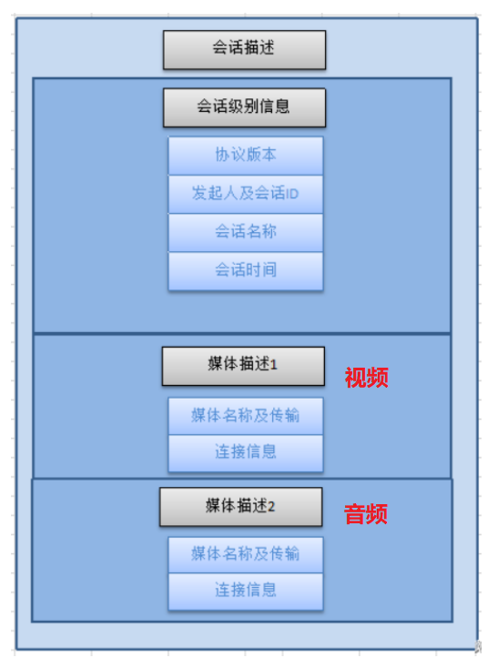

# stream

# 1 音视频基础

## 1.1 视频主要概念

视频录制和播放原理：


**像素**：是一个图片的基本单位，pix是英语单词picture的简写，加上英语单词“元素element”， 就得到了“pixel”，简称px，所以“像素”有“图像元素”之意

**分辨率**：图像（或视频）的分辨率是指图像的大小或尺寸。我们通常用像素表示图像的尺寸。常见的分辨率： 360P(640x360)、720P(1280x720)、1080P(1920x1080)、4K(3840x2160)、8K(7680x4320

**视频码率**：kb/s，是指视频文件在单位时间内使用的数据流量，也叫码流率。

**视频帧率**：fps，通常说一个视频的25帧，指的就是这个视频帧率，即1秒中会显示25帧。帧率越高，给人的视觉就越流畅。

**视频分辨率**：分辨率就是我们常说的640x480分辨率、1920x1080分辨率，分辨率影响视频图像的大小。

**Stride** ：指在内存中每行像素所占的空间。为了实现内存对齐每行像素在内存中所占 的空间并不一定是图像的宽度。


**RGB**：红R、绿G、蓝B三基色。也是三个通道

**YUV**：“Y”表示明亮度（Luminance或Luma），也就是灰阶值，“U”和“V”表 示的则是色度（Chrominance或Chroma）

**位深**：每个通道的位深越大，能够表示的颜色值就越大，比如现在高端电视说的10bit色 彩，即是每个通道用10bit表示，每个通道有1024种颜色。

**libyuv**：Google开源的实现各种YUV与RGB间相互转换、旋转、缩放的库。


**I帧（Intra coded frames）**：I帧不需要参考其他画面而生成,解码时仅靠自己就重构完整图像;

**P帧（Predicted frames）**：根据本帧与相邻的前一帧（I帧或P帧）的不同点来压缩本帧数据，P帧属于前向预测的帧间编码。它需要参考前面最靠近它的I帧或P帧来解码。

**B帧（Bi-directional predicted frames）**B 帧图像采用双向时间预测，可以大大提高压缩倍数。


常见视频压缩算法：

- MPEG2 MPEG阵营
- H264 MPEG阵营
- H265 MPEG阵营
- AVS   中国阵营
- VP8   Google阵营
- VP9 Google阵营

## 1.2 音频

**模拟信号数字化**：

- 采样频率：Nyguist采样定律，要从采样中完全恢复原始信号波形，采样频率必须至少是信号中最高频率的两倍。前面提到人耳能听到的频率范围是[20H~20kHz]，所以采样频率一般为44.1Khz
- 采样量化：采样值的精度取决于它用多少位来表示，这就是量化。
- 编码：

**PCM脉冲编码调制**：PCM是把声音从模拟信号转化为数字信号的技术。


**采样频率：**每秒钟采样的点的个数。常用的采样频率有：

- 22000（22kHz）： 无线广播。

- 44100（44.1kHz）：CD音质。

- 48000（48kHz）： 数字电视，DVD。

- 96000（96kHz）： 蓝光，高清DVD。

- 192000(192kHz): 蓝光，高清DVD。

**采样精度（采样深度）**：每个“样本点”的大小，常用的大小为8bit， 16bit，24bit。

**通道数：**单声道，双声道，四声道，5.1声道。


**比特率：**每秒传输的bit数，单位为：bps（Bit Per Second），没有压缩的音频数据的比特率 = 采样频率 * 采样精度 * 通道数。

**码率：** 质量压缩后的音频数据的比特率，常见的码率：

- 96kbps： FM

- 128-160kbps：一般质量音频。

- 192kbps： CD质量。

- 256-320Kbps：高质量音频


**帧：**每次编码的采样单元数，比如MP3通常是1152个采样点作为一个编码单元，AAC通常是1024个采样点作为一个编码单元。

**帧长**：可以指每帧播放持续的时间：每帧持续时间(秒) = 每帧采样点数 / 采样频率（HZ），也可以指压缩后每帧的数据长度。


**数字音频压缩编码**：采取去除声音信号中冗余成分的方法来实现。所谓冗余成分指的是音频中不能被人耳感知到的信号，它们对确定声音的音色，音调等信息没有任何的帮助。

**冗余信号**：包含人耳听觉范围外的音频信号以及被掩蔽掉的音频信号等。例如，人耳所能察觉的声音信号的频率范围为20Hz～20KHz，除此之外的其它频率人耳无法察觉，都可视为冗余信号。

根据人耳听觉的生理和心理声学现象，当一个强音信号与一个弱音信号同时存在时，弱音信号将被强音信号所掩蔽而听不见，这样弱音信号就可以视为冗余信号而不用传送。这就是人耳听觉的掩蔽效应，

**频谱掩蔽效应**：一个频率的声音能量小于某个阈值之后，人耳就会听不到。当有另外能量较大的声音出现的时候，该声音频率附近的阈值会提高很多，即所谓的掩蔽效应。

**时域掩蔽效应**：当强音信号和弱音信号同时出现时，还存在**时域掩蔽效应**。即两者发生时间很接近的时候，也会发生掩蔽效应。时域掩蔽过程曲线如图所示，分为前掩蔽、同时掩蔽和后掩蔽三部分。

**音频编解码**：

- OPUS
- MP3
- AAC
- AC3和EAC3 杜比公司的方案 

# 2 环境搭建

vs2015，qt5.1，cdb，

qt创建的项目目录里面不能有中文路径，否则无法编译。

qt如果要使用msvc的调试器，必须安装windows sdk 中的 debugger tools（下载winsdksetup.exe）


# 4 SDL

SDL是 “Simple DirectMedia Layer”的缩写，SDL是一个开源的跨平台的多媒体库，封装了复杂的音视频底层操作，简化了音视频处理的难度。

## 4.1 yuv文件渲染

```c
#include <stdio.h>
#include <string.h>

#include <SDL.h>

//自定义消息类型
#define REFRESH_EVENT   (SDL_USEREVENT + 1)     // 请求画面刷新事件
#define QUIT_EVENT      (SDL_USEREVENT + 2)     // 退出事件

//定义分辨率
// YUV像素分辨率
#define YUV_WIDTH   320
#define YUV_HEIGHT  240
//定义YUV格式
#define YUV_FORMAT  SDL_PIXELFORMAT_IYUV

int s_thread_exit = 0;  // 退出标志 = 1则退出

int refresh_video_timer(void *data)
{
    while (!s_thread_exit)
    {
        SDL_Event event;
        event.type = REFRESH_EVENT;
        SDL_PushEvent(&event);
        SDL_Delay(40);
    }

    s_thread_exit = 0;

    //push quit event
    SDL_Event event;
    event.type = QUIT_EVENT;
    SDL_PushEvent(&event);

    return 0;
}
#undef main
int main(int argc, char* argv[])
{
    //初始化 SDL
    if(SDL_Init(SDL_INIT_VIDEO))
    {
        fprintf( stderr, "Could not initialize SDL - %s\n", SDL_GetError());
        return -1;
    }

    // SDL
    SDL_Event event;                            // 事件
    SDL_Rect rect;                              // 矩形
    SDL_Window *window = NULL;                  // 窗口
    SDL_Renderer *renderer = NULL;              // 渲染
    SDL_Texture *texture = NULL;                // 纹理
    SDL_Thread *timer_thread = NULL;            // 请求刷新线程
    uint32_t pixformat = YUV_FORMAT;            // YUV420P，即是SDL_PIXELFORMAT_IYUV

    // 分辨率
    // 1. YUV的分辨率
    int video_width = YUV_WIDTH;
    int video_height = YUV_HEIGHT;
    // 2.显示窗口的分辨率
    int win_width = YUV_WIDTH;
    int win_height = YUV_WIDTH;

    // YUV文件句柄
    FILE *video_fd = NULL;
    const char *yuv_path = "yuv420p_320x240.yuv";

    size_t video_buff_len = 0;

    uint8_t *video_buf = NULL; //读取数据后先把放到buffer里面

    // 我们测试的文件是YUV420P格式
    uint32_t y_frame_len = video_width * video_height;
    uint32_t u_frame_len = video_width * video_height / 4;
    uint32_t v_frame_len = video_width * video_height / 4;
    uint32_t yuv_frame_len = y_frame_len + u_frame_len + v_frame_len;

    //创建窗口
    window = SDL_CreateWindow("Simplest YUV Player",
                           SDL_WINDOWPOS_UNDEFINED,
                           SDL_WINDOWPOS_UNDEFINED,
                           video_width, video_height,
                           SDL_WINDOW_OPENGL|SDL_WINDOW_RESIZABLE);
    if(!window)
    {
        fprintf(stderr, "SDL: could not create window, err:%s\n",SDL_GetError());
        goto _FAIL;
    }
    // 基于窗口创建渲染器
    renderer = SDL_CreateRenderer(window, -1, 0);
    // 基于渲染器创建纹理
    texture = SDL_CreateTexture(renderer,
                                pixformat,
                                SDL_TEXTUREACCESS_STREAMING,
                                video_width,
                                video_height);

    // 分配空间
    video_buf = (uint8_t*)malloc(yuv_frame_len);
    if(!video_buf)
    {
        fprintf(stderr, "Failed to alloce yuv frame space!\n");
        goto _FAIL;
    }

    // 打开YUV文件
    video_fd = fopen(yuv_path, "rb");
    if( !video_fd )
    {
        fprintf(stderr, "Failed to open yuv file\n");
        goto _FAIL;
    }
    // 创建请求刷新线程
    timer_thread = SDL_CreateThread(refresh_video_timer,
                                    NULL,
                                    NULL);

    while (1)
    {
        // 收取SDL系统里面的事件
        SDL_WaitEvent(&event);

        if(event.type == REFRESH_EVENT) // 画面刷新事件
        {
            video_buff_len = fread(video_buf, 1, yuv_frame_len, video_fd);
            if(video_buff_len <= 0)
            {
                fprintf(stderr, "Failed to read data from yuv file!\n");
                goto _FAIL;
            }
            // 设置纹理的数据 video_width = 320， plane
            SDL_UpdateTexture(texture, NULL, video_buf, video_width);

            // 显示区域，可以通过修改w和h进行缩放
            rect.x = 0;
            rect.y = 0;
            float w_ratio = win_width * 1.0 /video_width;
            float h_ratio = win_height * 1.0 /video_height;
            // 320x240 怎么保持原视频的宽高比例
            rect.w = video_width * w_ratio;
            rect.h = video_height * h_ratio;
//            rect.w = video_width * 0.5;
//            rect.h = video_height * 0.5;

            // 清除当前显示
            SDL_RenderClear(renderer);
            // 将纹理的数据拷贝给渲染器
            SDL_RenderCopy(renderer, texture, NULL, &rect);
            // 显示
            SDL_RenderPresent(renderer);
        }
        else if(event.type == SDL_WINDOWEVENT)
        {
            //If Resize
            SDL_GetWindowSize(window, &win_width, &win_height);
            printf("SDL_WINDOWEVENT win_width:%d, win_height:%d\n",win_width,
                   win_height );
        }
        else if(event.type == SDL_QUIT) //退出事件
        {
            s_thread_exit = 1;
        }
        else if(event.type == QUIT_EVENT)
        {
            break;
        }
    }

_FAIL:
    s_thread_exit = 1;      // 保证线程能够退出
    // 释放资源
    if(timer_thread)
        SDL_WaitThread(timer_thread, NULL); // 等待线程退出
    if(video_buf)
        free(video_buf);
    if(video_fd)
        fclose(video_fd);
    if(texture)
        SDL_DestroyTexture(texture);
    if(renderer)
        SDL_DestroyRenderer(renderer);
    if(window)
        SDL_DestroyWindow(window);

    SDL_Quit();

    return 0;

}

```

## 4.2 PCM声音播放

```c
/**
 * SDL2播放PCM
 *
 * 本程序使用SDL2播放PCM音频采样数据。SDL实际上是对底层绘图
 * API（Direct3D，OpenGL）的封装，使用起来明显简单于直接调用底层
 * API。
 * 测试的PCM数据采用采样率44.1k, 采用精度S16SYS, 通道数2
 *
 * 函数调用步骤如下:
 *
 * [初始化]
 * SDL_Init(): 初始化SDL。
 * SDL_OpenAudio(): 根据参数（存储于SDL_AudioSpec）打开音频设备。
 * SDL_PauseAudio(): 播放音频数据。
 *
 * [循环播放数据]
 * SDL_Delay(): 延时等待播放完成。
 *
 */

#include <stdio.h>
#include <SDL.h>

// 每次读取2帧数据, 以1024个采样点一帧 2通道 16bit采样点为例
#define PCM_BUFFER_SIZE (1024*2*2*2)

// 音频PCM数据缓存
static Uint8 *s_audio_buf = NULL;
// 目前读取的位置
static Uint8 *s_audio_pos = NULL;
// 缓存结束位置
static Uint8 *s_audio_end = NULL;


//音频设备回调函数
void fill_audio_pcm(void *udata, Uint8 *stream, int len)
{
    SDL_memset(stream, 0, len);

    if(s_audio_pos >= s_audio_end) // 数据读取完毕
    {
        return;
    }

    // 数据够了就读预设长度，数据不够就只读部分（不够的时候剩多少就读取多少）
    int remain_buffer_len = s_audio_end - s_audio_pos;
    len = (len < remain_buffer_len) ? len : remain_buffer_len;
    // 拷贝数据到stream并调整音量
    SDL_MixAudio(stream, s_audio_pos, len, SDL_MIX_MAXVOLUME/8);
    printf("len = %d\n", len);
    s_audio_pos += len;  // 移动缓存指针
}

// 提取PCM文件
// ffmpeg -i input.mp4 -t 20 -codec:a pcm_s16le -ar 44100 -ac 2 -f s16le 44100_16bit_2ch.pcm
// 测试PCM文件
// ffplay -ar 44100 -ac 2 -f s16le 44100_16bit_2ch.pcm
#undef main
int main(int argc, char *argv[])
{
    int ret = -1;
    FILE *audio_fd = NULL;
    SDL_AudioSpec spec;
    const char *path = "44100_16bit_2ch.pcm";
    // 每次缓存的长度
    size_t read_buffer_len = 0;

    //SDL initialize
    if(SDL_Init(SDL_INIT_AUDIO))    // 支持AUDIO
    {
        fprintf(stderr, "Could not initialize SDL - %s\n", SDL_GetError());
        return ret;
    }

    //打开PCM文件
    audio_fd = fopen(path, "rb");
    if(!audio_fd)
    {
        fprintf(stderr, "Failed to open pcm file!\n");
        goto _FAIL;
    }

    s_audio_buf = (uint8_t *)malloc(PCM_BUFFER_SIZE);

    // 音频参数设置SDL_AudioSpec
    spec.freq = 44100;          // 采样频率
    spec.format = AUDIO_S16SYS; // 采样点格式
    spec.channels = 2;          // 2通道
    spec.silence = 0;
    spec.samples = 1024;       // 23.2ms -> 46.4ms 每次读取的采样数量，多久产生一次回调和 samples
    spec.callback = fill_audio_pcm; // 回调函数
    spec.userdata = NULL;

    //打开音频设备
    if(SDL_OpenAudio(&spec, NULL))
    {
        fprintf(stderr, "Failed to open audio device, %s\n", SDL_GetError());
        goto _FAIL;
    }

    //play audio
    SDL_PauseAudio(0);

    int data_count = 0;
    while(1)
    {
        // 从文件读取PCM数据
        read_buffer_len = fread(s_audio_buf, 1, PCM_BUFFER_SIZE, audio_fd);
        if(read_buffer_len == 0)
        {
            break;
        }
        data_count += read_buffer_len; // 统计读取的数据总字节数
        printf("now playing %10d bytes data.\n",data_count);
        s_audio_end = s_audio_buf + read_buffer_len;    // 更新buffer的结束位置
        s_audio_pos = s_audio_buf;  // 更新buffer的起始位置
        //the main thread wait for a moment
        while(s_audio_pos < s_audio_end)
        {
            SDL_Delay(10);  // 等待PCM数据消耗
        }
    }
    printf("play PCM finish\n");
    // 关闭音频设备
    SDL_CloseAudio();

_FAIL:
    //release some resources
    if(s_audio_buf)
        free(s_audio_buf);

    if(audio_fd)
        fclose(audio_fd);

    //quit SDL
    SDL_Quit();

    return 0;
}


```


# 6 RTMP推拉流


# 7 RTSP

## 7.1 ZLMediaKit

[ZLMediaKit，一个基于C++11的高性能运营级流媒体服务框架](https://github.com/ZLMediaKit/ZLMediaKit)

- 支持多种协议(RTSP/RTMP/HLS/HTTP-FLV/WebSocket-FLV/GB28181/HTTP-TS/WebSocket-TS/HTTP-fMP4/WebSocket-fMP4/MP4/WebRTC),支持协议互转。

[新手使用wvp-pro和ZLMediaKit的菜鸟说明](https://blog.csdn.net/houge101/article/details/128259947)

### 7.1.1 [搭建步骤](https://github.com/ZLMediaKit/ZLMediaKit/wiki/%E5%BF%AB%E9%80%9F%E5%BC%80%E5%A7%8B)

```bash
# ubuntu安装步骤

#国内用户推荐从同步镜像网站gitee下载 
git clone --depth 1 https://gitee.com/xia-chu/ZLMediaKit
cd ZLMediaKit
#千万不要忘记执行这句命令
git submodule update --init

# 编译器
# linux gcc >= 4.8
sudo apt-get install build-essential

# cmake工具
sudo apt-get install cmake

# 依赖库
# 依赖openssl、ffmpeg、sdl、avcodec、avutil
# 可以通过dpkg -l | grep ''查看是否安装
# 除了openssl,其他其实都可以不安装。
# ubuntu现在好像自带所有依赖
sudo apt-get install libssl-dev
sudo apt-get install libsdl-dev
sudo apt-get install libavcodec-dev
sudo apt-get install libavutil-dev
sudo apt-get install ffmpeg


# 构建可编译
cd ZLMediaKit
mkdir build
cd build
cmake ..
make -j4
# 构建产物
# ZiaKit工程主要生成3种二进制目标文件，他们的生成的路径在release目录下。
# 这些文件主要分为MediaServer，c api SDK，test_开头的测试程序
# MediaServer：作为服务器的主进程，该进程可以在免去开发的情况下直接作为测试流媒体服务器使用，如果你需要更复杂的业务逻辑，可以通过Web HOOK和RESTful API实现,同时你可以通过配置文件控制其参数。
# c api SDK：ZLMediaKit也提供c的api二次开发sdk库，头文件在ZLMediaKit/api/include,库文件为ZLMediaKit/release/linux/Debug/libmk_api.so


# 运行
cd ZLMediaKit/release/linux/Debug
#通过-h可以了解启动参数
./MediaServer -h
#以守护进程模式启动
./MediaServer -d &
```

### 7.1.2 配置

```bash
#!!!!此配置文件为范例配置文件，意在告诉读者，各个配置项的具体含义和作用，
#!!!!该配置文件在执行cmake时，会拷贝至release/${操作系统类型}/${编译类型}(例如release/linux/Debug) 文件夹。
#!!!!该文件夹(release/${操作系统类型}/${编译类型})同时也是可执行程序生成目标路径，在执行MediaServer进程时，它会默认加载同目录下的config.ini文件作为配置文件，
#!!!!你如果修改此范例配置文件(conf/config.ini)，并不会被MediaServer进程加载，因为MediaServer进程默认加载的是release/${操作系统类型}/${编译类型}/config.ini。
#!!!!当然，你每次执行cmake，该文件确实会被拷贝至release/${操作系统类型}/${编译类型}/config.ini，
#!!!!但是一般建议你直接修改release/${操作系统类型}/${编译类型}/config.ini文件，修改此文件一般不起作用,除非你运行MediaServer时使用-c参数指定到此文件。

[api]
#是否调试http api,启用调试后，会打印每次http请求的内容和回复
apiDebug=1
#一些比较敏感的http api在访问时需要提供secret，否则无权限调用
#如果是通过127.0.0.1访问,那么可以不提供secret
secret=035c73f7-bb6b-4889-a715-d9eb2d1925cc
#截图保存路径根目录，截图通过http api(/index/api/getSnap)生成和获取
snapRoot=./www/snap/
#默认截图图片，在启动FFmpeg截图后但是截图还未生成时，可以返回默认的预设图片
defaultSnap=./www/logo.png

[ffmpeg]
#FFmpeg可执行程序路径,支持相对路径/绝对路径
bin=/usr/bin/ffmpeg
#FFmpeg拉流再推流的命令模板，通过该模板可以设置再编码的一些参数
cmd=%s -re -i %s -c:a aac -strict -2 -ar 44100 -ab 48k -c:v libx264 -f flv %s
#FFmpeg生成截图的命令，可以通过修改该配置改变截图分辨率或质量
snap=%s -i %s -y -f mjpeg -frames:v 1 %s
#FFmpeg日志的路径，如果置空则不生成FFmpeg日志
#可以为相对(相对于本可执行程序目录)或绝对路径
log=./ffmpeg/ffmpeg.log
# 自动重启的时间(秒), 默认为0, 也就是不自动重启. 主要是为了避免长时间ffmpeg拉流导致的不同步现象
restart_sec=0

#转协议相关开关；如果addStreamProxy api和on_publish hook回复未指定转协议参数，则采用这些配置项
[protocol]
#转协议时，是否开启帧级时间戳覆盖
# 0:采用源视频流绝对时间戳，不做任何改变
# 1:采用zlmediakit接收数据时的系统时间戳(有平滑处理)
# 2:采用源视频流时间戳相对时间戳(增长量)，有做时间戳跳跃和回退矫正
modify_stamp=2
#转协议是否开启音频
enable_audio=1
#添加acc静音音频，在关闭音频时，此开关无效
add_mute_audio=1
#无人观看时，是否直接关闭(而不是通过on_none_reader hook返回close)
#此配置置1时，此流如果无人观看，将不触发on_none_reader hook回调，
#而是将直接关闭流
auto_close=0

#推流断开后可以在超时时间内重新连接上继续推流，这样播放器会接着播放。
#置0关闭此特性(推流断开会导致立即断开播放器)
#此参数不应大于播放器超时时间;单位毫秒
continue_push_ms=15000

#是否开启转换为hls(mpegts)
enable_hls=1
#是否开启转换为hls(fmp4)
enable_hls_fmp4=0
#是否开启MP4录制
enable_mp4=0
#是否开启转换为rtsp/webrtc
enable_rtsp=1
#是否开启转换为rtmp/flv
enable_rtmp=1
#是否开启转换为http-ts/ws-ts
enable_ts=1
#是否开启转换为http-fmp4/ws-fmp4
enable_fmp4=1

#是否将mp4录制当做观看者
mp4_as_player=0
#mp4切片大小，单位秒
mp4_max_second=3600
#mp4录制保存路径
mp4_save_path=./www

#hls录制保存路径
hls_save_path=./www

###### 以下是按需转协议的开关，在测试ZLMediaKit的接收推流性能时，请把下面开关置1
###### 如果某种协议你用不到，你可以把以下开关置1以便节省资源(但是还是可以播放，只是第一个播放者体验稍微差点)，
###### 如果某种协议你想获取最好的用户体验，请置0(第一个播放者可以秒开，且不花屏)
#hls协议是否按需生成，如果hls.segNum配置为0(意味着hls录制)，那么hls将一直生成(不管此开关)
hls_demand=0
#rtsp[s]协议是否按需生成
rtsp_demand=0
#rtmp[s]、http[s]-flv、ws[s]-flv协议是否按需生成
rtmp_demand=0
#http[s]-ts协议是否按需生成
ts_demand=0
#http[s]-fmp4、ws[s]-fmp4协议是否按需生成
fmp4_demand=0

[general]
#是否启用虚拟主机
enableVhost=0
#播放器或推流器在断开后会触发hook.on_flow_report事件(使用多少流量事件)，
#flowThreshold参数控制触发hook.on_flow_report事件阈值，使用流量超过该阈值后才触发，单位KB
flowThreshold=1024
#播放最多等待时间，单位毫秒
#播放在播放某个流时，如果该流不存在，
#ZLMediaKit会最多让播放器等待maxStreamWaitMS毫秒
#如果在这个时间内，该流注册成功，那么会立即返回播放器播放成功
#否则返回播放器未找到该流，该机制的目的是可以先播放再推流
maxStreamWaitMS=15000
#某个流无人观看时，触发hook.on_stream_none_reader事件的最大等待时间，单位毫秒
#在配合hook.on_stream_none_reader事件时，可以做到无人观看自动停止拉流或停止接收推流
streamNoneReaderDelayMS=20000
#拉流代理时如果断流再重连成功是否删除前一次的媒体流数据，如果删除将重新开始，
#如果不删除将会接着上一次的数据继续写(录制hls/mp4时会继续在前一个文件后面写)
resetWhenRePlay=1
#合并写缓存大小(单位毫秒)，合并写指服务器缓存一定的数据后才会一次性写入socket，这样能提高性能，但是会提高延时
#开启后会同时关闭TCP_NODELAY并开启MSG_MORE
mergeWriteMS=0
#服务器唯一id，用于触发hook时区别是哪台服务器
mediaServerId=your_server_id

#最多等待未初始化的Track时间，单位毫秒，超时之后会忽略未初始化的Track
wait_track_ready_ms=10000
#如果流只有单Track，最多等待若干毫秒，超时后未收到其他Track的数据，则认为是单Track
#如果协议元数据有声明特定track数，那么无此等待时间
wait_add_track_ms=3000
#如果track未就绪，我们先缓存帧数据，但是有最大个数限制，防止内存溢出
unready_frame_cache=100

[hls]
#hls写文件的buf大小，调整参数可以提高文件io性能
fileBufSize=65536
#hls最大切片时间
segDur=2
#m3u8索引中,hls保留切片个数(实际保留切片个数大2~3个)
#如果设置为0，则不删除切片，而是保存为点播
segNum=3
#HLS切片从m3u8文件中移除后，继续保留在磁盘上的个数
segRetain=5
#是否广播 hls切片(ts/fmp4)完成通知(on_record_ts)
broadcastRecordTs=0
#直播hls文件删除延时，单位秒，issue: #913
deleteDelaySec=10
#是否保留hls文件，此功能部分等效于segNum=0的情况
#不同的是这个保留不会在m3u8文件中体现
#0为不保留，不起作用
#1为保留，则不删除hls文件，如果开启此功能，注意磁盘大小，或者定期手动清理hls文件
segKeep=0

[hook]
#是否启用hook事件，启用后，推拉流都将进行鉴权
enable=0
#播放器或推流器使用流量事件，置空则关闭
on_flow_report=https://127.0.0.1/index/hook/on_flow_report
#访问http文件鉴权事件，置空则关闭鉴权
on_http_access=https://127.0.0.1/index/hook/on_http_access
#播放鉴权事件，置空则关闭鉴权
on_play=https://127.0.0.1/index/hook/on_play
#推流鉴权事件，置空则关闭鉴权
on_publish=https://127.0.0.1/index/hook/on_publish
#录制mp4切片完成事件
on_record_mp4=https://127.0.0.1/index/hook/on_record_mp4
# 录制 hls ts(或fmp4) 切片完成事件
on_record_ts=https://127.0.0.1/index/hook/on_record_ts
#rtsp播放鉴权事件，此事件中比对rtsp的用户名密码
on_rtsp_auth=https://127.0.0.1/index/hook/on_rtsp_auth
#rtsp播放是否开启专属鉴权事件，置空则关闭rtsp鉴权。rtsp播放鉴权还支持url方式鉴权
#建议开发者统一采用url参数方式鉴权，rtsp用户名密码鉴权一般在设备上用的比较多
#开启rtsp专属鉴权后，将不再触发on_play鉴权事件
on_rtsp_realm=https://127.0.0.1/index/hook/on_rtsp_realm
#远程telnet调试鉴权事件
on_shell_login=https://127.0.0.1/index/hook/on_shell_login
#直播流注册或注销事件
on_stream_changed=https://127.0.0.1/index/hook/on_stream_changed
#过滤on_stream_changed hook的协议类型，可以选择只监听某些感兴趣的协议；置空则不过滤协议
stream_changed_schemas=rtsp/rtmp/fmp4/ts/hls/hls.fmp4
#无人观看流事件，通过该事件，可以选择是否关闭无人观看的流。配合general.streamNoneReaderDelayMS选项一起使用
on_stream_none_reader=https://127.0.0.1/index/hook/on_stream_none_reader
#播放时，未找到流事件，通过配合hook.on_stream_none_reader事件可以完成按需拉流
on_stream_not_found=https://127.0.0.1/index/hook/on_stream_not_found
#服务器启动报告，可以用于服务器的崩溃重启事件监听
on_server_started=https://127.0.0.1/index/hook/on_server_started
#服务器退出报告，当服务器正常退出时触发
on_server_exited=https://127.0.0.1/index/hook/on_server_exited
#server保活上报
on_server_keepalive=https://127.0.0.1/index/hook/on_server_keepalive
#发送rtp(startSendRtp)被动关闭时回调
on_send_rtp_stopped=https://127.0.0.1/index/hook/on_send_rtp_stopped
#rtp server 超时未收到数据
on_rtp_server_timeout=https://127.0.0.1/index/hook/on_rtp_server_timeout

#hook api最大等待回复时间，单位秒
timeoutSec=10
#keepalive hook触发间隔,单位秒，float类型
alive_interval=10.0
#hook通知失败重试次数,正整数。为0不重试，1时重试一次，以此类推
retry=1
#hook通知失败重试延时，单位秒，float型
retry_delay=3.0

[cluster]
#设置源站拉流url模板, 格式跟printf类似，第一个%s指定app,第二个%s指定stream_id,
#开启集群模式后，on_stream_not_found和on_stream_none_reader hook将无效.
#溯源模式支持以下类型:
#rtmp方式: rtmp://127.0.0.1:1935/%s/%s
#rtsp方式: rtsp://127.0.0.1:554/%s/%s
#hls方式: http://127.0.0.1:80/%s/%s/hls.m3u8
#http-ts方式: http://127.0.0.1:80/%s/%s.live.ts
#支持多个源站，不同源站通过分号(;)分隔
origin_url=
#溯源总超时时长，单位秒，float型；假如源站有3个，那么单次溯源超时时间为timeout_sec除以3
#单次溯源超时时间不要超过general.maxStreamWaitMS配置
timeout_sec=15
#溯源失败尝试次数，-1时永久尝试
retry_count=3

[http]
#http服务器字符编码，windows上默认gb2312
charSet=utf-8
#http链接超时时间
keepAliveSecond=30
#http请求体最大字节数，如果post的body太大，则不适合缓存body在内存
maxReqSize=40960
#404网页内容，用户可以自定义404网页
#notFound=<html><head><title>404 Not Found</title></head><body bgcolor="white"><center><h1>您访问的资源不存在！</h1></center><hr><center>ZLMediaKit-4.0</center></body></html>
#http服务器监听端口
port=80
#http文件服务器根目录
#可以为相对(相对于本可执行程序目录)或绝对路径
rootPath=./www
#http文件服务器读文件缓存大小，单位BYTE，调整该参数可以优化文件io性能
sendBufSize=65536
#https服务器监听端口
sslport=443
#是否显示文件夹菜单，开启后可以浏览文件夹
dirMenu=1
#虚拟目录, 虚拟目录名和文件路径使用","隔开，多个配置路径间用";"隔开
#例如赋值为 app_a,/path/to/a;app_b,/path/to/b 那么
#访问 http://127.0.0.1/app_a/file_a 对应的文件路径为 /path/to/a/file_a
#访问 http://127.0.0.1/app_b/file_b 对应的文件路径为 /path/to/b/file_b
#访问其他http路径,对应的文件路径还是在rootPath内
virtualPath=
#禁止后缀的文件使用mmap缓存，使用“,”隔开
#例如赋值为 .mp4,.flv
#那么访问后缀为.mp4与.flv 的文件不缓存
forbidCacheSuffix=
#可以把http代理前真实客户端ip放在http头中：https://github.com/ZLMediaKit/ZLMediaKit/issues/1388
#切勿暴露此key，否则可能导致伪造客户端ip
forwarded_ip_header=
#默认允许所有跨域请求
allow_cross_domains=1
#允许访问http api和http文件索引的ip地址范围白名单，置空情况下不做限制
allow_ip_range=127.0.0.1,172.16.0.0-172.31.255.255,192.168.0.0-192.168.255.255,10.0.0.0-10.255.255.255

[multicast]
#rtp组播截止组播ip地址
addrMax=239.255.255.255
#rtp组播起始组播ip地址
addrMin=239.0.0.0
#组播udp ttl
udpTTL=64

[record]
#mp4录制或mp4点播的应用名，通过限制应用名，可以防止随意点播
#点播的文件必须放置在此文件夹下
appName=record
#mp4录制写文件缓存，单位BYTE,调整参数可以提高文件io性能
fileBufSize=65536
#mp4点播每次流化数据量，单位毫秒，
#减少该值可以让点播数据发送量更平滑，增大该值则更节省cpu资源
sampleMS=500
#mp4录制完成后是否进行二次关键帧索引写入头部
fastStart=0
#MP4点播(rtsp/rtmp/http-flv/ws-flv)是否循环播放文件
fileRepeat=0

[rtmp]
#rtmp必须在此时间内完成握手，否则服务器会断开链接，单位秒
handshakeSecond=15
#rtmp超时时间，如果该时间内未收到客户端的数据，
#或者tcp发送缓存超过这个时间，则会断开连接，单位秒
keepAliveSecond=15
#rtmp服务器监听端口
port=1935
#rtmps服务器监听地址
sslport=0

[rtp]
#音频mtu大小，该参数限制rtp最大字节数，推荐不要超过1400
#加大该值会明显增加直播延时
audioMtuSize=600
#视频mtu大小，该参数限制rtp最大字节数，推荐不要超过1400
videoMtuSize=1400
#rtp包最大长度限制，单位KB,主要用于识别TCP上下文破坏时，获取到错误的rtp
rtpMaxSize=10
# rtp 打包时，低延迟开关，默认关闭（为0），h264存在一帧多个slice（NAL）的情况，在这种情况下，如果开启可能会导致画面花屏
lowLatency=0
# H264 rtp打包模式是否采用stap-a模式(为了在老版本浏览器上兼容webrtc)还是采用Single NAL unit packet per H.264 模式
# 有些老的rtsp设备不支持stap-a rtp，设置此配置为0可提高兼容性
h264_stap_a=1

[rtp_proxy]
#导出调试数据(包括rtp/ps/h264)至该目录,置空则关闭数据导出
dumpDir=
#udp和tcp代理服务器，支持rtp(必须是ts或ps类型)代理
port=10000
#rtp超时时间，单位秒
timeoutSec=15
#随机端口范围，最少确保36个端口
#该范围同时限制rtsp服务器udp端口范围
port_range=30000-35000
#rtp h264 负载的pt
h264_pt=98
#rtp h265 负载的pt
h265_pt=99
#rtp ps 负载的pt
ps_pt=96
#rtp opus 负载的pt
opus_pt=100
#RtpSender相关功能是否提前开启gop缓存优化级联秒开体验，默认开启
#如果不调用startSendRtp相关接口，可以置0节省内存
gop_cache=1

[rtc]
#rtc播放推流、播放超时时间
timeoutSec=15
#本机对rtc客户端的可见ip，作为服务器时一般为公网ip，可有多个，用','分开，当置空时，会自动获取网卡ip
#同时支持环境变量，以$开头，如"$EXTERN_IP"; 请参考：https://github.com/ZLMediaKit/ZLMediaKit/pull/1786
externIP=
#rtc udp服务器监听端口号，所有rtc客户端将通过该端口传输stun/dtls/srtp/srtcp数据，
#该端口是多线程的，同时支持客户端网络切换导致的连接迁移
#需要注意的是，如果服务器在nat内，需要做端口映射时，必须确保外网映射端口跟该端口一致
port=8000
#rtc tcp服务器监听端口号，在udp 不通的情况下，会使用tcp传输数据
#该端口是多线程的，同时支持客户端网络切换导致的连接迁移
#需要注意的是，如果服务器在nat内，需要做端口映射时，必须确保外网映射端口跟该端口一致
tcpPort = 8000
#设置remb比特率，非0时关闭twcc并开启remb。该设置在rtc推流时有效，可以控制推流画质
#目前已经实现twcc自动调整码率，关闭remb根据真实网络状况调整码率
rembBitRate=0
#rtc支持的音频codec类型,在前面的优先级更高
#以下范例为所有支持的音频codec
preferredCodecA=PCMU,PCMA,opus,mpeg4-generic
#rtc支持的视频codec类型,在前面的优先级更高
#以下范例为所有支持的视频codec
preferredCodecV=H264,H265,AV1,VP9,VP8

[srt]
#srt播放推流、播放超时时间,单位秒
timeoutSec=5
#srt udp服务器监听端口号，所有srt客户端将通过该端口传输srt数据，
#该端口是多线程的，同时支持客户端网络切换导致的连接迁移
port=9000
#srt 协议中延迟缓存的估算参数，在握手阶段估算rtt ,然后latencyMul*rtt 为最大缓存时长，此参数越大，表示等待重传的时长就越大
latencyMul=4
#包缓存的大小
pktBufSize=8192


[rtsp]
#rtsp专有鉴权方式是采用base64还是md5方式
authBasic=0
#rtsp拉流、推流代理是否是直接代理模式
#直接代理后支持任意编码格式，但是会导致GOP缓存无法定位到I帧，可能会导致开播花屏
#并且如果是tcp方式拉流，如果rtp大于mtu会导致无法使用udp方式代理
#假定您的拉流源地址不是264或265或AAC，那么你可以使用直接代理的方式来支持rtsp代理
#如果你是rtsp推拉流，但是webrtc播放，也建议关闭直接代理模式，
#因为直接代理时，rtp中可能没有sps pps,会导致webrtc无法播放; 另外webrtc也不支持Single NAL Unit Packets类型rtp
#默认开启rtsp直接代理，rtmp由于没有这些问题，是强制开启直接代理的
directProxy=1
#rtsp必须在此时间内完成握手，否则服务器会断开链接，单位秒
handshakeSecond=15
#rtsp超时时间，如果该时间内未收到客户端的数据，
#或者tcp发送缓存超过这个时间，则会断开连接，单位秒
keepAliveSecond=15
#rtsp服务器监听地址
port=554
#rtsps服务器监听地址
sslport=0
#rtsp 转发是否使用低延迟模式，当开启时，不会缓存rtp包，来提高并发，可以降低一帧的延迟
lowLatency=0
#强制协商rtp传输方式 (0:TCP,1:UDP,2:MULTICAST,-1:不限制)
#当客户端发起RTSP SETUP的时候如果传输类型和此配置不一致则返回461 Unsupported transport
#迫使客户端重新SETUP并切换到对应协议。目前支持FFMPEG和VLC
rtpTransportType=-1
[shell]
#调试telnet服务器接受最大bufffer大小
maxReqSize=1024
#调试telnet服务器监听端口
port=0

```

#### [HTTP HOOK  API](https://github.com/zlmediakit/ZLMediaKit/wiki/MediaServer%E6%94%AF%E6%8C%81%E7%9A%84HTTP-HOOK-API)

MediaServer可以把内部的一些事件通过http post 第三方http服务器的方式通知出去，以下是相关的默认配置：


### 7.1.3 测试

[测试搭建是否成功](https://github.com/ZLMediaKit/ZLMediaKit/wiki/ZLMediaKit%E6%8E%A8%E6%B5%81%E6%B5%8B%E8%AF%95)

#### 直播

```bash
# 直播，即推即放
# 通过rtsp推流
# h264推流，将本地的/path/to/test.mp4推流到，服务器rtsp://127.0.0.1/live/test
ffmpeg -re -i "/path/to/test.mp4" -vcodec h264 -acodec aac -f rtsp -rtsp_transport tcp rtsp://127.0.0.1/live/test
# h265推流
ffmpeg -re -i "/path/to/test.mp4" -vcodec h265 -acodec aac -f rtsp -rtsp_transport tcp rtsp://127.0.0.1/live/test

# 拉流播放
ffplay -rtsp_transport tcp rtsp://127.0.0.1/live/test


# 通过rtmp推流
ffmpeg -re -i "/path/to/test.mp4" -vcodec h264 -acodec aac -f flv rtmp://127.0.0.1/live/test
# rtmp不支持h265


# 通过rtp推流
# h264推流
ffmpeg -re -i "/path/to/test.mp4" -vcodec h264 -acodec aac -f rtp_mpegts rtp://127.0.0.1:10000
# h265推流
ffmpeg -re -i "/path/to/test.mp4" -vcodec h265 -acodec aac -f rtp_mpegts rtp://127.0.0.1:10000
```

#### 点播

```bash
# 点播，先上传文件，再通过http协议拉取
# 上传文件到
ZLMediaKit/release/linux/Debug/www/record
# 访问，即可看到点播的内容
http://127.0.0.1:80/record/transport.mp4
```

## 7.2 RTP协议

**RTP全称：实时传输协议（Real-time Transport Protocol）**，是一个网络传输协议，**用于传输实时流媒体数据**。

RTP协议详细说明了在网络中传输音频和视频的标准数据包格式，可以简单理解为对原始音视频数据进行封包，然后通过网络发送出去。

**默认使用UDP发出（低延时），当然也可以使用TCP（不考虑延时的情况下）**。

RTP报文 = RTP Header + RTP Payload


- V：RTP协议的版本号，占2位，当前协议版本号为2
-  P：填充标志，占1位，如果P=1，则在该报文的尾部填充一个或多个额外的八位组，它们不是有效载荷的一部分。
- X：扩展标志，占1位，如果X=1，则在RTP报头后跟有一个扩展报头
- CC：CSRC计数器，占4位，指示CSRC 标识符的个数
- **M: 标记**，占1位，不同的有效载荷有不同的含义，对于视频，标记一帧的结束；对于音频，标记会话（帧）的开始。
- **PT: 有效荷载类型**，占7位，**用于说明RTP报文中有效载荷的类型**，如GSM音频、JPEM图像等,在流媒体中大部分是用来区分音频流和视频流的，这样便于客户端进行解析，**H264默认为96(0x60)。音频默认97**


- **序列号**：占16位，用于标识发送者所发送的RTP报文的序列号，每发送一个报文，序列号增1。这个字段当下层的承载协议用UDP的时候，网络状况不好的时候可以用来检查丢包。同时出现网络抖动的情况可以用来对数据进行重新排序，序列号的初始值是随机的，同时音频包和视频包的sequence是分别记数的。

- **时戳**(Timestamp)：占32位，时戳反映了该RTP报文的第一个八位组的采样时刻。接收者使用时戳来计算延迟和延迟抖动，并进行同步控制。

  - 说明数据包时间的同步信息，是数据能以正确的时间顺序恢复的关键。
  - **时间戳单位**：计算的单位不是秒之类的单位，而是由采样频率所代替的单位，这样做的目的就是 为了是时间戳单位更为精准。比如说一个音频的采样频率为8000Hz，那么我们可以把时间戳单位设为1 / 8000；

  

**同步信源**，是指产⽣媒体流的信源。例如⻨克⻛、摄像机、RTP混合器等。它通过RTP报头中的⼀个32位数 字SSRC标识符来标识，⽽不依赖于⽹络地址，接收者将根据SSRC标识符来区分不同的信源，进⾏RTP报 ⽂的分组。

**特约信源**，是指当混合器接收到⼀个或多个同步信源的RTP报⽂后，经过混合处理产⽣⼀个新的组合RTP报 ⽂，并把混合器作为组合RTP报⽂的SSRC，⽽将原来所有的SSRC都作为CSRC传送给接收者，使接收者 知道组成组合报⽂的各个SSRC。

-  同步信源标识符(SSRC，Sync-Signal Source Character)：占32位，用于标识同步信源，
  - 该标识符是随机选择的，参加同一视频会议的两个同步信源不能有相同的SSRC。
- 特约信源标识符(CSRC)：每个CSRC标识符占32位，可以有0～15个。
  - 每个CSRC标识符占32位，可以有0～15个。每个CSRC标识了包含在该RTP报 ⽂有效载荷中的所有特约信源。


## 7.3 RTP封装和解装H264

H264由一个个NALU组成。

NALU = NALU Header + NALU Payload，header里有一个type（nal_unit_type）字段，表示NALU的类型。

⼀个NALU的⼤⼩是不⼀样的，可能一个NALU会被拆分为多个RTP，也有可能多个NALU合并为一个RTP，这个要视NALU的大小而定，

- NALU的⻓度<=1400，是单⼀NALU打包到单⼀的RTP 包
- NALU的⻓度>1400，则采⽤了FU-A（nal_unit_type = 28）的⽅式进⾏了打包，FU-A的头部又有NALU分片开始和结束的标志
  - F-A Header，
    - S：1bit，1表示NALU分片开始，
    - E：1bit，1表示NALU分片开始，
    - R：1bit，保留位，必须为0
    - Type： 5 bits，表示NALU的类型。
- 为什么NALU的⻓度⼤于1400字节就要进⾏FU-A切⽚，是因为底层MTU⼤⼩值固定为1500，从 传输效率讲，这⾥⽤1400作为切分条件

发送端⼀般采⽤Single NAL Unit和FU-A打包⽅式就基本可以将H264数据发送到接 收端了，对于AAC⾳频来说，直接将ADTS头部去掉以1024字节组成⼀帧直接塞到RTP即可，打包 并不难


## 7.4 RTCP 协议

**RTCP全称：实时传输控制协议（Real-time Transport Control Protocol，或 RTP Control Protocol）**

与RTP是姐妹协议，**RTCP与RTP联合⼯作**，RTP传输实时流媒体流内容，**RTCP传输关于RTP的传输报告，进行传输质量控制**。

而者同用一个传输层协议，要么UDP，要么TCP。由RTSP指定。

**RTCP端⼝号 = RTP端⼝号 + 1**

**其主要功能是就RTP正在提供的服务质量做出反馈。**


- Version （V），2bit， 定义了RTP的版本，此协议定义的版本是2。 
- Padding （P） 1bit， 如果填充位被设置为1，则⼀个或多个附加的字节会加在包头的最 后， 附加的最后⼀个字节放置附加的字节数。填充可能⽤于某些具有固定 ⻓ 度的加密算法，或者在底层数据单元中传输多个RTP包。
-  Item count （IC） 5bit， 有些RTCP分组类型包含多个条⽬（item），IC⽤来计算有多少个条 ⽬。因为IC只有5个⽐特，所以最多31个item。如果需要的item超过 31个，那么应⽤实现必须包含多个RTCP分组。如果IC为0表示空的 item列表。分组如果不需要item列表，那么可以把IC字段⽤于其他⽬ 的。 
- Packet type（PT） 8bit，**PT标识了分组中携带消息的类型**，在RTP标准中定义了5种类型：不同的消息类型对应不同的DATA。
  - **SR（Sender report），发端向接收端，发出的报告**
    - DATA中包含：NTP timestamp（该报告发出时的时间），RTP timestamp，Sender's packet count（这个同步源这个会话开始到现在（发出RTCP报⽂时）发出的数 据分组的个数），Sender's octet count（这个同步源从这个会话开始到现在（发出RTCP报⽂时）发出的所有数 据分组的字节数）
  -  **RR（Receiver report），接收端向发送端发出的报告**
    - DATA中包含：Reportee SSRC，Loss fraction（丢包率），Cumulative number of packets lost （丢包数量），Delay since last sender report (DLSR，最近收到SR分组的时间)，
  - SDES（Source description），源描述报告
  - BYE（Goodbye），离开开会话
  - APP（Application-defined），应用定义
-  Length（M） 16bit， 分组⻓度（以4 bytes为**单位**），所以意味着RTCP分组必须是4字节对 ⻬。该⻓度不包含32 bites固定头，也就是说length为0也是合理 的，说明只有4字节的头部（这种情况IC也是0）。

## 7.5 RTSP协议

RTSP(Real-Time Stream Protocol )是⼀种**基于⽂本的应⽤层协议**，在语法及⼀些消息参数等⽅⾯， **RTSP协议与HTTP协议类似。**

是一个网络控制协议，用于实时网络流媒体传输时的控制部分（play、pause、stop 等），**并不传输实时流媒体数据**

**用于控制实时流媒体的播放，RTSP是基于TCP协议传输的**

RTSP报文由三部分组成，即开始行、首部行和实体主体。


RSTP请求的方法一般有：

- OPTIONS：由客户端主动发出，获取服务器支持的方法
- ANNOUNCE
- DESCRIBE：
- SETUP
- RECORD
- PLAY
- PAUSE
- GET_PARAMETER
- SET_PARAMETER
- TEARDOWN

### 推流

1. 询问操作方式
   - c->s **OPTIONS** request：Client 向Server询问，有哪些操作是允许的
   - s->c response： Server 回复允许操作有什么方法，记录在Public字段中
2. 媒体描述信息
   - c->s  **ANNOUNCE** request：Client 向Server告知SDP（Session Description Protocol），告诉Server媒体描述信息
   - s->c response：返回Session ID，允许建立RSTP会话
3. 建立RSTP会话
   - c->s **SETUP** request：Client请求Server建立会话，并在请求头的Transport字段里放入可传输的方式和端口
   - s->c response：Server建⽴会话，通过Transport头字段返回可选择的具体转输选项，并返 回之前回应建⽴的Session ID;
4. 请求传输数据
   - c->s **RECORD** request：询问服务器是否可以开始传输（录制）数据
   - s->c response：Server 回复 允许并会**携带 url 在 RTP-info**。
5. 数据传输：c->s，RTP运送流媒体数据，RTCP给通信双方反馈传输质量情况
6. 请求关闭会话：
   - c->s **TEARDOWN** request：Client请求关闭会话，Session id放在Session中
   - s->c response：Server关闭会话

### 拉流

1. 询问操作方式
2. 媒体描述信息
   - c->s **DESCRIBE** request：Client请求获取Server关于媒体的信息（⼀般是SDP信息），在请求头的Accept字段中存储可接受响应报文的类型Application/SDP
   - s->c response：Server回应媒体描述信息，⼀般是sdp信息
3. 建立RSTP会话
4. 请求传输数据
   - c->s **PLAY** request：Client请求Server传输数据
   - s->c response：回复url在RTP-info。且此时会携带range:npt 数据以记录流的播放时间
5. 数据传输：s->c，RTP，RTCP
6. 请求关闭会话


rtsp、rtp、rtmp、rtcp、http等流媒体协议

 

### SDP

从SDP中可以获取到媒体的相关信息。



## 7.6 几个协议之间的关系

- RTP用于传输实时流媒体数据
- RTCP用于控制实时流媒体的质量，
- RTSP为控制RTP传输的协议（暂停发包、开始发包、结束发包等），即控制实时流媒体的播放。
- RTP和RTCP默认基于UDP（也可通过TCP），RTSP基于TCP。


老板 ： RTSP
秘书 ： SDP
质量经理 : RTCP
小工：RTP

老板A: 有媒体资源
老板B：有播放平台
某天A和B坐在一起聊天喝茶。
老板A：我把我的资源推给你，你来推广，整不？
老板B：来谈谈，让俺看你有啥资源。
然后A的秘书就带着各种资料出场介绍。
秘书A: 我们的资源有xxx,您看看可以不
老板B: 嗯~ 俺可以。
此时老板A就派出了质量经理和小工，让经理出具质量报告，小工负责搬运媒体流。
搬运过程中，老板B手下的质量经理也会提出各种意见，指出小工偷懒等问题。
最终，A和B说这次合作很愉快，下次再见。

# log

## [vlc 做流媒体服务器](https://blog.csdn.net/huangleiisme/article/details/134291290)

将本地的视频文件，以流的形式，推送到VLC自建的固定端口的流媒体服务器上，并且以可以指定地址。

然后，我们就可以通过ffplay拉流播放。


## python 推多路流

```python
# 需先自行安装FFmpeg，并添加环境变量
# 通过命令行参数--channel 指定推流的路数
import cv2
import subprocess

import argparse

parser = argparse.ArgumentParser()
parser.add_argument("--channel", type=int, default=1)
args =parser.parse_args()
streamList = []

rtmp = 'rtmp://127.0.0.1/live/test'
cap = cv2.VideoCapture(0)

size = (int(cap.get(cv2.CAP_PROP_FRAME_WIDTH)), int(cap.get(cv2.CAP_PROP_FRAME_HEIGHT)))
sizeStr = str(size[0]) + 'x' + str(size[1])
command = ['ffmpeg',
    '-y', '-an',
    '-f', 'rawvideo',
    '-vcodec','rawvideo',
    '-pix_fmt', 'bgr24',
    '-s', sizeStr,
    '-r', '25',
    '-i', '-',
    '-c:v', 'libx264',
    '-pix_fmt', 'yuv420p',
    '-preset', 'ultrafast',
    '-f', 'flv', 'place rtmp']
pipeList = []
for i in range(args.channel):
    rtmp = f'rtmp://127.0.0.1/live/test/{i}'
    command[-1] = rtmp
    pipeList.append(subprocess.Popen(command, shell=False, stdin=subprocess.PIPE))

while cap.isOpened():
    success, frame = cap.read()
    if success:
        # cv2.imshow('camera', frame)
        if cv2.waitKey(10) & 0xFF == ord('q'):
            break
        for pipe in pipeList:
            pipe.stdin.write(frame.tobytes())
cap.release()
for pipe in pipeList:
    pipe.terminate()

```


1. [FFmpeg解码后的帧 转OpenCV Mat显示](https://blog.csdn.net/guyuealian/article/details/79607568)

2. ffmpeg在avformat_write_header时，因为一些原因导致写入失败。

   - 想要通过av_err2str查看原因，但编译器会报错error: taking address of temporary array av_make_error_string，这里时因为源代码将临时变量作为返回值，因此报错。

   - [`error: taking address of temporary array av_make_error_string((char[AV_ERROR_MAX_STRING_SI`](https://blog.csdn.net/weicaijiang/article/details/123108773)

   - [引入ffmpeg编译错误taking address of temporary array](https://blog.csdn.net/fantasy_ARM9/article/details/112252009)

   - ```c
      
      
      
     /**
      * Convenience macro, the return value should be used only directly in
      * function arguments but never stand-alone.
      */
     //#define av_err2str(errnum) \
      //   av_make_error_string((char[AV_ERROR_MAX_STRING_SIZE]){0}, AV_ERROR_MAX_STRING_SIZE, errnum)
      
     //修改如下
      
      
     av_always_inline char* av_err2str(int errnum)
     {
         static char str[AV_ERROR_MAX_STRING_SIZE];
         memset(str, 0, sizeof(str));
         return av_make_error_string(str, AV_ERROR_MAX_STRING_SIZE, errnum);
     }
     ```

   - 
