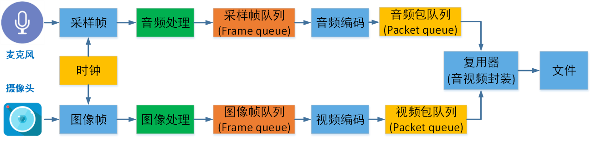
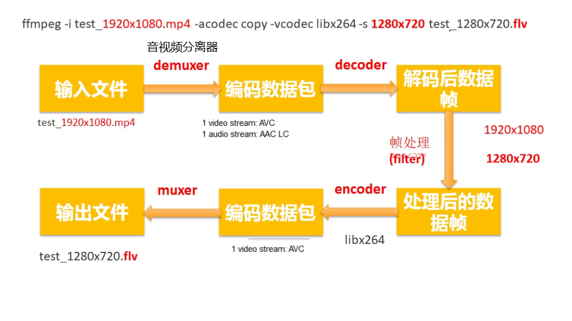
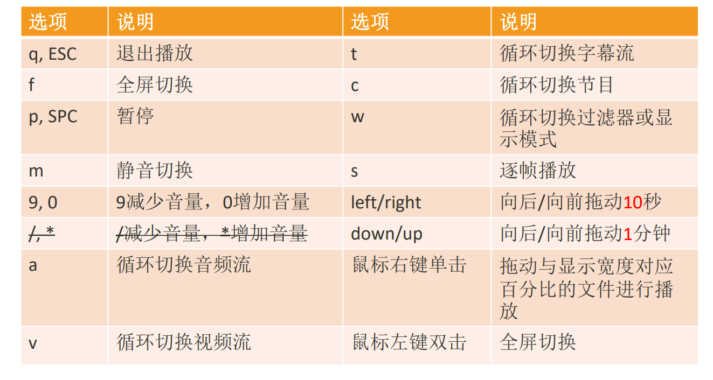

# stream

# 1 音视频基础

## 1.1 视频主要概念

视频录制和播放原理：




**像素**：是一个图片的基本单位，pix是英语单词picture的简写，加上英语单词“元素element”， 就得到了“pixel”，简称px，所以“像素”有“图像元素”之意

**分辨率**：图像（或视频）的分辨率是指图像的大小或尺寸。我们通常用像素表示图像的尺寸。常见的分辨率： 360P(640x360)、720P(1280x720)、1080P(1920x1080)、4K(3840x2160)、8K(7680x4320

**视频码率**：kb/s，是指视频文件在单位时间内使用的数据流量，也叫码流率。

**视频帧率**：fps，通常说一个视频的25帧，指的就是这个视频帧率，即1秒中会显示25帧。帧率越高，给人的视觉就越流畅。

**视频分辨率**：分辨率就是我们常说的640x480分辨率、1920x1080分辨率，分辨率影响视频图像的大小。

**Stride** ：指在内存中每行像素所占的空间。为了实现内存对齐每行像素在内存中所占 的空间并不一定是图像的宽度。


**RGB**：红R、绿G、蓝B三基色。也是三个通道

**YUV**：“Y”表示明亮度（Luminance或Luma），也就是灰阶值，“U”和“V”表 示的则是色度（Chrominance或Chroma）

**位深**：每个通道的位深越大，能够表示的颜色值就越大，比如现在高端电视说的10bit色 彩，即是每个通道用10bit表示，每个通道有1024种颜色。

**libyuv**：Google开源的实现各种YUV与RGB间相互转换、旋转、缩放的库。


**I帧（Intra coded frames）**：I帧不需要参考其他画面而生成,解码时仅靠自己就重构完整图像;

**P帧（Predicted frames）**：根据本帧与相邻的前一帧（I帧或P帧）的不同点来压缩本帧数据，P帧属于前向预测的帧间编码。它需要参考前面最靠近它的I帧或P帧来解码。

**B帧（Bi-directional predicted frames）**B 帧图像采用双向时间预测，可以大大提高压缩倍数。


常见视频压缩算法：

- MPEG2 MPEG阵营
- H264 MPEG阵营
- H265 MPEG阵营
- AVS   中国阵营
- VP8   Google阵营
- VP9 Google阵营

## 1.2 音频

**模拟信号数字化**：

- 采样频率：Nyguist采样定律，要从采样中完全恢复原始信号波形，采样频率必须至少是信号中最高频率的两倍。前面提到人耳能听到的频率范围是[20H~20kHz]，所以采样频率一般为44.1Khz
- 采样量化：采样值的精度取决于它用多少位来表示，这就是量化。
- 编码：

**PCM脉冲编码调制**：PCM是把声音从模拟信号转化为数字信号的技术。


**采样频率：**每秒钟采样的点的个数。常用的采样频率有：

- 22000（22kHz）： 无线广播。

- 44100（44.1kHz）：CD音质。

- 48000（48kHz）： 数字电视，DVD。

- 96000（96kHz）： 蓝光，高清DVD。

- 192000(192kHz): 蓝光，高清DVD。

**采样精度（采样深度）**：每个“样本点”的大小，常用的大小为8bit， 16bit，24bit。

**通道数：**单声道，双声道，四声道，5.1声道。


**比特率：**每秒传输的bit数，单位为：bps（Bit Per Second），没有压缩的音频数据的比特率 = 采样频率 * 采样精度 * 通道数。

**码率：** 质量压缩后的音频数据的比特率，常见的码率：

- 96kbps： FM

- 128-160kbps：一般质量音频。

- 192kbps： CD质量。

- 256-320Kbps：高质量音频


**帧：**每次编码的采样单元数，比如MP3通常是1152个采样点作为一个编码单元，AAC通常是1024个采样点作为一个编码单元。

**帧长**：可以指每帧播放持续的时间：每帧持续时间(秒) = 每帧采样点数 / 采样频率（HZ），也可以指压缩后每帧的数据长度。


**数字音频压缩编码**：采取去除声音信号中冗余成分的方法来实现。所谓冗余成分指的是音频中不能被人耳感知到的信号，它们对确定声音的音色，音调等信息没有任何的帮助。

**冗余信号**：包含人耳听觉范围外的音频信号以及被掩蔽掉的音频信号等。例如，人耳所能察觉的声音信号的频率范围为20Hz～20KHz，除此之外的其它频率人耳无法察觉，都可视为冗余信号。

根据人耳听觉的生理和心理声学现象，当一个强音信号与一个弱音信号同时存在时，弱音信号将被强音信号所掩蔽而听不见，这样弱音信号就可以视为冗余信号而不用传送。这就是人耳听觉的掩蔽效应，

**频谱掩蔽效应**：一个频率的声音能量小于某个阈值之后，人耳就会听不到。当有另外能量较大的声音出现的时候，该声音频率附近的阈值会提高很多，即所谓的掩蔽效应。

**时域掩蔽效应**：当强音信号和弱音信号同时出现时，还存在**时域掩蔽效应**。即两者发生时间很接近的时候，也会发生掩蔽效应。时域掩蔽过程曲线如图所示，分为前掩蔽、同时掩蔽和后掩蔽三部分。

**音频编解码**：

- OPUS
- MP3
- AAC
- AC3和EAC3 杜比公司的方案 

# 2 环境搭建

vs2015，qt5.1，cdb，

qt创建的项目目录里面不能有中文路径，否则无法编译。

qt如果要使用msvc的调试器，必须安装windows sdk 中的 debugger tools（下载winsdksetup.exe）

# 3 ffmpeg命令

## 3.1 ffmpeg

**ffmpeg**：Hyper fast Audio and Video encoder **超快音视频编码器**（**类似爱剪辑**）

- ```bash
  # 基本信息
  ffmpeg -h
  # 高级信息
  ffmpeg -h long
  #所有信息，若嫌打印过多： ffmepg -h full > ffmpeg_h_full.log，然后再打开 ffmpeg_h_full.log文件查看
  ffmpeg -h full
  
  ffmpeg [options] [[infile options] -i infile]... 
  {[outfile options] outfile}...
  ```




### 3.1.1 ffmpeg命令分类查询


查看具体分类所支持的**参数**：`ffmepg -h type=name`

```bash
# type可以不加s，就像muxer
ffmpeg -h muxer=flv
ffmpeg -h filter=atempo (atempo调整音频播放速率)
ffmpeg -h encoder=libx264
ffmpeg -encoders | findstr x264
```


### 3.1.2 主要参数

```bash
主要参数：
◼ -i 设定输入流
◼ -f 设定输出格式(format)
◼ -ss 开始时间
◼ -t 时间长度


◼ 视频参数：
◼ -vframes 设置要输出的视频帧数
◼ -b 设定视频码率
◼ -b:v 视频码率
◼ -r 设定帧速率
◼ -s 设定画面的宽与高
◼ -vn 不处理视频
◼ -aspect aspect 设置横纵比 4:3 16:9 或 1.3333 1.7777
◼ -vcodec 设定视频编解码器，如果用copy表示原始编解码数据必须被拷贝。
◼ -vf 视频过滤器

ffmpeg -i test.mp4 -vframes 300 -b:v 300k -r 30 -s 640x480 -aspect 16:9 -vcodec libx265 out.h265

◼ 音频参数：
◼ -aframes 设置要输出的音频帧数
◼ -b:a 音频码率
◼ -ar 设定采样率
◼ -ac 设定声音的Channel数
◼ -acodec 设定声音编解码器，如果用copy表示原始编解码数据必须被拷贝。
◼ -an 不处理音频
◼ -af 音频过滤器

ffmpeg -i test.mp4 -b:a 192k -ar 48000 -ac 2 -acodec libmp3lame -aframes 200 out2.mp3
```


### 3.1.3 提取音视频数据

```bash
◼ 保留封装格式
ffmpeg -i test.mp4 -acodec copy -vn audio.mp4
ffmpeg -i test.mp4 -vcodec copy -an video.mp4
◼ 提取视频
保留编码格式：ffmpeg -i test.mp4 -vcodec copy -an -t 10 test_copy.h264
强制格式：ffmpeg -i test.mp4 -vcodec libx264 -an test.h264
◼ 提取音频
保留编码格式：ffmpeg -i test.mp4 -acodec copy -vn test.aac
强制格式：ffmpeg -i test.mp4 -acodec libmp3lame -vn test.mp3
```


```bash
# 从视频中提取音频，https://blog.csdn.net/weixin_42721372/article/details/126086830
ffmpeg -i ./TMElive.mp4 -ss 01:00:31 -t 00:02:52.0 -vn -b:a 192k -ar 44100 -ac 2 -acodec libmp3lame -y ./Mute_1.mp3
```

### 3.1.4 提取视频像素格式和音频PCM数据

```bash
◼ 提取YUV
◼ 提取3秒数据，分辨率和源视频一致
ffmpeg -i test_1280x720.mp4 -t 3 -pix_fmt yuv420p yuv420p_orig.yuv
◼ 提取3秒数据，分辨率转为320x240
ffmpeg -i test_1280x720.mp4 -t 3 -pix_fmt yuv420p -s 320x240 yuv420p_320x240.yuv


◼ 提取RGB
◼ 提取3秒数据，分辨率转为320x240
ffmpeg -i test.mp4 -t 3 -pix_fmt rgb24 -s 320x240 rgb24_320x240.rgb


◼ RGB和YUV之间的转换
ffmpeg -s 320x240 -pix_fmt yuv420p -i yuv420p_320x240.yuv -pix_fmt rgb24 rgb24_320x240_2.rgb

```

```bash
◼ 提取PCM数据
ffmpeg -i buweishui.mp3 -ar 48000 -ac 2 -f s16le 48000_2_s16le.pcm
ffmpeg -i buweishui.mp3 -ar 48000 -ac 2 -sample_fmt s16 out_s16.wav
ffmpeg -i buweishui.mp3 -ar 48000 -ac 2 -codec:a pcm_s16le out2_s16le.wav
ffmpeg -i buweishui.mp3 -ar 48000 -ac 2 -f f32le 48000_2_f32le.pcm
# 从视频中提取PCM数据
ffmpeg -i test.mp4 -t 10 -vn -ar 48000 -ac 2 -f f32le 48000_2_f32le_2.pcm
```

### 3.1.5 转封装

```bash
◼ 保持编码格式：
ffmpeg -i test.mp4 -vcodec copy -acodec copy test_copy.ts
ffmpeg -i test.mp4 -codec copy test_copy2.ts
◼ 改变编码格式：
ffmpeg -i test.mp4 -vcodec libx265 -acodec libmp3lame out_h265_mp3.mkv
◼ 修改帧率：
ffmpeg -i test.mp4 -r 15 -codec copy output.mp4 (错误命令)
ffmpeg -i test.mp4 -r 15 output2.mp4
◼ 修改视频码率：
ffmpeg -i test.mp4 -b 400k output_b.mkv （此时音频也被重新编码）
◼ 修改视频码率：
ffmpeg -i test.mp4 -b:v 400k output_bv.mkv

◼ 修改音频码率：
ffmpeg -i test.mp4 -b:a 192k output_ba.mp4
#如果不想重新编码video，需要加上-vcodec copy

◼ 修改音视频码率：
ffmpeg -i test.mp4 -b:v 400k -b:a 192k output_bva.mp4
◼ 修改视频分辨率：
ffmpeg -i test.mp4 -s 480x270 output_480x270.mp4
◼ 修改音频采样率: 
ffmpeg -i test.mp4 -ar 44100 output_44100hz.mp4
```

### 3.1.6 裁剪和拼接

```bash
# 实验的视频构造
◼ 找三个不同的视频每个视频截取10秒内容
ffmpeg -i 沙海02.mp4 -ss 00:05:00 -t 10 -codec copy 1.mp4
ffmpeg -i 复仇者联盟3.mp4 -ss 00:05:00 -t 10 -codec copy 2.mp4
ffmpeg -i 红海行动.mp4 -ss 00:05:00 -t 10 -codec copy 3.mp4
如果音视频格式不统一则强制统一为 -vcodec libx264 -acodec aac
◼ 将上述1.mp4/2.mp4/3.mp4转成ts格式
ffmpeg -i 1.mp4 -codec copy -vbsf h264_mp4toannexb 1.ts
ffmpeg -i 2.mp4 -codec copy -vbsf h264_mp4toannexb 2.ts
ffmpeg -i 3.mp4 -codec copy -vbsf h264_mp4toannexb 3.ts
◼ 转成flv格式
ffmpeg -i 1.mp4 -codec copy 1.flv
ffmpeg -i 2.mp4 -codec copy 2.flv
ffmpeg -i 3.mp4 -codec copy 3.flv


# 拼接
◼ 以MP4格式进行拼接
方法1：ffmpeg -i "concat:1.mp4|2.mp4|3.mp4" -codec copy out_mp4.mp4  #（不可用）
方法2：ffmpeg -f concat -i mp4list.txt -codec copy out_mp42.mp4
# mp4list.txt里的内容有三行, 如下
# file '1.mp4'
# file '2.mp4'
# file '3.mp4'

◼ 以TS格式进行拼接
方法1：ffmpeg -i "concat:1.ts|2.ts|3.ts" -codec copy out_ts.mp4
方法2：ffmpeg -f concat -i tslist.txt -codec copy out_ts2.mp4
# tslist.txt 也是如此，只是文件后缀变为了ts

◼ 以FLV格式进行拼接
方法1：ffmpeg -i "concat:1.flv|2.flv|3.flv" -codec copy out_flv.mp4  #（不可用）
方法2：ffmpeg -f concat -i flvlist.txt -codec copy out_flv2.mp4

◼ 方法1只适用部分封装格式，比如TS
◼ 建议：
（1）使用方法2进行拼接
（2）把所用视频先转成TS格式，再进行拼接


# 不同编码格式的文件进行拼接
◼ 建议：
◼ 把每个视频封装格式也统一为ts，拼接输出的时候再输出你需要的封装格式，比如MP4
◼ 视频分辨率可以不同，但是编码格式需要统一
◼ 音频编码格式需要统一，音频参数(采样率/声道等)也需要统一
```


## 3.2 ffplay

[ffplay](https://blog.csdn.net/m0_60259116/article/details/125787812)

**ffplay**：Simple media player简单媒体播放器，里面做了很多东西，如果自己要做播放器的话，需要ffplay的源码通读一遍。

- ```bash
  ffplay -h
  ffplay [options] input_file
  ```

### 3.2.1 键盘控制




### 3.2.2 主要参数

```bash
# 主要参数

◼ -x width 强制显示宽带。
◼ -y height 强制显示高度。
◼ -video_size size 帧尺寸 设置显示帧存储(WxH格式)，仅适用于类似原始YUV等没有包含帧大小(WxH)的视频。
比如: ffplay -pixel_format yuv420p -video_size 320x240 -framerate 5 yuv420p_320x240.yuv
◼ -pixel_format format 格式设置像素格式。
◼ -fs 以全屏模式启动。
◼ -an 禁用音频（不播放声音）
◼ -vn 禁用视频（不播放视频）
◼ -sn 禁用字幕（不显示字幕）
◼ -ss pos 根据设置的秒进行定位拖动，注意时间单位：比如'55' 55 seconds, '12:03:45' ,12 hours, 03 minutes and 45 seconds, '23.189' 23.189 second
◼ -t duration 设置播放视频/音频长度，时间单位如 -ss选项

◼ -bytes 按字节进行定位拖动（0=off 1=on -1=auto）。
◼ -seek_interval interval 自定义左/右键定位拖动间隔（以秒为单位），默认值为10秒（代码没有看到实现）
◼ -nodisp 关闭图形化显示窗口，视频将不显示
◼ -noborder 无边框窗口
◼ -volume vol 设置起始音量。音量范围[0 ~100]
◼ -f fmt 强制使用设置的格式进行解析。比如-f s16le
◼ -window_title title 设置窗口标题（默认为输入文件名）
◼ -loop number 设置播放循环次数
◼ -showmode mode 设置显示模式，可用的模式值：0 显示视频，1 显示音频波形，2 显示音频频谱。缺省为0，如果视频不存在则自动选择2
◼ -vf filtergraph 设置视频滤镜
◼ -af filtergraph 设置音频滤镜


# 高级参数
◼ -stats 打印多个回放统计信息，包括显示流持续时间，编解码器参数，流中的当前位置，以及音频/视频同步差值。默认情况下处于启用状
态，要显式禁用它则需要指定-nostats。。
◼ -fast 非标准化规范的多媒体兼容优化。
◼ -genpts 生成pts。
◼ -sync type 同步类型 将主时钟设置为audio（type=audio），video（type=video）或external（type=ext），默认是audio为主时钟。
◼ -ast audio_stream_specifier 指定音频流索引，比如-ast 3，播放流索引为3的音频流
◼ -vst video_stream_specifier指定视频流索引，比如-vst 4，播放流索引为4的视频流
◼ -sst subtitle_stream_specifier 指定字幕流索引，比如-sst 5，播放流索引为5的字幕流
◼ -autoexit 视频播放完毕后退出

◼ -exitonkeydown 键盘按下任何键退出播放
◼ -exitonmousedown 鼠标按下任何键退出播放
◼ -codec:media_specifier codec_name 强制使用设置的多媒体解码器，media_specifier可用值为a（音频）， v（视频）和s字幕。比如codec:v h264_qsv 强制视频采用h264_qsv解码
◼ -acodec codec_name 强制使用设置的音频解码器进行音频解码
◼ -vcodec codec_name 强制使用设置的视频解码器进行视频解码
◼ -scodec codec_name 强制使用设置的字幕解码器进行字幕解码
◼ -autorotate 根据文件元数据自动旋转视频。值为0或1 ，默认为1。
◼ -framedrop 如果视频不同步则丢弃视频帧。当主时钟非视频时钟时默认开启。若需禁用则使用 -noframedrop
◼ -infbuf 不限制输入缓冲区大小。尽可能快地从输入中读取尽可能多的数据。播放实时流时默认启用，如果未及时读取数据，则可能会丢弃数据。此选项将不限制缓冲区的大小。若需禁用则使用-noinfbuf

更多参数：http://www.ffmpeg.org/ffplay.html

```


### 3.3.3 播放内容

```bash
◼ 播放本地文件
◼ ffplay -window_title "test time" -ss 2 -t 10 -autoexit test.mp4
◼ ffplay buweishui.mp3
◼ 播放网络流
◼ ffplay -window_title "rtmp stream" rtmp://202.69.69.180:443/webcast/bshdlive-pc
◼ 播放YUV数据
◼ ffplay -pixel_format yuv420p -video_size 320x240 -framerate 5 yuv420p_320x240.yuv
◼ 播放RGB数据
◼ ffplay -pixel_format rgb24 -video_size 320x240 -i rgb24_320x240.rgb
◼ ffplay -pixel_format rgb24 -video_size 320x240 -framerate 5 -i rgb24_320x240.rgb
◼ 播放PCM数据
◼ ffplay -ar 48000 -ac 2 -f f32le 48000_2_f32le.pcm
-ar set audio sampling rate (in Hz) (from 0 to INT_MAX) (default 0)
-ac set number of audio channels (from 0 to INT_MAX) (default 0)
```

简单过滤器

```bash
◼ 视频旋转
ffplay -i test.mp4 -vf transpose=1
◼ 视频反转
ffplay test.mp4 -vf hflip
ffplay test.mp4 -vf vflip
◼ 视频旋转和反转
ffplay test.mp4 -vf hflip,transpose=1
◼ 音频变速播放
ffplay -i test.mp4 -af atempo=2
◼ 视频变速播放
ffplay -i test.mp4 -vf setpts=PTS/2
◼ 音视频同时变速
ffplay -i test.mp4 -vf setpts=PTS/2 -af atempo=2
◼ 更多参考
http://www.ffmpeg.org/ffmpeg-filters.html
```


**ffprobe**：Simple multimedia streams analyzer 简单多媒体流分析器

- ```bash
  ffprobe -h
  ffprobe [OPTIONS] [INPUT_FILE]
  ```


ffmpeg/ffplay/ffprobe部分参数通用，部 分参数不通用，在使用时需要注意

