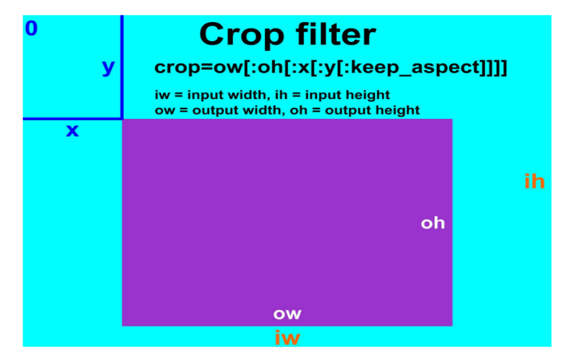
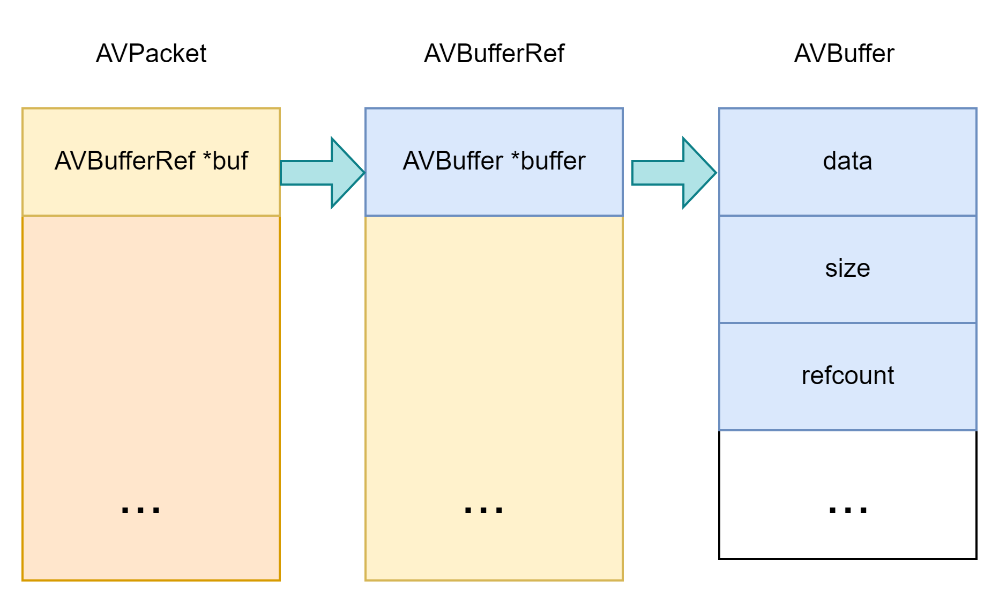
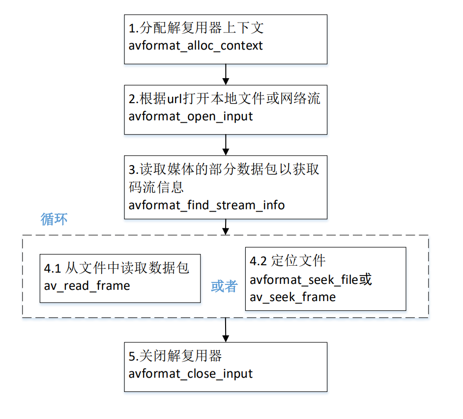

# stream

# 1 音视频基础

## 1.1 视频主要概念

视频录制和播放原理：


**像素**：是一个图片的基本单位，pix是英语单词picture的简写，加上英语单词“元素element”， 就得到了“pixel”，简称px，所以“像素”有“图像元素”之意

**分辨率**：图像（或视频）的分辨率是指图像的大小或尺寸。我们通常用像素表示图像的尺寸。常见的分辨率： 360P(640x360)、720P(1280x720)、1080P(1920x1080)、4K(3840x2160)、8K(7680x4320

**视频码率**：kb/s，是指视频文件在单位时间内使用的数据流量，也叫码流率。

**视频帧率**：fps，通常说一个视频的25帧，指的就是这个视频帧率，即1秒中会显示25帧。帧率越高，给人的视觉就越流畅。

**视频分辨率**：分辨率就是我们常说的640x480分辨率、1920x1080分辨率，分辨率影响视频图像的大小。

**Stride** ：指在内存中每行像素所占的空间。为了实现内存对齐每行像素在内存中所占 的空间并不一定是图像的宽度。


**RGB**：红R、绿G、蓝B三基色。也是三个通道

**YUV**：“Y”表示明亮度（Luminance或Luma），也就是灰阶值，“U”和“V”表 示的则是色度（Chrominance或Chroma）

**位深**：每个通道的位深越大，能够表示的颜色值就越大，比如现在高端电视说的10bit色 彩，即是每个通道用10bit表示，每个通道有1024种颜色。

**libyuv**：Google开源的实现各种YUV与RGB间相互转换、旋转、缩放的库。


**I帧（Intra coded frames）**：I帧不需要参考其他画面而生成,解码时仅靠自己就重构完整图像;

**P帧（Predicted frames）**：根据本帧与相邻的前一帧（I帧或P帧）的不同点来压缩本帧数据，P帧属于前向预测的帧间编码。它需要参考前面最靠近它的I帧或P帧来解码。

**B帧（Bi-directional predicted frames）**B 帧图像采用双向时间预测，可以大大提高压缩倍数。


常见视频压缩算法：

- MPEG2 MPEG阵营
- H264 MPEG阵营
- H265 MPEG阵营
- AVS   中国阵营
- VP8   Google阵营
- VP9 Google阵营

## 1.2 音频

**模拟信号数字化**：

- 采样频率：Nyguist采样定律，要从采样中完全恢复原始信号波形，采样频率必须至少是信号中最高频率的两倍。前面提到人耳能听到的频率范围是[20H~20kHz]，所以采样频率一般为44.1Khz
- 采样量化：采样值的精度取决于它用多少位来表示，这就是量化。
- 编码：

**PCM脉冲编码调制**：PCM是把声音从模拟信号转化为数字信号的技术。


**采样频率：**每秒钟采样的点的个数。常用的采样频率有：

- 22000（22kHz）： 无线广播。

- 44100（44.1kHz）：CD音质。

- 48000（48kHz）： 数字电视，DVD。

- 96000（96kHz）： 蓝光，高清DVD。

- 192000(192kHz): 蓝光，高清DVD。

**采样精度（采样深度）**：每个“样本点”的大小，常用的大小为8bit， 16bit，24bit。

**通道数：**单声道，双声道，四声道，5.1声道。


**比特率：**每秒传输的bit数，单位为：bps（Bit Per Second），没有压缩的音频数据的比特率 = 采样频率 * 采样精度 * 通道数。

**码率：** 质量压缩后的音频数据的比特率，常见的码率：

- 96kbps： FM

- 128-160kbps：一般质量音频。

- 192kbps： CD质量。

- 256-320Kbps：高质量音频


**帧：**每次编码的采样单元数，比如MP3通常是1152个采样点作为一个编码单元，AAC通常是1024个采样点作为一个编码单元。

**帧长**：可以指每帧播放持续的时间：每帧持续时间(秒) = 每帧采样点数 / 采样频率（HZ），也可以指压缩后每帧的数据长度。


**数字音频压缩编码**：采取去除声音信号中冗余成分的方法来实现。所谓冗余成分指的是音频中不能被人耳感知到的信号，它们对确定声音的音色，音调等信息没有任何的帮助。

**冗余信号**：包含人耳听觉范围外的音频信号以及被掩蔽掉的音频信号等。例如，人耳所能察觉的声音信号的频率范围为20Hz～20KHz，除此之外的其它频率人耳无法察觉，都可视为冗余信号。

根据人耳听觉的生理和心理声学现象，当一个强音信号与一个弱音信号同时存在时，弱音信号将被强音信号所掩蔽而听不见，这样弱音信号就可以视为冗余信号而不用传送。这就是人耳听觉的掩蔽效应，

**频谱掩蔽效应**：一个频率的声音能量小于某个阈值之后，人耳就会听不到。当有另外能量较大的声音出现的时候，该声音频率附近的阈值会提高很多，即所谓的掩蔽效应。

**时域掩蔽效应**：当强音信号和弱音信号同时出现时，还存在**时域掩蔽效应**。即两者发生时间很接近的时候，也会发生掩蔽效应。时域掩蔽过程曲线如图所示，分为前掩蔽、同时掩蔽和后掩蔽三部分。

**音频编解码**：

- OPUS
- MP3
- AAC
- AC3和EAC3 杜比公司的方案 

# 2 环境搭建

vs2015，qt5.1，cdb，

qt创建的项目目录里面不能有中文路径，否则无法编译。

qt如果要使用msvc的调试器，必须安装windows sdk 中的 debugger tools（下载winsdksetup.exe）

# 3 ffmpeg命令

## 3.1 ffmpeg

**ffmpeg**：Hyper fast Audio and Video encoder **超快音视频编码器**（**类似爱剪辑**）

- ```bash
  # 基本信息
  ffmpeg -h
  # 高级信息
  ffmpeg -h long
  #所有信息，若嫌打印过多： ffmepg -h full > ffmpeg_h_full.log，然后再打开 ffmpeg_h_full.log文件查看
  ffmpeg -h full
  
  ffmpeg [options] [[infile options] -i infile]... 
  {[outfile options] outfile}...
  ```


### 3.1.1 ffmpeg命令分类查询


查看具体分类所支持的**参数**：`ffmepg -h type=name`

```bash
# type可以不加s，就像muxer
ffmpeg -h muxer=flv
ffmpeg -h filter=atempo (atempo调整音频播放速率)
ffmpeg -h encoder=libx264
ffmpeg -encoders | findstr x264
```


### 3.1.2 主要参数

```bash
主要参数：
◼ -i 设定输入流
◼ -f 设定输出格式(format)
◼ -ss 开始时间
◼ -t 时间长度


◼ 视频参数：
◼ -vframes 设置要输出的视频帧数
◼ -b 设定视频码率
◼ -b:v 视频码率
◼ -r 设定帧速率
◼ -s 设定画面的宽与高
◼ -vn 不处理视频
◼ -aspect aspect 设置横纵比 4:3 16:9 或 1.3333 1.7777
◼ -vcodec 设定视频编解码器，如果用copy表示原始编解码数据必须被拷贝。
◼ -vf 视频过滤器

ffmpeg -i test.mp4 -vframes 300 -b:v 300k -r 30 -s 640x480 -aspect 16:9 -vcodec libx265 out.h265

◼ 音频参数：
◼ -aframes 设置要输出的音频帧数
◼ -b:a 音频码率
◼ -ar 设定采样率
◼ -ac 设定声音的Channel数
◼ -acodec 设定声音编解码器，如果用copy表示原始编解码数据必须被拷贝。
◼ -an 不处理音频
◼ -af 音频过滤器

ffmpeg -i test.mp4 -b:a 192k -ar 48000 -ac 2 -acodec libmp3lame -aframes 200 out2.mp3
```


### 3.1.3 提取音视频数据

```bash
◼ 保留封装格式
ffmpeg -i test.mp4 -acodec copy -vn audio.mp4
ffmpeg -i test.mp4 -vcodec copy -an video.mp4
◼ 提取视频
保留编码格式：ffmpeg -i test.mp4 -vcodec copy -an -t 10 test_copy.h264
强制格式：ffmpeg -i test.mp4 -vcodec libx264 -an test.h264
◼ 提取音频
保留编码格式：ffmpeg -i test.mp4 -acodec copy -vn test.aac
强制格式：ffmpeg -i test.mp4 -acodec libmp3lame -vn test.mp3
```


```bash
# 从视频中提取音频，https://blog.csdn.net/weixin_42721372/article/details/126086830
ffmpeg -i ./TMElive.mp4 -ss 01:00:31 -t 00:02:52.0 -vn -b:a 192k -ar 44100 -ac 2 -acodec libmp3lame -y ./Mute_1.mp3
```

### 3.1.4 提取视频像素格式和音频PCM数据

```bash
◼ 提取YUV
◼ 提取3秒数据，分辨率和源视频一致
ffmpeg -i test_1280x720.mp4 -t 3 -pix_fmt yuv420p yuv420p_orig.yuv
◼ 提取3秒数据，分辨率转为320x240
ffmpeg -i test_1280x720.mp4 -t 3 -pix_fmt yuv420p -s 320x240 yuv420p_320x240.yuv


◼ 提取RGB
◼ 提取3秒数据，分辨率转为320x240
ffmpeg -i test.mp4 -t 3 -pix_fmt rgb24 -s 320x240 rgb24_320x240.rgb


◼ RGB和YUV之间的转换
ffmpeg -s 320x240 -pix_fmt yuv420p -i yuv420p_320x240.yuv -pix_fmt rgb24 rgb24_320x240_2.rgb

```

```bash
◼ 提取PCM数据
ffmpeg -i buweishui.mp3 -ar 48000 -ac 2 -f s16le 48000_2_s16le.pcm
ffmpeg -i buweishui.mp3 -ar 48000 -ac 2 -sample_fmt s16 out_s16.wav
ffmpeg -i buweishui.mp3 -ar 48000 -ac 2 -codec:a pcm_s16le out2_s16le.wav
ffmpeg -i buweishui.mp3 -ar 48000 -ac 2 -f f32le 48000_2_f32le.pcm
# 从视频中提取PCM数据
ffmpeg -i test.mp4 -t 10 -vn -ar 48000 -ac 2 -f f32le 48000_2_f32le_2.pcm
```

### 3.1.5 转封装

```bash
◼ 保持编码格式：
ffmpeg -i test.mp4 -vcodec copy -acodec copy test_copy.ts
ffmpeg -i test.mp4 -codec copy test_copy2.ts
◼ 改变编码格式：
ffmpeg -i test.mp4 -vcodec libx265 -acodec libmp3lame out_h265_mp3.mkv
◼ 修改帧率：
ffmpeg -i test.mp4 -r 15 -codec copy output.mp4 (错误命令)
ffmpeg -i test.mp4 -r 15 output2.mp4
◼ 修改视频码率：
ffmpeg -i test.mp4 -b 400k output_b.mkv （此时音频也被重新编码）
◼ 修改视频码率：
ffmpeg -i test.mp4 -b:v 400k output_bv.mkv

◼ 修改音频码率：
ffmpeg -i test.mp4 -b:a 192k output_ba.mp4
#如果不想重新编码video，需要加上-vcodec copy

◼ 修改音视频码率：
ffmpeg -i test.mp4 -b:v 400k -b:a 192k output_bva.mp4
◼ 修改视频分辨率：
ffmpeg -i test.mp4 -s 480x270 output_480x270.mp4
◼ 修改音频采样率: 
ffmpeg -i test.mp4 -ar 44100 output_44100hz.mp4
```

### 3.1.6 裁剪和拼接

```bash
# 实验的视频构造
◼ 找三个不同的视频每个视频截取10秒内容
ffmpeg -i 沙海02.mp4 -ss 00:05:00 -t 10 -codec copy 1.mp4
ffmpeg -i 复仇者联盟3.mp4 -ss 00:05:00 -t 10 -codec copy 2.mp4
ffmpeg -i 红海行动.mp4 -ss 00:05:00 -t 10 -codec copy 3.mp4
如果音视频格式不统一则强制统一为 -vcodec libx264 -acodec aac
◼ 将上述1.mp4/2.mp4/3.mp4转成ts格式
ffmpeg -i 1.mp4 -codec copy -vbsf h264_mp4toannexb 1.ts
ffmpeg -i 2.mp4 -codec copy -vbsf h264_mp4toannexb 2.ts
ffmpeg -i 3.mp4 -codec copy -vbsf h264_mp4toannexb 3.ts
◼ 转成flv格式
ffmpeg -i 1.mp4 -codec copy 1.flv
ffmpeg -i 2.mp4 -codec copy 2.flv
ffmpeg -i 3.mp4 -codec copy 3.flv


# 拼接
◼ 以MP4格式进行拼接
方法1：ffmpeg -i "concat:1.mp4|2.mp4|3.mp4" -codec copy out_mp4.mp4  #（不可用）
方法2：ffmpeg -f concat -i mp4list.txt -codec copy out_mp42.mp4
# mp4list.txt里的内容有三行, 如下
# file '1.mp4'
# file '2.mp4'
# file '3.mp4'

◼ 以TS格式进行拼接
方法1：ffmpeg -i "concat:1.ts|2.ts|3.ts" -codec copy out_ts.mp4
方法2：ffmpeg -f concat -i tslist.txt -codec copy out_ts2.mp4
# tslist.txt 也是如此，只是文件后缀变为了ts

◼ 以FLV格式进行拼接
方法1：ffmpeg -i "concat:1.flv|2.flv|3.flv" -codec copy out_flv.mp4  #（不可用）
方法2：ffmpeg -f concat -i flvlist.txt -codec copy out_flv2.mp4

◼ 方法1只适用部分封装格式，比如TS
◼ 建议：
（1）使用方法2进行拼接
（2）把所用视频先转成TS格式，再进行拼接


# 不同编码格式的文件进行拼接
◼ 建议：
◼ 把每个视频封装格式也统一为ts，拼接输出的时候再输出你需要的封装格式，比如MP4
◼ 视频分辨率可以不同，但是编码格式需要统一
◼ 音频编码格式需要统一，音频参数(采样率/声道等)也需要统一
```

### 3.1.7 图片与视频互转

```bash
◼ 截取一张图片
ffmpeg -i test.mp4 -y -f image2 -ss 00:00:02 -vframes 1 -s 640x360 test.jpg
ffmpeg -i test.mp4 -y -f image2 -ss 00:00:02 -vframes 1 -s 640x360 test.bmp
-i 输入
-y 覆盖，如果本地文件夹中有同名图片，直接覆盖，用来回答are you overwrite (y/n)?
-f 格式
image2 一种格式
-ss 起始值
-vframes 帧 如果大于1 那么 输出加%03d test%03d.jpg 
-s 格式大小size

◼ 转换视频为图片（每帧一张图):
ffmpeg -i test.mp4 -t 5 -s 640x360 -r 15 frame%03d.jpg 
# -r 15 每秒输出15张图片

◼ 图片转换为视频:
ffmpeg -f image2 -i frame%03d.jpg -r 25 video.mp4

◼ 从视频中生成GIF图片
ffmpeg -i test.mp4 -t 5 -r 1 image1.gif
ffmpeg -i test.mp4 -t 5 -r 25 -s 640x360 image2.gif
◼ 将 GIF 转化为 视频
ffmpeg -f gif -i image2.gif image2.mp4

◼ 从视频中生成GIF图片
ffmpeg -i test.mp4 -t 5 -r 1 image1.gif
ffmpeg -i test.mp4 -t 5 -r 25 -s 640x360 image2.gif
◼ 将 GIF 转化为 视频
ffmpeg -f gif -i image2.gif image2.mp4
```

### 3.1.8 推拉流

```bash
# nginx搭建rmtp流媒体服务器
https://www.jianshu.com/p/16741e363a77

# 拉流

# 拉流播放
ffplay rtmp://server/live/streamName 

# 拉流导出文件
ffmpeg -i rtmp://server/live/streamName -c copy dump.flv
# 对于不是rtmp的协议 -c copy要谨慎使用，因为目的格式文件（eg:flv），并不支持源流的编码方式
ffmpeg -i http://ivi.bupt.edu.cn/hls/cctv1hd.m3u8 -c copy cctv1.ts
ffmpeg -i http://ivi.bupt.edu.cn/hls/cctv1hd.m3u8 cctv1.flv
ffmpeg -i http://ivi.bupt.edu.cn/hls/cctv1hd.m3u8 -acodec aac -vcodec libx264 cctv1-2.flv

# 推流
# 将一个文件推流到rmtp上
ffmpeg -re -i out.mp4 -c copy flv rtmp://server/live/streamName
```

### 3.1.9 过滤器（滤镜）

#### Filter 内置变量 

这些变量可以在函数，参数值等地方使用。

- t 以秒表示的时间戳，如果输入的时间是未知的则是 NAN
- n 输入帧的顺序编号，从 0 开始 4 
- pos 输入帧的位置，如果未知的则是 NAN
- w 输入视频帧的宽度 
- h 输入视频帧的高度

#### 裁剪



```bash
crop=ow:oh:x:y
# 查看图片左1/3，中1/3，右1/3，视频的裁剪同样如此，只需换为ffmpeg
ffplay -i input.jpg -vf crop =iw/3:ih:0:0
ffplay -i input.jpg -vf crop =iw/3:ih:iw/3:0
ffplay -i input.jpg -vf crop =iw/3:ih:iw/3*2:0
```

#### 水印

在视频中增加文字水印需要准备的条件比较多，需要有文字字库处理的相关文件，在编译 FFmpeg 时需要 支持 FreeType、FontConfig、iconv，系统中需要有相关的字库，

##### 文字水印

**在 FFmpeg 中增加纯字母水印可以使用 drawtext 滤镜进行支持**

下面就来看一下 drawtext 的滤镜参数

| 参数     | 类型   | 说明                         |
| -------- | ------ | ---------------------------- |
| text     | 字符串 | 文字                         |
| textfile | 字符串 | 文字文件                     |
| box      | 布尔   | 文字区域背景框(缺省 false)   |
| boxcolor | 色彩   | 展示字体区域块的颜色         |
| font     | 字符串 | 字体名称（默认为 Sans 字体） |
| fontsize | 整数   | 显示字体的大小               |
| x        | 整数   | 缺省为 0                     |
| y        | 整数   | 缺省为 0                     |
| alpha    | 浮点数 | 透明度(默认为 1)，范围0~1    |

```bash
# drawtext滤镜示例
ffplay -i input.mp4 -vf "drawtext=fontsize=100:fontfile=FreeSerif.ttf:text='hello world':fontcolor=green:x=400:y=200:alpha=0.5:box=1:boxcolor=yellow"

# 使用时间作为水印，使用 ffmpeg 转码存储到文件时需要加上-re，否则时间不对。
ffplay -i input.mp4 -vf 
"drawtext=fontsize=60:fontfile=FreeSerif.ttf:text='%{localtime\:%Y\-%m\-%d %H-%M-%S}':fontcolor=green:box=1:boxcolor=yellow"

# 跑马灯效果
ffplay -i input.mp4 -vf 
"drawtext=fontsize=100:fontfile=FreeSerif.ttf:text='helloworld':x=mod(100*t\,w):y=abs(sin(t))*h*0.7"
```

##### 图片水印 

为视频添加图片水印可以使用 movie 滤镜

 **movie的内容可以是图片，视频，设备等。**

| 参数             | 类型     | 说明                                 |
| ---------------- | -------- | ------------------------------------ |
| filename         | 字符串   | 输入的文件名，可以是文件，协议，设备 |
| format_name, f   | 字符串   | 输入的封装格式                       |
| stream_index, si | 整数     | 输入的流索引编号                     |
| seek_point, sp   | 浮点数   | Seek 输入流的时间位置                |
| streams, s       | 字符串   | 输入的多个流的流信息                 |
| loop             | 整数     | 循环次数                             |
| discontinuity    | 时间差值 | 支持跳动的时间戳差值                 |

**可以有多个movie，多个movie用分号相隔，通过[xx]命名指代，最后通过overlay将多个指定合成**

```bash
# 添加图片水印
ffmpeg -i input.mp4 -vf "movie=logo.png[watermark];[in][watermark]overlay=x=10:y=10[out]" 
output.mp4
# 在这里其实使用了两个滤镜，[xxx]代替（或指定）某些命令内容
# movie=logo.png;
# overlay=x=10:y=10，#叠加在视频上方

（1）图片 logo.png 将会打入到 input.mp4 视频中，显示在 x 坐标 50、y 坐标 20 的位置
ffplay -i input.mp4 -vf "movie=logo.png[logo];[in][logo]overlay=50:10[out]"
由于 logo.png 图片的背景色是白色，所以显示起来比较生硬，如果水印图片是透明背景的，效果会更好，
下面找一张透明背景色的图片试一下：
ffplay -i input.mp4 -vf "movie=logo2.png[watermark];[in][watermark]overlay=50:10[out]"

（2）显示位置
# 左上角
ffplay -i input.mp4 -vf "movie=logo.png[watermark];[in][watermark]overlay=10:10[out]"
# 右上角
ffplay -i input.mp4 -vf "movie=logo.png[watermark];[in][watermark]overlay=main_w-overlay_w-10:10[out]"
#左下角
ffplay -i input.mp4 -vf "movie=logo.png[watermark];[in][watermark]overlay=10:main_h-overlay_h-10[out]"
# 右下角
ffplay -i input.mp4 -vf "movie=logo.png[watermark];[in][watermark]overlay=main_w-overlay_w-10:main_h-overlay_h-10[out]"
（3）跑马灯效果
ffplay -i input.mp4 -vf 
"movie=logo.png[watermark];[in][watermark]overlay=x=mod(50*t\,main_w):y=abs(sin(t))*h*0.7[out]"
```

#### 画中画

在视频画面中，嵌入另外一个视频画面。

在 FFmpeg 中，可以通过 **overlay 将 多个视频流、多个多媒体采集设备、多个视频文件合成到一个界面中，生成画中画的效果**。

尤其是 用在图层处理与合并场景中.

​      设置 output 的像素格式，默认为 yuv420 ➢ yuv420 (值为 0) ➢ yuv422 (值为 1) ➢ yuv444 (值为 2) ➢ rgb (值为 3)

| 参数       | 类型 | 说明                                                         |
| ---------- | ---- | ------------------------------------------------------------ |
| x          | 数字 | x坐标                                                        |
| y          | 数字 | y坐标                                                        |
| eof_action | 整数 | 遇到 eof 表示时的处理方式，默认为重复 <br />➢ repeat(值为 0)：重复前一帧<br /> ➢ endcall(值为 1)：一旦有一个画面停止了，就停止所有的流 <br />➢ pass(值为 2)：保留主图层，子画面消失 |
| shortest   | 布尔 | 终止最短的视频时全部终止（默认 false）                       |
| format     | 整数 | 设置 output 的像素格式，默认为 yuv420<br /> ➢ yuv420 (值为 0) <br />➢ yuv422 (值为 1) <br />➢ yuv444 (值为 2) <br />➢ rgb (值为 3) |


```bash
ffplay -i input.mp4 -vf "movie=sub_320x240.mp4[sub];[in][sub]overlay=x=20:y=20[out]"
# overlay 前面两个[in][sub],表示需要叠加的两个指代的内容，[in]指代的是输入的视频input.mp4,[sub]指代的是sub_320x240.mp4

# 缩放子画面的大小
ffplay -i input.mp4 -vf "movie=sub_320x240.mp4,scale=640x480[sub];[in][sub]overlay=x=20:y=20[out]"

```

#### 多宫格


```bash
ffmpeg -i 1.mp4 -i 2.mp4 -i 3.mp4 -i 4.mp4 -filter_complex				# 指定输入
"nullsrc=size=640x480[base];											# 设置一个空画布
[0:v]setpts=PTS-STARTPTS,scale=320x240[upperleft];						# 设置第一个视频为upperleft
[1:v]setpts=PTS-STARTPTS,scale=320x240[upperright];						# 第二个upperright
[2:v]setpts=PTS-STARTPTS, scale=320x240[lowerleft];						# 第三个lowerleft
[3:v]setpts=PTS-STARTPTS,scale=320x240[lowerright];						# 第四个lowerright
[base][upperleft]overlay=shortest=1[tmp1];								# 将空画布和第一个视频合成为临时tmp1
[tmp1][upperright]overlay=shortest=1:x=320[tmp2];						# 将tmp1和upperright合成为临时tmp2
[tmp2][lowerleft]overlay=shortest=1:y=240[tmp3];						# 将tmp2和lowerleft合成为临时tmp3
[tmp3][lowerright]overlay=shortest=1:x=320:y=240" out.mp4
```


## 3.2 ffplay

[ffplay](https://blog.csdn.net/m0_60259116/article/details/125787812)

**ffplay**：Simple media player简单媒体播放器，里面做了很多东西，如果自己要做播放器的话，需要ffplay的源码通读一遍。

- ```bash
  ffplay -h
  ffplay [options] input_file
  ```

### 3.2.1 键盘控制


### 3.2.2 主要参数

```bash
# 主要参数

◼ -x width 强制显示宽带。
◼ -y height 强制显示高度。
◼ -video_size size 帧尺寸 设置显示帧存储(WxH格式)，仅适用于类似原始YUV等没有包含帧大小(WxH)的视频。
比如: ffplay -pixel_format yuv420p -video_size 320x240 -framerate 5 yuv420p_320x240.yuv
◼ -pixel_format format 格式设置像素格式。
◼ -fs 以全屏模式启动。
◼ -an 禁用音频（不播放声音）
◼ -vn 禁用视频（不播放视频）
◼ -sn 禁用字幕（不显示字幕）
◼ -ss pos 根据设置的秒进行定位拖动，注意时间单位：比如'55' 55 seconds, '12:03:45' ,12 hours, 03 minutes and 45 seconds, '23.189' 23.189 second
◼ -t duration 设置播放视频/音频长度，时间单位如 -ss选项

◼ -bytes 按字节进行定位拖动（0=off 1=on -1=auto）。
◼ -seek_interval interval 自定义左/右键定位拖动间隔（以秒为单位），默认值为10秒（代码没有看到实现）
◼ -nodisp 关闭图形化显示窗口，视频将不显示
◼ -noborder 无边框窗口
◼ -volume vol 设置起始音量。音量范围[0 ~100]
◼ -f fmt 强制使用设置的格式进行解析。比如-f s16le
◼ -window_title title 设置窗口标题（默认为输入文件名）
◼ -loop number 设置播放循环次数
◼ -showmode mode 设置显示模式，可用的模式值：0 显示视频，1 显示音频波形，2 显示音频频谱。缺省为0，如果视频不存在则自动选择2
◼ -vf filtergraph 设置视频滤镜
◼ -af filtergraph 设置音频滤镜


# 高级参数
◼ -stats 打印多个回放统计信息，包括显示流持续时间，编解码器参数，流中的当前位置，以及音频/视频同步差值。默认情况下处于启用状
态，要显式禁用它则需要指定-nostats。。
◼ -fast 非标准化规范的多媒体兼容优化。
◼ -genpts 生成pts。
◼ -sync type 同步类型 将主时钟设置为audio（type=audio），video（type=video）或external（type=ext），默认是audio为主时钟。
◼ -ast audio_stream_specifier 指定音频流索引，比如-ast 3，播放流索引为3的音频流
◼ -vst video_stream_specifier指定视频流索引，比如-vst 4，播放流索引为4的视频流
◼ -sst subtitle_stream_specifier 指定字幕流索引，比如-sst 5，播放流索引为5的字幕流
◼ -autoexit 视频播放完毕后退出

◼ -exitonkeydown 键盘按下任何键退出播放
◼ -exitonmousedown 鼠标按下任何键退出播放
◼ -codec:media_specifier codec_name 强制使用设置的多媒体解码器，media_specifier可用值为a（音频）， v（视频）和s字幕。比如codec:v h264_qsv 强制视频采用h264_qsv解码
◼ -acodec codec_name 强制使用设置的音频解码器进行音频解码
◼ -vcodec codec_name 强制使用设置的视频解码器进行视频解码
◼ -scodec codec_name 强制使用设置的字幕解码器进行字幕解码
◼ -autorotate 根据文件元数据自动旋转视频。值为0或1 ，默认为1。
◼ -framedrop 如果视频不同步则丢弃视频帧。当主时钟非视频时钟时默认开启。若需禁用则使用 -noframedrop
◼ -infbuf 不限制输入缓冲区大小。尽可能快地从输入中读取尽可能多的数据。播放实时流时默认启用，如果未及时读取数据，则可能会丢弃数据。此选项将不限制缓冲区的大小。若需禁用则使用-noinfbuf

更多参数：http://www.ffmpeg.org/ffplay.html

```


### 3.3.3 播放内容

```bash
◼ 播放本地文件
◼ ffplay -window_title "test time" -ss 2 -t 10 -autoexit test.mp4
◼ ffplay buweishui.mp3
◼ 播放网络流
◼ ffplay -window_title "rtmp stream" rtmp://202.69.69.180:443/webcast/bshdlive-pc
◼ 播放YUV数据
◼ ffplay -pixel_format yuv420p -video_size 320x240 -framerate 5 yuv420p_320x240.yuv
◼ 播放RGB数据
◼ ffplay -pixel_format rgb24 -video_size 320x240 -i rgb24_320x240.rgb
◼ ffplay -pixel_format rgb24 -video_size 320x240 -framerate 5 -i rgb24_320x240.rgb
◼ 播放PCM数据
◼ ffplay -ar 48000 -ac 2 -f f32le 48000_2_f32le.pcm
-ar set audio sampling rate (in Hz) (from 0 to INT_MAX) (default 0)
-ac set number of audio channels (from 0 to INT_MAX) (default 0)
```

简单过滤器

```bash
◼ 视频旋转
ffplay -i test.mp4 -vf transpose=1
◼ 视频反转
ffplay test.mp4 -vf hflip
ffplay test.mp4 -vf vflip
◼ 视频旋转和反转
ffplay test.mp4 -vf hflip,transpose=1
◼ 音频变速播放
ffplay -i test.mp4 -af atempo=2
◼ 视频变速播放
ffplay -i test.mp4 -vf setpts=PTS/2
◼ 音视频同时变速
ffplay -i test.mp4 -vf setpts=PTS/2 -af atempo=2
◼ 更多参考
http://www.ffmpeg.org/ffmpeg-filters.html
```

## 3.3 ffprobe

**ffprobe**：Simple multimedia streams analyzer 简单多媒体流分析器

- ```bash
  ffprobe -h
  ffprobe [OPTIONS] [INPUT_FILE]
  ```


ffmpeg/ffplay/ffprobe部分参数通用，部 分参数不通用，在使用时需要注意

# 4 SDL

SDL是 “Simple DirectMedia Layer”的缩写，SDL是一个开源的跨平台的多媒体库，封装了复杂的音视频底层操作，简化了音视频处理的难度。

## 4.1 yuv文件渲染

```c
#include <stdio.h>
#include <string.h>

#include <SDL.h>

//自定义消息类型
#define REFRESH_EVENT   (SDL_USEREVENT + 1)     // 请求画面刷新事件
#define QUIT_EVENT      (SDL_USEREVENT + 2)     // 退出事件

//定义分辨率
// YUV像素分辨率
#define YUV_WIDTH   320
#define YUV_HEIGHT  240
//定义YUV格式
#define YUV_FORMAT  SDL_PIXELFORMAT_IYUV

int s_thread_exit = 0;  // 退出标志 = 1则退出

int refresh_video_timer(void *data)
{
    while (!s_thread_exit)
    {
        SDL_Event event;
        event.type = REFRESH_EVENT;
        SDL_PushEvent(&event);
        SDL_Delay(40);
    }

    s_thread_exit = 0;

    //push quit event
    SDL_Event event;
    event.type = QUIT_EVENT;
    SDL_PushEvent(&event);

    return 0;
}
#undef main
int main(int argc, char* argv[])
{
    //初始化 SDL
    if(SDL_Init(SDL_INIT_VIDEO))
    {
        fprintf( stderr, "Could not initialize SDL - %s\n", SDL_GetError());
        return -1;
    }

    // SDL
    SDL_Event event;                            // 事件
    SDL_Rect rect;                              // 矩形
    SDL_Window *window = NULL;                  // 窗口
    SDL_Renderer *renderer = NULL;              // 渲染
    SDL_Texture *texture = NULL;                // 纹理
    SDL_Thread *timer_thread = NULL;            // 请求刷新线程
    uint32_t pixformat = YUV_FORMAT;            // YUV420P，即是SDL_PIXELFORMAT_IYUV

    // 分辨率
    // 1. YUV的分辨率
    int video_width = YUV_WIDTH;
    int video_height = YUV_HEIGHT;
    // 2.显示窗口的分辨率
    int win_width = YUV_WIDTH;
    int win_height = YUV_WIDTH;

    // YUV文件句柄
    FILE *video_fd = NULL;
    const char *yuv_path = "yuv420p_320x240.yuv";

    size_t video_buff_len = 0;

    uint8_t *video_buf = NULL; //读取数据后先把放到buffer里面

    // 我们测试的文件是YUV420P格式
    uint32_t y_frame_len = video_width * video_height;
    uint32_t u_frame_len = video_width * video_height / 4;
    uint32_t v_frame_len = video_width * video_height / 4;
    uint32_t yuv_frame_len = y_frame_len + u_frame_len + v_frame_len;

    //创建窗口
    window = SDL_CreateWindow("Simplest YUV Player",
                           SDL_WINDOWPOS_UNDEFINED,
                           SDL_WINDOWPOS_UNDEFINED,
                           video_width, video_height,
                           SDL_WINDOW_OPENGL|SDL_WINDOW_RESIZABLE);
    if(!window)
    {
        fprintf(stderr, "SDL: could not create window, err:%s\n",SDL_GetError());
        goto _FAIL;
    }
    // 基于窗口创建渲染器
    renderer = SDL_CreateRenderer(window, -1, 0);
    // 基于渲染器创建纹理
    texture = SDL_CreateTexture(renderer,
                                pixformat,
                                SDL_TEXTUREACCESS_STREAMING,
                                video_width,
                                video_height);

    // 分配空间
    video_buf = (uint8_t*)malloc(yuv_frame_len);
    if(!video_buf)
    {
        fprintf(stderr, "Failed to alloce yuv frame space!\n");
        goto _FAIL;
    }

    // 打开YUV文件
    video_fd = fopen(yuv_path, "rb");
    if( !video_fd )
    {
        fprintf(stderr, "Failed to open yuv file\n");
        goto _FAIL;
    }
    // 创建请求刷新线程
    timer_thread = SDL_CreateThread(refresh_video_timer,
                                    NULL,
                                    NULL);

    while (1)
    {
        // 收取SDL系统里面的事件
        SDL_WaitEvent(&event);

        if(event.type == REFRESH_EVENT) // 画面刷新事件
        {
            video_buff_len = fread(video_buf, 1, yuv_frame_len, video_fd);
            if(video_buff_len <= 0)
            {
                fprintf(stderr, "Failed to read data from yuv file!\n");
                goto _FAIL;
            }
            // 设置纹理的数据 video_width = 320， plane
            SDL_UpdateTexture(texture, NULL, video_buf, video_width);

            // 显示区域，可以通过修改w和h进行缩放
            rect.x = 0;
            rect.y = 0;
            float w_ratio = win_width * 1.0 /video_width;
            float h_ratio = win_height * 1.0 /video_height;
            // 320x240 怎么保持原视频的宽高比例
            rect.w = video_width * w_ratio;
            rect.h = video_height * h_ratio;
//            rect.w = video_width * 0.5;
//            rect.h = video_height * 0.5;

            // 清除当前显示
            SDL_RenderClear(renderer);
            // 将纹理的数据拷贝给渲染器
            SDL_RenderCopy(renderer, texture, NULL, &rect);
            // 显示
            SDL_RenderPresent(renderer);
        }
        else if(event.type == SDL_WINDOWEVENT)
        {
            //If Resize
            SDL_GetWindowSize(window, &win_width, &win_height);
            printf("SDL_WINDOWEVENT win_width:%d, win_height:%d\n",win_width,
                   win_height );
        }
        else if(event.type == SDL_QUIT) //退出事件
        {
            s_thread_exit = 1;
        }
        else if(event.type == QUIT_EVENT)
        {
            break;
        }
    }

_FAIL:
    s_thread_exit = 1;      // 保证线程能够退出
    // 释放资源
    if(timer_thread)
        SDL_WaitThread(timer_thread, NULL); // 等待线程退出
    if(video_buf)
        free(video_buf);
    if(video_fd)
        fclose(video_fd);
    if(texture)
        SDL_DestroyTexture(texture);
    if(renderer)
        SDL_DestroyRenderer(renderer);
    if(window)
        SDL_DestroyWindow(window);

    SDL_Quit();

    return 0;

}

```

## 4.2 PCM声音播放

```c
/**
 * SDL2播放PCM
 *
 * 本程序使用SDL2播放PCM音频采样数据。SDL实际上是对底层绘图
 * API（Direct3D，OpenGL）的封装，使用起来明显简单于直接调用底层
 * API。
 * 测试的PCM数据采用采样率44.1k, 采用精度S16SYS, 通道数2
 *
 * 函数调用步骤如下:
 *
 * [初始化]
 * SDL_Init(): 初始化SDL。
 * SDL_OpenAudio(): 根据参数（存储于SDL_AudioSpec）打开音频设备。
 * SDL_PauseAudio(): 播放音频数据。
 *
 * [循环播放数据]
 * SDL_Delay(): 延时等待播放完成。
 *
 */

#include <stdio.h>
#include <SDL.h>

// 每次读取2帧数据, 以1024个采样点一帧 2通道 16bit采样点为例
#define PCM_BUFFER_SIZE (1024*2*2*2)

// 音频PCM数据缓存
static Uint8 *s_audio_buf = NULL;
// 目前读取的位置
static Uint8 *s_audio_pos = NULL;
// 缓存结束位置
static Uint8 *s_audio_end = NULL;


//音频设备回调函数
void fill_audio_pcm(void *udata, Uint8 *stream, int len)
{
    SDL_memset(stream, 0, len);

    if(s_audio_pos >= s_audio_end) // 数据读取完毕
    {
        return;
    }

    // 数据够了就读预设长度，数据不够就只读部分（不够的时候剩多少就读取多少）
    int remain_buffer_len = s_audio_end - s_audio_pos;
    len = (len < remain_buffer_len) ? len : remain_buffer_len;
    // 拷贝数据到stream并调整音量
    SDL_MixAudio(stream, s_audio_pos, len, SDL_MIX_MAXVOLUME/8);
    printf("len = %d\n", len);
    s_audio_pos += len;  // 移动缓存指针
}

// 提取PCM文件
// ffmpeg -i input.mp4 -t 20 -codec:a pcm_s16le -ar 44100 -ac 2 -f s16le 44100_16bit_2ch.pcm
// 测试PCM文件
// ffplay -ar 44100 -ac 2 -f s16le 44100_16bit_2ch.pcm
#undef main
int main(int argc, char *argv[])
{
    int ret = -1;
    FILE *audio_fd = NULL;
    SDL_AudioSpec spec;
    const char *path = "44100_16bit_2ch.pcm";
    // 每次缓存的长度
    size_t read_buffer_len = 0;

    //SDL initialize
    if(SDL_Init(SDL_INIT_AUDIO))    // 支持AUDIO
    {
        fprintf(stderr, "Could not initialize SDL - %s\n", SDL_GetError());
        return ret;
    }

    //打开PCM文件
    audio_fd = fopen(path, "rb");
    if(!audio_fd)
    {
        fprintf(stderr, "Failed to open pcm file!\n");
        goto _FAIL;
    }

    s_audio_buf = (uint8_t *)malloc(PCM_BUFFER_SIZE);

    // 音频参数设置SDL_AudioSpec
    spec.freq = 44100;          // 采样频率
    spec.format = AUDIO_S16SYS; // 采样点格式
    spec.channels = 2;          // 2通道
    spec.silence = 0;
    spec.samples = 1024;       // 23.2ms -> 46.4ms 每次读取的采样数量，多久产生一次回调和 samples
    spec.callback = fill_audio_pcm; // 回调函数
    spec.userdata = NULL;

    //打开音频设备
    if(SDL_OpenAudio(&spec, NULL))
    {
        fprintf(stderr, "Failed to open audio device, %s\n", SDL_GetError());
        goto _FAIL;
    }

    //play audio
    SDL_PauseAudio(0);

    int data_count = 0;
    while(1)
    {
        // 从文件读取PCM数据
        read_buffer_len = fread(s_audio_buf, 1, PCM_BUFFER_SIZE, audio_fd);
        if(read_buffer_len == 0)
        {
            break;
        }
        data_count += read_buffer_len; // 统计读取的数据总字节数
        printf("now playing %10d bytes data.\n",data_count);
        s_audio_end = s_audio_buf + read_buffer_len;    // 更新buffer的结束位置
        s_audio_pos = s_audio_buf;  // 更新buffer的起始位置
        //the main thread wait for a moment
        while(s_audio_pos < s_audio_end)
        {
            SDL_Delay(10);  // 等待PCM数据消耗
        }
    }
    printf("play PCM finish\n");
    // 关闭音频设备
    SDL_CloseAudio();

_FAIL:
    //release some resources
    if(s_audio_buf)
        free(s_audio_buf);

    if(audio_fd)
        fclose(audio_fd);

    //quit SDL
    SDL_Quit();

    return 0;
}


```

# 5 ffmpeg编程

FFMPEG有8个常用库： 

1.  AVUtil：核心工具库，下面的许多其他模块都会依赖该库做一些基本的音 视频处理操作。
2.  AVFormat：文件格式和协议库，该模块是最重要的模块之一，封装了 Protocol层和Demuxer、Muxer层，使得协议和格式对于开发者来说是透 明的。 
3.  AVCodec：编解码库，封装了Codec层，但是有一些Codec是具备自己的 License的，FFmpeg是不会默认添加像libx264、FDK-AAC等库的，但是 FFmpeg就像一个平台一样，可以将其他的第三方的Codec以插件的方式 添加进来，然后为开发者提供统一的接口。
4.  AVFilter：音视频滤镜库，该模块提供了包括音频特效和视频特效的处理， 在使用FFmpeg的API进行编解码的过程中，直接使用该模块为音视频数 据做特效处理是非常方便同时也非常高效的一种方式
5. AVDevice：输入输出设备库，比如，需要编译出播放声音或者视 频的工具ffplay，就需要确保该模块是打开的，同时也需要SDL的 预先编译，因为该设备模块播放声音与播放视频使用的都是SDL库。
6.  SwrRessample：该模块可用于音频重采样，可以对数字音频进行 声道数、数据格式、采样率等多种基本信息的转换。
7.  SWScale：该模块是将图像进行格式转换的模块，比如，可以将 YUV的数据转换为RGB的数据，缩放尺寸由1280*720变为800*480。
8. PostProc：该模块可用于进行后期处理，当我们使用AVFilter的时 候需要打开该模块的开关，因为Filter中会使用到该模块的一些基 础函数

## 5.1 [ffmpeg内存模型](https://blog.csdn.net/qq_38731735/article/details/126109751)

只新增数据包对象，用于管理数据对象，对于数据本身采用同一个内存空间进行管理，当所有的内存引用为0时释放这片内存空间。

FFmpeg正是采用这种内存管理的方式进行数据包和数据帧的管理。

AVPacket和AVFrame都有一个指针AVBufferRef，指向存放具体数据的AVBuffer

采用引用计数的方式进行内存释放。

### 5.1.1 AVPacket实现

<table><thead><tr><th>核心API</th><th>功能</th></tr></thead><tbody><tr><td>av_packet_alloc</td><td>申请AVPacket</td></tr><tr><td>av_packet_free</td><td>释放AVPacket</td></tr><tr><td>av_init_packet</td><td>初始化AVPacket，将结构体中的*buf置为null</td></tr><tr><td>av_new_packet</td><td>给AVPacket申请AVBufferRef和AVBuffer数据空间，引用计数设置为1</td></tr><tr><td>av_buffer_ref</td><td>新申请AVBufferRef，AVBuffer引用计数加一</td></tr><tr><td>av_buffer_unref</td><td>释放AVBufferRef，AVBuffer引用计数减一</td></tr></tbody></table>

AVPacket 内存模型如下图所示，AVBuffer存放具体数据，AVBufferRef用于管理AVBuffer，AVPacket 是实际对外数据包体。

需要注意的点：

- av_packet_alloc内部会进行初始化，所以不需要再调用av_init_packet初始化；
- av_packet_free内部会进行解引用，所以不需要再调用av_packet_unref；
- av_init_packet一定不能在av_new_packet之后使用会造成内存泄漏
- 对同一个AVPacket进行多次av_packet_ref而没有av_packet_unref会造成内存泄漏。
  



```c
typedef struct AVPacket {
    AVBufferRef *buf; //在av_new_packet后，指向一个AVBufferRef，
    int64_t pts;
    int64_t dts;
    uint8_t *data;
    int   size;
    int   stream_index;	//用于区分该packet是视频流，还是音频流，或是其他元素流
    int   flags;
    AVPacketSideData *side_data;
    int side_data_elems;
    int64_t duration;
    int64_t pos;                            ///< byte position in stream, -1 if unknown
    void *opaque;
    AVBufferRef *opaque_ref;
    AVRational time_base;
} AVPacket;

typedef struct AVBufferRef {
    AVBuffer *buffer;
    uint8_t *data;
    size_t   size;
}  AVBufferRef;
struct AVBuffer {
    uint8_t *data; /**< data described by this buffer */
    size_t size; /**< size of data in bytes */
    atomic_uint refcount;
    void (*free)(void *opaque, uint8_t *data);
    void *opaque;
    int flags;
    int flags_internal;
};
```


### 5.1.2  AVFrame实现

<table><thead><tr><th>核心API</th><th>功能</th></tr></thead><tbody><tr><td>av_frame_alloc</td><td>申请AVFrame</td></tr><tr><td>av_frame_free</td><td>释放AVFrame</td></tr><tr><td>av_frame_get_buffer</td><td>申请AVBufferRef和AVFrame数据空间</td></tr><tr><td>av_frame_ref</td><td>新申请AVBufferRef，AVFrame引用计数加一</td></tr><tr><td>av_frame_unref</td><td>释放AVBufferRef，AVFrame引用计数减一</td></tr><tr><td>av_frame_move_ref</td><td>AVFrame转移引用计数</td></tr></tbody></table>

AVFrame实现原理与AVPacket 一致，都是利用AVBufferRef进行引用计数的管理，同时数据存储在AVBuffer中，只有保存一份，av_frame_ref负责将引用计数加一，av_frame_unref引用计数减一，当引用计数减到0后，进行数据释放。

AVFrame帧的操作与packet分配原理一致，使用方式也类似。主要包括几个步骤一个是av_frame_alloc分配一个AVFrame帧，然后稍微有点不同的是需要为帧进行初始化，然后来确认是视频帧还是音频帧。第二步是av_frame_get_buffer获取帧的数据区也就是AVBufferRef和AVBuffer这里有一个比较特殊的地方是这里预制了一个长度为8的AVBufferRef指针数组，主要是用于不同的数据存储格式不一样需要多个内存空间。最后是确保AVFrame是可写的，在进行数据操作。释放利用av_frame_free。


## 5.2 ffmpeg解复用 + 解码

解复用也称解封装，将视频文件拆分各个成分的流。


```c
◼ avformat_alloc_context();负责申请一个AVFormatContext结构的内存,并进行简单初始化
◼ avformat_free_context();释放该结构里的所有东西以及该结构本身
◼ avformat_close_input();关闭解复用器。关闭后就不再需要使用avformat_free_context 进行释放。
◼ avformat_open_input();打开输入视频文件
◼ avformat_find_stream_info()：获取视频文件信息
◼ av_read_frame(); 读取音视频包
◼ avformat_seek_file(); 定位文件
◼ av_seek_frame():定位文件

◼ AVMEDIA_TYPE_VIDEO视频流
video_index = av_find_best_stream(ic, AVMEDIA_TYPE_VIDEO,-1,-1, NULL, 0)
◼ AVMEDIA_TYPE_AUDIO音频流
audio_index = av_find_best_stream(ic, AVMEDIA_TYPE_AUDIO,-1,-1, NULL, 0)

```




```c
#include <stdio.h>
#include <libavformat/avformat.h>


int main(int argc, char **argv)
{
    //打开网络流。这里如果只需要读取本地媒体文件，不需要用到网络功能，可以不用加上这一句
//    avformat_network_init();

    const char *default_filename = "believe.mp4";

    char *in_filename = NULL;

    if(argv[1] == NULL)
    {
        in_filename = default_filename;
    }
    else
    {
        in_filename = argv[1];
    }
    printf("in_filename = %s\n", in_filename);

    //AVFormatContext是描述一个媒体文件或媒体流的构成和基本信息的结构体
    AVFormatContext *ifmt_ctx = NULL;           // 输入文件的demux

    int videoindex = -1;        // 视频索引
    int audioindex = -1;        // 音频索引


    // 打开文件，主要是探测协议类型，如果是网络文件则创建网络链接
    int ret = avformat_open_input(&ifmt_ctx, in_filename, NULL, NULL);
    if (ret < 0)  //如果打开媒体文件失败，打印失败原因
    {
        char buf[1024] = { 0 };
        av_strerror(ret, buf, sizeof(buf) - 1);
        printf("open %s failed:%s\n", in_filename, buf);
        goto failed;
    }
	
    // 获取视频文件信息，将获取到的信息放入AVFormatContext *ifmt_ctx
    ret = avformat_find_stream_info(ifmt_ctx, NULL);
    if (ret < 0)  //如果打开媒体文件失败，打印失败原因
    {
        char buf[1024] = { 0 };
        av_strerror(ret, buf, sizeof(buf) - 1);
        printf("avformat_find_stream_info %s failed:%s\n", in_filename, buf);
        goto failed;
    }

    //打开媒体文件成功
    printf_s("\n==== av_dump_format in_filename:%s ===\n", in_filename);
    av_dump_format(ifmt_ctx, 0, in_filename, 0);
    printf_s("\n==== av_dump_format finish =======\n\n");
    // url: 调用avformat_open_input读取到的媒体文件的路径/名字
    printf("media name:%s\n", ifmt_ctx->url);
    // nb_streams: nb_streams媒体流数量
    printf("stream number:%d\n", ifmt_ctx->nb_streams);
    // bit_rate: 媒体文件的码率,单位为bps
    printf("media average ratio:%lldkbps\n",(int64_t)(ifmt_ctx->bit_rate/1024));
    // 时间
    int total_seconds, hour, minute, second;
    // duration: 媒体文件时长，单位微妙
    total_seconds = (ifmt_ctx->duration) / AV_TIME_BASE;  // 1000us = 1ms, 1000ms = 1秒
    hour = total_seconds / 3600;
    minute = (total_seconds % 3600) / 60;
    second = (total_seconds % 60);
    //通过上述运算，可以得到媒体文件的总时长
    printf("total duration: %02d:%02d:%02d\n", hour, minute, second);
    printf("\n");
    /*
     * 老版本通过遍历的方式读取媒体文件视频和音频的信息
     * 新版本的FFmpeg新增加了函数av_find_best_stream，也可以取得同样的效果
     */
    for (uint32_t i = 0; i < ifmt_ctx->nb_streams; i++)
    {
        AVStream *in_stream = ifmt_ctx->streams[i];// 音频流、视频流、字幕流
        //如果是音频流，则打印音频的信息
        if (AVMEDIA_TYPE_AUDIO == in_stream->codecpar->codec_type)
        {
            printf("----- Audio info:\n");
            // index: 每个流成分在ffmpeg解复用分析后都有唯一的index作为标识
            printf("index:%d\n", in_stream->index);
            // sample_rate: 音频编解码器的采样率，单位为Hz
            printf("samplerate:%dHz\n", in_stream->codecpar->sample_rate);
            // codecpar->format: 音频采样格式
            if (AV_SAMPLE_FMT_FLTP == in_stream->codecpar->format)
            {
                printf("sampleformat:AV_SAMPLE_FMT_FLTP\n");
            }
            else if (AV_SAMPLE_FMT_S16P == in_stream->codecpar->format)
            {
                printf("sampleformat:AV_SAMPLE_FMT_S16P\n");
            }
            // channels: 音频信道数目
            printf("channel number:%d\n", in_stream->codecpar->channels);
            // codec_id: 音频压缩编码格式
            if (AV_CODEC_ID_AAC == in_stream->codecpar->codec_id)
            {
                printf("audio codec:AAC\n");
            }
            else if (AV_CODEC_ID_MP3 == in_stream->codecpar->codec_id)
            {
                printf("audio codec:MP3\n");
            }
            else
            {
                printf("audio codec_id:%d\n", in_stream->codecpar->codec_id);
            }
            // 音频总时长，单位为秒。注意如果把单位放大为毫秒或者微妙，音频总时长跟视频总时长不一定相等的
            if(in_stream->duration != AV_NOPTS_VALUE)
            {
                int duration_audio = (in_stream->duration) * av_q2d(in_stream->time_base);
                //将音频总时长转换为时分秒的格式打印到控制台上
                printf("audio duration: %02d:%02d:%02d\n",
                       duration_audio / 3600, (duration_audio % 3600) / 60, (duration_audio % 60));
            }
            else
            {
                printf("audio duration unknown");
            }

            printf("\n");

            audioindex = i; // 获取音频的索引
        }
        else if (AVMEDIA_TYPE_VIDEO == in_stream->codecpar->codec_type)  //如果是视频流，则打印视频的信息
        {
            printf("----- Video info:\n");
            printf("index:%d\n", in_stream->index);
            // avg_frame_rate: 视频帧率,单位为fps，表示每秒出现多少帧
            printf("fps:%lffps\n", av_q2d(in_stream->avg_frame_rate));
            if (AV_CODEC_ID_MPEG4 == in_stream->codecpar->codec_id) //视频压缩编码格式
            {
                printf("video codec:MPEG4\n");
            }
            else if (AV_CODEC_ID_H264 == in_stream->codecpar->codec_id) //视频压缩编码格式
            {
                printf("video codec:H264\n");
            }
            else
            {
                printf("video codec_id:%d\n", in_stream->codecpar->codec_id);
            }
            // 视频帧宽度和帧高度
            printf("width:%d height:%d\n", in_stream->codecpar->width,
                   in_stream->codecpar->height);
            //视频总时长，单位为秒。注意如果把单位放大为毫秒或者微妙，音频总时长跟视频总时长不一定相等的
            if(in_stream->duration != AV_NOPTS_VALUE)
            {
                int duration_video = (in_stream->duration) * av_q2d(in_stream->time_base);
                printf("video duration: %02d:%02d:%02d\n",
                       duration_video / 3600,
                       (duration_video % 3600) / 60,
                       (duration_video % 60)); //将视频总时长转换为时分秒的格式打印到控制台上
            }
            else
            {
                printf("video duration unknown");
            }

            printf("\n");
            videoindex = i;
        }
    }

    AVPacket *pkt = av_packet_alloc();

    int pkt_count = 0;
    int print_max_count = 10;
    printf("\n-----av_read_frame start\n");
    while (1)
    {
        ret = av_read_frame(ifmt_ctx, pkt);
        if (ret < 0)
        {
            printf("av_read_frame end\n");
            break;
        }

        if(pkt_count++ < print_max_count)
        {
            if (pkt->stream_index == audioindex)
            {
                printf("audio pts: %lld\n", pkt->pts);
                printf("audio dts: %lld\n", pkt->dts);
                printf("audio size: %d\n", pkt->size);
                printf("audio pos: %lld\n", pkt->pos);
                printf("audio duration: %lf\n\n",
                       pkt->duration * av_q2d(ifmt_ctx->streams[audioindex]->time_base));
            }
            else if (pkt->stream_index == videoindex)
            {
                printf("video pts: %lld\n", pkt->pts);
                printf("video dts: %lld\n", pkt->dts);
                printf("video size: %d\n", pkt->size);
                printf("video pos: %lld\n", pkt->pos);
                printf("video duration: %lf\n\n",
                       pkt->duration * av_q2d(ifmt_ctx->streams[videoindex]->time_base));
            }
            else
            {
                printf("unknown stream_index:\n", pkt->stream_index);
            }
        }

        av_packet_unref(pkt);
    }

    if(pkt)
        av_packet_free(&pkt);
failed:
    if(ifmt_ctx)
        avformat_close_input(&ifmt_ctx);


    getchar(); //加上这一句，防止程序打印完信息马上退出
    return 0;
}

```


## 5.3  ffmpeg 编码 + 封装

