# JMeter

# 0 性能测试

## 0.1 概念

性能：效率特性

- 时间特性：系统处理用户请求的响应时间
- 资源特性：系统运行过程中，系统资源的消耗情况。

**性能测试：使用自动化工具，模拟不同的场景，对软件各项性能指标进行测试和评估的过程**

性能测试目的：

- 评估当前系统的能力，eg：
  - 验收第三方提供的软件
  - 获取关键指标与其他类似产品进行比较
- 寻找性能瓶颈，优化性能
- 评估软件是否满足未来的需要

## 0.2 策略

策略：

- 基准测试
- 负载测试
- 稳定性测试
- 其他：并发测试，压力测试

### 0.2.1 基准测试

狭义：单用户测试，测试环境确定后，对业务模型中的重要业务做单独的测试，获取单用户运行时的各项性能指标（单用户循环多次）

广义：是一种测量和评估软件性能指标的活动。在环境确定的情况下，在某个时刻**建立**一个已知的**性能基准线**，当系统的软硬件环境**发生变化后**，再进行一次基准测试以**确定变化对性能的影响**。

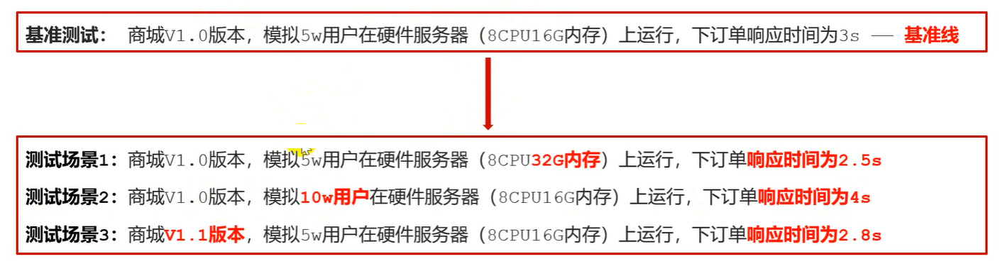

基准测试不会单独存在，为多用户并发测试和综合场景测试等提供参考依据

### 0.2.2 负载测试

通过**逐步增加系统负载**，确定**在满足系统的性能指标情况下**，找出系统所能够承受的**最大负载量**的测试

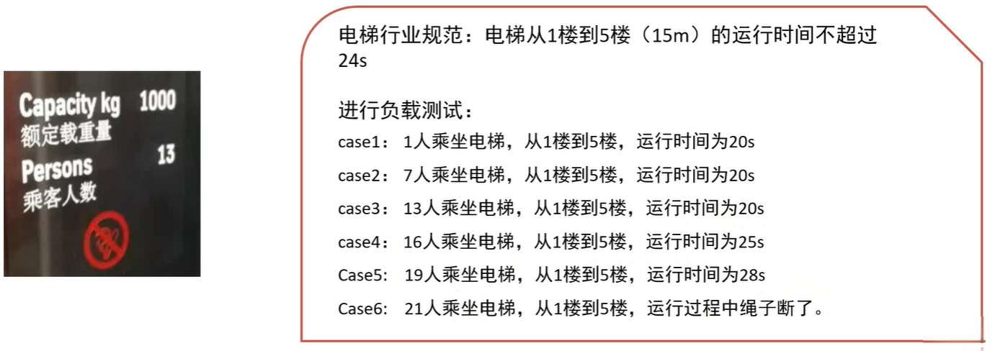

### 0.2.3 稳定性测试

在服务器**稳定运行（用户正常的业务负载下）**的情况下，进行**长时间测试**（1天-1周等），并最终保证服务器能满足线上业务需求。

系统在**用户要求的业务负载下**运行达到**规定的时间**时，系统才能正式上线使用。

### 0.2.4 压力测试

软件使用时，用户量超过预期（最大负载量），该如何反应？多久能恢复？

压力测试：在强负载下的测试，查看系统在**峰值（最大负载）情况**下，是否存在功能隐患，是否具有良好的**容错能力和可恢复能力**。

- **极限负载情况下导致系统崩溃的破坏性压力测试**
- **高负载下、长时间的稳定性压力测试**

### 0.2.5 并发测试

并发测试（绝对并发）：发现多用户并发访问同一应用、模块或数据记录时存在的死锁、资源争用、数据不一致等问题。

应用场景：抢红包，秒杀，抢购等

## 0.3 指标

指标：对系统的性能进行量化

1. 响应时间
   - 指用户从**客户端发起**一个请求开始，到客户端接收到从**服务器返回结果**，整个过程所耗费的时间。
   - 一般通过HTTP接口请求消息来测试
   - 不包含发消息时，前端页面的处理时间。不包含收到消息后，前端页面的渲染显示时间
2. 并发数
   - 某一时刻，同时向服务器发送请求的用户数
3. 吞吐量
   - 单位时间内，处理客户端请求的数量。直接体现软件系统的性能承载能力
   - 从业务上角度：业务数/小时，业务数/天，访问人数/天，页面访问量/天。从网络角度：字节数/小时，字节数/天。从技术角度：事务数/秒（TPS），查询数/秒（QPS）
   - QPS：服务器**每秒**处理的**特定请求**的数量，不同的请求他的QPS会有不同
   - TPS：
     - 服务器每秒处理的事务请求的数量
     - 事务，即业务，页面上的一次操作，可能对应一个请求或多个请求。
     - 一个事务对应一个请求时：QPS = TPS，一个事务对应多个请求时，QPS = n * TPS
4. 点击数
   - 指客户端向服务发送请求时，所有的页面资源元素（eg：img，css，js，链接）的请求总数量
   - 只有web项目才有此指标，点击数不是页面上的一次点击。
   - 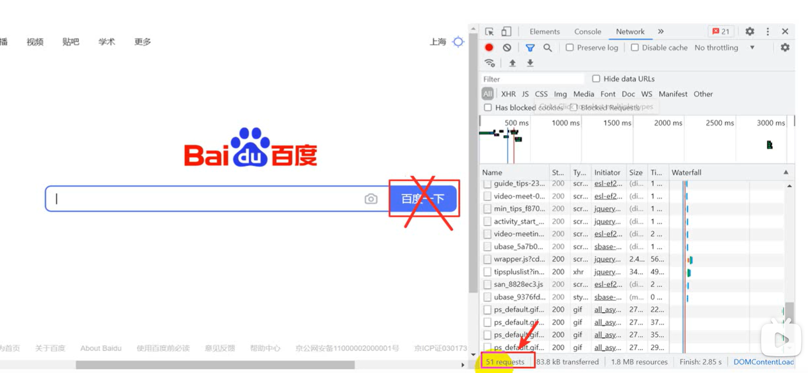
5. 错误率
   - 指系统在**负载情况**下，失败业务的概率。
   - 错误率 = （失败业务数 / 业务总数）* 100%
   - 注意：
     - 大多数系统都会要求错误率接近于0
     - 错误率是一个性能指标，**不是功能上的随机bug**
     - 不能说，我往购物车中添加商品，10次有2次添加失败，在没有特定的场景（eg：大量用户发请求）下，这样的现象是bug
6. 资源使用率
   - 指系统中各种资源的使用情况，= （资源的使用量 / 资源总可用量）* 100%
   - 经验参考：CPU 不高于75%~85%，内存不高于80%，磁盘IO不高于90%，网络不高于80%

## 0.4 流程

### 0.4.1 性能测试需求分析

1. 明确被测试系统
   - 熟悉被测试系统的业务功能和技术架构
2. 明确测试内容
   - 业务角度：用户使用频率较高的关键业务功能
   - 技术角度：逻辑复杂度高的业务，数据量大的业务
3. 明确测试策略
4. 明确测试指标
   - 有明确需求指标
   - 无明确需求指标（分析指标）：查找资料，未来流量预估

### 0.4.2 性能测试计划和方案

1. 测什么
   - 背景
   - 目的
   - 范围
2. 谁来测
   - 进度与分工
   - 交付清单
3. 怎么测
   - 测试策略

### 4.4.3 性能测试用例

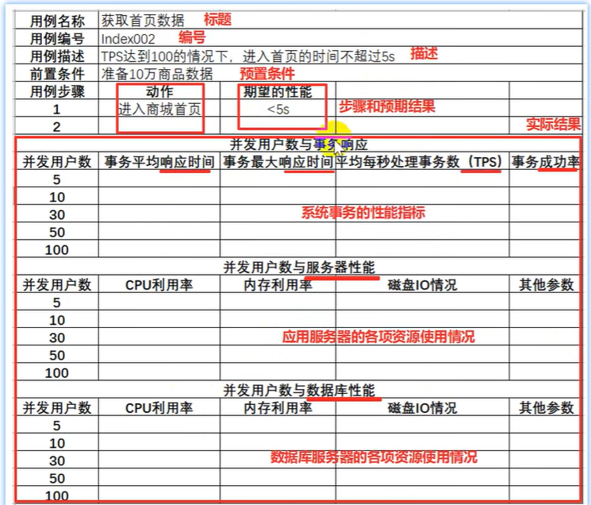

### 4.4.4 性能测试执行

1. 建立测试环境
   - 软/硬件/网络环境
2. 编写测试脚本
3. 性能测试监控
4. 执行测试脚本
   - 设置性能运行场景，执行性能测试，同步收集各项性能指标

### 4.4.5 性能分析与调优

经过测试结果分析，如不符合性能要求，提出性能bug，然后由开发人员进行后续调优

### 4.4.6 性能测试报告

主要内容：

- 测试工作经过回顾
- 缺陷分析和调优
- 风险评估
- 性能测试结果
- 测试工作总结与改进

## 0.5 主流性能测试工具

### 0.5.1 LoadRuner

LoadRuner是一种工业级标准性能测试负载工具，可以模拟上万用户实施测试，并在测试时可实时监测应用服务器各种数据

支持多协议：Web（http/HTML），Windows Sockets、FTP等，使用C语言开发。

优点：

- 多用户（支持用户以万为单位）
- 详细分析报表（以秒为单位）
- 支持IP欺骗功能

缺点：

- 收费
- 体积庞大（安装包GB）
- 无法定制功能

### 0.5.2 JMeter

JMeter是Apache组织开发的java开源软件，用于对系统做功能测试和性能测试，

优点：开源免费，小巧50M，丰富的学习资料和扩展组件。

缺点：不支持ip欺骗，报表精度低。

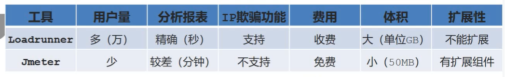

## 0.6 安装JMeter

依赖：JDK

下载：https://jmeter.apache.org/download_jmeter.cgi

解压后，进入bin目录

启动方式3种：

- 双击jmeter.bat
- 双击ApacheJMeter.jar
- java -jar ApacheJMeter.jar

**汉化**：

- 临时汉化：菜单组Options -> Choose Language
- 永久汉化：bin/jmeter.properties，搜索language，去掉注释符#，值修改为zh_CN

## 0.7 JMeter目录介绍

- bin
  - 存放可执行文件和配置文件
  - 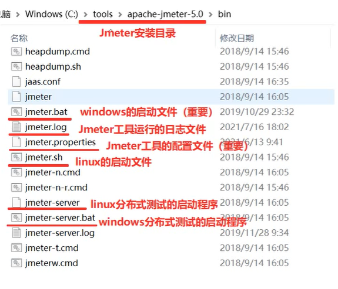
- docs
  - Jmeter的api文档，用于开发扩展组件
  - 双击apache/docs/api/index.html
- printable_docs
  - 用户帮助手册：printable_docs\usermanual/index.html
- lib：
  - Jmeter依赖的jar包，和用户扩展所依赖的jar包

# 1 基础概念

## 1.1 元件和组件

 右击测试计划 -> add -> 线程组（Thread Group）

右击线程组，add中，就是一系列元件

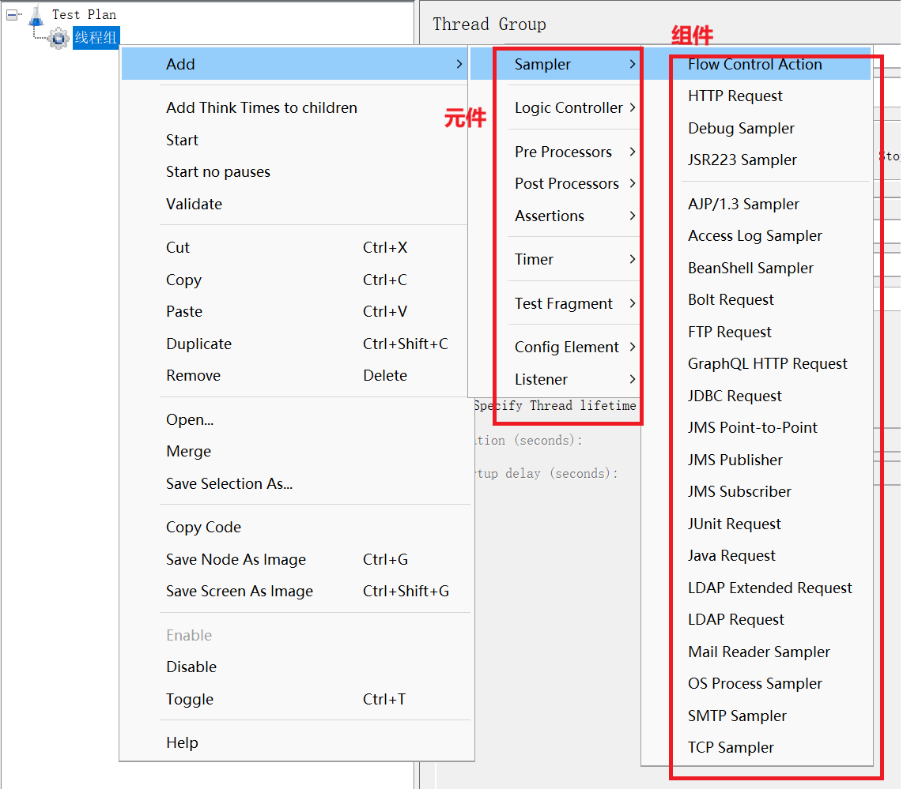

元件：多个类似功能组件的容器，类似于类

1. Sampler（采样器）：发送请求
2. Logic Controller（逻辑控制器）：控制语句执行顺序
3. Pre Processors（前置处理器）：对请求参数预处理
4. Post Processors（后置处理器）：对响应结果进行提取
5. Assertions（断言）：检查结果与预期结果是否一致
6. Timer（定时器）：设置等待
7. Test Fragment（测试片段）：封装一段代码，供其他脚本调用
8. Config Element（配置元件）：测试数据的初始化配置
9. Listener（监听器）：查看Jmeter脚本的运行结果

组件：实现独立的某个功能，类似于方法

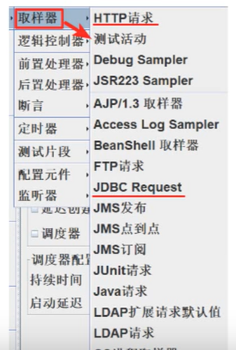

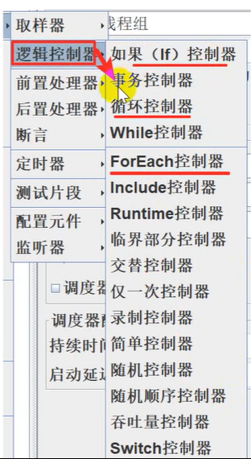

接口自动化脚本的实现过程与Jemeter的元件映射

1. 初始化测试数据——配置元件
2. 对接口参数进行赋值——前置处理器
3. 调用GET/POST方法发送请求——采样器
4. 提取响应中特定字段的值——后置处理器
5. 对提取出来的值与预期结果进行对比——断言
6. 在控制台查看脚本运行结果——监听器

## 1.2 元件作用域和执行顺序

**元件的作用域**：

- 测试计划的树形结构的父子关系决定了作用域
- 所有组件都是以**采样器为核心**来运行的（必须要有采样器，才能跑），组件添加的位置不同，生效的取样器不同
- 原则
  - 取样器：核心，不和其它元件相互作用，没有作用域
  - 逻辑控制器：只对其子节点的取样器和逻辑控制起作用
  - 其他元件：
    - 如果是某个取样器的子节点，则该元件只对其父节点起作用
    - 如果其父节点不是取样器，则其作用域是该元件父节点下的其他所有后代节点

**元件的执行顺序**：

- 同一作用域下不同类型元件，先后执行顺序，按照下面从上到下。
  - 配置元件（Config Element）
  - 前置处理器
  - 定时器
  - 取样器
  - 后置处理器
  - 断言
  - 监听器
- 同一作用域下多个相同类型的元件
  - 按照测试计划中从上到下的顺序依次执行

eg：下面这张图的执行顺序：定时器1 -> 请求1 -> 定时器1 -> 定时器2  -> 请求2 -> 定时器1 -> 定时器3 -> 请求3 

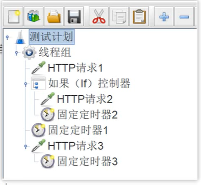

**同一测试计划下的线程组执行顺序**

- 并行跑（默认），谁先返回结果，谁就先显示到结果树的前面（Listener -> View Results Tree）
- 串行跑，点击测试计划，勾选 “独立运行每个线程组（例如：在一个组运行结束后，启动下一个）”

## 1.3 线程组

线程组：用于执行测试的一组用户

- 模拟多人操作
- 线程组可以添加多个，多个线程组可以并行（默认）或串行（在测试计划中，可以勾选Run thread Group consecutively (i.e. one at a time)）
- 取样器（Sampler）和逻辑控制器必须依赖线程组才能使用

位置：测试计划 -> add -> 线程（用户）-> 线程组

同一线程的执行是阻塞串行，不是并发

### 1.3.1 分类

线程组：普通线程组

setup线程组：在普通线程组之前执行，执行预测试操作

teardown线程组：在普通线程组之后执行，执行测试后操作

### 1.3.2 参数

线程数（Number of Threads (users)）：虚拟用户数

Ramp-up时间（Ramp-up period (seconds)）：虚拟用户陆陆续续开始发送请求的时间段，用户上线时间区间

循环次数（Loop Count）：每个用户循环请求的次数

- 有无限Infinite选项，当勾选时，必须配合调度器（Specify Thread lifetime）中的**Startup delay(seconds) ** 和**`Duration (seconds)`（持续时间）**使用
  - Startup delay(seconds)：该线程组在启动计划开始后多少秒，开始执行。
  - Duration (seconds)：无线循环多长时间，持续时间

## 1.4 http请求

作用：向服务器发送http/https请求

位置：线程组 -> 右击 -> add -> Sampler -> HTTP Request

### 参数

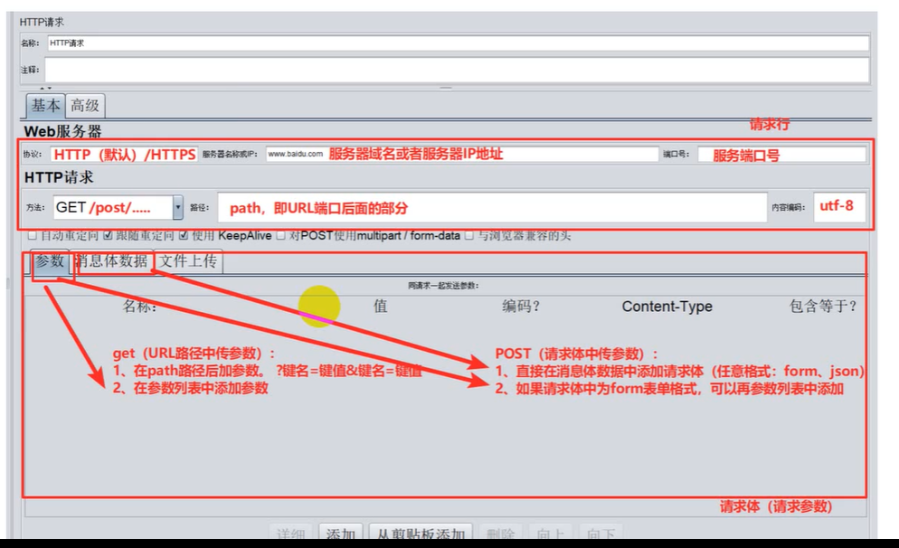

## 1.5 查看结果树

作用：查看http请求的请求和响应结果

位置：测试计划 -> 右击 -> add -> listener -> 查看结果树（view result tree）

组成：

- 取样结果（Sampler result）：查看响应头，响应状态码
- 请求（Request）：查看请求相关信息（Request header 和Request Body）
- 响应（Response Data）：查看响应信息（Response header 和Response Body）

### 响应结果乱码

jmeter/bin/jmeter.properties文件中，找`samplerresult.default.encoding=UTF-8`

# 2 参数化

场景：如果要访问某一请求10次，要求每次请求发送不同的参数值，该怎么做？

参数化：把测试数据组织起来，用不同的测试数据调用相同的测试方法

Jmeter常见的参数化方式：

- 用户定义的变量——全局变量
- 用户参数——为每个用户分配不同的参数值
- CSV Data Set Config——文件方式
- 函数——内置函数
- 数据库

## 2.1 定义变量

作用：定义全局变量

位置：测试计划 -> 线程组 -> 配置元件（Config Element） -> 用户定义变量（User define Variable）

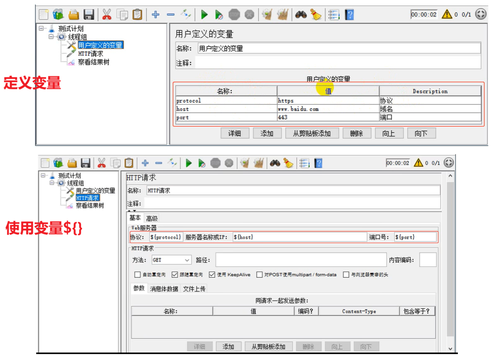

## 2.2 用户参数

场景：性能测试时有多个用户同时请求，每个用户在登录请求时需要使用不同的用户名密码进行登录，该怎么做？

针对同一组参数，当不同用户来访问时，可以获取到不同的值

位置：测试计划 -> 线程组 -> 前置处理器（Pre Processors） -> 用户参数（User Parameters）

使用：**${variable_name}**

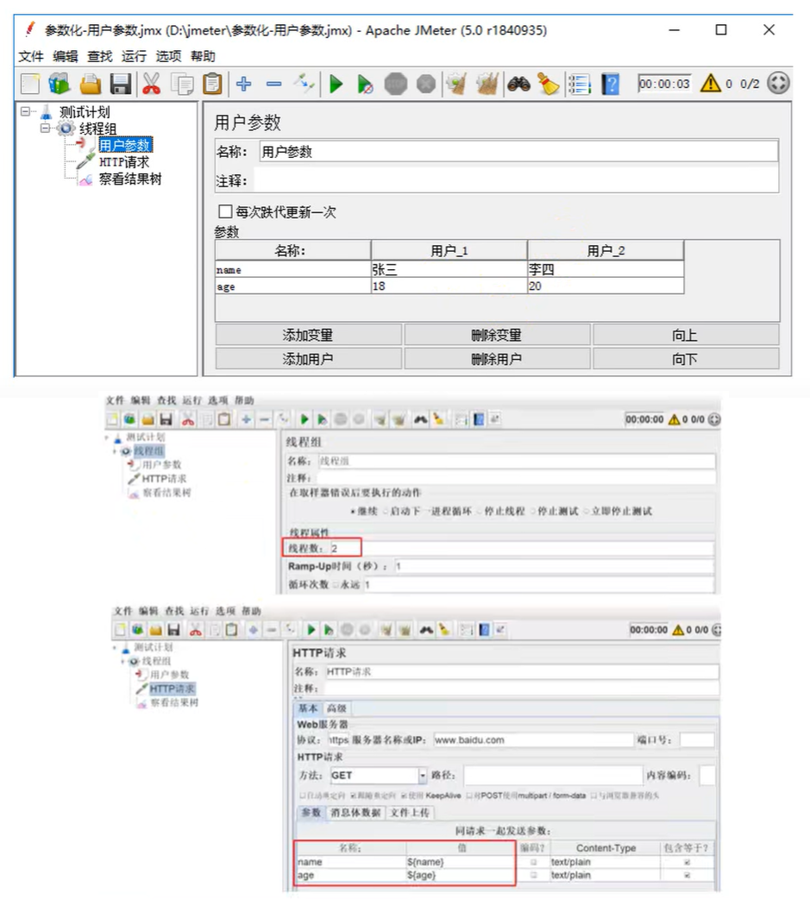

## 2.3 CSV数据文件

作用：让用户在多次循环中，可以取到不同的值

位置：测试计划 -> 线程组 -> 配置元件（Config Element）-> CSV数据文件设置（CSV Data Set Config）

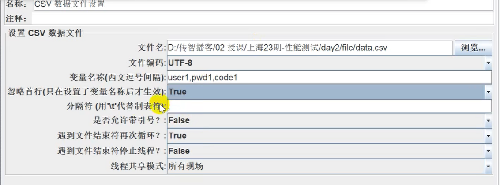

## 2.4 函数参数化

场景：如果要模拟1000个用户，每个用户循环执行10万次添加商品操作，请求参数要求不同，该怎么做？

### __counter

位置：菜单 -> 选项 ->  函数助手对话框

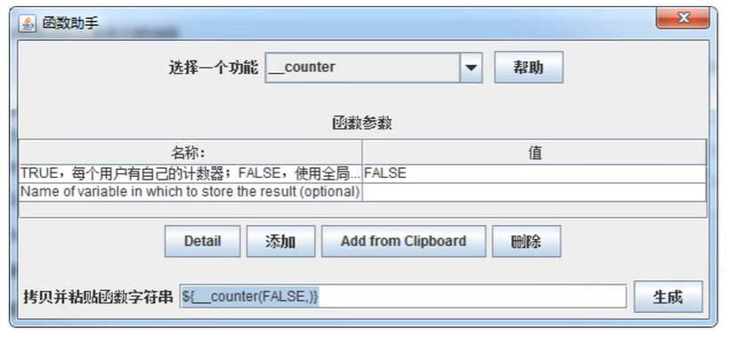

函数参数

- TRUE, 每个用户有自己的计数器; FALSE, 使用全局计数器
- Name of variable in which to store the result (optional):用于存储结果的变量名(可选)

# 3 断言

断言：让程序自动判断预期结果和实际结果是否一致

常用断言：

- 响应断言
- Json断言
- 持续时间断言（Duration Assertion）

Jmeter会自动判定响应状态码，如果状态码为4xx/5xx，则判定失败

## 3.1 响应断言

作用：对http请求的任意格式的响应结果进行断言

位置：测试计划 -> 线程组 -> http请求 -> （右击add）断言 -> 响应断言（Response Assertion）

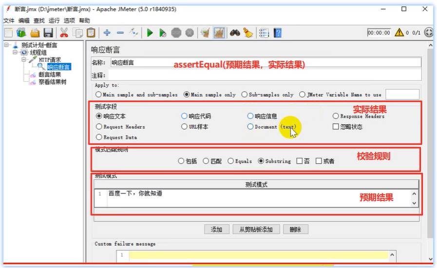

测试字段（Field to Test）：要检查的项

- 响应文本：来自服务器的响应文本，即主体

- 响应代码：响应的状态码，例如：200
- 响应信息：响应的信息，例如：OK
- Response Headers：响应头部
- Request Headers：请求头部
- Request Data：请求数据
- URL 样本：请求 URL
- Document (text)：响应的整个文档
- 忽略状态（复选框）：忽略返回的响应状态码，如果你的接口就是想返回400，那你就忽略200的要求

模式匹配的规则（Pattern Match Rules）：比较方式

- 包括（contains）：文本包含指定的正则表达式
- 匹配（matches）：整个文本匹配指定的正则表达式
- Equals：整个返回结果的文本等于指定的字符串 (区分大小写)
- Substring：返回结果的文本包含指定字符串 (区分大小写)
- 否：取反
- 或者：如果存在多个测试模式，勾选代表逻辑或（只要有一个模式匹配，则断言就是 OK），**不勾选代表逻辑且**（所有都必须匹配，断言才是 OK）

测试模式：预期的结果

- 可以添加多个测试模式

## 3.2 JSON断言

作用：对http请求的JSON格式的响应结果进行断言

位置：测试计划 -> 线程组 -> http请求 -> （右击add）断言 -> JSON断言（JSON Assertion）

- Assert JSON Path exists：用于断言的 JSON 元素的路径（实际结果），like：”$.weatherinfo.city“，这里的$符代表json的根对象

- Additionally assert value（复选框）：如果您想要 用某个值生成断言，请选择复选框

- Match as regular expression（复选框）：使用正则表达式断言

- Expected Value：期望值（期望结果）

- Expect null（复选框）：如果希望为空，请选择复选框

- Invert assertion (will fail if above conditions met)（复选框）：反转断言 (如果满足以上条件则失败)

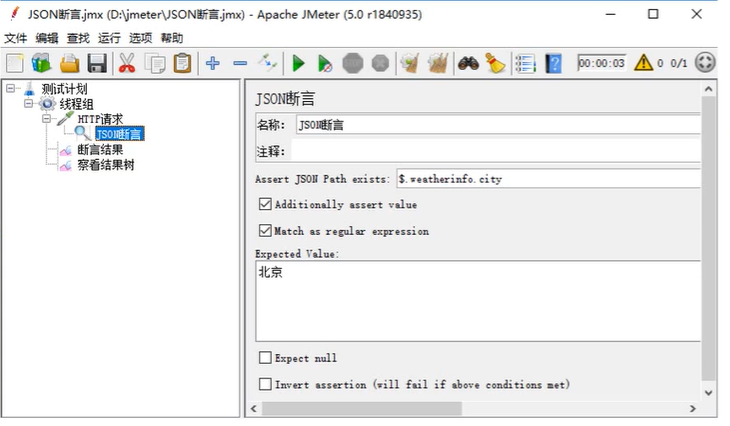

在查看结果时，Text-> JSON Path Tester：

- 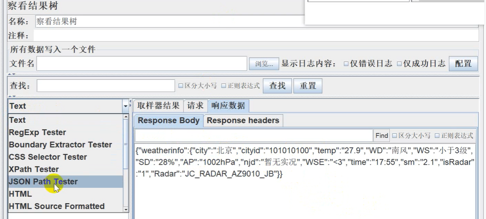

## 3.3 断言持续时间

作用：检查http请求的响应时间是否超出要求范围

位置：测试计划 -> 线程组 -> http请求 -> （右击add）断言 -> 断言持续时间（Duration Assertion）

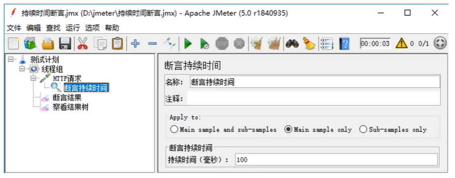

取样器结果（Sampler Result）中，Load Time为实际请求的响应时间。

# 4 关联

关联：当请求之间有依赖关系，比如一个请求的入参是另一个请求返回的数据，这时候就需要用到关联处理。

Jmeter中常用的关联方法：

- 正则表达式提取器
- XPath提取器
- JSON提取器
- 其他：CSS/JQuery提取器

## 4.1 正则表达式提取器

位置：测试计划 -> 线程组 -> http请求 -> （右击add）后置处理器 -> 正则表达式提取器（Regular Pattern Extractor）

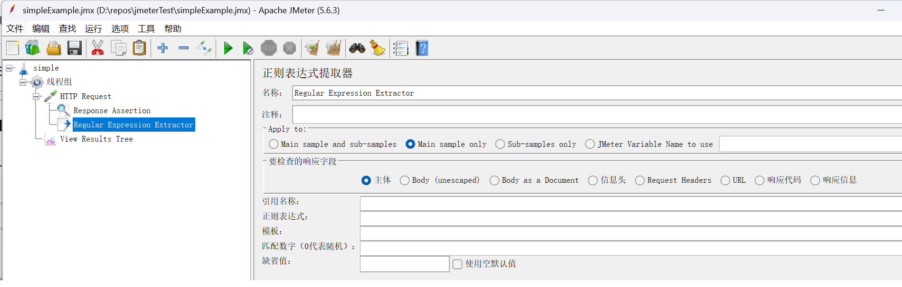

参数讲解

- **引用名称**：存放提取出的值的参数名称，供下一个请求引用，如填写 title，则可用 ${title} 引用它

- **正则表达式**
  - `()`：括起来的部分就是要提取的。
  - `.`：匹配任何字符串。
  - `+`：一次或多次。
  - `?`：不要太贪婪，在找到第一个匹配项后停止。

- **模板**：用 $$ 引用起来，如果在正则表达式中有多个提取值（子文本），则可以是 $2$，$3$ 等等，表示解析到的第几个值给 title。如：1表示解析到的第 1 个值（可以去Tool.md文档中参考正则表达式的捕获组相关内容）
- **匹配数字**：0 代表随机取值，-1 代表全部取值，1 代表取第一个值。
- **缺省值**：如果参数没有取得到值，那默认给一个值让它取。

### 示例1

1. 请求：http://www.itcast.cn，获取网页的title值
2. 请求：https://www.baidu.com，把获取的title作为请求参数

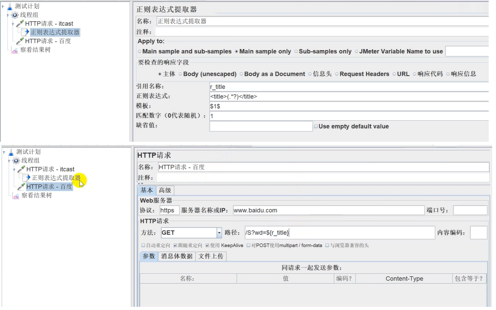

**线程组 -> debug sampler可以调试**

## 4.2 XPath提取器

作用：针对HTML格式的响应结果数据进行提取

位置：测试计划 -> 线程组 -> http请求 -> （右击add）后置处理器 -> XPath提取器（XPath Extractor）

参数介绍：

- Use Tidy (tolerant parser)：
  - 当需要处理的页面是 HTML 格式时，必须选中该选项
  - 当需要处理的页面是 XML 或 XHTML 格式时，取消选中该选项。
- 引用名称：存放提取出的值的参数名称
- XPath Query：用于提取值的 XPath 表达式，类似于css选择器，但有不同的语法
- 匹配数字：如果 XPath 路径查询出许多结果，则可以选择提取哪个。0：表示随机，-1：表示提取所有结果，1 表示第一个值
- 缺省值：参数的默认值

## 4.3 JSON提取器

作用：针对JSON格式的响应结果数据进行提取

位置：测试计划 -> 线程组 -> http请求 -> （右击add）后置处理器 -> JSON 提取器（JSON Extractor）

- Names of created variables：存放提取出的值的参数名称

- JSON Path Expressions：JSON 路径表达式，eg：$.weatherinfo.city

- Match No：如果 JSON 路径匹配出许多结果，则可以选择提取哪个。0：表示随机，-1：表示提取所有结果，1 表示第一个值

- Default Values：参数的默认值

## 4.4 属性

场景：当有关联关系的两个请求在同一个线程组中时，可以使用三种提取器的变量来实现数据传递。当有关联关系的两个请求在不同线程组中时，如何进行数据传递呢？

JMeter 属性可以解决上述场景的问题，在线程组之间的数据存在数据交换时，**一定在测试计划中保持线程组串行执行**

JMeter属性的配置函数：工具-> 函数助手

- __setProperty()：将值保存为JMeter属性
- __property()：在其他线程组中使用property函数读取属性

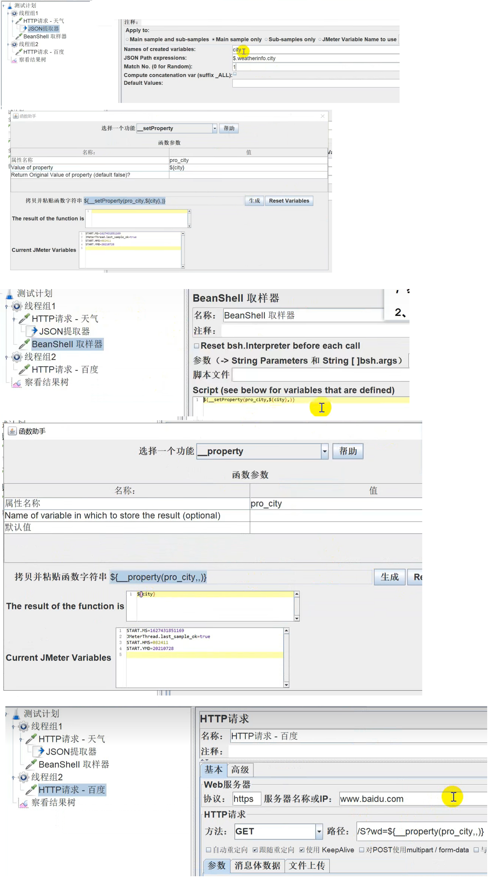

# 5 脚本录制

