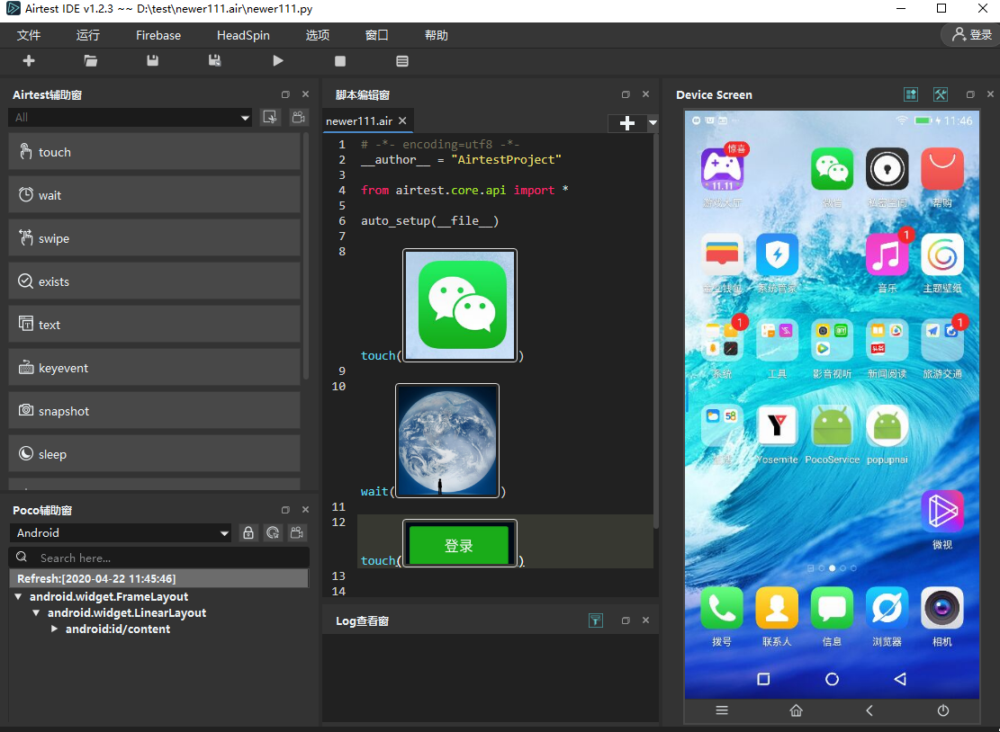
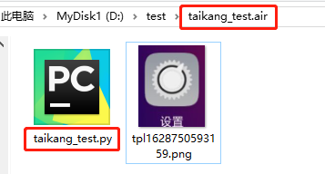
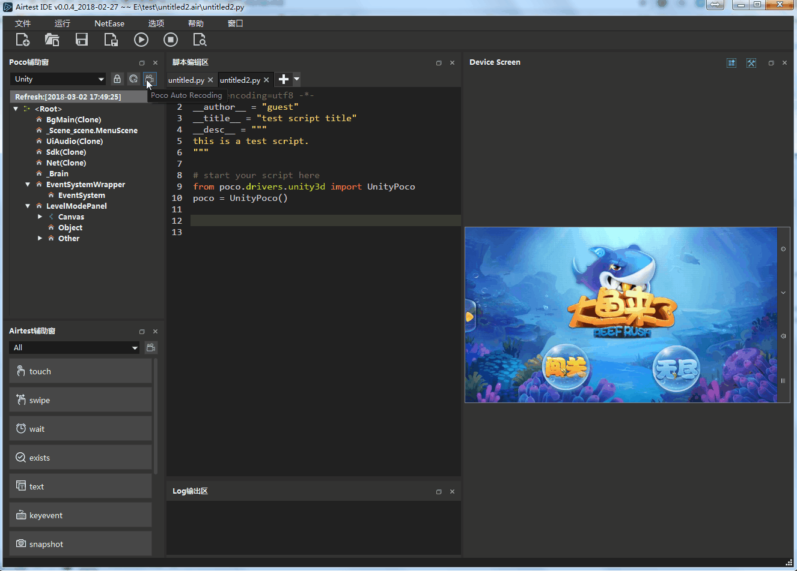
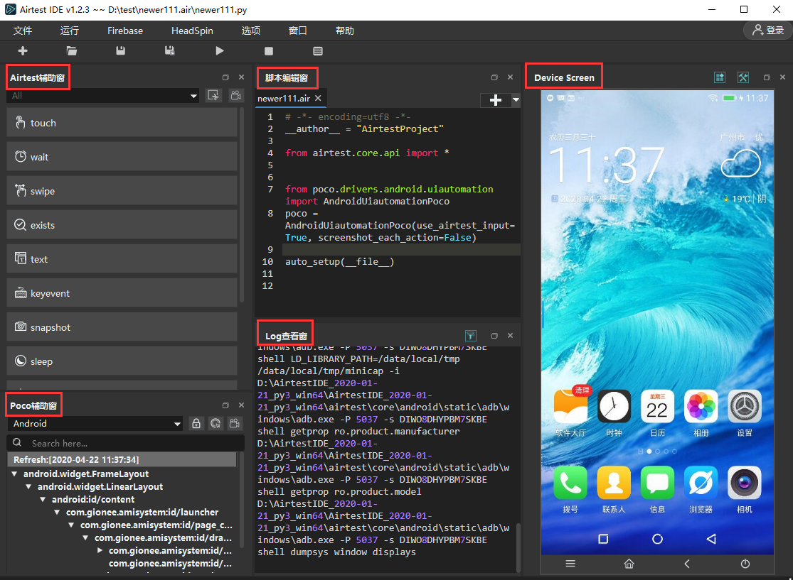

# [Airtest](https://airtest.doc.io.netease.com/for_newer/)

Airtest Project是一款由网易研发并开源的自动化测试框架

## Airtest框架

Airtest 是一个跨平台的、 **基于图像识别** 的UI自动化测试框架，适用于游戏和App，支持平台有Windows、Android和iOS。

Airtest脚本基本上离不开截图。

### 脚本

“新建脚本”按钮，默认即可创建一个后缀名为`.air`的脚本文件，`.air`这是Airtest脚本的专属后缀。

让我们打开刚才新建脚本的文件夹，可以看到实际上`.air`脚本文件是一个普通的文件夹，里面附带了一个**同名**的`.py`文件。

airtest的限制：

- 在某些特殊情况下，例如对于游戏或App里的动态元素，通过图像识别来定位就较为困难。
- 如果我们测试的应用，UI界面迭代比较频繁的话，我们的Airtest图像脚本也要频繁迭代，成本比较高；

### 图像识别逻辑

模板匹配算法

## Poco框架

Poco是一款基于 **UI控件搜索** 的自动化框架，它本质上也是 **python** 第三方库。

### 控件支持

这里的控件，类似于浏览器页面中的标签`<button>`

目前来说，除了安卓和iOS原生应用，poco可以直接使用，其它各种平台都需要通过对应的方法来接入pocoSDK，之后才能够使用poco框架。

我们现在支持的平台有：Android，iOS，Cocos-Creator，Cocos2dx-js, Cocos2dx-lua，UE4，Unity3D，Egret，WeChat Applet&webview，Netease；不支持Windows和MacOS。

### 脚本

Poco脚本与Airtest脚本的差别很大，Airtest脚本基本上离不开截图，但Poco脚本都基于控件定位和控件操作

## AirtestIDE

AirtestIDE 是一个跨平台的UI自动化测试编辑器，它是专为Airtest和Poco这两个自动化测试框架量身打造的。

