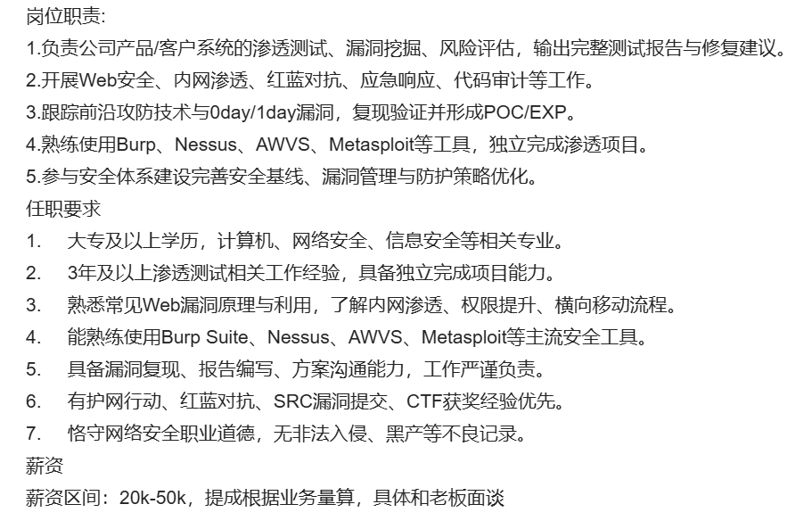
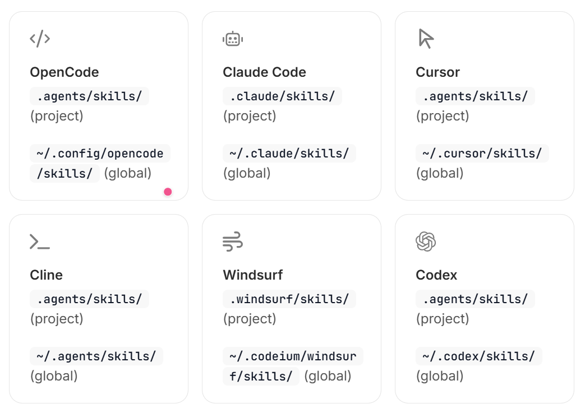

# Penetration Test

渗透测试



# 攻击测试资源

1. 奇安信补天平台：https://www.butian.net/，首先注册为白帽子，方便后续参加 SRC 提交漏洞。
2. 在补天官网项目大厅找到对应目标企业，渗透其下可测资产即可。地址：https://www.butian.net/Reward/plan/2


# 渗透测试相关skills

1. https://skillsclaude.com/：Senior Security


# [Strix](https://github.com/usestrix/strix)

Strix 是具备自主运行能力的 AI 智能代理，行为模式堪比真实黑客 —— 它可以动态执行你的代码、挖掘安全漏洞，并通过概念验证（PoC）对漏洞有效性进行核验。

该产品面向开发人员与安全团队打造，能够快速、精准地完成安全测试，省去人工渗透测试高昂的成本开销，同时规避静态分析工具普遍存在的误报问题。

容器镜像：usestrix/strix-sandbox

# 0 绪论

使用场景：

- 应用安全测试 — 检测并验证应用程序中的高危漏洞

- 快速渗透测试 — 数小时内即可完成渗透测试，无需耗时数周

- 漏洞赏金自动化 — 自动开展漏洞探查并生成漏洞验证证明（PoC），加快报告输出

- CI/CD 集成 — 在漏洞发布至生产环境前将其拦截

核心能力：

- 完整黑客工具集 — 浏览器自动化、HTTP 代理、终端、Python 运行环境
- 真实漏洞验证 — 生成漏洞验证证明（PoC），杜绝误报
- 多智能体编排 — 多个专项智能体协同攻坚复杂目标
- 开发者优先命令行工具 — 支持交互式文本界面（TUI）或用于自动化的无头模式

安全工具：

- Strix 智能体内置一套完备的工具集

- | 工具            | 用途                                       |
  | --------------- | ------------------------------------------ |
  | HTTP 代理       | 完整的请求 / 响应篡改与分析                |
  | 浏览器自动化    | 多标签浏览器，用于 XSS、CSRF、认证流程测试 |
  | 终端            | 可交互 Shell，执行系统命令                 |
  | Python 运行环境 | 自定义漏洞利用代码开发与验证               |
  | 情报侦察        | 自动化开源情报（OSINT）收集、攻击面测绘    |
  | 代码分析        | 具备静态分析与动态分析能力                 |

漏洞覆盖范围：

| 漏洞分类   | 示例漏洞                                                     |
| ---------- | ------------------------------------------------------------ |
| 访问控制   | 垂直越权 (IDOR)、权限提升、认证绕过                          |
| 注入攻击   | SQL 注入、NoSQL 注入、命令注入                               |
| 服务端风险 | SSRF（服务端请求伪造）、XXE（XML 外部实体注入）、反序列化漏洞 |
| 客户端风险 | XSS（跨站脚本）、原型污染（prototype pollution）、DOM 漏洞   |
| 业务逻辑   | 竞态条件（Race conditions）、业务流程篡改                    |
| 身份认证   | JWT 漏洞、会话管理缺陷                                       |
| 基础设施   | 配置错误、对外开放的风险服务                                 |

multi-agent architecture

- Strix 采用由多个专项智能体构成的图谱，实现全方位安全测试

- **分布式工作流** — 针对不同攻击类型与资产配置专属智能体

- **可扩展测试能力** — 并行执行任务，快速完成全面漏洞覆盖

  **动态协同调度** — 各个智能体相互协作、共享探测到的漏洞信息

# 1 CLI Reference

```bash
strix (--target <target> | --target-list <path>) [options]
```

1. --target，-t

   - 测试的目标，测试目标可以有多个

   - 目标类型：URLS，repos，本地文件夹，域名，ip地址，API接口文档（OpenAPI/Swagger .json/.yaml，或者导出的 postman collection），postman collection地址（postman://collection-uuid）

     - 如果target是一份 API 接口规范文档时，Strix 会将该文档复制到智能代理的工作空间中，并授权文档内声明的所有Base URL（包括从 Postman 环境变量解析得出的地址）作为**扫描范围内的主机**。

       因此智能代理会直接读取这份接口契约，对文档中完整声明的攻击面开展测试，而不需要通过爬虫探测的方式去寻找接口端点。

       将接口规范与已部署上线的服务根地址搭配使用（示例命令：`--target ./openapi.yaml --target https://api.example.com`），智能代理便可获得一个可访问的目标主机，执行渗透测试。

     - 如果target是本地文件夹，本地目录将以实时、可写入的方式挂载至沙箱环境，因此智能代理会修改你的真实文件（`.git` 目录除外）。所以**请先提交代码或暂存修改。**

     - 如果target是postman collection地址，通过 ID 获取 Postman 集合需要配置 `POSTMAN_API_KEY`（Postman 接口密钥）。

       追加参数 `?env=<environment-uuid>` 可同时拉取 Postman 环境配置，用来解析该集合所引用的 `{{baseUrl}}`、令牌等变量（示例：`postman://<collection-uuid>?env=<environment-uid>`）。

   - ```bash
     # Local codebase
     strix --target ./app-directory
     
     # GitHub repository
     strix --target https://github.com/org/repo
     
     # Live web application
     strix --target https://your-app.com
     
     # Multiple targets (white-box testing)
     strix -t https://github.com/org/repo -t https://your-app.com
     
     # Targets from a file, one target per non-empty, non-comment line
     strix --target-list ./targets.txt
     ```

2. --instruction

   - 扫描的自定义指令。可用于配置凭据、划定重点测试范围，或是指定特定的测试方案。
   - --instruction-file，也可以指定一个详细指令的文件

3. --workspace-file

   - 扫描开始前，待放入沙箱工作区的本机文件路径。如需上传多个文件，可重复使用该参数。

     格式填写规则：`路径:目标位置`，用于指定文件在 `/workspace` 目录内的存放位置；若不填写目标位置，默认使用原文件名。

4. --scan-mode，-m

   - 扫描深度（强度）：quick，standard， deep

5. --scope-mode 

   - 代码范围模式，默认auto
   - auto：在CI/headless模式下，启用合并请求差异扫描范围
   - diff：强制仅扫描变更文件
   - full：关闭差异范围扫描，扫描全部代码

6. --diff-base

   - 用于对比的目标分支（branch）或提交版本（commit）（例如：`origin/main`）。默认使用代码仓库的默认分支。

7. --non-interactive, -n

   - 以无界面（headless）模式运行，不启用文本交互界面（TUI：Text‑based User Interface）。适用于 CI/CD 流水线。

8. --max-budget，number

   - 单次扫描的大型语言模型最大开销限额（美元），开销由根代理以及所有子代理累计计算。每次模型返回响应后都会校验预算。
   - 在**非交互模式（-n）**下，当运行成本达到阈值时，扫描会正常终止，状态标记为已停止（非失败），同时销毁沙箱环境。子代理会在预算消耗至 90% 时提前停止，预留最后一部分预算供根代理收尾并生成最终报告。
   - 在**交互模式**下，达到预算上限只会暂停扫描，而非直接结束：所有代理进入待命状态；发送任意消息即可恢复扫描，同时限额在原有预算基础上增加一倍。交互模式下不为子代理预留预算。
   - 当开销即将触及预算时，各级代理将会收到分阶段收尾警告，使其能够完成手头工作，并在强制终止前调用生命周期工具。不同代理的警告节点略低于各自的停止阈值：
     - 根代理警告节点：70%、85%、95%，到达 100% 时停止；
     - 子代理警告节点：75%、80%、85%，到达 90% 预留线时停止。
     - 交互模式下所有代理统一使用 70%、85%、95% 的警告档位。警告中展示的百分比为累计实际开销占总预算的比例。
   - 该参数取值必须大于 0；如省略此选项，则开销无上限。

9. --max-turns integer default:"500"

   - 分配给每个代理的最大轮次（一轮 = 一次模型响应加上对应的一轮工具调用），每次运行单独计数。代理达到该上限时将被强制终止。
   - 轮次限额即将耗尽时，系统会在下一次模型交互轮次内向该代理推送分阶段收尾警告（70%、85%、95%），使其优先完成剩余工作，并在强制停止前调用生命周期工具（根代理调用 `finish_scan`，子代理调用 `agent_finish`）。
   - 参数值必须大于0

10. 

## 1.1 命令退出码

- 0，Scan 成功，interactive mode 总是返回0，headless mode 0意味着没有发现vulnerabilities
- 1，扫描期间致命错误发生，eg：缺少环境变量，没有docker，无效的配置文件，diff-scope 解析失败
- 2，发现vulnerabilities (headless mode only)

## 1.2 Scan Mode

1. quick：快速检查那些显而易见的缺陷
   - 场景：CI/CD，验证连通性，冒烟测试
   - Duration：Minutes
2. standard：适用于常规安全审查的均衡测试模式
   - 场景：常规安全评估，预发布验证，开发里程碑
   - Duration：30Minutes to 1 Hour
3. deep：全面的渗透测试（默认的模式）
   - 场景：全面的安全审计，pre-production审查，关键的应用评估
   - Duration：1-4 hours ，取决于目标的复杂度

| Scenario             | Recommended Mode |
| :------------------- | :--------------- |
| Every PR             | Quick            |
| Weekly scans         | Standard         |
| Before major release | Deep             |
| Bug bounty hunting   | Deep             |

## 1.3 Custom Instructions

```bash
# 行内指令
strix --target https://app.com --instruction "Focus on authentication vulnerabilities"	# 重点检测身份认证相关漏洞

# 复杂指令，使用文件的方式传递指令
strix --target https://app.com --instruction-file ./pentest-instructions.md

# 给予认证信息
strix --target https://app.com \
  --instruction "Login with email: test@example.com, password: TestPass123" 	# 使用账号登录：邮箱 test@example.com，密码 TestPass123

# 专注范围
strix --target https://api.example.com \
  --instruction "Focus on IDOR vulnerabilities in the /api/users endpoints"		# 重点检测 /api/users 接口下的不安全直接对象引用（IDOR）漏洞
  
# 排除范围
strix --target https://app.com \
  --instruction "Do not test /admin or /internal endpoints"		# 不对 /admin 和 /internal 接口执行扫描测试
  
# API TEST
strix --target https://api.example.com \
  --instruction "Use API key header: X-API-Key: abc123. Focus on rate limiting bypass."		# 请求头携带 API‑Key：X‑API‑Key: abc123。重点检测限流绕过漏洞。
  


```

指令文件示例

```markdown
# 渗透测试指令
## 测试账号凭据
- 管理员账号：admin@example.com / AdminPass123
- 普通用户账号：user@example.com / UserPass123
## 重点检测范围
1. 用户资料接口的不安全直接对象引用（IDOR）越权漏洞
2. 不同角色之间的权限提升漏洞
3. JWT 令牌篡改漏洞
## 排除测试范围
- /health 健康检查接口
- 第三方集成功能
```

好的指令可以帮助Strix 优先考虑最有价值的袭击路径

### workspace files

指令内容会成为大模型提示词的一部分。如果你需要向 Strix 提供文件以供其使用（例如字典表、API 接口文档或备注材料），请使用参数 `--workspace‑file`。扫描启动前，Strix 会将该文件上传至沙箱工作目录。

```bash
strix --target https://app.com --workspace-file ./wordlist.txt
```

文件默认存放路径为 `/workspace/<文件名>`。如需自定义存放位置，请使用 `PATH:DEST` 格式填写参数。`DEST` 是 `/workspace` 目录下的子路径。

每一个需要上传的文件都要重复使用该参数。Strix 会在代理任务清单中列出这些文件，代理便可获知文件的读取位置。

适用于所有workspace file的规则：

1. 文件在沙箱内为只读。
2. 文件目标存放路径必须位于 `/workspace` 目录之内。
3. 目标路径不可指向被测目标目录。被测目标的文件由目标站点本身提供；如出现此种冲突，Strix 将跳过该文件并输出警告日志。
4. 两个文件不能指定相同的存放目标路径。


# 2 Coding Agent

在 Claude Code、Cursor、Codex 以及其他 AI 智能体中使用 Strix

Strix 专为 AI 编码智能体驱动运行而设计。安装官方智能体技能后，你的智能体便可执行渗透测试、修复安全问题结果，并将 Strix 接入持续集成（CI）流程。

```bash
npx skills add usestrix/strix
```

这个usestrix/strix包里包含以下skill

| 技能名称                                  | 智能体可掌握的能力                                           |
| ----------------------------------------- | ------------------------------------------------------------ |
| `penetration-testing-with-strix`          | 针对代码、网址、域名或 IP 地址执行headless scan（可选用本地部署命令行工具或云端托管服务），支持预算上限控制，并读取扫描结果 |
| `managed-pentesting-with-strix`           | 通过 REST 接口操控托管平台 app.strix.ai，无需本地部署 Docker 或配置大模型密钥 |
| `fix-security-vulnerabilities-with-strix` | 对安全检测结果进行分级处理、修复问题根源，重新运行 Strix 验证每一处修复效果 |
| `ci-security-scanning-with-strix`         | 为 GitHub Actions 或任意CI流水线  添加合并请求（PR）安全扫描（支持本地命令行工具或云端托管应用） |
| `application-security-testing`            | 对完整产品开展安全评估：为每项资产选择合适的测试方案，再将所有检测结果整理排序，生成统一修复方案 |
| `web-app-penetration-testing`             | 对线上 Web 应用或预发布站点执行黑盒渗透测试，包含测试范围配置、凭证管理以及多账号访问权限检测 |
| `api-security-testing`                    | 依据 OWASP API 安全十大风险项目，测试 REST/GraphQL 接口；完成基于接口文档的资产枚举、未授权对象访问 (BOLA/IDOR)、权限控制校验 |
| `owasp-top-10-testing`                    | 系统化开展 OWASP Top 10 安全评估，如实记录每一类风险项的检测覆盖情况 |
| `find-security-vulnerabilities-in-code`   | 对代码仓库或工作目录进行白盒安全审计，利用漏洞验证程序确认安全缺陷 |

如果你只想安装某一个skill可以使用：

```bash
npx skills add usestrix/strix --skill penetration-testing-with-strix
```


# 3 Tools

Strix 智能体借助各类专用工具，如同一个真实的渗透测试工程师做的那样。

Strix 在基于 Kali Linux 的 Docker 容器（镜像：usestrix/strix-sandbox）内运行，[容器预装了一整套安全测试工具](https://docs.strix.ai/tools/sandbox)。智能体可通过终端接口调用下述任意工具。

所有工具均已完成预配置，开箱即用。智能体会根据待测试的漏洞类型，自动选择合适的工具。

## 3.1 Browser

基于 Playwright 的 Chrome 浏览器用于 Web 应用测试

工作原理：

所有浏览器流量都会自动经过 Caido 代理转发，让 Strix 能够完整查看每一条请求与响应数据。由此可实现：

- 检测客户端漏洞（跨站脚本 XSS、DOM 篡改）
- 执行带身份认证的业务流程（登录、OAuth、多因素认证 MFA）
- 触发大量 JavaScript 驱动的功能模块
- 捕获动态生成的网络请求

**Caido proxy**：Caido 代理，一款 Web 安全测试抓包代理工具

能力：

| 操作     | 说明                                   |
| -------- | -------------------------------------- |
| 页面跳转 | 访问网址、追踪链接、处理重定向         |
| 点击交互 | 操作按钮、超链接、表单控件             |
| 文本输入 | 填写表单、搜索框及各类输入字段         |
| 执行 JS  | 在页面上下文运行自定义 JavaScript 代码 |
| 屏幕截图 | 截取页面可视状态，用于生成报告         |
| 多标签页 | 在多个浏览器标签之间开展测试           |

示例执行流程：

- 智能体启动浏览器并跳转至登录页面
- 填入账号凭证，提交表单
- 代理捕获认证请求报文
- 智能体访问受保护资源页面
- 通过重放修改过 ID 参数的请求，开展不安全的直接对象引用（IDOR）漏洞测试


## 3.2 http proxy

Strix 内置了专为安全测试打造的现代化 HTTP 代理工具 —— [Caido](https://caido.io/)。所有浏览器流量均经过 Caido 转发，使智能体能够完全控制所有请求与响应报文。

能力：

| 功能     | 说明                                         |
| -------- | -------------------------------------------- |
| 请求捕获 | 自动记录全部 HTTP/HTTPS 流量                 |
| 请求重放 | 修改参数后重新发送任意请求                   |
| HTTPQL   | 使用强大的过滤条件，对已捕获流量进行查询检索 |
| 范围管理 | 将测试目标限定于指定域名或路径               |
| 站点地图 | 可视化展示探测发现的攻击面                   |

## 3.3 Terminal

Strix 可访问运行于 Docker 沙箱内部的持久化 Bash 终端。智能体能够使用沙箱内全部工具

| 功能       | 说明                                         |
| ---------- | -------------------------------------------- |
| 持久化状态 | 工作目录与环境变量在多条命令执行期间保持不变 |
| 多会话     | 开启多个并行终端，执行并发任务               |
| 后台任务   | 启动长时间运行的进程且不会造成阻塞           |
| 交互控制   | 响应程序提示、管控正在运行的进程             |


# [skills CLI](https://mintlify.wiki/vercel-labs/skills/introduction)

skills CLI 是一款面向 AI 编码智能体技能的通用包管理器。你可通过它安装、管理以及分享可复用指令集，借助这些指令集，能够在 42 种以上受支持的智能体（Claude code、OpenCode、Codex等）上拓展coding agent的能力。

**skills命令行工具可自动检测你已安装的编码智能体。若未检测到任何智能体，系统将提示你选择需要安装到哪些智能体上。**

skills可以被安装到两个范围scopes：

| Scope       | Flag      | Location            | Use Case                                      |
| :---------- | :-------- | :------------------ | :-------------------------------------------- |
| **Project** | (default) | `./<agent>/skills/` | Committed with your project, shared with team |
| **Global**  | `-g`      | `~/<agent>/skills/` | Available across all projects                 |



skills命令的安装：

- skills命令

  ```bash
  npm install -g skills
  # skills自动探测电脑中的agent，以安装skills到对应位置
  skills add vercel-labs/agent-skills
  ```

- npx skills，每次都可以使用skills的最新版本，并且不要求全局安装

  ```bash
  npx skills add vercel-labs/agent-skills
  ```

