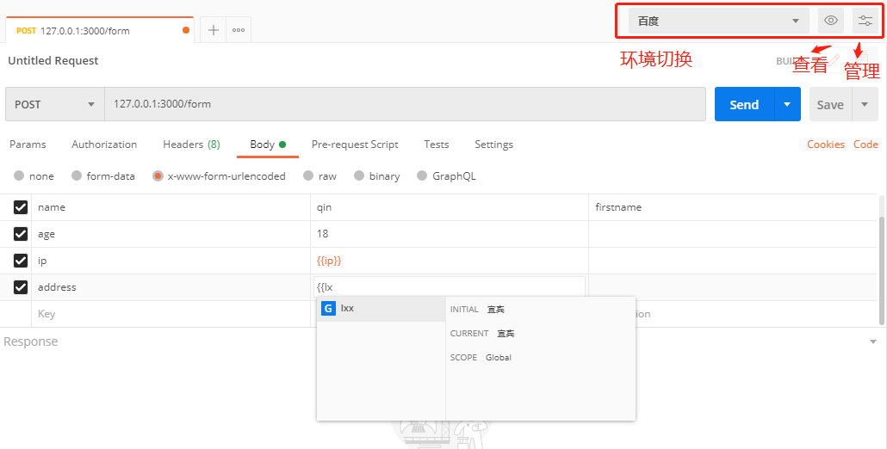

# Postman

测试金字塔：UI测试，接口测试，单元测试。（理论上来说，我们更应该侧重于接口和单元的测试）

postman接口请求过程：接口url（request url），http方法（request method），请求头域（request headers），请求参数

postman接口响应验证：http状态码（status code），收到接口响应，检查响应头域（response headers），查看响应正文（response）

preview：如果请求返回的是一个页面，那么看到的就是一个解析后的页面，如果返回的是json字符串，那么将看到的是字符串

timing：请求的时间分析

# [Http头域](<https://www.cnblogs.com/morgana/p/8683252.html>)

`Content-Type`：与请求参数在body中的格式密切相关。

1. `x-www-form-urlencoded`：将body中的参数编码到url上，我们是不可见的，但的确做了编码，我们也可以直接将参数写到url后面。对于一般的text数据就用此类型，
2. `form-data`：文件和其它text类型数据
3. `raw`：原始格式，`text/plain、application/json、application/javascript、application/xml、text/xml、text/html`
4. `binary`：文件

# 变量

`global和environment`，变量主要用于复用，环境变量的优先级是高于全局变量的，当在使用环境时，环境变量和全局变量同时存在，那么全局将会失效。

global全局变量：在任何接口中都能用的变量。

environment环境变量：创建不同环境，用于同名变量的不同值。

# 断言

验证返回的结果是否符合要求。

## 沙箱

postman测试沙箱其实是结合js脚本完成测试中的功能，在请求发起前后实现部分测试操作。

常用功能：

- 请求前脚本（Pre-request Script）设置请求前置操作，如设置变量等。
- 请求后对状态码，响应头，响应正文等信息，进行断言操作（tests），自动对接口返回信息的校验。

